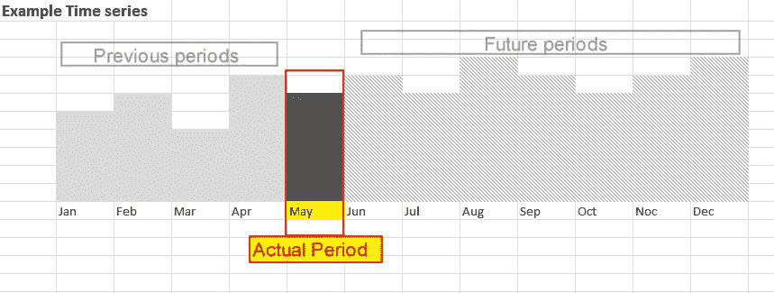
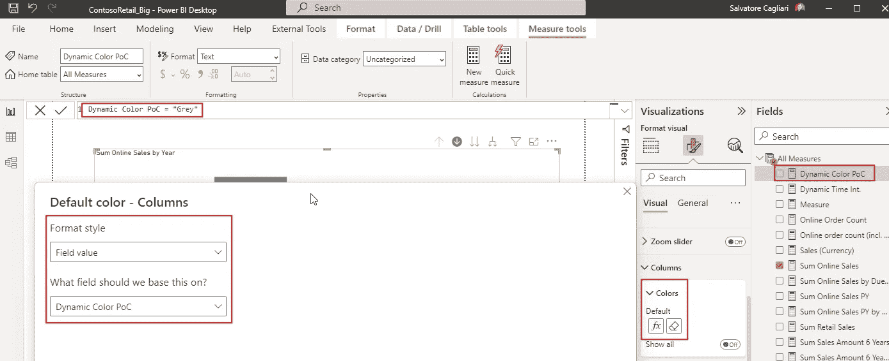
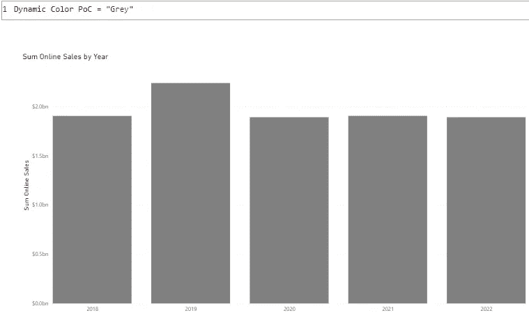
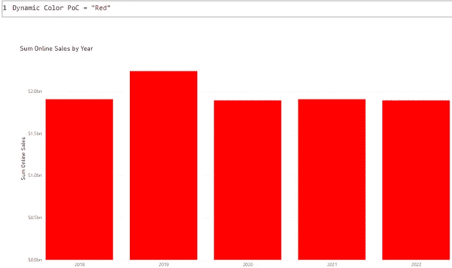
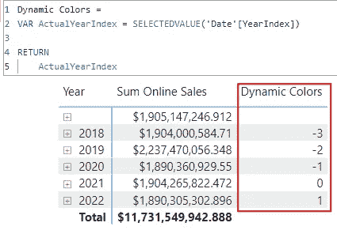
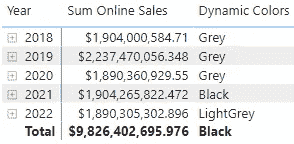
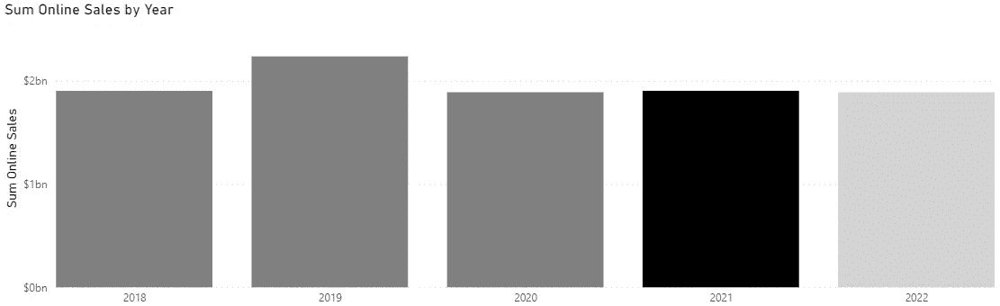
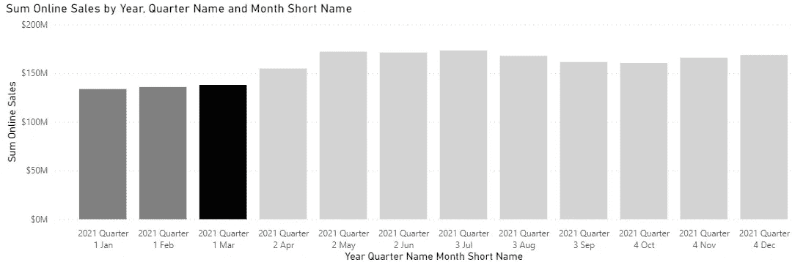

# 如何在 Power BI 中使用 DAX 表达式控制颜色

> 原文：<https://towardsdatascience.com/how-to-control-colors-with-dax-expressions-in-power-bi-ef7e5c767eff>

## 我们现在可以添加长期视觉效果的着色规则。但是，我们如何使用 DAX 表达式来控制这些颜色，并试图遵循 IBCS 规则呢？


Firmbee.com 在 [Unsplash](https://unsplash.com?utm_source=medium&utm_medium=referral) 上[的照片](https://unsplash.com/@firmbee?utm_source=medium&utm_medium=referral)

# 介绍

几周前，我发表了一篇关于信息设计的文章:

<https://medium.com/cloud-workers/three-simple-rules-for-information-design-52db54864b47>  

概括一下:

IBCS 是一家为信息设计创造了一套规则的公司。

IBCS 帮助我们利用其规则来改进我们的报道。

我把原来的 8 条成功法则浓缩成了 3 条简单易用的法则:

1.你的信息是什么？

2.使用一致的符号。

3.去掉不必要的东西。

信息设计的一个重要原则是在我们的报告中避免不必要的颜色。

例如:

当您想要显示数据的时间序列时，您希望如下图所示:



图 1 —时间序列的示例报告(作者提供的图表)

如您所见，每个周期有三种不同的填充颜色:

1.  实际周期是黑色的
2.  所有过去的时期都是灰色的
3.  所有未来期间都有对角线条纹

这样做的原因是为了让用户容易发现实际数字，并能够快速区分过去和预测数据。

不幸的是，我们不能在 Power BI 中为列视觉使用对角线条纹。

但是我们可以使用 DAX 来检测周期，并根据该列相对于实际周期的位置来选择颜色。

# 准备

为了能够实现如下所示的解决方案，您需要一个包含两个附加列的日期表:

*   年度指数
*   蒙特辛德克斯

我在关于 Power BI 和 DAX 的第一篇文章中提到了这些专栏:

</3-ways-to-improve-your-reporting-with-an-expanded-date-table-2d983d76cced>  

此列计算从实际日期开始的周期数。

实际日期( [Now()](https://dax.guide/now/) )在报告中的数据刷新期间进行评估。

您可以在 DAX 日期表中使用以下表达式来添加这些列:

*   " MonthIndex "，DATEDIFF(EOMONTH(Now()，0)，EOMONTH([Date]，0)，MONTH)
*   “YearIndex”，YEAR([Date]) — YEAR(Now())

如果使用存储在源系统中的日期表，可以在那里添加这些列。

在 SQL Server 中，可以使用以下语句设置这些列的值(变量@Today 包含语句à GETDATE()的执行日期):

```
UPDATE [dbo].[Date]
SET [YearIndex] = DATEDIFF(yyyy, @Today, [Date]);

UPDATE [dbo].[Date]
SET [MonthIndex] = DATEDIFF(mm, @Today, [Date]);
```

**重要提示:**以下示例中的数据有一个日期表，实际日期设置为 2012 年 3 月 9 日。

# Power BI 中的颜色

我们可以通过两种不同的方式在 DAX 表达式中使用颜色名称:

1.我们将鼠标悬停在 Power BI 中的调色板上，并写入颜色名称。
例如:

a.黑色

b.灰色

c.浅灰色

d.红色

e.蓝色

2.或者，我们可以单击“更多颜色…”，选择一种颜色并记下该颜色的十六进制值。
例如:

a.#000000 黑色

b.#FFFFFF à白色

c.#DCDCDC à浅灰色

d.#FF0000 红色

e.# 0000FF 蓝色

有了这些信息，我们可以创建 DAX 度量，它返回颜色名称或颜色代码。

# 概念验证

现在，我们想看看它是如何工作的。

我们创建一个柱形图，其中一个度量值和日历层次结构被分配给 X 轴。

作为默认颜色，我们看到我们的列是蓝色的。但是我们想把这个换成灰色。

第一步是创建一个固定颜色的基本测量:

```
Dynamic Color PoC = "Grey"
```

然后，我们将此度量作为表达式分配给列:



图 2 —第一次测试(作者提供的图)

结果看起来像这样:



图 3 —第一次测试的结果(作者提供的数据)

如果我们将测量值更改为以下值:

```
Dynamic Color PoC = "Red"
```

我们得到以下结果:



图 4 —红色测试(作者提供的图片)

现在，我们知道了如何给柱形图分配颜色。

我们可以进入下一步，给年份分配动态颜色。

# 控制每年的颜色

我将通过每个步骤来构建解决方案。这样，你就很容易理解为什么这个解决方案会有效。

第一步是创建一个度量，看看如何使用日期表中的 YearIndex 列:

```
Dynamic Colors =
VAR ActualYearIndex = SELECTEDVALUE('Date'[YearIndex])

RETURN
   ActualYearIndex
```

为了检查结果，我们向报告中添加了一个带有日期层次结构和两个度量值(带有要显示的值的度量值和新的动态颜色度量值)的矩阵。

结果显示在矩阵中，如下所示:



图 5 —动态颜色测量，步骤 1(作者提供的图片)

如您所见，2021 年的 YearIndex 为 0，前一年为负数。下一年是正数。

第二步是使用这个结果根据 YearIndex 设置颜色。

为了实现这一点，我们将动态颜色度量扩展为以下表达式:

```
Dynamic Color =
VAR ActualYearIndex = SELECTEDVALUE('Date'[YearIndex])
VAR YearColor = 
    SWITCH(TRUE
          ,ActualYearIndex < 0, "Grey"
          ,ActualYearIndex = 0, "Black"
          ,ActualYearIndex > 0, "LightGrey"
          )

RETURN
    YearColor
```

如您所见，我们使用[开关()](https://dax.guide/switch/)函数为每个 YearIndex 值分配一种颜色。

矩阵中的结果如下所示:



图 6 —每年颜色矩阵(作者提供的图)

柱形图中的结果如下所示:



图 7 —每年动态颜色的柱形图(由作者提供)

这是一个(几乎)完美的起点。

但是当我们深入到月份级别时会发生什么呢？

在这种情况下，颜色将继承与年份相同的颜色。

但对于 2021 年，我们将在月份级别看到相同的配色方案。

我们希望三月是黑色，三月之前的几个月是灰色，三月之后的几个月都是浅灰色。

# 添加月份

要将相同的动态逻辑添加到月级别，我们可以扩展现有逻辑来编写以下度量:

```
Dynamic Color =
    VAR ActualYearIndex = SELECTEDVALUE('Date'[YearIndex])
    VAR ActualMonthIndex = 
        IF( HASONEVALUE('Date'[MonthIndex])
                        ,SELECTEDVALUE('Date'[MonthIndex])
                        ,99
                        )
VAR YearColor =
    SWITCH(TRUE
            ,ActualYearIndex < 0, "Grey"
            ,ActualYearIndex = 0, "Black"
            ,ActualYearIndex > 0, "LightGrey"
            )

VAR MonthColor =
    SWITCH(TRUE
            ,ActualMonthIndex < 0, "Grey"
            ,ActualMonthIndex = 0, "Black"
            ,ActualMonthIndex > 0, "LightGrey"
            )

RETURN
    IF(ActualMonthIndex = 99
        ,YearColor
        ,MonthColor)
```

这里的关键是我们如何评估 ActualMonthIndex。

我们使用 [HASONEVALUE()](https://dax.guide/hasonevalue/) 函数来检查当前过滤上下文是只包含一个月还是包含多个月。

在年份级别，此函数将返回 FALSE，因为实际筛选器上下文中包含多个值。

在月级别，筛选器上下文只包含一个值。因此，该函数将返回 TRUE。

剩余的测量使用相同的逻辑，但是两次。

月级别的柱形图如下所示:



图 8 —每月动态颜色的柱形图(由作者提供)

当然，你可以使用除了黑色和灰色以外的颜色。

但是考虑到有些用户不能区分那么多颜色。例如，请看下图:


图 9 —彩色和黑白(作者提供的图片)

这里我添加了两个红色和绿色的矩形。
然后我复制了这些矩形，并把它们转换成黑白图片。

如你所见，两个灰色矩形之间的差异不再那么大。

在为报表选择颜色时，您必须考虑这些影响。

# 结论

设计报告时，信息设计是一个重要因素。

我们需要避免陷入在报告中使用过多颜色的陷阱。

权力 BI 诱惑我们使用太多的颜色，但我们需要知道我们在做什么。

例如，文章[在 Power BI 桌面中使用报表主题— Power BI |微软学习](https://learn.microsoft.com/en-us/power-bi/create-reports/desktop-report-themes)教你如何在 Power BI 中使用主题。

但是即使是色盲主题也使用了很多不同的颜色。

然后，当你看到[可下载的自定义主题](https://learn.microsoft.com/en-us/power-bi/create-reports/desktop-report-themes#custom-report-theme-files-you-can-use-right-now)时，情况变得更糟。

更不用说 YouTube 上的视频了，比如这个:

他开始做得很好，但是后来他用了那么多颜色，完全走错了方向。

当我们将这个视频中的最终报告转换为黑白时，结果非常暗，尽管数据的对比度仍然可以。但是不同的酒吧不容易发现。

请记住，典型的商业用户并不关心颜色，只要数据准确且易于使用。


照片由[你好我是 Nik](https://unsplash.com/@helloimnik?utm_source=medium&utm_medium=referral) 在 [Unsplash](https://unsplash.com?utm_source=medium&utm_medium=referral)

# 参考

[IBCS —国际商务交流标准](https://www.ibcs.com/)—IBCS 规则的网站，提供该规则手册的在线版本。

我使用 Contoso 样本数据集，就像我以前的文章一样。你可以从微软[这里](https://www.microsoft.com/en-us/download/details.aspx?id=18279)免费下载 ContosoRetailDW 数据集。

Contoso 的数据可以在麻省理工学院的许可下自由使用，正如这里的[所描述的](https://github.com/microsoft/Power-BI-Embedded-Contoso-Sales-Demo)。

我扩大了数据集，使 DAX 引擎工作更努力。
在线销售表包含 7100 万行(而不是 1260 万行)，零售表包含 1850 万行(而不是 340 万行)。

<https://medium.com/@salvatorecagliari/membership> 