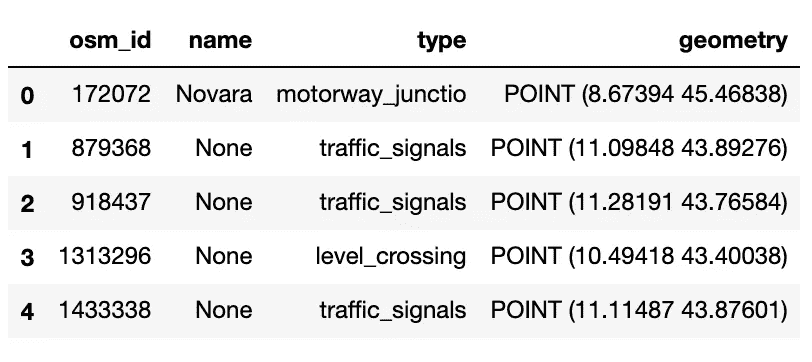
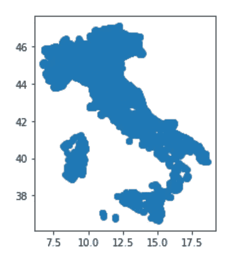
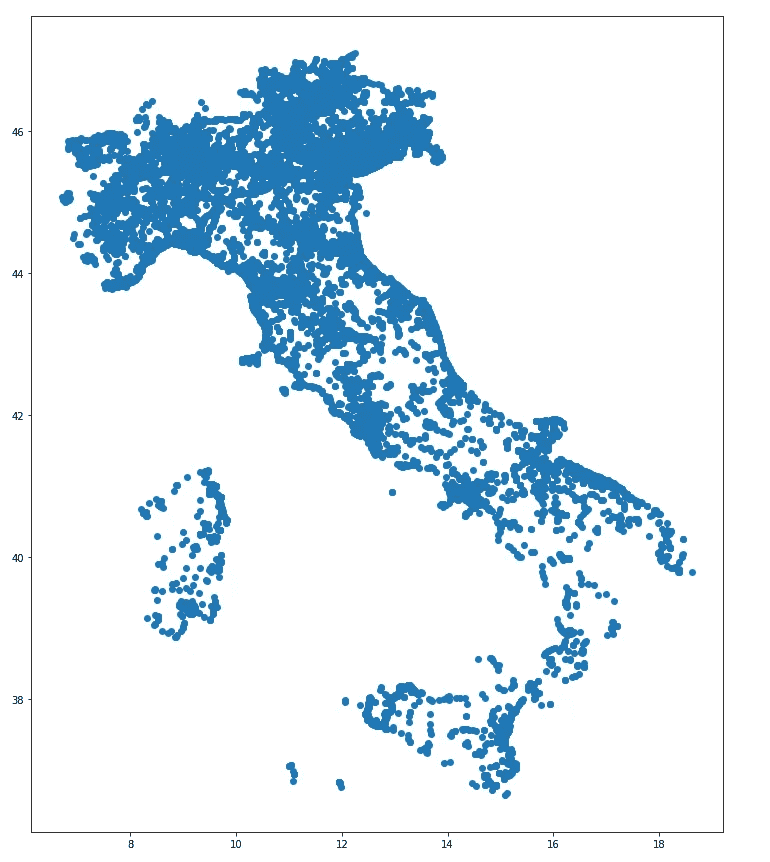
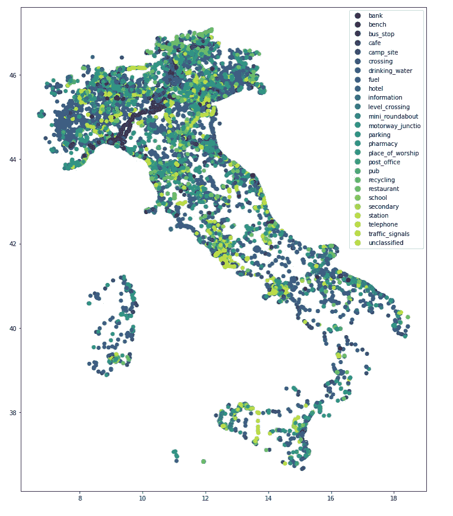
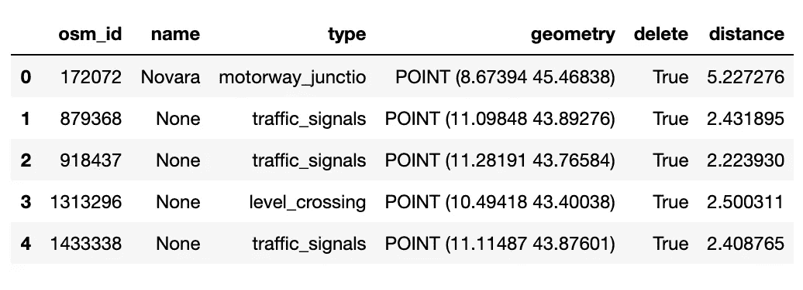
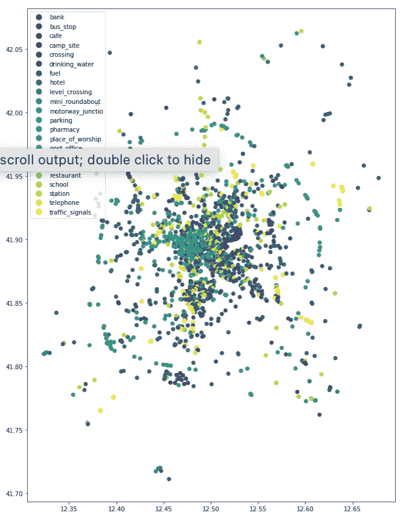

# 如何在 Python 中将 Shapefile 转换为 DataFrame

> 原文：<https://towardsdatascience.com/how-to-convert-a-shapefile-to-a-dataframe-in-python-a6ca9a893504>

## 数据操作

# 如何在 Python 中将 Shapefile 转换为 DataFrame

## GeoPandas Python 库概述，附带一个分步示例


由 [Unsplash](https://unsplash.com?utm_source=medium&utm_medium=referral) 上的 [GeoJango Maps](https://unsplash.com/@geojango_maps?utm_source=medium&utm_medium=referral) 拍摄

数据科学应用程序通常需要处理地理空间中数据。Shapefiles 是存储使用基于文件的数据库组织的地理空间数据的文件。GIS 专业人员、地方政府机构和企业使用 Shapefiles 进行制图和分析。

在这篇博文中，我将通过一个实际的例子描述一种用 Python 处理地理空间数据的优雅方式。我将使用 [GeoPandas](https://geopandas.org/en/stable/index.html) ，这是一个 Python 库，用于处理地理空间数据，如绘图、分析和绘图。GeoPandas 扩展了如此受欢迎的 Pandas 库来处理地理数据。我还将看看如何使用`matplotlib`绘制结果。

可以通过以下命令安装 GeoPandas:

```
pip3 install geopandas
```

本教程组织如下:

*   加载数据集
*   绘图数据
*   几何上的操作

# 加载数据集

要加载地理数据集，我可以利用`read_file()`函数，它会自动检测数据集的格式。如果文件是 shapefile，我应该确保包含 shapefile 的文件夹也包含。prj，。dbf，还有。shx 文件。

在本教程中，我利用了由 [Map Cruzin](https://mapcruzin.com/free-italy-arcgis-maps-shapefiles.htm) 提供的包含意大利兴趣点的数据集。这个 shapefile 来源于[OpenStreetMap.org](https://www.openstreetmap.org/)，并在[开放数据公共开放数据库许可](https://opendatacommons.org/licenses/odbl/) (ODbL)下获得许可。

```
**import** geopandas **as** gpddf **=** gpd.read_file('../../Datasets/italy-points-shape/points.shp')
df.head()
```



作者图片

几何字段可能包含点、多线、多边形等。数据集可能包含多个几何字段，但只能将一个几何字段设置为活动的。这可以通过`set_geometry()`功能来完成。

```
df **=** df.set_geometry('geometry')
```

该文件作为 GeoPandas 数据帧加载。因为 GeoPandas 数据帧是 Pandas 数据帧的子类，所以我可以对我的 GeoPandas 数据帧使用 Pandas 数据帧的所有方法。例如，我可以通过`shape`属性显示记录的数量:

```
df.shape
```

该数据集包含 47，427 个文件。

# 绘图数据

我可以绘制第一张地图，通过 GeoPandas 提供的`plot()`功能。如果一个文件包含多个几何图形

```
df.plot()
```



作者图片

以前的地图太小，因此可以使用`matplotlib`进行改进。首先，我可以增加体型。我定义了一个具有所需大小的`subplot()`，然后将`ax`变量传递给地理数据框架图:

```
import matplotlib.pyplot as pltfig, ax = plt.subplots(1, 1, figsize=(15, 15))
df.plot(ax=ax)
```



作者图片

我也可以根据类型栏改变点的颜色。这种类型的图称为 Chorophlet 图。我计算了不同类型的数量:

```
len(df['type'].value_counts())
```

有 301 种不同的类型。为了提高地图的可读性，我删除了点数小于 300 的类型。

```
target_types = df[‘type’].value_counts() > 300 tc = target_types[target_types == True].index**def** myfilter(x):
    **return** x **in** tcdf['delete'] **=** df['type'].apply(**lambda** x: myfilter(x))
df **=** df[df['delete']]
```

现在我检查剩余类型的数量

```
len(df['type'].value_counts())
```

有 26 种类型。

现在，我简单地通过将`column`属性传递给`plot()`函数来绘制 Chorophlet 地图。我可以通过设置`legend=True`来显示图例。

```
fig, ax **=** plt.subplots(1, 1, figsize**=**(15, 15))
df.plot(ax**=**ax, column**=**'type', legend**=True**, cmap**=**'viridis')
```



作者图片

有趣的是，大多数景点都位于意大利北部。

# 几何上的操作

GeoPandas 允许直接在几何域上进行许多操作。例如，我可以计算出每个点离给定点的距离，即意大利首都罗马。我通过`points_from_xy()`函数将坐标转换成几何图形:

```
rome_longitude **=** [12.496365]
rome_latitude **=** [41.902782]
rome_point **=** gpd.points_from_xy(rome_longitude,rome_latitude)
```

然后，我计算`df`中每个点离`rome_point`的距离。我使用`distance()`功能，该功能应用于活动几何图形:

```
df['distance'] **=** df['geometry'].distance(rome_point[0])
```



作者图片

我通过增加距离对数据集进行排序

```
df **=** df.sort_values(by**=**'distance', ascending**=True**)
```

最后，我只选择罗马附近的兴趣点，即距离小于 0.2

```
df_rome **=** df[df['distance'] **<** 0.2]
```

然后，我绘制出最终的数据帧:

```
fig, ax **=** plt.subplots(1, 1, figsize**=**(15, 15))
df_rome.plot(ax**=**ax, column**=**'type', legend**=True**, cmap**=**'viridis')
```



作者图片

# 摘要

恭喜你！您刚刚学习了如何通过 GeoPandas 用 Python 表示地理数据！

您已经了解了如何使用 GeoPandas 对地理数据执行高效操作。尽管 Pandas 在许多任务上表现出色，但它并不适合在位置感知应用程序中处理地理空间数据。GeoPandas 通过向 Pandas 添加非常适合地理空间数据的功能来解决这个问题。

你可以从我的 [Github 库](https://github.com/alod83/data-science/blob/master/Preprocessing/GeoPandas/GeoPandas.ipynb)下载本教程的代码。

如果你已经走了这么远来阅读，对我来说今天已经很多了。谢谢！你可以在[这篇文章](https://alod83.medium.com/which-topics-would-you-like-to-read-c68314dc6813)中读到更多关于我的信息。

# 相关文章

[](/how-to-manipulate-a-pandas-dataframe-in-sql-7d1a1503f47) [## 如何在 SQL 中操作熊猫数据帧

### 这是一个现成的代码，包含一些使用 SQL 查询操作 Python Pandas 数据框架的技巧。

towardsdatascience.com](/how-to-manipulate-a-pandas-dataframe-in-sql-7d1a1503f47) [](/how-to-anonymise-places-in-python-55597d0ded24) [## 如何在 Python 中匿名化地点

### 一个现成的代码，根据地名数据库识别和隐藏地点

towardsdatascience.com](/how-to-anonymise-places-in-python-55597d0ded24) [](/how-to-transform-data-extracted-from-wikipedia-into-a-map-in-python-8325dce0710b) [## 如何将从维基百科提取的数据转换成 Python 中的地图

### 一个现成的代码，可以通过 Selenium、GeoPy 和 leav 在从维基百科提取的条目列表上创建一个地图

towardsdatascience.com](/how-to-transform-data-extracted-from-wikipedia-into-a-map-in-python-8325dce0710b) [](/deepnote-a-collaborative-framework-for-your-python-notebooks-99390a6766e9) [## deep note:Python 笔记本的协作框架

### Deepnote 入门

towardsdatascience.com](/deepnote-a-collaborative-framework-for-your-python-notebooks-99390a6766e9)