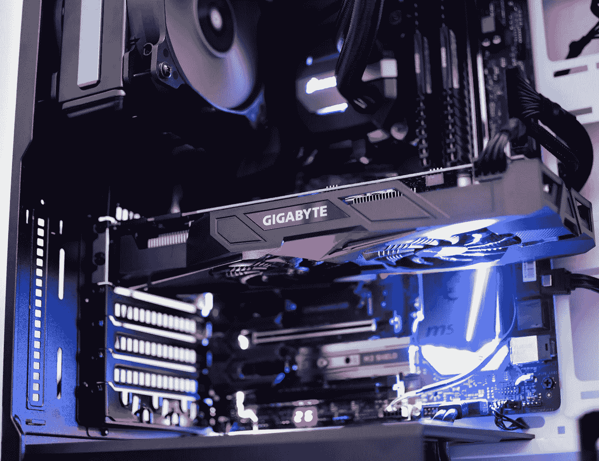
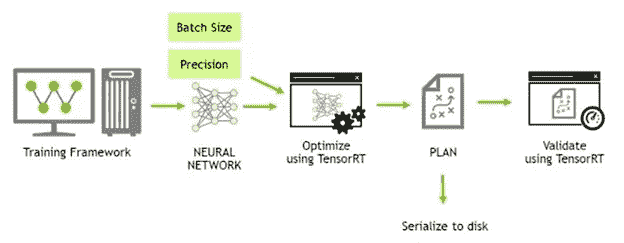
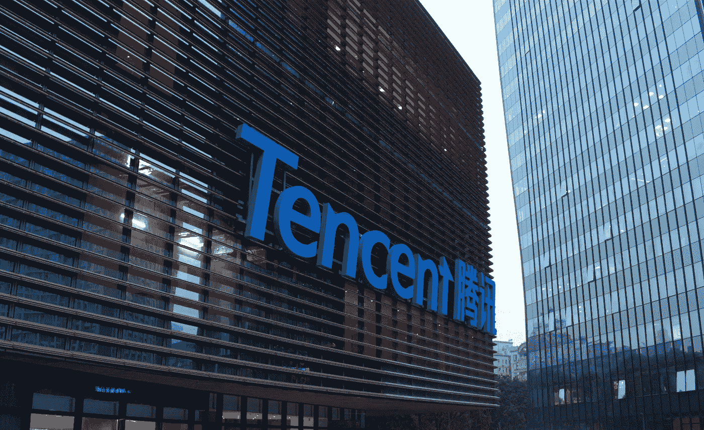
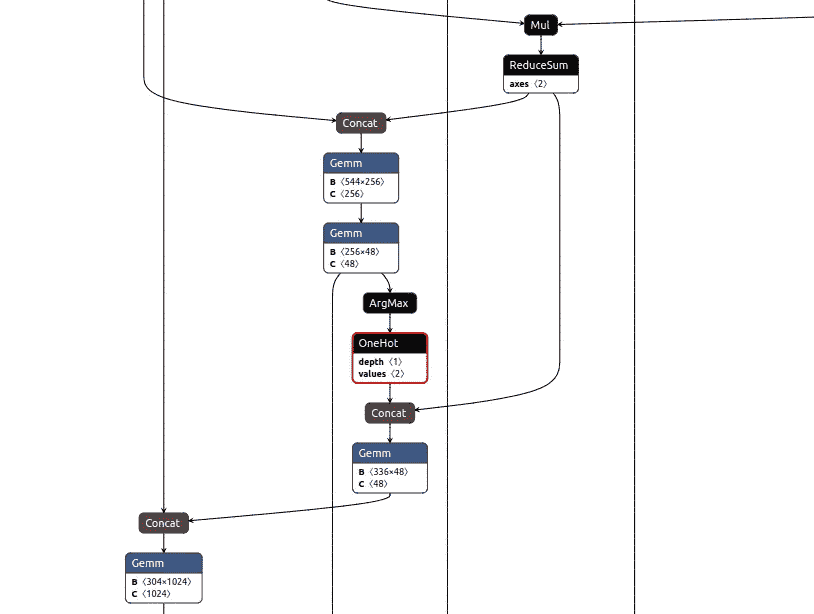
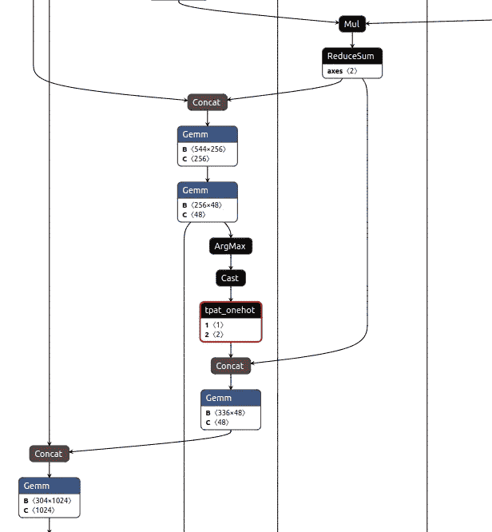

# 如何将您的自定义模型转换为 TensorRT

> 原文：<https://towardsdatascience.com/how-to-convert-your-custom-model-into-tensorrt-5a2ea1dec2e4>

## ML 提示和技巧/ TPAT

## 用 TPAT 缓解你紧张的疼痛

如果您曾经和 TensorRT 一起工作过，那么您可能会遇到类似的错误，对吗？

> [E] [TRT] UffParser:验证器错误:resize/ResizeNearestNeighbor:不支持的 operation _ ResizeNearestNeighbor

在这篇博客中，我们将向您展示如何将带有自定义运算符的模型转换成 TensorRT，以及如何避免这些错误！



(图片来源:Rafael Pol 在 [Unsplash](https://unsplash.com/s/photos/gpu?utm_source=unsplash&utm_medium=referral&utm_content=creditCopyText) 上拍摄的

N[**vidia tensort**](https://developer.nvidia.com/tensorrt)是目前使用最广泛的 GPU 推理框架，能够优化使用 [Pytorch](https://pytorch.org/) 、 [Tensorflow](https://www.tensorflow.org/resources/learn-ml?gclid=CjwKCAjwv-GUBhAzEiwASUMm4mUCWNcxPcNSWSQcwKbcQwwDtZ67i_ugrmIBnJBp3rMBL5IA9gd0mhoC9Z8QAvD_BwE) 、 [mxnet](https://mxnet.apache.org/versions/1.9.1/) 或 [PaddlePaddle](https://github.com/PaddlePaddle/Paddle) 构建的机器学习模型，以便在 NVIDIA 硬件上高效运行它们。众所周知，使用 TensorRT 图的 [**推理与本地运行模型相比，显著提高了推理速度和吞吐量**](https://developer.nvidia.com/embedded/jetson-benchmarks) **。**



TensorRT 代表了最流行的深度学习框架和 NVIDIA 硬件之间的桥梁(来源:[https://docs . NVIDIA . com/deep learning/TensorRT/quick-start-guide/index . html](https://docs.nvidia.com/deeplearning/tensorrt/quick-start-guide/index.html))

虽然使用 tensort 推理有很多好处，但是由于支持的操作符数量有限，**真正的难点是手写 tensort 插件，以便支持在 tensort 中没有现成支持的自定义操作符**。这使得部署过程变得不必要的复杂，并且可能需要几个小时甚至几天来优化和成功部署 tensort 模型，这需要编写多个定制 tensort 操作符。

# **TensorRT 插件自动生成工具-TPAT**

近日，[腾讯](https://www.tencent.com/en-us/index.html)和 NVIDIA 公布了[**tensort Plugin Autogen 工具——TPAT**](https://github.com/Tencent/TPAT)，这是一款开源工具，可以支持[开放神经网络交换(ONNX)](https://onnx.ai/) 格式的所有运营商，**端到端生成 tensort 插件。**



(来源:[https://www.tencent.com/en-us/media/library/images.html](https://www.tencent.com/en-us/media/library/images.html))

这是一个真正的游戏规则改变者，我们在 [Forsight](http://forsight.ai) 立即开始使用它，以便进一步优化我们 ModelZoo 中的一些模型，并从我们的硬件中挤出更多的性能。

TPAT 实现了 TensorRT 插件的自动生成，TensorRT 型号的**部署可以简化，不再需要人工干预。**

TPAT 需要的唯一输入是 ONNX 模型和定制操作符的名称映射。**TPAT 优化过程基于** [**TVM 深度学习编译器**](https://tvm.apache.org/) **，对定形算子进行自动调优，自动生成高性能 CUDA 内核。**必要的 CUDA 内核和运行时参数写在 TensorRT 插件模板中，用来生成动态链接库，可以直接加载到 TensorRT 中运行。

TPAT 确实是一个神奇的工具，因为它提供了以下优于手写插件和本地 TensorRT 操作符的优势:

⦁ **改善运营商覆盖:**支持 ONNX、Tensorflow 和 PyTorch 的所有运营商

支持 TPAT 的运营商列表(来源:[https://github.com/Tencent/TPAT/blob/main/docs/Operators.md](https://github.com/Tencent/TPAT/blob/main/docs/Operators.md)

⦁ **全自动化**:端到端全自动生成用户指定的 tensorrt 插件

⦁ **高性能**:大部分操作者的性能都超过了手写或原装 tensorrt 插件

TPAT vs 手写插件性能对比(来源:[https://github . com/腾讯/TPAT/blob/main/docs/Compare _ handled . MD](https://github.com/Tencent/TPAT/blob/main/docs/Compare_handwritten.md))

TPAT 与原生 TensorRT 插件性能对比(来源:[https://github . com/腾讯/TPAT/blob/main/docs/Optimize _ TensorRT . MD](https://github.com/Tencent/TPAT/blob/main/docs/Optimize_TensorRT.md))

# 在 NVIDIA Jetson AGX Xavier 上使用 TPAT

为了使用 TPAT 和 TensorRT 优化您的模型，并在 [NVIDIA Jetson AGX Xavier](https://www.nvidia.com/en-us/autonomous-machines/embedded-systems/jetson-agx-xavier/) 上运行它，您应该使用以下 Docker 文件而不是 TPAT 报告中包含的[文件来成功构建 TPAT Docker 映像。](https://github.com/Tencent/TPAT/blob/main/Dockerfile)

```
FROM nvcr.io/nvidia/l4t-tensorflow:r32.4.4-tf1.15-py3RUN apt-get update && apt-get install build-essential cmake -yRUN wget -O "clang+llvm-9.0.1-aarch64-linux-gnu.tar.xz" https://github.com/llvm/llvm-project/releases/download/llvmorg-9.0.1/clang+llvm-9.0.1-aarch64-linux-gnu.tar.xz \&& tar -xvf clang+llvm-9.0.1-aarch64-linux-gnu.tar.xz && mkdir -p /usr/local/llvm/ \&& mv clang+llvm-9.0.1-aarch64-linux-gnu/* /usr/local/llvm/RUN python3 -m pip install --upgrade pipRUN pip3 install buildtools onnx==1.10.0RUN pip3 install pycuda nvidia-pyindexRUN apt-get install gitRUN pip install onnx-graphsurgeon onnxruntime==1.9.0 tf2onnx xgboost==1.5.2RUN git clone --recursive https://github.com/Tencent/TPAT.git /workspace/TPAT && cd /workspace/TPAT/3rdparty/blazerml-tvm && mkdir build && cp cmake/config.cmake build && cd buildRUN sed -i 's/set(USE_LLVM OFF)/set(USE_LLVM \/usr\/local\/llvm\/bin\/llvm-config)/g' /workspace/TPAT/3rdparty/blazerml-tvm/build/config.cmakeRUN sed -i 's/set(USE_CUDA OFF)/set(USE_CUDA ON)/g' /workspace/TPAT/3rdparty/blazerml-tvm/build/config.cmakeRUN cd /workspace/TPAT/3rdparty/blazerml-tvm/build/ && cmake .. && make -j8ENV TVM_HOME="/workspace/TPAT/3rdparty/blazerml-tvm/"ENV PYTHONPATH="$TVM_HOME/python:${PYTHONPATH}"
```

您可以使用以下命令构建 Docker 映像:

```
sudo docker build . -t tpat:master
```

*注意:您应该连接外部存储器，并在那里构建 docker 映像，因为映像本身相当大，而 AGX 的内置内存有限。*

成功构建映像后，您可以使用以下命令运行 Docker 容器:

```
sudo docker run --gpus all --shm-size=1g --ulimit memlock=-1 --ulimit stack=67108864 -it tpat:master
```

启动容器后，您应该**确保您的 TPAT Makefile 中的计算能力对应于您的设备的计算能力**。为了在 Jetson AGX Xavier 上成功构建 TPAT 插件，你应该在这个[行](https://github.com/Tencent/TPAT/blob/6380a44ed1c2c35c97dc30768835197bfb79eeb1/python/trt_plugin/Makefile#L68)上用`-arch=sm_72`替换`-arch=sm_75`。

现在你应该已经拥有了使用 TPAT 为你的模型自动生成定制插件所需的一切！

# 如何使用 TPAT 生成一个自定义的 TensorRT 插件？

为了在 Jetson Xavier AGX 上使用 TPAT 优化模型中的某些运算符，请遵循以下步骤。

首先，您应该运行需要以下参数的`onnx_to_plugin.py`脚本:

```
usage: onnx_to_plugin.py [-h] -i INPUT_MODEL_PATH -o OUTPUT_MODEL_PATH
                         [-n [NODE_NAMES [NODE_NAMES ...]]]
                         [-t [NODE_TYPES [NODE_TYPES ...]]]
                         [-p PLUGIN_NAME_DICT]optional arguments:
  -h, --help            show this help message and exit
  -i INPUT_MODEL_PATH, --input_model_path INPUT_MODEL_PATH
                        Please provide input onnx model path
  -o OUTPUT_MODEL_PATH, --output_model_path OUTPUT_MODEL_PATH
                        Please provide output onnx model path which used for
                        tensorrt
  -n [NODE_NAMES [NODE_NAMES ...]], --node_names [NODE_NAMES [NODE_NAMES ...]]
                        Please provide the operator name that needed to
                        generate tensorrt-plugin
  -t [NODE_TYPES [NODE_TYPES ...]], --node_types [NODE_TYPES [NODE_TYPES ...]]
                        Please provide the operator type that needed to
                        generate tensorrt-plugin
  -p PLUGIN_NAME_DICT, --plugin_name_dict PLUGIN_NAME_DICT
                        Please provide the dict of op name and plugin name
                        that will be generated by TPAT, such as : {"op_name" :
                        "plugin_name"}
```

我们提供了一个示例命令，该命令优化了`model.onnx`图中的`loop_function_1/OneHotEncoding/one_hot`运算符，并输出包含优化后的`tpat_onehot`运算符的`model_tpat.onnx`图:

```
OPENBLAS_CORETYPE=ARMV8 python3 onnx_to_plugin.py \
 -i “model.onnx” \
 -o “model_tpat.onnx” \ 
 -p “{\”loop_function_1/OneHotEncoding/one_hot\” : \”tpat_onehot\”}”
```

**运行该命令的结果是一个优化的 ONNX 图，其中不支持的操作符被 TPAT 生成的操作符替换。**你可以在`TPAT/python/trt_plugin/lib/`中找到 TPAT 生成算子动态库，应该命名为`tpat_onehot.so`。

*注意:您应该在运行 TPAT 转换脚本的命令前添加* `*OPENBLAS_CORETYPE=ARMV8*` *，以修复 Jetson Xavier AGX 设备上发生的* [*问题*](https://github.com/numpy/numpy/issues/18131) *。*



model.onnx 图中的 OneHot 运算符与 model_tpat.onnx 图中的 tpat_onehot 运算符(来源:作者使用 [Netron](https://netron.app/) 生成的图片)

# 将 TPAT-翁克斯图优化成张量图

`trtexec`是一款无需开发自己的应用程序即可快速利用 TensorRT 的工具。`trtexec`工具有三个主要用途:

*   根据随机或用户提供的输入数据对网络进行基准测试。
*   从模型生成序列化引擎。
*   从生成器生成序列化定时缓存。

[](https://docs.nvidia.com/deeplearning/tensorrt/developer-guide/index.html#trtexec-ovr)  

可以使用下面的`trtexec`命令将模型转换成 TensorRT 平面图格式:

```
trtexec --onnx=model_tpat.onnx \
        --saveEngine=model.plan \
       --buildOnly --verbose --fp16 \
       --workspace=6000 --noTF32 \
       --plugins=”./python/trt_plugin/lib/tpat_onehot.so”
```

*请注意，您必须提供 TPAT 优化运算符的路径。*

成功转换模型后，您可以使用以下命令来测量 TensorRT 模型性能:

```
trtexec --loadEngine=model.plan \
        --verbose --workspace=4096 \ 
        --streams=16 --threads \
        --plugins=”./python/trt_plugin/lib/tpat_onehot.so”
```

就这样，您已经**使用 TPAT 成功转换了 tensort 不支持的运算符，并优化了 tensort 图**。你可以尝试这个过程，并在评论中分享你的见解和结果！

> 我们希望这篇博客对你有用，请看看我们团队在 Forsight 写的其他一些博客，如果你有任何问题，请随时通过 **info@forsight.ai** 联系我们！

[](/new-tf2-object-detection-api-5c6ea8362a8c)  [](https://medium.com/swlh/construction-feat-tf2-object-detection-api-4465a3937c87)  [](/understand-your-algorithm-with-grad-cam-d3b62fce353)  [](/generalizing-your-model-an-example-with-efficientnetv2-and-cats-dogs-6903740dfe2c)  

# 参考

1.  https://github.com/Tencent/TPAT-TensorRT 插件自动生成工具([)](https://github.com/Tencent/TPAT)
2.  腾讯和英伟达开源 TensorRT 插件自动生成工具 TPAT([https://www.codetd.com/en/article/13743533](https://www.codetd.com/en/article/13743533))