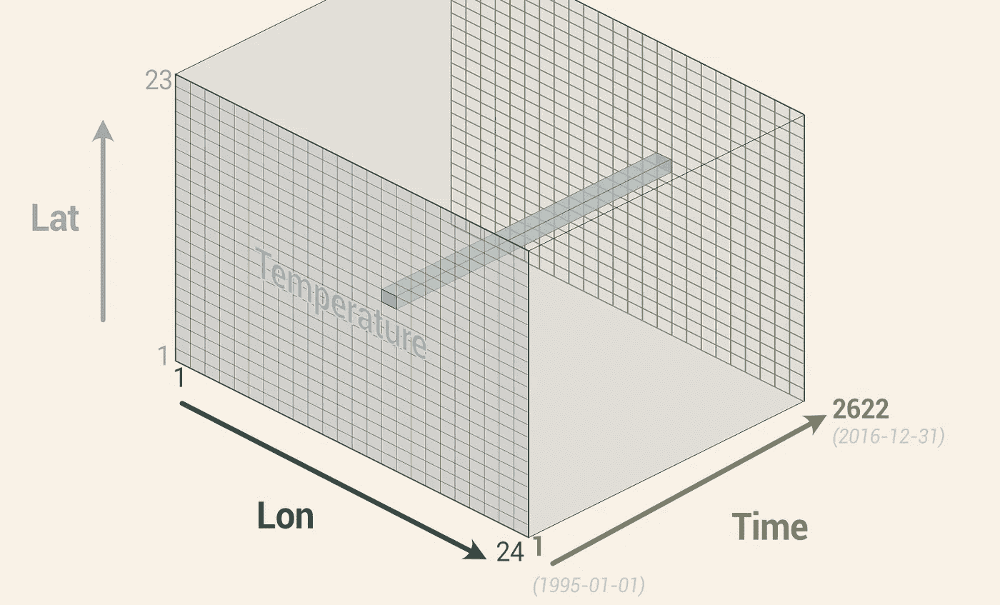
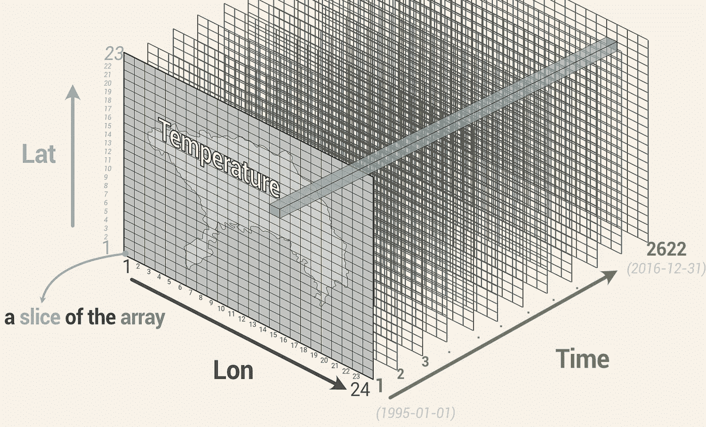
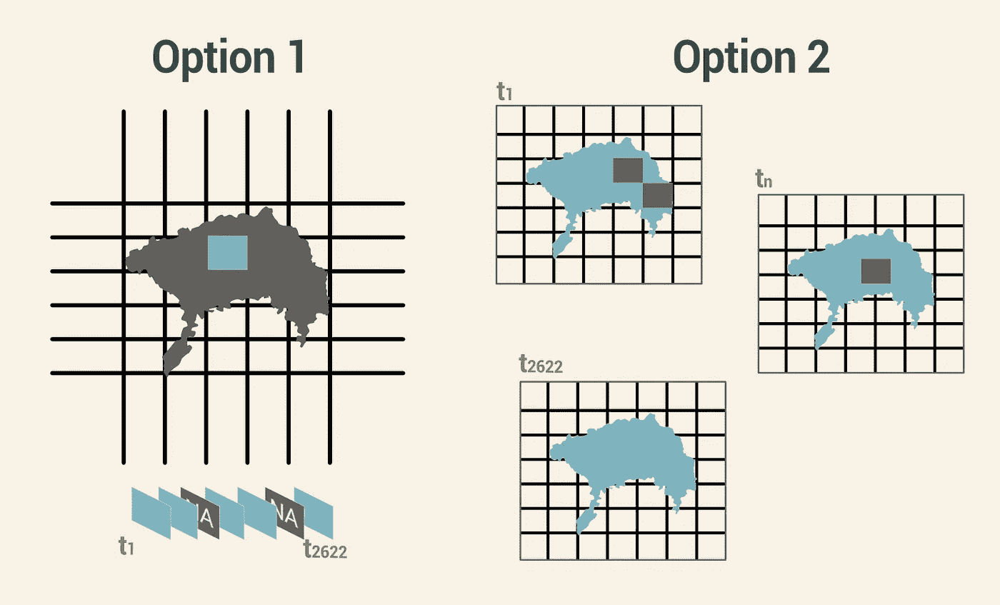
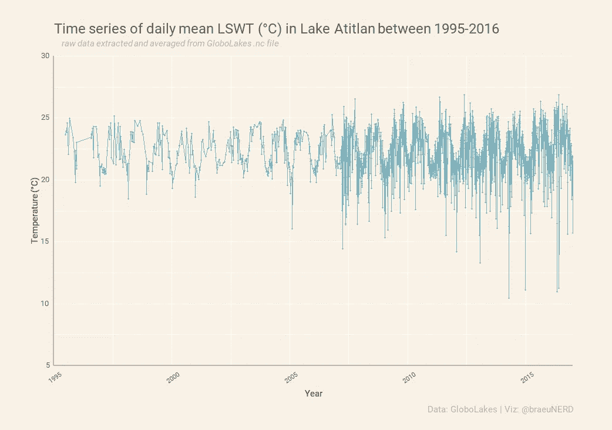

# 如何破解 R 中打开的 NetCDF 文件并提取数据为时间序列

> 原文：<https://towardsdatascience.com/how-to-crack-open-netcdf-files-in-r-and-extract-data-as-time-series-24107b70dcd>

## 获取免费的气候数据可能很棘手——以下是方法


作者图片

今天，很多事情都可以用气候和天气数据来分析:农业生产、旅游、销售、应急管理、建筑、移民、过敏或你每年的冰淇淋零食。但是我们从哪里得到这些数据呢？

幸运的是，我们在无云的夜晚看到的许多闪亮的轨道光点——卫星——正在为我们收集数据做大量艰苦的工作。这些卫星背后的许多倡议甚至让我们所有人免费使用这些数据。**但是一些免费的数据可能不像人们想象的那么容易获取。**

我第一次碰到一个`.nc`文件时非常沮丧。最初，我很兴奋地发现我需要的数据显示“免费下载”，但我几乎立即放弃了我想做的事情，因为我不知道如何阅读这个文件，它有一个我从未见过的奇怪的`'.nc'`结尾。最初的谷歌搜索对我来说毫无意义:大量 MATLAB 和 Python 的教程——**那时我只知道一些非常基本的 R** 。

最终，我学会了如何做这件事，以及此后的许多其他事情(在这个过程中，我流了一些眼泪)，但我陷入了“也许我是唯一一个不知道这件事的人”这种老掉牙的骗子思维陷阱。我从来没有想过为它写一个教程。最近，我的一个朋友在一个 nc 文件上遇到了类似的问题；我把我的剧本发给她，几天后她发短信给我:“保存。你应该把这个公之于众！”。

本教程早就应该发布了。因此，如果您陷入了类似的困境，或者您也意识到 NetCDF 文件已经存在:我希望本教程能够有所帮助！

# 什么是 NetCDF？

卫星数据是 ***大量*** 的数据；大量多维数据(纬度、经度、时间和一个变量——或者更多！-感兴趣的，比如温度)。

通常，我们可以看到按日、周、月或年描述平均温度的分析…但原始数据远不止这些。例如，一些从 Envisat 卫星测量水温的传感器一天几次收集数据。然后对这些进行处理，以考虑混浊度和其他质量控制方面，并每天给你一个“干净”的值。通常情况下，您不必担心这一部分(不过，如果您感兴趣，可供下载的数据通常有关于如何清理的附加文档)。

但是产生的数据仍然是大量的数据，并且大量的数据意味着巨大的文件大小。因此，卫星数据必须打包成小文件，以便像你我这样的人可以轻松下载和访问。输入 NetCDF。

NetCDF 文件是开放地理空间联盟的标准。它代表“网络公共数据表单”(虽然，如果你问我，称它为“公共”有点夸张)。NetCDF 文件允许所有这些数据放在一个小文件中，我们可以轻松下载。不过，在 NetCDF 文件中存储气候、其他环境和生物信息学数据确实越来越普遍了。**所以我们不妨习惯使用它们！**

有一些软件使得探索 NetCDF 文件看起来更简单，但是它们也有局限性。有些只适用于 Windows，需要许可证，或者需要您安装额外的程序，而有些则严格用于可视化数据。但有时您可能需要对这些类型的数据做不同的事情，可能需要一个温度的时间序列数据集来用于您自己的业务或研究数据，而这些其他选项无法帮助您。**使用像 R 这样的语言访问 NetCDF 文件给了你更多的控制和定制选项，让你可以对可用的数据做些什么。**

如 [Unidata](https://www.unidata.ucar.edu/software/netcdf/) 中所述，这些是 NetCDF 文件的主要特征:

*   **机器无关**(不管你用的是 Windows 还是 Mac 无论您想用 R、Julia、Python 还是 MATLAB 来研究 nc 文件，您都可以！)
*   **面向多维数组的数据**(也称为栅格数据或网格数据)
*   **自描述**(文件元数据和属性包含在文件本身中)
*   **可移植**(可由任何操作系统访问，与它们如何存储和读取数据无关)

## 数据源

根据您需要的数据来自世界的哪个部分，有时可能比其他地方更难获得可靠的数据集。幸运的是，你可以从[哥白尼](https://www.copernicus.eu/en/access-data)、 [CEDA](https://archive.ceda.ac.uk/) 或 [NOAA](https://www.ncei.noaa.gov/cdo-web/) (以及更多来源)免费下载大量好数据。气温、土地温度；森林覆盖、植被物候；海洋、湖泊和河流温度；这样的例子不胜枚举。大部分使用 NetCDF 格式(文件以`.nc`结尾)。

对于本教程，我将使用来自 [GloboLakes](http://www.laketemp.net/home_GL/index.php) 的数据。我特意从[下载了阿蒂特兰湖的数据](https://catalogue.ceda.ac.uk/uuid/76a29c5b55204b66a40308fc2ba9cdb3)，其中包含从 *1995 年到 2016 年*的*湖面水温(LSWT)* 的*每日*观测数据，这些数据来自 Envisat 和 ERS-2 卫星上不同辐射计的组合(如果感兴趣，在提供的链接中有更多关于它们如何组合和协调的细节)。我将指导您如何访问数据，并将其转换成一个时间序列，保存在一个*【normal】*data . frame 和`.csv`文件中。

## 让我们开始吧:如何打开那个文件

我假设这不是你第一次使用 R，并且你已经将你的工作目录`setwd()`设置为你保存`.nc`下载的地方。你可以在这里访问本教程的[完整 R 脚本。](https://github.com/BraeuNerd/ncdfwithRexample/blob/main/ncdfwithRexample.R)

首先，装入我们需要的包:

```
# ncdf4: this package lets you manipulate netCDF files. Unlike the ncdf package, the ncdf4 supports both NetCDF3 and NetCDF4 formats.**> library(ncdf4)****> library(tidyverse)** # because who can live without the tidyverse?
```

我们将使用`nc_open`功能打开您的`.nc`文件。我们会将文件存储在`our_nc_data` vector 中，并立即打印出来，以探索其中的内容(记住，了解您的数据是任何分析过程中必不可少的第一步！).

```
**> our_nc_data <- nc_open("/your_path/file.nc")****> print(our_nc_data)**
```

您应该得到一个变量及其详细信息的列表，如下所示:

```
File GloboLakes/LAKE00001479-GloboLakes-L3S-LSWT-v4.0-fv01.0.nc
     **6 variables** (excluding dimension variables):
         short **lake_surface_water_temperature**[lon,lat,time]
            **_FillValue:** -32768
            **units: Kelvin**
            scale_factor: 0.0099999
            add_offset: 273.1499938
            **long_name: lake surface skin temperature**
            valid_min: -200
            valid_max: 5000
            **comment:** The observations from different instruments have been combined.
            **standard_name: lake_surface_water_temperature**
         short **lswt_uncertainty**[lon,lat,time]
 **<its metadata similar to the first one above>**         byte **quality_level**[lon,lat,time]
            **<its metadata similar to the first one above>** byte **obs_instr**[lon,lat,time]
            **<its metadata similar to the first one above>** byte **flag_bias_correction**[lon,lat,time]
 **<its metadata similar to the first one above>**         int **lakeid**[lon,lat]
            **<its metadata similar to the first one above>**
```

我们的六个变量是湖面水温(lswt)、lswt 不确定性、质量水平、仪器(obs_instr)、旗偏差校正和 LakeID。

它还应该打印一个维度列表和一个全局属性列表:

```
 3 dimensions:
         **lat    Size:23
              long_name: latitude
              standard_name: latitude**
              units: degrees_north
              valid_min: -90
              valid_max: 90
              axis: Y
              reference-datum: geographical coordinates, **WGS84** projection **lon    Size:24
              long_name: longitude
              standard_name: longitude**
              units: degrees_east
              valid_min: -180
              valid_max: 180
              axis: X
              reference-datum: geographical coordinates, **WGS84** projection ** time    Size: 2622**   *** is unlimited ***
              long_name: reference time of the lswt file
              standard_name: time
            **  units: seconds since 1981-01-01 00:00:00
              calendar: gregorian**49 global attributes:
**<more metadata that you can explore on you own>**
```

花一分钟通读信息，了解你的数据。注意，对于这个 GloboLakes 文件:

*   我们有 6 个变量(在本教程中，我们将重点放在第一个变量上，lake _ surface _ water _ temperature[lon，lat，time]；注意单位是开尔文)。
*   请注意 3 个维度的详细信息(纬度= 23，经度= 24，时间= 2622；自 1981–01–01 00:00:00 公历以来，纬度和经度以北纬和东经度为单位，时间单位以秒为单位)
*   _FillValue 是表示缺失值的方式(我们稍后需要将其更改为 R 识别为缺失值的“NA”)。
*   您可以自己探索全局属性(基本上是更多的元数据)

由于我们下载了一个湖的每日 LSWT 数据，现在我们对我们的数据有了更多的了解，我们可以有把握地说:我们有阿蒂特兰湖 24×23(经度×纬度)切片的 2622 天的平均开尔文 LSWT 数据。我认为用视觉更简单:



ncdf 文件中数据的可视化表示。图片作者。

## 让我们把坐标和时间维度作为它们自己的变量

现在您知道了文件中的内容，就更容易知道如何调用每个变量以及您实际需要哪些变量。为了确保您调用了正确的变量，您可以使用函数`attributes()`来获取文件中变量和维度的名称。然后我们将*用函数`ncvar_get()`把*的纬度、经度、时间提取到自己的对象中。我们还将*用函数`ncatt_get()`提取*它们的一些属性。

```
**> attributes(our_nc_data$var)
> attributes(our_nc_data$dim)**# Get latitude and longitude with the ncvar_get function and store each into their own object:**> lat <- ncvar_get(our_nc_data, "lat")
> nlat <- dim(lat) #to check it matches the metadata: 23****> lon <- ncvar_get(our_nc_data, "lon")
> nlon <- dim(lon) #to check, should be 24**# Check your lat lon dimensions match the information in the metadata we explored before:**> print(c(nlon, nlat))**# Get the time variable. Remember: our metadata said our time units are in seconds since 1981-01-01 00:00:00, so you will not see a recognizable date and time format, but a big number like "457185600". We will take care of this later**> time <- ncvar_get(our_nc_data, "time")
> head(time)** # just to have a look at the numbers **> tunits <- ncatt_get(our_nc_data, "time", "units")** #check units **> nt <- dim(time)** #should be 2622
```

你还和我在一起吗？

## 现在让我们提取表面温度数据

我们继续使用`ncvar_get()`函数获取变量，使用`ncatt_get()`获取属性。

```
#get the variable in "matrix slices"
**> lswt_array <- ncvar_get(our_nc_data, "lake_surface_water_temperature") 

> fillvalue <- ncatt_get(our_nc_data, "lake_surface_water_temperature", "_FillValue")****> dim(lswt_array)** #to check; this should give you 24 23 2622#right away let's replace the nc FillValues with NAs
**> lswt_array[lswt_array==fillvalue$value] <- NA
> lswt_array**
```

# 我们完成提取了！

到目前为止一切顺利！但是我们仍然有不可读(至少不是人类可读)的时间。此外，我们仍然在处理 4D 的情况，变量在它们自己的对象中，为了获得时间序列，我们仍然需要将其展平到 2D“正常”或更方便的数据框架。

## 人类可读时间

如果我们打印我们的`tunits`，它会提醒我们时间变量是“自 1981–01–01 00:00:00 以来的秒数”。但是如果我们打印`time`我们仍然会看到一个类似“457185600”的数字。我们可以将其转换为“正常”的年-月-日格式:

```
**> time_obs <- as.POSIXct(time, origin = “1981–01–01”, tz=”GMT”)****> dim(time_obs) #should be 2622****> range(time_obs)** [1] "1995-06-28 12:00:00 GMT"
[2] "2016-12-31 12:00:00 GMT"#Looks good
```

太好了！现在，你知道你的数据在你的元数据所说的范围内，而不是一个疯狂的长数字:在 1995 年到 2016 年之间。

## 现在让我们看看您之前创建的 lswt_array

数组的每个“切片”是 23 个纬度和 24 个经度点的时间点，每个纬度时间的组合都有自己的开尔文温度记录(打印`dim(lswt_array)`应该返回“24 23 2622”)。



中数据的可视化表示。nc 文件(湖的轮廓、日期和其他特定值仅在您使用与我相同的 GloboLakes 文件时适用)。注意我说的“切片”是什么意思。作者图片

如果你打印`lswt_array`，你会看到一个类似矩阵的“切片”。在这个特定的数据集中，您还会注意到有许多缺失值(NAs)。会不会只是前两个被印出来？您可以使用以下代码打印不同的单个切片，其中括号内的信息应该是:`[lon, lat, slice]`并且 slice 是 1 到 2622 之间的一个数字(时间变量的大小，换句话说，就是数据集中的天数)。

```
# try it out:**> lswt_slice <- lswt_array[ , , 2123] 
> lswt_slice <- lswt_array[ , , 25]** # and why not, draw it out:
**> image(lon, lat, lswt_slice)**
```

在尝试了 1-2622 之间的几个随机切片后，我注意到中心周围有许多缺失值，所以我仔细检查了湖泊所在的纬度和经度范围以及数据集包含的范围。事实证明，我们的数据网格中有很多空间是在陆地上，而不是在湖泊上，所以自然地，没有这些点的水温数据。

所以我在谷歌地图上做了一个快速的手动检查，这个湖大约在 14.61n-14.75n 和 91.3W-91.10W 之间。我们的整个数据超过了这个区域。

为了使我们的最终文件更小，我们将去掉那些额外的点。只是还没有。我们仍然没有数据框架，只有 4 个独立的变量或对象。如果我们现在从 lswt_array 中删除 NAs，我们以后将无法知道剩余的值中哪些属于哪个 lon、lat 和 time。

## 让我们构建数据框架

首先，我们创建整个矩阵，以免丢失匹配的时间和温度:

```
#Create 2D matrix of long, lat and time**> lonlattime <- as.matrix(expand.grid(lon,lat,time_obs))** # this might take several seconds#reshape whole lswt_array**> lswt_vec_long <- as.vector(lswt_array)
> length(lswt_vec_long)** # by now it should be 1447344#Create data.frame**> lswt_obs <- data.frame(cbind(lonlattime, lswt_vec_long))** 
```

您的`lswt_obs`现在应该是这样的:

```
**> head(lswt_obs)**
      Var1    Var2                 Var3   lswt_vec_long
1  -91.775  14.125  1995-06-28 12:00:00            <NA>
2  -91.725  14.125  1995-06-28 12:00:00            <NA>
3...
```

没关系。但是让我们给这些列起一个合适的名字。

```
**> colnames(lswt_obs) <- c(“Long”,”Lat”,”Date”,”LSWT_Kelvin”)****> head(lswt_obs)**
      Long     Lat                 Date  LSWT_Kelvin
1  -91.775  14.125  1995-06-28 12:00:00         <NA>
2  -91.725  14.125  1995-06-28 12:00:00         <NA>
3...
```

现在我们正在到达那里。事实上，它已经有了你需要的数据，但是它仍然有许多不必要的东西，这将导致一个巨大的。我们不需要的 csv 文件。

# 让我们把它整理成一个有用的数据框

正如我之前所说，我们在陆地上有很多空地。但是如果您尝试几个 lswt_slices，您会看到网格中还有一些湖泊空间在不同的日期有缺失值(NAs)。由于我们今天的目标是获得一个时间序列数据框架，我认为我们可以从这里走两条路(可能会有更多，如果你想采取不同的方法，请在评论中告诉我！):

选项 1:选择一对特定的坐标[lat，lon],只保留该特定位置随时间变化的温度数据，删除其他所有数据(如果愿意，也可以用几对坐标来做这件事)。使用此选项，您可以拥有不同坐标的多个时间序列(每个时间序列都有不同数量的 NAs，您必须根据您对数据的处理来决定以后如何处理)。

选项 2:只删除所有的 NAs(不管你是否删除那些*在水面上*的 NAs ),然后取所有可用温度数据*到日期*的平均值，得到整个可用湖面区域每天的平均 LSWT。有些日期会比其他日期有更多的值。

最终结果将是相同的(一个带有日期和温度的数据帧)，但是您的温度值*可能会*略有不同。



选项的可视化表示。作者图片

对于本教程，我将选择选项 2。请记住:只要你“全盘托出”你对最终文档中的数据所做的一切，以便它可以被适当地解释和复制，(几乎)一切都是有效的！

```
# Bold move time: remove all rows with NA in LSWT_Kelvin:
**> lswt_final <- na.omit(lswt_obs)**
```

唷！那就少了很多数据！您可以通过`dim()`查看:

```
**> dim(lswt_obs)**
**1447344**     4**> dim(lswt_final)**
**15308  **   4
```

我们仍然有超过 2622 个日期(15308)，因为我们在同一天仍然有几个温度点(此外，2622 不是 1995-2016 年之间的总天数，因为卫星也有寿命-或困难)。

在构建我们的时间序列数据集时，我们不再需要纬度和经度，因为我们将按日期计算平均温度。让我们来解决这个问题:

```
# remove lat & long columns
**> lswt_final <- lswt_final[-c(1:2)]
> lswt_final
**  Date                 LSWT_Kelvin
  <chr>                <chr>
1 1995-06-28 12:00:00  296.63999
```

干得好。但是现在你可以看到在列名(日期和 LSWT 开尔文)下面有一个`<chr>`提醒我们它们都是以字符或字符串的形式存储的(如果你没有看到它们，你可以用`glimpse()`来检查你的数据类型)。让我们来解决这个问题，因为我们不能接受字符串的`mean()`！

```
**> lswt_final$Date <- as.Date(lswt_final$Date)
> lswt_final$LSWT_Kelvin <- as.double(lswt_final$LSWT_Kelvin)**
```

太棒了。现在让我们来看看日平均温度:

```
**> lswt_final <- lswt_final %>%
                group_by(Date) %>%
                summarize(Mean_K = mean(LSWT_Kelvin))**
**> lswt_final**
  Date          Mean_K
  <date>         <dbl>
1 1995-06-28    297.79
2 1995-07-11    297.07
3 1995-07-17    296.99
4 ...**> dim(lswt_final)** 2622     2
# that seems about right!!!
```

呜哇！基本上，你完成了，但是让我们给它一个最后的触摸，把开尔文变成摄氏度。

```
**> lswt_C <- lswt_final %>%
            mutate(LSWT_C = Mean_K-273.15)**
```

现在你知道了！您现在可以使用它，或者将其保存在`.csv`文件中，或者以您需要的任何形式保存。

```
# save as csv 
**> write.csv(as.data.frame(lswt_C), "GloboLakes_Atitlan_TS_95_16.csv", row.names=T)**
```

以下是您现在拥有的简单线图(请记住，这些数据仍需要清理):



作者图片

现在，您可以继续使用这些数据做任何您需要的事情了！

点击查看[的完整脚本。](https://github.com/BraeuNerd/ncdfwithRexample/blob/main/ncdfwithRexample.R)

# 不要害怕 NetCDF 文件！

因此，如果你选择语言和专业知识是 r，不要让一个你以前从未见过的神秘的不受欢迎的文件吓得你不敢完成你想的项目。现在就去打开那些 nc 文件吧！

我试图使这成为一个浓缩的教程，为你的进一步清理和分析提供一个基本的时间序列，但是如果你已经迷上了，并且想知道更多 nc 文件背后的*理论*和你能做的其他事情，这里是我使用的参考和其他推荐的进一步阅读:

*   [Unidata Data Services and Tools for Geoscience](https://docs.unidata.ucar.edu/netcdf-c/current/)(“一个提供数据服务、工具和网络基础设施领导力的社区，旨在推进地球系统科学并增加教育机会”)。
*   **本教程中使用的数据**来自 Carrea，L. & Merchant，C.J. 2019。 [GloboLakes:湖泊表面水温(LSWT)v 4.0(1995–2016)。环境数据分析中心。](http://www.laketemp.net/home_GL/index.php)
*   David W. Pierce 的 [ncdf4 包](https://rdrr.io/cran/ncdf4/man/ncdf4-package.html)的文档
*   [这个视频](https://www.youtube.com/watch?v=XqoetylQAIY)快速演示了如何将 ncdf 文件与 Panoply、QGIS 和 Python 等其他工具一起使用
*   鲍曼，p；米塞夫博士；Merticariu，v；范虎生于 2021 年。[阵列数据库:概念、标准、实现。](https://journalofbigdata.springeropen.com/articles/10.1186/s40537-020-00399-2)大数据杂志。