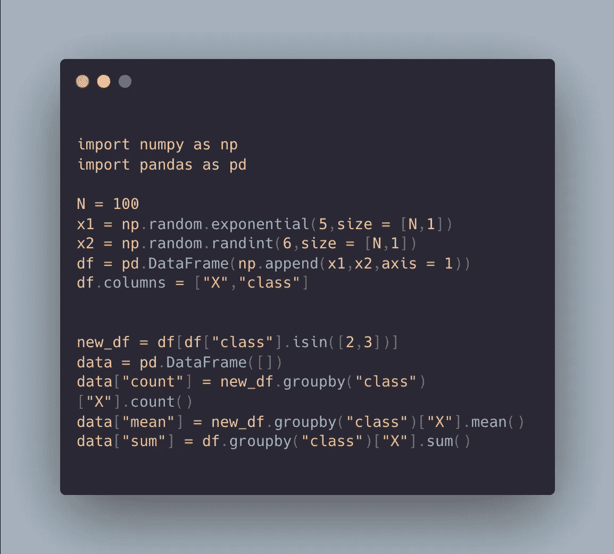
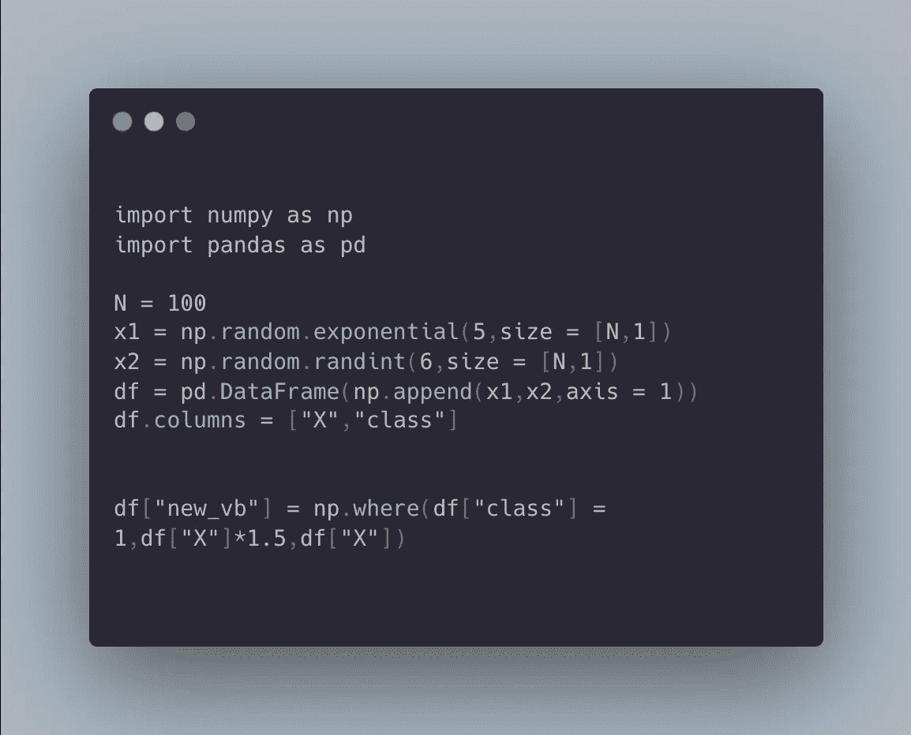
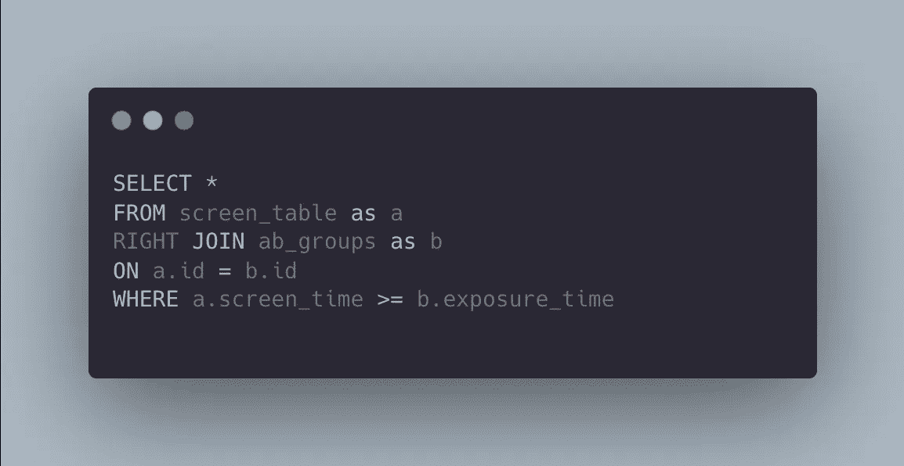

# 如何破解 Spotify 数据科学技术屏面试

> 原文：<https://towardsdatascience.com/how-to-crack-spotify-data-science-technical-screen-interview-23f0f7205928>

## 要了解 Spotify 技术屏幕，您应该知道的确切 Python/SQL 命令和实验主题列表


图片来源: [@felipepelaquim](https://www.pexels.com/photo/light-vacation-art-hand-10465965/)

如果你正在准备 Spotify 的技术筛选或技术面试，那么你很可能在寻找以下问题的答案:

*   *我该如何开始准备 Spotify 数据科学技术面试？*
*   *我能从 Spotify 数据科学技术采访中得到什么？*

本文将涵盖以下主题:

```
**- Tech Screen Duration
- Part 1: Python Question
- Part 2: SQL Question
- Part 3: A/B Testing Question**
```

# 技术屏幕持续时间

这个技术面试大约需要 45 分钟，分为三个部分:Python、SQL 和实验。


图片来源: [cottonbro](https://www.pexels.com/photo/listening-to-music-on-a-smartphone-5077404/)

# 第 1 部分:Python 问题

第一个技术屏幕问题通常是数据争论或数据转换问题，这应该在 Python 中进行，尽管您也可以在 SQL 中进行。这个问题旨在了解你是否能利用 **Python** 中的过滤、聚合等一些基本概念。是否可以利用两个最流行的库: **Pandas** 和 **NumPy。**

## 示例问题

如何修复某个特定设备的数据因为某种原因减半的数据中的 bug？

学习 **Pandas** 中的基本功能，如分组、求和、平均、过滤(单值和多值)，如:

*   **df.groupby("x")**
*   **df.groupby("x")["y"]。sum()**
*   **df.groupby("x")["y"]。avg()**
*   **df[df["x"] == k]**
*   **df[df.x.isin([k，l])】**



学习 **Numpy:** 中的基本过滤功能

*   df["new_vb"] = np.where(条件，条件为真时的值，条件为假时的值)



# 第 2 部分:SQL 问题

技术屏幕上的第二个问题是 **SQL** 中的编码问题，您需要了解基本的 SQL 函数来过滤数据，执行两个数据之间的连接，同时深入了解 **A/B 测试**的概念。

要解决这个问题，你需要熟悉 A/B 测试背后的基本概念，例如控制组与实验组，选择主要的成功或绩效指标，并对这两组中的每一组进行计算。你需要了解的关于 A/B 测试解决这个问题的一切都可以在这里找到:[https://towardsdatascience . com/simple-and-complet-guide-to-A-B-testing-c 34154d 0 ce 5 A](/simple-and-complet-guide-to-a-b-testing-c34154d0ce5a)

[](/simple-and-complet-guide-to-a-b-testing-c34154d0ce5a) [## 简单完整的 A/B 测试指南

### 为您的数据科学实验进行端到端 A/B 测试，面向非技术和技术专家，提供示例和…

towardsdatascience.com](/simple-and-complet-guide-to-a-b-testing-c34154d0ce5a) 

要解决这个问题，请学习以下 **SQL** 中的基本函数:

*   **选择**
*   **计数**
*   **AVG**
*   **左连接，右连接**
*   **其中**
*   **分组依据**
*   **有**
*   **排序依据**
*   **极限值**

您应该能够计算指标，如每个控制和实验组的平均屏幕时间，其中用户信息在一个表中，而屏幕时间在另一个表中。这意味着您应该能够连接两个表，并且只为参与 A/B 测试的用户保留数据(左连接或右连接),这取决于您选择的表顺序。

例如:



您需要记住的一点是，您只需要 A/B 测试用户在 A/B 测试开始后的使用数据。

# 第 3 部分:A/B 测试问题

面试的第三部分也是最后一部分是关于 A/B 测试的。这些是静态问题，你可以在每一次与实验相关的面试中找到，例如:

*   p 值
*   统计显著性
*   假设检验
*   t 检验与 z 检验
*   置信区间
*   第一类和第二类错误
*   更多

研究以下两篇博文，它们包含了所有基本的统计概念，如 p 值等，以及关于 A/B 测试的内容，然后你将能够回答在技术屏幕的最后部分提出的所有问题。

[](/fundamentals-of-statistics-for-data-scientists-and-data-analysts-69d93a05aae7) [## 数据科学家和数据分析师的统计学基础

### 数据科学或数据分析之旅的关键统计概念

towardsdatascience.com](/fundamentals-of-statistics-for-data-scientists-and-data-analysts-69d93a05aae7) [](/simple-and-complet-guide-to-a-b-testing-c34154d0ce5a) [## 简单完整的 A/B 测试指南

### 为您的数据科学实验进行端到端 A/B 测试，面向非技术和技术专家，提供示例和…

towardsdatascience.com](/simple-and-complet-guide-to-a-b-testing-c34154d0ce5a) 

图片来源: [cottonbro](https://www.pexels.com/@cottonbro?utm_content=attributionCopyText&utm_medium=referral&utm_source=pexels)

***免责声明*** *:你可以在 Glassdoor.com 等网站上找到更多关于 Spotify 或任何其他公司面试问题类型的信息。*

# 如果你喜欢这篇文章，这里有一些你可能喜欢的其他文章:

[](/simple-and-complet-guide-to-a-b-testing-c34154d0ce5a) [## 简单完整的 A/B 测试指南

### 为您的数据科学实验进行端到端 A/B 测试，面向非技术和技术专家，提供示例和…

towardsdatascience.com](/simple-and-complet-guide-to-a-b-testing-c34154d0ce5a) [](/fundamentals-of-statistics-for-data-scientists-and-data-analysts-69d93a05aae7) [## 数据科学家和数据分析师的统计学基础

### 数据科学或数据分析之旅的关键统计概念

towardsdatascience.com](/fundamentals-of-statistics-for-data-scientists-and-data-analysts-69d93a05aae7) [](/bias-variance-trade-off-overfitting-regularization-in-machine-learning-d79c6d8f20b4) [## 理解机器学习中的偏差-方差权衡、过拟合和正则化

### 介绍偏差-方差权衡，过度拟合&如何使用正则化解决过度拟合:脊和套索…

towardsdatascience.com](/bias-variance-trade-off-overfitting-regularization-in-machine-learning-d79c6d8f20b4) [](https://tatev-aslanyan.medium.com/data-sampling-methods-in-python-a4400628ea1b) [## Python 中的数据采样方法

### 使用不同的数据采样技术创建 Python 中的随机样本的现成代码

tatev-aslanyan.medium.com](https://tatev-aslanyan.medium.com/data-sampling-methods-in-python-a4400628ea1b) [](https://medium.com/analytics-vidhya/pyspark-cheat-sheet-big-data-analytics-161a8e1f6185) [## PySpark 备忘单:大数据分析

### 这里是基本 PySpark 命令和函数的备忘单。在 PySpark 中开始您的大数据分析。

medium.com](https://medium.com/analytics-vidhya/pyspark-cheat-sheet-big-data-analytics-161a8e1f6185) [](https://tatev-aslanyan.medium.com/bias-variance-trade-off-in-machine-learning-7f885355e847) [## 机器学习中的偏差-方差权衡

### 机器学习和统计模型中偏差-方差权衡的介绍

tatev-aslanyan.medium.com](https://tatev-aslanyan.medium.com/bias-variance-trade-off-in-machine-learning-7f885355e847) [](/monte-carlo-simulation-and-variants-with-python-43e3e7c59e1f) [## 蒙特卡罗模拟和 Python 变种

### 蒙特卡洛模拟指南，必须了解 Python 实现的统计抽样技术

towardsdatascience.com](/monte-carlo-simulation-and-variants-with-python-43e3e7c59e1f) [](https://levelup.gitconnected.com/predicting-bitcoins-price-with-recurrent-neural-networks-a27b4d2d839) [## 用递归神经网络预测比特币价格

### 谁没听说过世界上最著名的数字货币，十年加密货币？没错，我是…

levelup.gitconnected.com](https://levelup.gitconnected.com/predicting-bitcoins-price-with-recurrent-neural-networks-a27b4d2d839) 

***感谢阅读***

*我鼓励你* [***加入 Medium***](https://tatev-aslanyan.medium.com/membership)**来拥有* *完整访问我所有关于数据科学、机器学习、AI 和其他主题的文章。**

**关注我* [***中***](https://medium.com/@tatev-aslanyan)**阅读更多关于各种数据科学和数据分析话题的文章。更多机器学习的动手应用，数学和统计概念查看我的*[***Github***](https://github.com/TatevKaren)**账号。
欢迎反馈，可在*[***LinkedIn***](https://www.linkedin.com/in/tatev-karen-aslanyan/)*上联系。****

*****快乐学习！*****