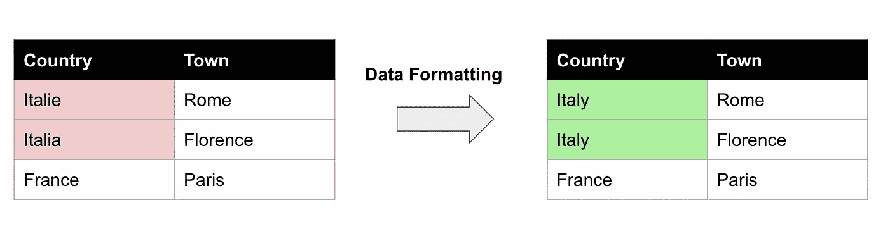
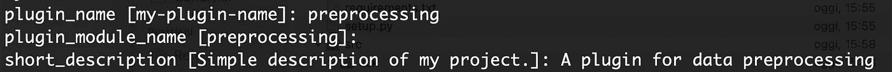
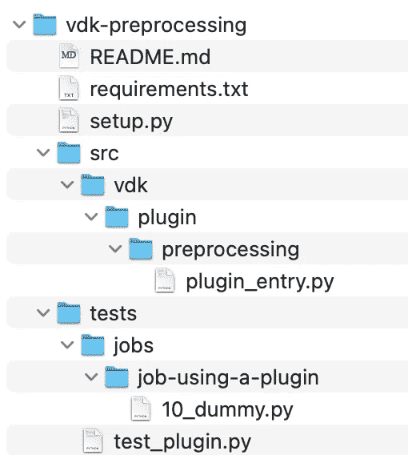
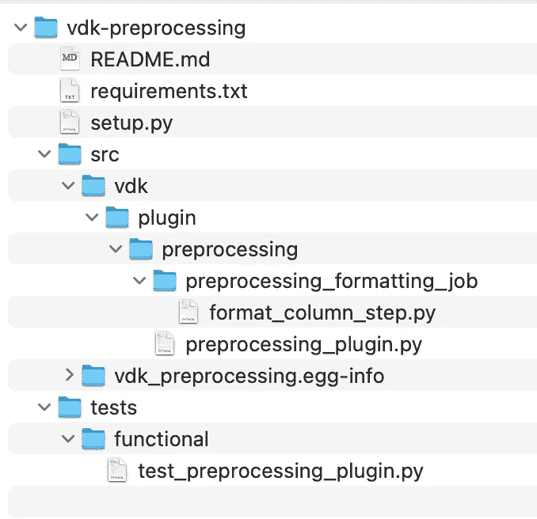
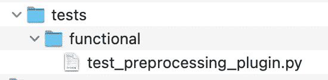

# 如何在 VDK 创建一个数据格式插件

> 原文：<https://towardsdatascience.com/how-to-create-a-data-formatting-plugin-in-vdk-dc5f1c7d206d>

## 数据工程，数据湖

## 关于如何通过编写 VDK 自定义插件来操作数据湖中的表的分步教程


[活动创建者](https://unsplash.com/@campaign_creators?utm_source=medium&utm_medium=referral)在 [Unsplash](https://unsplash.com?utm_source=medium&utm_medium=referral) 上的照片

[通用数据工具包](https://github.com/vmware/versatile-data-kit) (VDK)是一个框架，用于将不同的数据源接收和操作到一个数据湖中。我已经在我的上一篇文章中讨论过 VDK，所以关于它的介绍，你可以参考那里。

在这篇文章中，我将讨论如何在 VDK 中实现一个自定义插件。**作为一个用例，我将实现一个简单的插件，它从现有的表中获取输入，并在其上执行数据格式化。为了展示插件是如何工作的，我将只实现一个简单的任务，从一个表的一列中取出一些字符串，并用另一个字符串替换它们。下图显示了我将要实现的数据格式化作业:**



作者图片

在左边的表中，同一个国家意大利出现了两个不同的名称，因此我将执行数据格式化，以得到一个同质的国家值，如右边的表所示。

为了执行前面描述的任务，我将实现一个 VDK 插件，您可以如下调用:

```
**vdk format-column** -t my-table -c country -o "Italie,Italia" -d Italy
```

其中:

*   `-t`选项指定要操作的表格
*   `-c`选项指定要操作的列
*   `-o`选项指定要替换的事件列表
*   `-d`选项指定目标值。

为了在 VDK 实现这个自定义插件，我将遵循下面描述的步骤:

1.  创建骨架
2.  配置插件
3.  配置作业
4.  测试和安装插件。

# 1.创建骨架

为了创建插件的框架，我使用如下的`cookiecutter`:

```
**cookiecutter** https://github.com/tozka/cookiecutter-vdk-plugin
```

当我运行前面的命令时，我需要回答一些问题:



作者图片

该过程完成后，将创建一个新目录。下图显示了所创建目录的树:



作者图片

包含两个主目录:`src`和`tests`，以及三个文件:`README.md`、`requirements.txt`和`setup.py`。

首先，我编辑`README.md`文件。我可以让`requirements.txt`保持原样，因为我不会添加任何特定的库。

我现在把重点放在插件配置上。

# 2 配置插件

我用编辑器打开了`setup.py`文件。在这个文件中，您可以指定插件的版本、名称、所需的包以及插件的入口点目录:

```
__version__ = "0.1.0"setuptools.setup(
 **name="vdk-preprocessing",**
 version=__version__,
 url="https://github.com/vmware/versatile-data-kit",
 description="Versatile Data Kit SDK Preprocessing plugin to manipulate an already ingested table.", long_description=pathlib.Path("README.md").read_text(),
 long_description_content_type="text/markdown",
 install_requires=["vdk-core"],
 package_dir={"": "src"}, packages=setuptools.find_namespace_packages(where="src"), **entry_points={"vdk.plugin.run": ["vdk-preprocessing =  vdk.plugin.preprocessing.preprocessing_plugin"]},** classifiers=[ "Development Status :: 4 - Beta",
 "License :: OSI Approved :: Apache Software License",
 "Programming Language :: Python :: 3.7",
 "Programming Language :: Python :: 3.8",
 "Programming Language :: Python :: 3.9",
 "Programming Language :: Python :: 3.10",
 ],)
```

现在我可以重命名目录的名称来反映我的项目的语义。最终的目录树应该如下所示:



我已经将`plugin_entry.py`重命名为`preprocessing_plugin.py`，然后我在`preprocessing`中添加了一个`preprocessing_formatting_job`目录，在那里我放了一个`format_column_step.py`脚本。

现在我正在写剧本`preprocessing_plugin.py`。这个脚本定义了插件接口。在我的例子中，我将实现一个命令行插件，所以这里我必须定义插件的命令名，以及传递给命令的选项。在我的例子中，该命令将接收 4 个参数作为输入:

```
**@click.command**(
  name="format-column",
  help="Execute a SQL query against a configured database and format the table.",
  no_args_is_help=True,
)**@click.option**(
  "-t",
  "--table",
  help="The name of the table.",
  default="my_table",
  type=click.STRING,
)**@click.option**(
  "-c",
  "--column",
  help="The column to format.",
  default="my_column",
  type=click.STRING,
)**@click.option**(
  "-o",
  "--occurrences",
  help="The list of occurrences to modify separated by comma.",
  default="",
  type=click.STRING,
)**@click.option**(
  "-d",
  "--destination",
  help="The target value.",
  default="",
  type=click.STRING,
)**@click.pass_context**
```

您可以注意到，我需要将上下文传递给我的命令函数。

VDK 使用`hookimpl` decorators 实现了一个插件，所以你可以参考 [VDK 官方文档](https://github.com/vmware/versatile-data-kit/tree/main/projects/vdk-plugins)了解更多细节。

一旦定义了选项，我就可以定义`format_column()`函数，它将接收它们:

```
**def format_column(ctx: click.Context, table: str, column: str, occurrences : str, destination : str):**
  args = dict(table=table, column=column, occurrences=occurrences, destination=destination)
  ctx.invoke(
    run,
    data_job_directory=os.path.dirname(format_column_step.__file__),
    arguments=json.dumps(args),
)
```

前面的函数只是调用运行任务的特定作业。

最后，我给 VDK 加上命令:

```
@hookimpl
**def vdk_command_line(root_command: click.Group) -> None:**
   root_command.add_command(format_column)
```

# 3 配置作业

现在是配置格式化作业的时候了。这个作业只包含一个名为 format_column.py 的步骤。

我定义了一个名为 ColumnFormatter 的新类来执行该任务。在我的例子中，它搜索作为参数传递的表的列中的所有匹配项，并用目标值替换它:

```
class **ColumnFormatter**:
  def __init__(self, job_input: IJobInput):
     self.__job_input = job_input def format_column(self, table: str, column: str, occurrences: list, destination : str):
     for value in occurrences:
        query = f"UPDATE {table} SET {column} = '{destination}' WHERE {column} = '{value}'; "
       self.__job_input.execute_query(query)
```

`ColumnFormatter`类必须包含一个`IJobInput`实例对象。

现在我实现了`run()`函数，向 VDK 表明这是一个步骤:

```
def **run(job_input: IJobInput) -> None:** table = job_input.get_arguments().get("table")
   column = job_input.get_arguments().get("column") 
   occurrences = job_input.get_arguments().get("occurrences").split(",")
   destination = job_input.get_arguments().get("destination") formatter = ColumnFormatter(job_input)
   formatter.format_column(table, column, occurrences,destination)
```

`run()`函数只是检索命令行参数，并将它们传递给 ColumnFormatter 方法`format_column()`。

# 4 测试和安装插件

插件准备好了。最后一步包括编写测试和安装插件。我更改了`tests`目录的默认结构，因为我将实现一个简单的测试。

我将测试编写为包含在测试目录中的脚本，如下图所示:



作者图片

您可以编写任意多的测试。在这个例子中，我只编写了一个测试来展示它们是如何工作的。VDK 使用`pytest`来执行测试。

我编写了下面的测试:

*   我使用`sqlite-query`插件创建了一个表格。我还用本文顶部显示的表中的值填充了该表(列 town 和 country)

```
runner = **CliEntryBasedTestRunner**(sqlite_plugin, preprocessing_plugin)runner.invoke(
[
 "sqlite-query",
 "--query",
 "CREATE TABLE test_table (city TEXT, country TEXT)",
]
)mock_sqlite_conf = mock.MagicMock(SQLiteConfiguration)
sqlite_ingest = IngestToSQLite(mock_sqlite_conf)
payload = [
{"city": "Pisa", "country": "Italie"},
{"city": "Milano", "country": "Italia"},
{"city": "Paris", "country": "France"},
]sqlite_ingest.ingest_payload(
 payload=payload,
 destination_table="test_table",
 target=db_dir,
)
```

我使用了 VDK 提供的`CliEntryBasedTestRunner()`类来调用 sqlite-query 插件。

*   我调用 vdk 预处理插件，用值“意大利”替换国家列中出现的“意大利，意大利”

```
result = runner.invoke(["**format-column**", "--table", "test_table", "--column", "country", "--occurrences", "Italie,Italia", "--destination", "Italy"])
```

*   我检查输出。

```
result = runner.invoke([
 "sqlite-query",
 "--query",
 "SELECT country FROM test_table",
]
)output = result.stdout
assert output == (
  "country\n"
  "---------\n"
  "Italy\n"
  "Italy\n"
  "France\n")
```

现在你可以运行测试。首先，我安装软件包:

```
pip install -e /path/to/vdk-preprocessing/
```

然后从`vdk-preprocessing`目录中:

```
pytest
```

如果一切正常，你的测试应该是`PASSED`。

# 摘要

恭喜你！你刚刚学会了如何在 VDK 建立一个自定义插件！你可以在 [VDK 官方知识库](https://github.com/vmware/versatile-data-kit/tree/main/projects/vdk-plugins)中找到更多关于 VDK 插件的信息。你也可以使用 VDK 已经有的插件！

你可以在我的 [GitHub 库](https://github.com/alod83/vdk-examples/tree/main/plugins/vdk-preprocessing)中找到这篇文章中描述的例子的代码。

# 相关文章

[](/handling-missing-values-in-versatile-data-kit-bb4f2a907b9c)  [](/how-to-build-a-web-app-with-data-ingested-through-versatile-data-kit-ddae43b5f62d)  [](/using-versatile-data-kit-to-ingest-and-process-data-from-rest-api-6e3e0660b791)  [](/from-raw-data-to-a-cleaned-database-a-deep-dive-into-versatile-data-kit-ab5fd992a02e) 