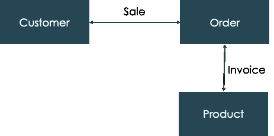
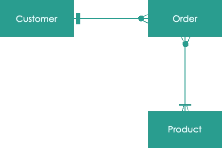
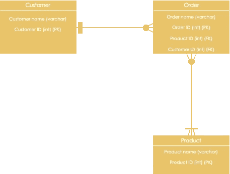
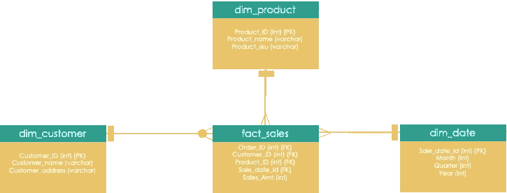

# 如何通过 5 个重要步骤创建数据仓库

> 原文：<https://towardsdatascience.com/how-to-create-a-data-warehouse-in-5-important-steps-95a8f893a3fd>

## 任何数据仓库项目中需要的 5 个重要步骤

[万花筒](https://unsplash.com/@kaleidico?utm_source=medium&utm_medium=referral)在 [Unsplash](https://unsplash.com?utm_source=medium&utm_medium=referral) 上拍摄的照片

H 作为众多复杂数据转换项目的一部分，我可以确认 85%的数据项目失败的统计数据。

这些失败的原因是:

1.  更改数据堆栈
2.  缺乏准备
3.  没有合适的团队
4.  不耐烦的利益相关者
5.  过分热情的管理
6.  缺乏对文化变革的投资等。

项目以良好的意图开始；很快，面对以上问题，导致挫败感和一种压倒性的感觉。这些项目要么被不择手段拖到终点线，要么被放弃，去寻找下一个闪亮的目标。

那么，我们如何避免这种情况呢？今天，我们将学习一个成功的数据仓库项目的蓝图。

不，这不是火箭科学。

## 第 1 步—了解核心业务需求

请不要追逐下一个闪亮的物体。

你真的需要一个数据仓库(DWH)吗？除非你是一个全新的企业，你可能已经有了最后的 DWH 项目的残余。需求需要创建一个新的**DWH 吗？如果答案是肯定的，请确保您了解核心业务需求。**

通常，它是为了解决一个重大问题，即如何产生更多的收入，减轻监管风险，改善董事会层面的报告等。

> 记住；解决问题>用于解决问题的技术

明确你的要求——创造迫使你思考最终结果的报道故事。

一个报道故事的例子:

*作为一名营销经理，我需要了解去年购买***产品的*****客户*** *的* ***数量，以便向他们提供追加销售。*****

**从上面的故事中，我可以确定我们将需要**根据前一年**的销售额合计每位顾客**的产品数量。**创建一个完整的报告故事目录，帮助您推动业务及其数据需求。**

## ****创建概念模型****

**现在，您已经有了一个报告故事的列表，是时候创建简单的概念模型来验证它们了。概念模型是实体及其关系的抽象视图。**

**用简单的英语，他们像五年级学生一样解释你的业务流程。**

****

**作者图片:抽象概念模型**

**概念模型还可以稍微详细一些，实体关系可以解释为一对多、一对一或多对多，称为 [**基数。**](https://www.lucidchart.com/pages/ER-diagram-symbols-and-meaning)**

****

**作者图片:显示基数的模型**

1.  **客户必须是独一无二的，即同一客户不应重复计算。**
2.  **他们可以有零个或多个订单，也就是说，他们可能在数据库中，以前从未订购过。**
3.  **订单必须包含一种或多种产品，即没有产品就不能下订单。**
4.  **一个产品可能出现在零个或多个订单中，即一个产品可能在库存中，但从未销售过或销售过多次。**

**你有一个报道故事的目录，你从中挑选出所需的数据。您还有一个简单的概念模型，它解释了这些关系。**

**这必须与业务最终用户共同创建和验证。**

## **步骤#2 —创建物理数据模型**

**我们可以从早期的概念数据模型中为骨骼添加肉。作为一个实体，客户现在可以被细化为属性，如客户姓名、电话号码、地址、唯一标识符等。**

****

**作者图片:简单的物理数据模型，只有很少的关键属性**

**物理模型引入了字符串、整数等数据类型。、主键和外键。如果我们回到最初的报告故事，我们在物理数据模型中有足够的信息来回答这个问题吗？**

> **作为一名营销经理，我需要知道**客户**去年**购买的**产品数量**，以便向他们提供追加销售。****

****我不这么认为！此时，我们需要决定如何在 DWH 创建这些数据。我们可以使用一些不同的方法，例如星型模式中的维度建模或雪花模型中的第三范式标准化。****

****如果这些概念对你来说是陌生的——考虑阅读这篇文章:****

****  

对于我们的例子，我们将创建一个简单的维度模型，包含事实(定量)和维度(定性)。

作者图片:我们报道故事的星形模式

现在，我们在事实表中有了足够的信息，可以聚合任意日期(去年、最近五年)每个客户的产品数量及其总销售额。该模型还允许我们以多种方式“切割”数据。

## 分析已知的数据属性

当这项活动正在进行时，您必须**开始分析已知的源数据。**

我已经记不清有多少 DWH 项目因为数据质量差和缺乏真实数据测试而失败。提前做好这项工作——在设计数据管道之前，分析数据，了解数据质量问题，并尝试解决这些问题。如果某个问题无法解决，您必须在您的数据管道中处理它。**** 

## ****第 3 步—展示最终结果的解决方案线框****

****根据团队的规模和需求的复杂程度，这可能与第二步同时发生。商业终端用户不关心你的 DWH 或者你的星形模式维度模型。他们希望问题得到解决。****

****记住；解决问题>用于解决问题的技术！****

****在此阶段，根据客户的要求创建一些最终报告的线框/原型。你将很快学会并塑造最终产品的外观。业务最终用户可能有一个愿景，但他们在需求阶段无法清晰地表达出来。线框不需要使用真实世界的数据或在报告工具中。它可以简单地在幻灯片中创建。****

## ****步骤# 4——构建、测试和迭代****

****希望到这时候，我们已经做出了一些设计和环境决策。包括物理数据模型、历史要求、批准的线框图以及环境供应和设置。****

****现在—我们创建 ETL(提取、转换和加载)作业或数据管道。数据需要从源系统转移到我们的物理 DWH。****

****在移动这些数据时，我们需要考虑#2(数据类型)的分析输出，如果需要转换，还需要考虑需要提取的历史记录的数量。我们还需要迭代地对管道的单个组件进行单元测试。****

****一旦构建了足够大的管道，就应该进行端到端的系统集成测试，以确保集成点按预期运行。****

******整合通常决定交付的成败。******

****如果渠道足够成熟，可以给出一个结果，即报告指标、总销售额、产品数量等。，谨慎的做法是与业务最终用户一起验证这些数字。同样，让最终用户参与到整个过程中来帮助迭代解决方案将会在项目的后期节省大量的痛苦。****

## ****第五步——不是上线——而是走向成熟****

****我们喜欢对现场约会感到兴奋。一个 DWH 需要成熟；因此，上线并不重要。****

****如果被现实生活中的数据证明是错误的，一些设计决策可能必须在成熟阶段重新考虑。如果变更很耗时，并且影响到许多组件，这就特别痛苦。因此，我建议提前广泛地分析数据。****

****如果创建最终报告所需的时间比预期的长，则必须持续进行性能调整。****

****数据库管理员可能需要收集数据统计信息、创建索引、在重复的日期应用压缩等。在 DWH 可以完全依赖之前。****

****再说一次，从经验来说，期望 DWH 在代码生产的第一天就能工作是天真的。****

****随着 DWH 的成熟，使用它的团队将需要接受如何使用它的培训，数据治理原则将得到应用，数据质量和清理流程将正式化。将围绕这个 DWH 创建一个完整的运营模型，以确保它符合目的。****

## ****结论****

****这不是一份详尽的活动清单；在这篇文章中，我可能忽略了一些我认为不太必要的步骤。希望这里能为你和你的 DWH 项目提供一些经验。****

****如果你觉得这篇文章有帮助，请在下面留言告诉我。查看我在 Medium 上的其他帖子:****

****  

如果您没有订阅 Medium，请考虑使用我的推荐链接订阅[。它比网飞便宜，而且客观上能更好地利用你的时间。](https://hanzalaqureshi.medium.com/membership)如果你使用我的链接，我会获得一小笔佣金，而你可以在 Medium 上获得无限的故事。

我也定期在推特上写东西；跟着[我这里](https://twitter.com/hanzalaqureshi_)。****