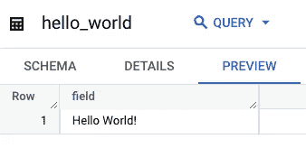
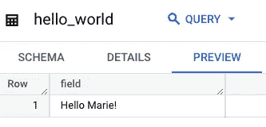
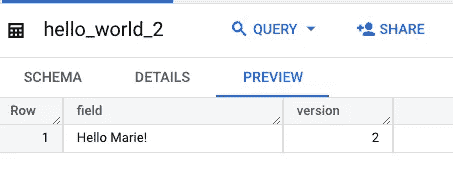
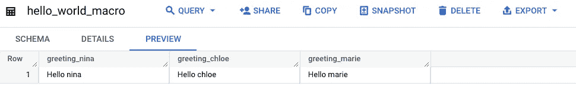

# 如何创建 dbt 包

> 原文：<https://towardsdatascience.com/how-to-create-a-dbt-package-ca795d1dbe12>


[钳工](https://unsplash.com/@benchaccounting?utm_source=medium&utm_medium=referral)在 [Unsplash](https://unsplash.com?utm_source=medium&utm_medium=referral) 上拍照

我过去常常复制和粘贴几乎相同的 SQL 查询，认为这是使用 SQL 的唯一方法。

幸运的是，我接受了一个分析工程师的新职位，并发现了 **dbt** ，这是一个用动态查询和模型依赖来构建数据模型的神奇工具。

</what-is-dbt-a0d91109f7d0>  

有了 dbt，我们可以使用宏，而不用两次重写相同的 SQL。我很快意识到，即使我们试图在项目中使用可重用的代码，我们也经常在不同的项目中使用相同的代码。

为了避免跨项目的代码冗余，我创建了我的第一个 dbt 包。这个包现在由共享一些模型和宏的几个项目导入。

以下是如何快速创建第一个 dbt 包并跨项目重用代码的方法！

# 创建项目

dbt 包只不过是一个常规的 dbt 项目。让我们通过调用 **dbt init** 来创建一个包。选择您想要的名称和配置，这并不重要，因为我们不会单独使用这个项目。

我们将把这个项目称为**包**，而这个包被导入的项目称为**主项目**。

# 导入模型

现在，在 **models/example** 文件夹中，让我们使用以下查询创建一个名为 **hello_world.sql，**的文件:

```
{{config(
materialized = 'table'
)}}SELECT "Hello World!" AS field
```

并将绝对路径复制到 dbt 项目。

打开您的主项目，并编辑 **packages.yml** 以添加以下行:

```
- local: <absolute_path>
```

然后在您的终端中，运行:

```
dbt deps
dbt run -m example
```

检查您的配置文件中指定的数据集。您现在应该会看到一个新的表格 hello_world，如下所示:



作者截图

# 定制您的模型

## 项目变量

这很好，但是您可能不希望在所有项目中使用完全相同的查询。好消息是，你可以使用项目变量来定制你的模型。

让我们编辑我们的查询:

```
{{config(materialized = 'table')}}SELECT "Hello {{ var('first_name') }}!" AS field
```

在我们主项目的 **dbt_project.yml** 文件中，我们可以像这样添加一个项目变量:

```
vars: first_name: Marie
```



作者截图

然后一旦你运行 **dbt run -m example，**你的查询将使用为该变量定义的值运行！

## **源文件**

这只是一个没有 FROM 子句的简单查询；在实际项目中，您还会希望使用[源文件](https://docs.getdbt.com/docs/build/sources)来查询不同的表。

让我们创建一个使用源表的模型 **hello_world_2** 。

```
{{config(materialized = 'table')}}SELECT *, 2 AS versionFROM {{ source("hello_source", "hello_world")}}
```

这里，我们告诉 dbt 在 source **hello_source** 中查找表 **hello_world** 。

但是我们必须在项目中配置源代码。让我们在项目的 sources 文件夹中创建一个名为 **hello.yml** 的配置文件。

```
version: 2sources: - name: hello_sourceproject: "<your_project>" dataset: "<your_dataset>" tables: - name: hello_world
```

现在，当我们运行我们的模型时，我们看到的是:



作者截图

## 导入宏

导入模型有一些主要的缺点:

*   如果我们需要模型中的变量，我们必须在项目文件中定义它们，这个文件很快就会被重载
*   项目变量的类型不被保留，所以列表被转换成字符串
*   从包中选择包括哪些型号并不容易

宏解决了这些问题，尽管还需要做更多的配置。

在我们包的 **macros** 文件夹中，让我们创建一个名为 **hello_everyone.sql** 的文件。

```
{{config(materialized = 'table')}}SELECT"Hello {{name}}" AS greeting_{{name}},
```

现在，让我们告诉主项目通过编辑项目文件来查找该宏:

```
macro-paths: ["macros", "dbt_packages/<package_name>/macros"]
```

最后，让我们在**模型/示例**中创建一个模型文件来调用我们的宏:

```
{{ hello_everyone(names) }}
```



作者截图

## 发布您的包

要发布您的包，您只需将它推送到 git 存储库，然后您将能够使用以下语法导入它:

```
packages:
  - git: "https://github.com/<git_url>" 
    revision: <version_tag>
```

感谢您的阅读，希望这篇教程对您有所帮助！您可以在 [dbt 文档](https://docs.getdbt.com/docs/build/packages)中找到关于该主题的更多信息。

如果您喜欢这篇文章，请关注我，了解更多关于 SQL、dbt 和分析的内容！