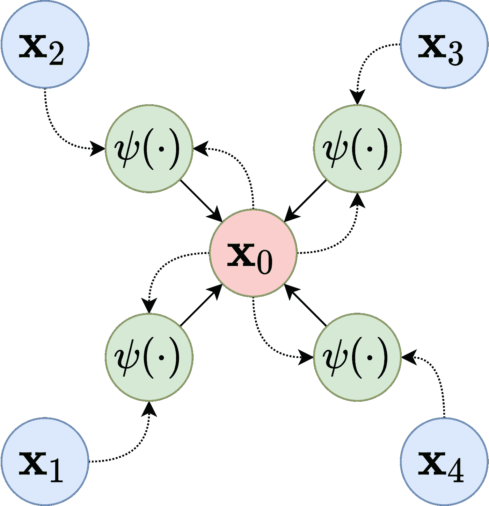

# 如何用 Python 创建图形神经网络

> 原文：<https://towardsdatascience.com/how-to-create-a-graph-neural-network-in-python-61fd9b83b54e>

## 用 Pytorch 几何图形和 OGB 创建 GNN


照片由 [JJ 英](https://unsplash.com/@jjying?utm_source=medium&utm_medium=referral)在 [Unsplash](https://unsplash.com?utm_source=medium&utm_medium=referral)

深度学习为在非结构化数据上进行预测开辟了一个全新的可能性世界。今天，通常对图像数据使用卷积神经网络(CNN ),对文本使用递归神经网络(RNNs ),等等。

在过去的几年中，出现了一类新的令人兴奋的神经网络:图神经网络(GNNs)。顾名思义，这个网络类侧重于处理图形数据。

在这篇文章中，你将学习图形神经网络如何工作的基础知识，以及如何使用 Pytorch 几何(PyG)库和开放图形基准(OGB)库在 Python 中实现它。

我的 [Github](https://github.com/TNanukem/paper_implementations/blob/main/Graph%20Neural%20Networks%20with%20OGB%20and%20Pytorch%20Geometric.ipynb) 和 [Kaggle](https://www.kaggle.com/tiagotoledojr/gnns-with-ogb-and-pytorch-geometric) 上有这篇文章的代码。

# 一个普通的 GNN 是如何工作的

随着图形卷积网络(GCN) [1]的引入，GNNs 开始变得流行起来，它从 CNN 借用了一些概念到图形世界。这种网络的主要思想，也称为消息传递框架，多年来成为该领域的黄金标准，这就是我们将在这里探讨的概念。

消息传递框架声明，对于图中的每个节点，我们将做两件事:

*   聚集来自其邻居的信息
*   用来自其先前层及其邻居聚集的信息来更新节点信息



消息传递框架。来源:[维基百科](https://en.wikipedia.org/wiki/Graph_neural_network#/media/File:Message_Passing_Neural_Network.png)

图 1 展示了这个通用框架是如何工作的。GCN 之后开发的许多架构都专注于定义聚集和更新数据的最佳方式。

# 关于派格和 OGB

PyG 是 Pytorch 库的扩展，它允许我们使用研究中已经建立的层快速实现新的 GNNs 架构。

OGB [2]是作为一种提高该领域研究质量的方法而开发的，因为它提供了可供使用的精选图表，也是评估给定架构结果的标准方法，从而使方案之间的比较更加公平。

一起使用这两个库的想法是，人们可以更容易地提出一个体系结构，而不必担心数据获取和评估机制。

# 实施 GNN

首先，让我们安装所需的库。请注意，您必须安装 PyTorch:

```
pip install ogb
pip install torch_geometric
```

现在，让我们导入所需的方法和库:

```
import os
import torch
import torch.nn.functional as Ffrom tqdm import tqdm
from torch_geometric.loader import NeighborLoader
from torch.optim.lr_scheduler import ReduceLROnPlateau
from torch_geometric.nn import MessagePassing, SAGEConv
from ogb.nodeproppred import Evaluator, PygNodePropPredDataset
```

第一步是从 OGB 下载数据集。我们将使用 ogbn-arxiv 网络，其中每个节点是 arxiv 上的一篇计算机科学论文，每个有向边代表一篇论文引用了另一篇论文。任务是将每个节点分类到一个纸类中。

下载它非常简单:

```
target_dataset = 'ogbn-arxiv'# This will download the ogbn-arxiv to the 'networks' folder
dataset = PygNodePropPredDataset(name=target_dataset, root='networks')
```

数据集变量是一个名为 PygNodePropPredDataset()的类的实例，该类特定于 OGB。要将数据集作为可在 Pytorch 几何图形上使用的数据类进行访问，我们只需:

```
data = dataset[0]
```

如果我们看一下这个变量，我们会看到这样的情况:

```
Data(num_nodes=169343, edge_index=[2, 1166243], x=[169343, 128], node_year=[169343, 1], y=[169343, 1])
```

我们有节点数、邻接表、网络的特征向量、每个节点的年份和目标标签。

这个网络已经有了一个用于训练、验证和测试的分离集。这是由 OGB 提供的，旨在提高该网络研究的可重复性和质量。我们可以通过以下方式提取:

```
split_idx = dataset.get_idx_split() 

train_idx = split_idx['train']
valid_idx = split_idx['valid']
test_idx = split_idx['test']
```

现在，我们将定义两个数据加载器，在我们的培训中使用。第一个将只加载训练集中的节点，第二个将加载网络上的所有节点。

我们将使用 Pytorch 几何图形中的邻居加载器。该数据加载器对每个节点的给定数量的邻居进行采样。这是一种避免具有数千个节点的节点的 RAM 和计算时间爆炸的方法。对于本教程，我们将在训练加载器上对每个节点使用 30 个邻居。

```
train_loader = NeighborLoader(data, input_nodes=train_idx,
                              shuffle=True, num_workers=os.cpu_count() - 2,
                              batch_size=1024, num_neighbors=[30] * 2)total_loader = NeighborLoader(data, input_nodes=None, num_neighbors=[-1],
                               batch_size=4096, shuffle=False,
                               num_workers=os.cpu_count() - 2)
```

请注意，我们打乱了训练数据加载器，而不是整个加载器。此外，训练加载器的邻居数量被定义为网络每层的数量。因为我们这里要使用两层网络，所以我们用两个值 30 将其设置到列表中。

现在是时候创造我们的 GNN 建筑了。对于任何熟悉 Pytorch 的人来说，这应该不会太可怕。

我们将使用鼠尾草层。这些层在一篇非常好的论文[3]中进行了定义，该论文介绍了邻域采样的概念。Pytorch 几何库已经为我们实现了这一层。

因此，与每一个 PyTorch 架构一样，我们必须用我们将要使用的层定义一个类:

```
class SAGE(torch.nn.Module):
    def __init__(self, in_channels,
                 hidden_channels, out_channels,
                 n_layers=2):

        super(SAGE, self).__init__()
        self.n_layers = n_layers self.layers = torch.nn.ModuleList()
        self.layers_bn = torch.nn.ModuleList() if n_layers == 1:
            self.layers.append(SAGEConv(in_channels, out_channels,   normalize=False))
        elif n_layers == 2:
            self.layers.append(SAGEConv(in_channels, hidden_channels, normalize=False))
             self.layers_bn.append(torch.nn.BatchNorm1d(hidden_channels))
            self.layers.append(SAGEConv(hidden_channels, out_channels, normalize=False))
        else:
           self.layers.append(SAGEConv(in_channels, hidden_channels, normalize=False))
              self.layers_bn.append(torch.nn.BatchNorm1d(hidden_channels)) for _ in range(n_layers - 2):
                self.layers.append(SAGEConv(hidden_channels,  hidden_channels, normalize=False))
                 self.layers_bn.append(torch.nn.BatchNorm1d(hidden_channels))

            self.layers.append(SAGEConv(hidden_channels, out_channels, normalize=False))

        for layer in self.layers:
            layer.reset_parameters() def forward(self, x, edge_index):
        if len(self.layers) > 1:
            looper = self.layers[:-1]
        else:
            looper = self.layers

        for i, layer in enumerate(looper):
            x = layer(x, edge_index)
            try:
                x = self.layers_bn[i](x)
            except Exception as e:
                abs(1)
            finally:
                x = F.relu(x)
                x = F.dropout(x, p=0.5, training=self.training)

        if len(self.layers) > 1:
            x = self.layers[-1](x, edge_index) return F.log_softmax(x, dim=-1), torch.var(x)

    def inference(self, total_loader, device):
        xs = []
        var_ = []
        for batch in total_loader:
            out, var = self.forward(batch.x.to(device), batch.edge_index.to(device))
            out = out[:batch.batch_size]
            xs.append(out.cpu())
            var_.append(var.item())

        out_all = torch.cat(xs, dim=0)

        return out_all, var_
```

让我们一步一步地分解它:

*   我们必须定义网络的输入通道数，这将是数据集中的要素数。out_channels 将是我们试图预测的类的数量。隐藏通道参数是一个我们可以自己定义的值，代表隐藏单元的数量。
*   我们可以设置网络的层数。对于每个隐藏层，我们添加一个批量标准化层，然后我们重置每个层的参数。
*   forward 方法运行正向传递的单次迭代。它将获取特征向量和邻接表，并将其传递给 SAGE 层，然后将结果传递给批量规范化层。我们还应用了一个 ReLU 非线性和一个用于正则化目的的漏失层。
*   最后，推理方法将为数据集中的每个节点生成一个预测。我们将使用它进行验证。

现在，让我们定义模型的一些参数:

```
device = torch.device('cuda' if torch.cuda.is_available() else 'cpu')model = SAGE(data.x.shape[1], 256, dataset.num_classes, n_layers=2)
model.to(device)
epochs = 100
optimizer = torch.optim.Adam(model.parameters(), lr=0.03)
scheduler = ReduceLROnPlateau(optimizer, 'max', patience=7)
```

现在，我们将创建测试函数来验证我们所有的预测:

```
def test(model, device):
    evaluator = Evaluator(name=target_dataset)
    model.eval()
    out, var = model.inference(total_loader, device) y_true = data.y.cpu()
        y_pred = out.argmax(dim=-1, keepdim=True) train_acc = evaluator.eval({
        'y_true': y_true[split_idx['train']],
        'y_pred': y_pred[split_idx['train']],
    })['acc']
    val_acc = evaluator.eval({
        'y_true': y_true[split_idx['valid']],
        'y_pred': y_pred[split_idx['valid']],
    })['acc']
    test_acc = evaluator.eval({
        'y_true': y_true[split_idx['test']],
        'y_pred': y_pred[split_idx['test']],
    })['acc']return train_acc, val_acc, test_acc, torch.mean(torch.Tensor(var))
```

在这个函数中，我们从 OGB 实例化了一个验证器类。这个类将负责对我们之前检索到的每个分割进行模型验证。这样，我们将看到每个时期的训练、验证和测试集的分数。

最后，让我们创建我们的培训循环:

```
for epoch in range(1, epochs):
    model.train() pbar = tqdm(total=train_idx.size(0))
    pbar.set_description(f'Epoch {epoch:02d}') total_loss = total_correct = 0 for batch in train_loader:
        batch_size = batch.batch_size
        optimizer.zero_grad() out, _ = model(batch.x.to(device), batch.edge_index.to(device))
        out = out[:batch_size] batch_y = batch.y[:batch_size].to(device)
        batch_y = torch.reshape(batch_y, (-1,)) loss = F.nll_loss(out, batch_y)
        loss.backward()
        optimizer.step() total_loss += float(loss)
        total_correct += int(out.argmax(dim=-1).eq(batch_y).sum())
        pbar.update(batch.batch_size) pbar.close() loss = total_loss / len(train_loader)
    approx_acc = total_correct / train_idx.size(0) train_acc, val_acc, test_acc, var = test(model, device)

    print(f'Train: {train_acc:.4f}, Val: {val_acc:.4f}, Test: {test_acc:.4f}, Var: {var:.4f}')
```

这个循环将训练我们的 GNN 100 个代，并且如果我们的验证分数连续七个代没有增长，将提前停止它。

# 结论

gnn 是一类令人着迷的神经网络。今天，我们已经有几个工具来帮助我们开发这种解决方案。正如你所看到的，使用 Pytorch 几何和 OGB 可以很容易地实现一些图形的 GNN。

[1]基普夫，托马斯&韦林，马克斯。(2016).基于图卷积网络的半监督分类。

[2]胡，魏，费伊，米，齐特尼克，米，董，y，任，刘，b，卡塔斯塔，米和莱斯科维奇(2020)。开放图基准:图的机器学习数据集*。arXiv 预印本 arXiv:2005.00687* 。

[3]汉密尔顿，威廉&英，雷克斯&莱斯科维奇，Jure。(2017).大型图上的归纳表示学习。