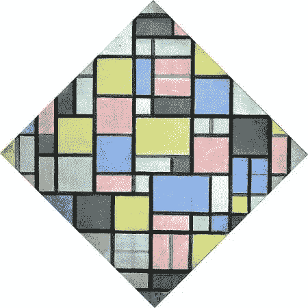
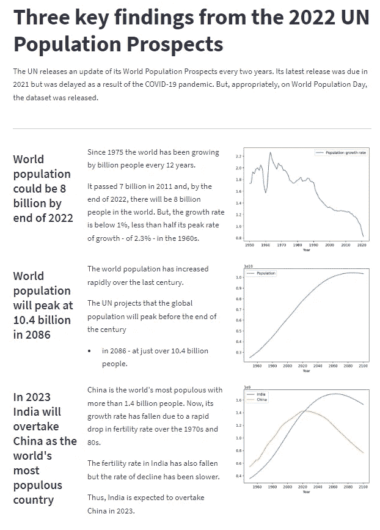
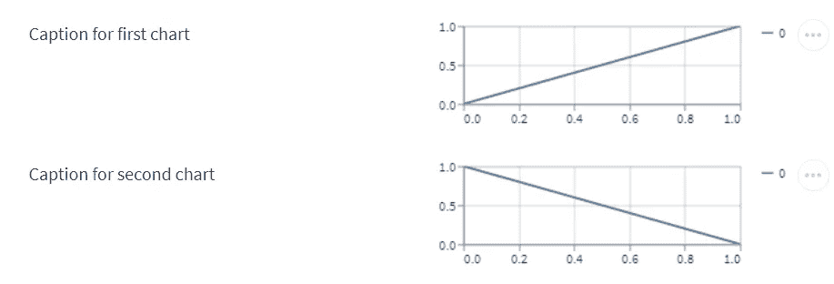
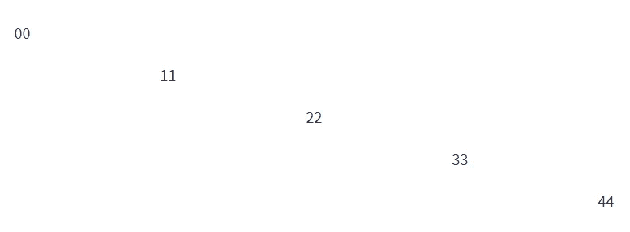
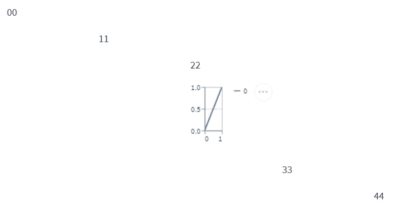

# 如何在 Streamlit 中创建网格布局

> 原文：<https://towardsdatascience.com/how-to-create-a-grid-layout-in-streamlit-7aff16b94508>

## 我们介绍了一种在 Streamlit 中使用世界人口数据演示应用程序以编程方式创建网格布局的方法



*Piet Mondrian，公共领域，通过维基共享媒体*

Streamlit 的优秀人员为我们提供了许多显示数据和图表的方法，也为设计数据科学应用程序提供了几种方法。

但是没有原生网格布局。

幸运的是，这很容易解决，我们将看到如何使用标准的 Streamlit 布局函数构建网格，然后创建一个简单的函数来创建任意维度的网格。

网格让我们以行和列的形式整齐一致地布置文本、数据和图表。例如，我用 2022 年联合国*世界人口展望*报告中的数据创建了一个 Streamlit 应用程序。其中，这份报告着眼于未来几十年世界人口将如何增长。这款应用基于《我们的世界》杂志的一篇文章(见注 1)，外观如下:



作者图片

你可以在这里运行[的应用](https://alanjones2-alan-jones-article-code-stgridappgridapp-s6w2lw.streamlit.app/)。

# 构建网格布局

稍后我们将查看该应用程序，但首先，我们将了解如何在 Streamlit 中构建网格布局。

当然，Streamlit 有内置的标准列。但是排呢？

实际上，是的，那些也是。如果我们将一堆 Streamlit 容器一个接一个地堆叠起来，我们就有了行。如果我们把这些容器分成相同数量的列，我们就有了一个网格。

看一下这段代码:

```
*# a 2x2 grid the long way*with st.container():
    col1, col2 = st.columns(2)
    with col1:
        st.write('Caption for first chart')
    with col2:
        st.line_chart((0,1), height=100)with st.container():
    col1, col2 = st.columns(2)
    with col1:
        st.write('Caption for second chart')
    with col2:
        st.line_chart((1,0), height=100)
```

*清单 1*

它通过堆叠两个容器并将每个容器分成两列来创建一个 2 x 2 的网格。每一行在右栏中有一个图表，在左栏中有一个标题。代码很容易理解并且运行良好。结果看起来像这样:



作者图片

对于这个简单的应用程序来说，这样做很好，但是如果我们要创建一个 10 x 10 的网格，代码可能会非常麻烦。

创建一个可以作为二维数组访问的网格不是更容易吗？因此，我们可以编写类似下面这样的代码，而不是我们上面看到的显式代码:

```
mygrid[0][0].write('Caption for first chart')
mygrid[0][1].line_chart((1,0), height=100)
mygrid[1][0].write('Caption for second chart')
mygrid[1][1].line_chart((0,1), height=100)
```

*清单 2*

我想你可能会同意，这是一种更简洁的方式来实现同样的事情，对于一个更大的网格将更容易管理。

因此，下一步可能是这样的:

```
*# 2x2 grid using an array*mygrid = [[],[]]with st.container():
    mygrid[0] = st.columns(2)
with st.container():
    mygrid[1] = st.columns(2)
```

*清单 3*

这里我们创建一个空的二维数组，然后在每个数组中，我们使用一个容器，并为每个数组元素分配两列。这给了我们一个二维数组，这使我们能够完全按照清单 2 中的方式编写代码。

同样，虽然这样做很好，但是将其扩展到更大的网格会导致更麻烦的代码。

# 通用解决方案

那么，我们写一个函数来创建一个任意维度的二维数组怎么样，2 x 2，3 x 2，10 x 10——随便什么。

这是:

```
*# make any grid with a function*def make_grid(cols,rows):
    grid = [0]*cols
    for i in range(cols):
        with st.container():
            grid[i] = st.columns(rows)
    return grid
```

*清单 4*

清单 4 中的函数将行数和列数作为参数。接下来，它创建一个一维数组，该数组是列的大小。(列表用零初始化——一个将被覆盖的任意值。)

然后，对于该数组的每个元素，我们创建一个 Streamlit 容器，并在该容器中创建所需数量的行(一个行列表)并将其分配给一维数组的每个元素，从而创建一个由函数返回的行和列组成的二维数组。

我们现在可以编写如下所示的代码:

```
mygrid = make_grid(5,5)mygrid[0][0].write('00')
mygrid[1][1].write('11')
mygrid[2][2].write('22')
mygrid[3][3].write('33')
mygrid[4][4].write('44')
```

*清单 5*

会产生这样的结果:



作者图片

当然，我们可以对这些网格元素使用任何适当的 Streamlit 函数，因此在清单 5 中的代码之后执行它

```
mygrid[2][2].line_chart((0,1), height=100)
```

*清单 6*

会给你这个:



作者图片

这里我们有一个创建任意大小和形状的网格布局的通用方法。让我们看看我是如何在世界人口应用程序中实际使用它的。

# 示例应用程序

该应用程序显示了联合国《2022 年世界人口展望》中的三个关键发现。它在数据中使用了我们世界中的两个数据文件，文本基于相同的来源(参见注释 1)。

每个调查结果有三行，每行包含三列:第一列是标题，第二列是简要描述，最后一列是图表。使用上述函数构建网格，使用 _ py plot _ from*matplotlib*从数据文件构建图表。使用`st.write()`或`st.markdown()`在适当的栏中显示文本。如果你遵循了上面的代码，你会发现代码很容易理解(代码的*要点*包含在最后)。

关于这个应用程序需要注意的一点是，它对各列的权重不同，因此标题列比其他两列窄一点。我们通过向`make_grid()`传递一个元组作为它的`cols`值来做到这一点。这被传递给产生我们想要的效果的`st.columns()`函数。

第一个发现是，世界人口增长率现在低于 1%，不到 20 世纪 60 年代的一半。

这一结果反映在第二个发现中，即尽管世界人口继续增长，但将在 2086 年达到 104 亿的峰值。

第三个发现是，虽然中国长期以来一直是地球上人口最多的国家——目前有 14 亿人——但自 20 世纪 70 年代和 80 年代以来，其增长率一直在下降。因此，印度的人口很可能在 2023 年超过中国，因为尽管其人口增长也在下降，但速度比中国慢。

# 结论

也许 Streamlit 将来会增加网格布局。但在此之前，我希望你会发现这是有用的。

你可以在我的 [Github 网页](https://alanjones2.github.io)上找到这里使用的所有代码和应用程序的完整列表，在文章的最后还有应用程序代码的要点。

感谢阅读。

# 笔记

1.  数据和编辑文本由[提供，数据中的我们的世界](https://ourworldindata.org/world-population-update-2022)，根据知识共享署名 4.0 国际( [CC BY 4](https://creativecommons.org/licenses/by/4.0/) )转载

# 示例应用程序清单