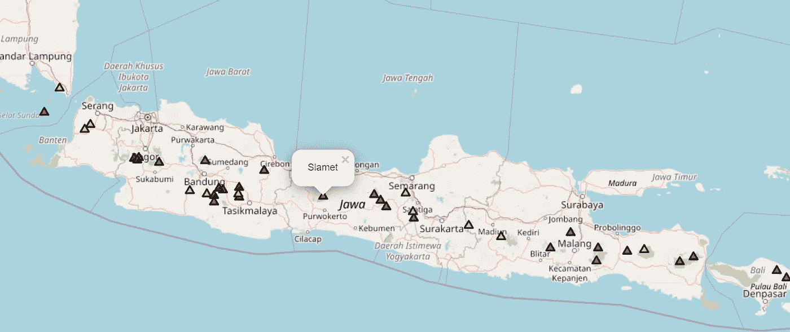
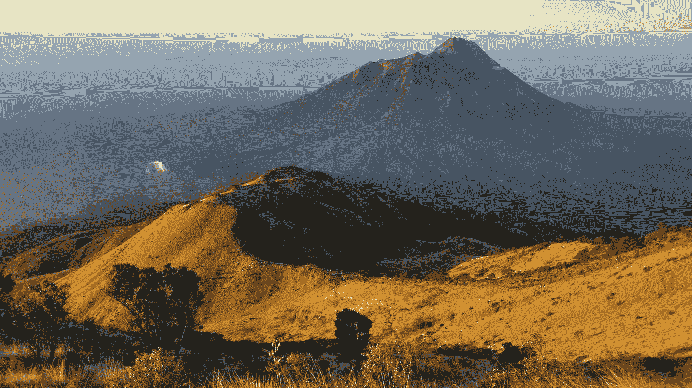
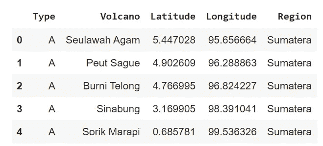
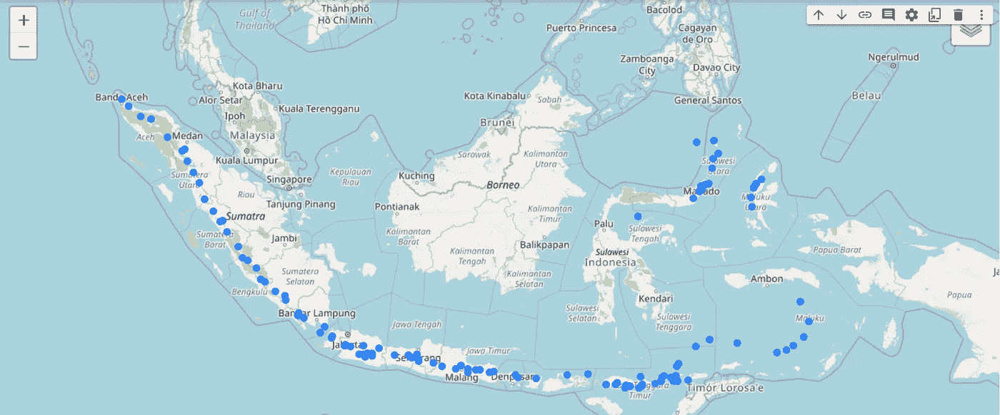
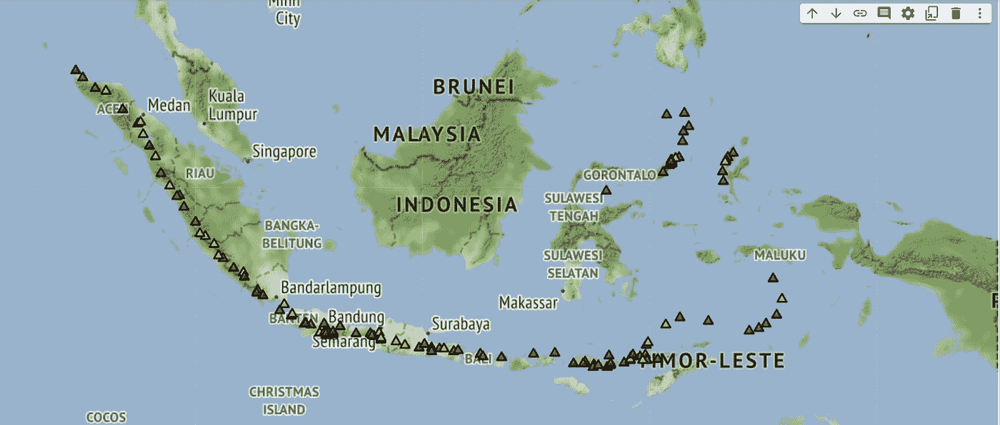

# 如何使用 Python 从地理空间数据创建地图

> 原文：<https://towardsdatascience.com/how-to-create-a-map-from-geospatial-data-in-python-f4bb7d11ddad>

## 使用 Folium 将印度尼西亚火山的位置数据绘制成地图



印度尼西亚爪哇岛的火山地图，用蟒蛇皮和树叶制成。图片作者。

我最近才学会如何用 **Python** 使用**叶子**实际创建一个地图来显示地理位置数据。我想我最好写下来，这样我就不会忘记怎么做了。在我接触到 leav 之前，我已经尝试过使用 Matplotlib 或 Plotly 等常用的可视化库。它们仍然工作，但不是我想象的那样。一旦我使用了叶，它就开始有意义了。所以我们开始吧。

作为一个例子，我将使用在印度尼西亚发现的火山的地理数据。请注意，全国至少有 **127 座火山**，从几个月前有喷发历史的活火山到没有已知喷发历史的火山。基本上，印度尼西亚是世界上活火山数量最多的国家。这听起来是可怕还是迷人，取决于你。



印度尼西亚博约拉里的默巴布山令人惊叹的景色。丹·吉尔摩在 [Unsplash](https://unsplash.com?utm_source=medium&utm_medium=referral) 上拍摄的照片。

# 收集数据

我从一个名为 [MAGMA Indonesia](https://magma.esdm.go.id/v1/edukasi/tipe-gunung-api-di-indonesia-a-b-dan-c) 的政府网站上收集了火山数据，并将它们存储到一个 CSV 文件中。您可以将以上页面中的数据复制并粘贴到您选择的任何电子表格应用程序的表格中。或者你可以在这个 [GitHub 库页面](https://github.com/catris25/Indonesian-Volcanoes-in-Folium/blob/main/Indonesian_volcanoes.csv)下载我准备好并格式化的文件。

我不是火山方面的专家，我只是碰巧一辈子都住在火山附近，所以我就按照数据和官方网站上说的去做。根据网站介绍，印度尼西亚有 3 种火山。

*   **A 型**共有 76 座，是自 16 世纪以来就有喷发历史的火山。
*   **B 型**，共 30 座，为 1600 年前有喷发史的火山。
*   **C 型**，共 21 座，是没有已知喷发历史，但仍有火山活动痕迹的火山，如索尔法塔拉或喷气孔。

# 加载和准备数据

因为我将数据保存为 CSV 格式，所以我可以使用 Pandas 加载它。

```
import pandas as pddf = pd.read_csv("Indonesian_volcanoes.csv")
df.head()
```



本文中使用的数据摘录。作者图片

然后，作为开始，我导入了 leav 库。

在这里找到我们地图的**位置中心**也很重要，它是数据中所有位置的平均经纬度。由于有火山横跨全国，这些经度和纬度基本上是在印度尼西亚的中心。我们将使用这个位置中心作为地图的中心。

手动输入定位中心也可以，但我更喜欢下面这种方式。

```
import foliumloc_center = [df['Latitude'].mean(), df['Longitude'].mean()]
```

# 蓝点中的火山

我们将把这张地图保存到一个名为 **map1** 的变量中。然后，我们可以开始使用叶创建地图。我使用 **loc_center** 中的位置作为地图的中心，并为 **zoom_start** 设置 5(完成后可以放大或缩小地图)。

地图图块有许多选项可用， **Openstreetmap** 、 **Mapbox** 、 **Stamen** 和 **CartoDB** 等等。我将使用最常见的一个，所以我使用 Openstreetmap 中的图块。

然后，我遍历了数据中的每座山，并为每座山的位置画了一个圈。弹出的是火山名称，所以当你在地图上点击它，它会显示山的名称。

```
map1 = folium.Map(location = loc_center, tiles='Openstreetmap', zoom_start = 5, control_scale=True)for index, loc in df.iterrows():
    folium.CircleMarker([loc['Latitude'], loc['Longitude']],     radius=2, weight=5, popup=loc['Volcano']).add_to(map1)folium.LayerControl().add_to(map1)map1
```



印度尼西亚的火山用蓝点表示。图片作者。


地图放大了。它展示了默拉皮火山，世界上最活跃的火山之一。图片作者。

你可以放大地图，点击每一个蓝点，就会显示出这座山的名字。总的来说，我已经对这张地图感到满意了。在这里你可以看到整个印度尼西亚和每个地区的山脉。

婆罗洲(加里曼丹)和巴布亚是印度尼西亚仅有的两个没有火山的大岛。那里有山，但是没有探测到火山活动。

现在，我想做更多的实验，比如我们把它们做成三角形，而不是圆点，怎么样？毕竟，山看起来确实像三角形，对吗？或者，如果我们根据火山活动的类型给山脉上色，就像我前面解释的那样，会怎么样呢？

# 根据火山的类型给它们上色

对于第二张地图，我将使用**雄蕊地形**作为地图的图块。我也用有三条边的正多边形标记器来做一个三角形来标记每座山。

对于 A 型火山(最活跃的火山)，我把它们涂成红色。对于 B 型，我把它们涂成黄色，对于 C 型，它们是绿色。

```
map2 = folium.Map(location = loc_center, tiles='Stamen Terrain', zoom_start = 5, control_scale=True)for index, loc in df.iterrows(): if loc['Type']=='A':
        color = 'red'
    elif loc['Type']=='B':
        color = "yellow"
    elif loc['Type']=='C':
        color = 'green'
    else:
        color = 'black' folium.RegularPolygonMarker([loc['Latitude'],    loc['Longitude']], popup = loc['Volcano'], fill_color=color, number_of_sides=3, radius=6, rotation=30).add_to(map2)folium.LayerControl().add_to(map2)map2
```



根据火山活动用不同的颜色来表示火山。图片作者。

使用上一张地图中的不同贴图，你会得到一个稍微不同的外观。用不同的颜色表示每座山的火山活动，你可以很容易地分辨出哪些火山更活跃(红色)，哪些火山不太活跃(黄色和绿色)。

您可以通过查看我将在参考资料部分链接的 Folium 文档来尝试不同的图块或不同的对象形状。

我希望你觉得这篇文章有用而且有趣。感谢阅读！

我在本文中使用的整个笔记本和数据都在下面我的 Github 存储库中。

[](https://github.com/catris25/Indonesian-Volcanoes-in-Folium)  

# **参考文献**:

[](https://magma.esdm.go.id/v1/edukasi/tipe-gunung-api-di-indonesia-a-b-dan-c)   