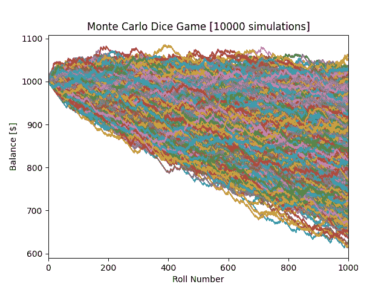

# 如何使用 Python 创建蒙特卡洛模拟

> 原文：<https://towardsdatascience.com/how-to-create-a-monte-carlo-simulation-using-python-c24634a0978a>

## 演练一个示例，了解什么是蒙特卡罗模拟以及如何使用它来预测概率


马库斯·温克勒在 [Unsplash](https://unsplash.com?utm_source=medium&utm_medium=referral) 上的照片

## 什么是蒙特卡洛模拟？

蒙特卡罗模拟是一种计算算法，它估计由于涉及随机变量而导致的不可确定事件的发生概率。该算法依靠重复的随机抽样来确定概率。这意味着用随机输入模拟一个事件很多次，以获得你的估计。您也可以确定其他因素，我们将在示例中看到。蒙特卡罗模拟可以应用于广泛的领域，从经济、赌博、工程、能源到任何介于两者之间的领域。所以，无论你在哪个职业领域，这都是一件非常值得了解的事情。

当学习如何建立蒙特卡洛模拟时，最好从一个基本模型开始，以了解基本原理。最简单也是最常见的方法是简单的游戏，所以我们将在本文中使用一个骰子游戏。你可能听说过这样一句话，“赌场总是赢家”，所以在这个例子中，赌场(通常是赌场)将有优势，我们将展示这对玩家可能的收入意味着什么。

## 骰子游戏

我们的简单游戏包括两个六面骰子。为了赢，玩家需要在两个骰子上掷出相同的数字。六面骰子有六种可能的结果(1、2、3、4、5 和 6)。用两个骰子，现在有 36 种可能的结果(1 和 1，1 和 2，1 和 3，等等。，或 6×6 = 36 种可能性)。在这场游戏中，庄家有更多的机会获胜(30 个结果对玩家的 6 个结果)，这意味着庄家有相当的优势。

假设我们的玩家开始时有 1000 美元的余额，并准备全部输掉，所以他们在每一次掷骰子时都下注 1 美元(意味着两个骰子都掷了)，并决定玩 1000 次。因为赌场如此慷慨，当玩家赢的时候，他们提供玩家赌注的 4 倍。例如，如果玩家赢了第一轮，他们的余额增加 4 美元，他们结束这一轮的余额为 1004 美元。如果他们奇迹般地连胜 1000 场，他们可以带着 5000 美元回家。如果他们每轮都输了，他们可能会一无所有地回家。风险回报比并不差…或者可能是这样。

## 导入 Python 包

让我们模拟我们的游戏，看看玩家是否做出了正确的选择。我们通过导入必要的 Python 包开始我们的代码:*的*py plot*Matplotlib*和 *random* 。我们将使用 *Pyplot* 来可视化我们的结果，并使用 *random* 来模拟普通的六面骰子滚动。

```
# Importing Packages
import matplotlib.pyplot as plt
import random
```

## 骰子滚动功能

接下来，我们可以定义一个函数，该函数将为两个骰子随机化一个从 1 到 6 的整数(模拟掷骰子)。该函数还将比较两个骰子，看它们是否相同。该函数将返回一个布尔变量 *same_num* ，用于存储卷是否相同。我们稍后将使用该值来确定代码中的操作。

```
# Creating Roll Dice Function
def roll_dice():
    die_1 = random.randint(1, 6)
    die_2 = random.randint(1, 6)

    # Determining if the dice are the same number
    if die_1 == die_2:
        same_num = True
    else:
        same_num = False
    return same_num
```

## 输入和跟踪变量

每一次蒙特卡洛模拟都需要你知道你的输入是什么，你希望获得什么信息。当我们描述这个游戏的时候，我们已经定义了我们的输入是什么。我们说过每场游戏的掷骰数是 1，000，玩家每掷的下注金额是 1 美元。除了我们的输入变量，我们还需要定义我们想要模拟游戏的次数。我们可以使用 *num_simulations* 变量作为我们的蒙特卡罗模拟计数。这个数字越大，预测的概率就越接近真实值。

我们可以跟踪的变量数量通常与项目的复杂程度成比例，所以明确你想要的信息是很重要的。在本例中，我们将跟踪每场模拟(或游戏)的获胜概率(每场游戏的获胜数除以总掷骰数)和期末余额。这些被初始化为列表，并将在每场游戏结束时更新。

```
# Inputs
num_simulations = 10000
max_num_rolls = 1000
bet = 1

# Tracking
win_probability = []
end_balance = []
```

## 设置图形

下一步是在运行模拟之前设置我们的图形。通过在模拟之前这样做，它允许我们在每次游戏后给我们的图形添加线条。然后，一旦我们运行了所有的模拟，我们就可以显示图表来显示我们的结果。

```
# Creating Figure for Simulation Balances
fig = plt.figure()
plt.title("Monte Carlo Dice Game [" + str(num_simulations) + "   
          simulations]")
plt.xlabel("Roll Number")
plt.ylabel("Balance [$]")
plt.xlim([0, max_num_rolls])
```

## 蒙特 卡罗模拟

在下面的代码中，我们有一个外部的 *for* 循环，它遍历我们预定义数量的模拟(10，000 次模拟)和一个嵌套的 *while* 循环，它运行每个游戏(1，000 次掷骰)。在我们开始每个 *while* 循环之前，我们将玩家的余额初始化为$1，000(作为用于绘图目的的列表)以及掷骰子和赢数。

我们的 *while* 循环将模拟游戏进行 1000 次掷骰。在这个循环中，我们掷骰子并使用从 *roll_dice()* 返回的布尔变量来决定结果。如果骰子是相同的数字，我们将 4 倍赌注加到*余额*列表中，并将一次胜利加到胜利计数中。如果骰子不同，我们从*余额*列表中减去赌注。在每一次掷骰子结束时，我们会在我们的 *num_rolls* 列表中添加一个计数。

一旦掷骰数达到 1000，我们就可以计算出玩家的获胜概率，即获胜数除以掷骰总数。我们还可以在跟踪变量 *end_balance* 中存储已完成游戏的结束余额。最后，我们可以绘制 *num_rolls* 和 *balance* 变量，为我们之前定义的数字添加一条线。

```
# For loop to run for the number of simulations desired
for i in range(num_simulations):
    balance = [1000]
    num_rolls = [0]
    num_wins = 0 # Run until the player has rolled 1,000 times
    while num_rolls[-1] < max_num_rolls:
        same = roll_dice() # Result if the dice are the same number
        if same:
            balance.append(balance[-1] + 4 * bet)
            num_wins += 1
        # Result if the dice are different numbers
        else:
            balance.append(balance[-1] - bet)

        num_rolls.append(num_rolls[-1] + 1)# Store tracking variables and add line to figure
    win_probability.append(num_wins/num_rolls[-1])
    end_balance.append(balance[-1])
    plt.plot(num_rolls, balance)
```

## 获得结果

最后一步是显示来自跟踪变量的有意义的数据。我们可以显示我们在 *for* 循环中创建的图形(如下所示)。此外，我们可以通过平均我们的 *win_probability* 和 *end_balance* 列表来计算和显示(如下所示)我们的总体获胜概率和期末余额。

```
# Showing the plot after the simulations are finished
plt.show()

# Averaging win probability and end balance
overall_win_probability = sum(win_probability)/len(win_probability)
overall_end_balance = sum(end_balance)/len(end_balance)# Displaying the averages
print("Average win probability after " + str(num_simulations) + "   
       runs: " + str(overall_win_probability))
print("Average ending balance after " + str(num_simulations) + " 
       runs: $" + str(overall_end_balance))
```



骰子游戏模拟[由作者创建]

```
Average win probability after 10000 simulations: 0.1667325999999987
Average ending balance after 10000 simulations: $833.663
```

## 分析结果

任何蒙特卡罗模拟(或任何这方面的分析)最重要的部分是从结果中得出结论。从我们的图中可以确定玩家很少在 1000 掷后盈利。事实上，我们 10，000 次模拟的平均期末余额为 833.66 美元(由于随机化，您的结果可能略有不同)。因此，即使玩家赢了，庄家“慷慨”地支付了 4 倍于我们赌注的钱，但庄家还是赢了。

我们还注意到我们获胜概率大约是 0.1667，或者大约是 1/6。让我们想想为什么会这样。回到前面的一段，我们注意到玩家有 6 种可能获胜的结果。我们还注意到有 36 种可能的掷骰子。使用这两个数字，我们预计玩家将在 36 次掷骰中赢得 6 次，或者 1/6 次，这与我们的蒙特卡洛预测相匹配。相当酷！

## 结论

你可以用这个例子来发挥你的创造力，尝试不同的赌注，不同的掷骰子等等。如果你愿意，你也可以跟踪一些其他的变量。使用这个例子来熟悉蒙特卡洛模拟，并真正使它成为你自己的。更有趣的是，如果庄家支付 5 倍的赌注，玩家平均会与庄家持平。此外，如果他们支付的金额超过赌注的 5 倍，房子很可能最终会破产。如果你想看那些结果，请在评论中告诉我！这个简单的例子说明了为什么蒙特卡罗模拟和概率如此重要。

感谢您阅读文章！我希望这有助于你创建一个可靠的蒙特卡洛模拟！请关注我更多的 Python 相关文章，并查看我写的其他文章！