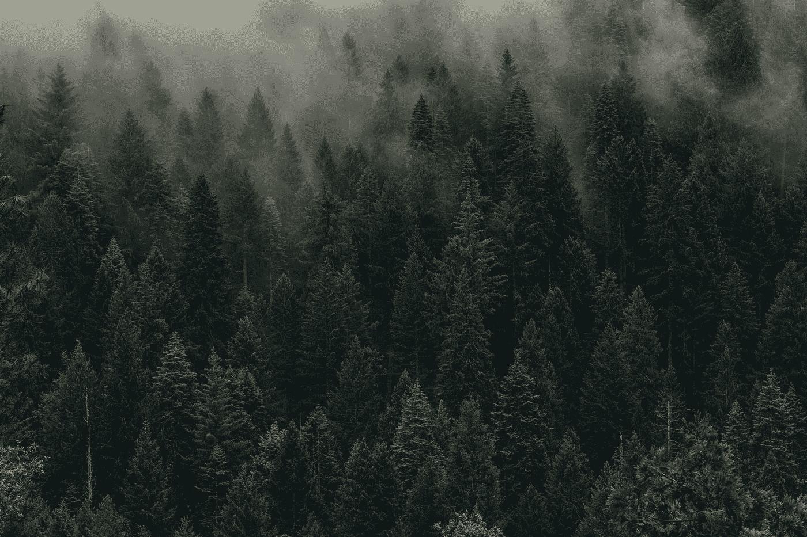
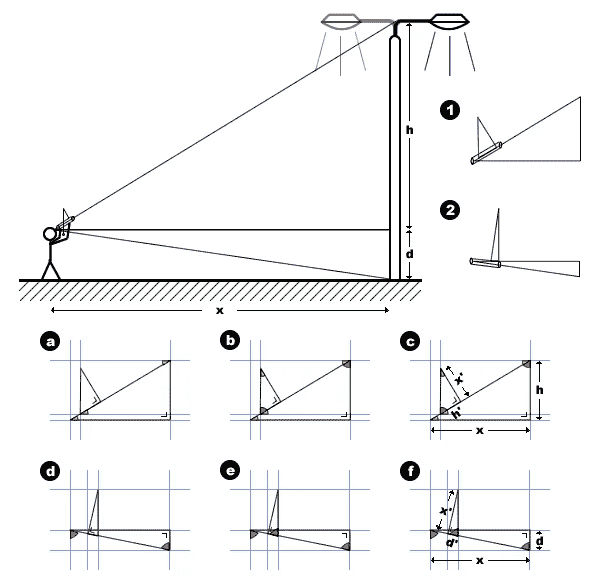

# 如何为您的数据项目创建抽样计划

> 原文：<https://towardsdatascience.com/how-to-create-a-sampling-plan-for-your-data-project-3b14bfd81f3a>

## 当简单的随机抽样不是那么简单的时候

在[第一部分](http://bit.ly/quaesita_srstrees1)中，我们看到简单随机抽样(SRS)在实践中并不总是*简单*。当你处理现实世界时，[数据设计](http://bit.ly/quaesita_philadelphia)可能是一个怪物。

# 故事到此为止

假设你是一名[数据科学家](http://bit.ly/quaesita_datascim)，受雇[估算](http://bit.ly/quaesita_vocab)下图森林中松树的平均高度，并描述[分布](http://bit.ly/quaesita_distributions)。你负责计划和分析，所以当一个狂热的徒步旅行者执行你的指示去测量森林中的树木时，你可以在你舒适的巢穴中幕后操纵。

你绝对不会做的是指示徒步旅行者 ***“完全随机地选择 20 棵树。”*** (如果你动心了，请回到[第一部分](http://bit.ly/quaesita_srstrees1)。)

这片森林里的树有多高？照片由[丹·奥蒂斯](https://unsplash.com/@danotis?utm_source=medium&utm_medium=referral)在 [Unsplash](https://unsplash.com?utm_source=medium&utm_medium=referral) 拍摄

相反，总是努力给出万无一失的指示，因为你永远不知道一个野傻子什么时候会出现。

> 永远努力给出万无一失的指令，因为你永远不知道一个野傻子什么时候会出现。

# 简单明了的说明

当我要求我的学生为数据收集代理(徒步旅行者)给出更好的——更简单的——指示时，团队通常会给出一个古老的经典建议:

用一个唯一的数字来标识每棵树，然后随机抽取这些 id

这更好了——至少它不再包括“仅仅”这个词——但这仍然不是专业统计学家级别的答案。专业的统计学家心碎了很多次，他们知道细节决定成败。

塞巴斯蒂安·赫尔曼在 [Unsplash](https://unsplash.com?utm_source=medium&utm_medium=referral) 上拍摄的照片

# 魔鬼在(现实世界)细节中

在专业统计学家的头脑中，这一看似无辜的指令会迅速滚雪球般变成一大堆细节:

“亲爱的徒步旅行者，让我提前道歉，但你必须穿过整个森林一次，用唯一的 id 给所有的树编号…这就是你喜欢徒步旅行的原因！”

甚至在我们说完之前，我们的大脑就已经在飞速运转:

*用什么颜料？(写下来！等等，我们可能需要多少桶油漆？(写下来！)
如果油漆用完了我们怎么办(因为我们不知道森林里有多少棵树)。(写下来！)
我们在哪里可以买到更多桶的油漆？最近的城镇在哪里？(写下来！)
我们工作的时候，把桶放在哪里会更有效率？(写下来！)
我们如何确保合理地标记这些树，以便在抽中它们的号码时能够有效地再次找到它们？(写下来！我们需要一辆手推车吗？或者一些助手？(写下来！)
我们如何确保没有漏掉一棵树？(写下来！我们预计这一切需要多长时间？(写下来！)
如果徒步旅行者中途退出项目怎么办？(写下来！)
下雨掉漆怎么办？(写下来！这些总共要花多少钱？(写下来！)
如果计划比预期的更昂贵，我们的旋转计划是什么？(写下来！)
我们的预算是多少？(写下来！)*

  

# 替代抽样方案

啊，预算。当你开始详述你的计划时，你可能会发现你的理想方法是不可行的。在这种情况下，你有两个选择。

1.  **选择不同的采样程序。** [SRS](http://bit.ly/quaesita_srstrees1) 并不是您唯一可用的方法，它甚至不一定是满足您需求的统计优势方法。它的主要优点是允许你使用初学者的技术，但是如果你发现在现实世界中完成 SRS 比雇佣懂得高级方法的人更昂贵，那么这是一个很好的选择。请记住，使用其他采样程序意味着您 ***必须*** 以不同于 STAT101 教您的标准方式分析数据(除非您选择下面的选项 2)。
2.  [**假设**](http://bit.ly/quaesita_saddest) **带走问题。这是绝望中的经典捷径，你会在[科学](http://bit.ly/quaesita_scientists)中发现它。它本质上可以归结为这样一句话:即使你知道某些事情不是真的，你也会像它们是真的一样进行你的分析。这是一个哲学上站不住脚的领域，唯一有权批准继续进行的人是决策者，他可能愿意接受一个低质量的决策程序来节约资源。如果你不是负责做出[数据驱动决策](http://bit.ly/quaesita_inspired)的人，你就没有资格做这个决定。**

但是，让我们想象一下，你的徒步旅行者是如此渴望尽可能长时间地在森林里闲逛(哇哦),以至于他们为你提供了这个项目的统一价格。现在你可以让这位户外狂热者为你粉刷所有的树木了。是时候开始计划下一步了:随机选择 20 棵树。

我们如何“仅仅”选择其中的 20 个呢？一个非常简单的方法是等到所有的树都被涂上唯一的 id，然后将所有的树 id 放入电子表格的一列中，拖动=RAND()函数通过相邻的列，并按照随机数列的顺序排序，然后选择混排的表格顶部的前 20 个 id。

现在我们担心更多的细节:

*标签应该是整数还是别的？(写下来！)
如果它们很难读懂怎么办？(写下来！)
我们确定随机数生成器是随机的吗？(写下来！)
如果我们忘记只粘贴特殊值怎么办？(写下来！我们打算带笔记本电脑去森林吗？哪一个？(写下来！)
没有 Wi-Fi 软件还能用吗？(写下来！)
笔记本电池够用吗？(写下来！)
我们需要备用笔记本电脑吗？(写下来！)*

一旦我们有了 20 个随机选择的树 id——*保存在哪里？(写下来！是时候为可能不得不再次徒步穿越森林向徒步者道歉了。希望我们已经想出了一个有效的徒步旅行策略来节省时间，因为这个可怜的徒步旅行者已经筋疲力尽了。但是还有更多！*

维基百科上关于使用高度计测量海拔的图片:[https://en.wikipedia.org/wiki/Hypsometer](https://en.wikipedia.org/wiki/Hypsometer)

徒步旅行者将如何进行测量？(写下来！我们应该使用哪种仪器？一个 [*高度计*](https://bigtrees.forestry.ubc.ca/measuring-trees/height-measurements/) *？(写下来！)
我们如何确保徒步旅行者经过适当培训，能够正确使用设备？(写下来！)
如果树在斜坡上* [*或者被遮挡*](https://bigtrees.forestry.ubc.ca/measuring-trees/height-measurements/) *怎么办？(写下来！我们可能需要什么额外的设备？(写下来！)
将在哪里记录测量值？纸？笔记本电脑？电话？我们有没有计划好如何搬运它，如果它出现故障该怎么办？(写下来！)
徒步旅行者是否明白测量值应记录在树 ID 旁边？树的高度是徒步旅行者唯一需要测量和记录的吗？当然，还有一些额外的信息可能是有用的，而且获取起来相对便宜，包括一天中的时间、树木的物理特征、离徒步旅行者出发点的距离、与阳光和土壤养分竞争相关的半径内其他树木的数量(半径是多少？)，树的周长，还有很多。(写下来！但是如果你和我一样，对树木知之甚少，先和领域专家谈谈。)
如果我们为每个 ID 记录一堆附加属性，应该如何记录它们？徒步旅行者应该使用什么样的数据模式？(写下来！)
我们如何检查错误？徒步旅行者应该进行额外的检查吗？(写下来！我们如何验证徒步旅行者正确地遵循了指示？(写下来！)
对于我们正在记录的每个属性，徒步旅行者应该使用哪个* [*单位或类别*](http://bit.ly/quaesita_datatypes) *？(写下来！)*

在今天结束之前，我们将仔细检查我们的文件，充实更多的细节。如果你在编写详细说明方面做得很差，你最终会因为数据收集代理带来的混乱而憎恨他们(因为这不会是你认为你要求的)。你的数据收集代理理所当然地会讨厌你给他们愚蠢的指令，并期望他们能读懂你的想法。

总有一天，数据收集代理会成为你，然后你会恨你。

> 抽样计划涵盖了数据收集的实际方面。

这就是我们如何在工作中艰难地学习的。我多年来养成的成熟的数据卫生习惯是由对我以前的糟糕规划的愤怒所推动的。年轻的我最关心的是数学。时间浸泡过的我对真实世界的细节更感兴趣。我希望你能从我的错误中吸取教训，这样你就不必再犯同样的错误了。

请向我保证，你不会再指示别人“随便”取一个简单的随机样本。

布雷特·乔丹在 [Unsplash](https://unsplash.com?utm_source=medium&utm_medium=referral) 上的照片

# 抽样检验方法

在你担心了很多细节之后(写下来！)，你面前的这份文件叫做**抽样计划**。

抽样计划涵盖了现实世界中数据收集的实际方面，在没有抽样计划的情况下从现实世界中记录数据是非常业余的。如果你试图跳过计划，你最终会为即将到来的重来做一次非常昂贵的彩排。

# 抽样方案

现在你已经写下了理论部分(抽样程序)和实践部分(抽样计划)，你已经准备好将它们合并成一个叫做**抽样方案**的文件。

> 抽样计划+抽样程序=抽样方案

顺便说一句，当你从供应商那里购买数据时，你应该总是要求完整的抽样方案(计划，而不仅仅是程序)，以确保你理解你的数据实际上意味着什么。要了解更多关于使用次级(继承)数据的技巧，包括购买的数据，请参见我的指南[这里](http://bit.ly/quaesita_notyours)。

  

一个真正的专业人士在建立一个完整的抽样方案之前不会想到收集数据。不幸的是，数据学院的课程教授方式——理论多，实践少——往往需要一段时间，刚毕业的小鸭才开始像真正的专业人士。我们这些已经在游戏中有一段时间的人可以通过啦啦队关注实际方面来尽自己的一份力量。毕竟，如果细节令人生厌，那么所有花哨的数学又有什么意义呢？

# 感谢阅读！人工智能课程怎么样？

如果你在这里玩得开心，并且你正在寻找一个为初学者和专家设计的有趣的应用人工智能课程，这里有一个我为你制作的娱乐课程:

在这里欣赏整个课程播放列表:[bit.ly/machinefriend](http://bit.ly/machinefriend)

  

*附:你有没有试过在 Medium 上不止一次地点击拍手按钮，看看会发生什么？* ❤️

# 了解更多关于数据设计的重要性

  

# 喜欢作者？与凯西·科兹尔科夫联系

让我们做朋友吧！你可以在 [Twitter](https://twitter.com/quaesita) 、 [YouTube](https://www.youtube.com/channel/UCbOX--VOebPe-MMRkatFRxw) 、 [Substack](http://decision.substack.com) 和 [LinkedIn](https://www.linkedin.com/in/kozyrkov/) 上找到我。有兴趣让我在你的活动上发言吗？使用[表格](http://bit.ly/makecassietalk)取得联系。