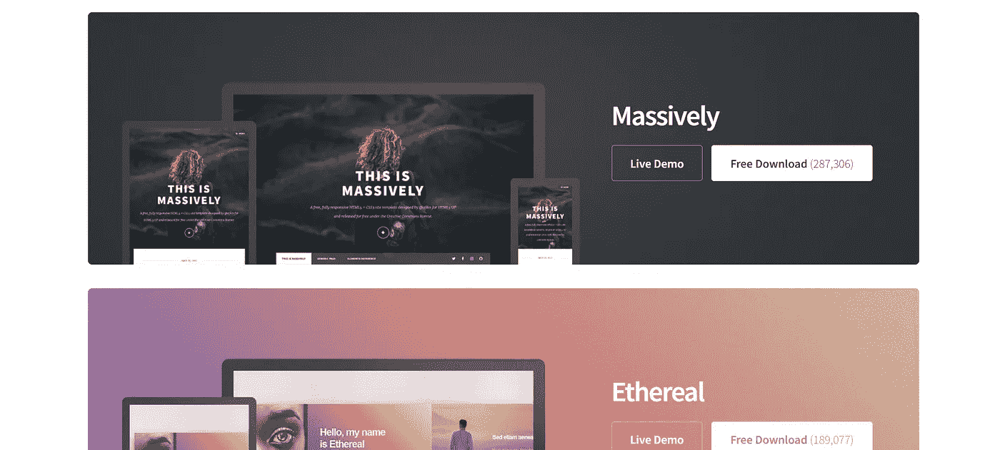
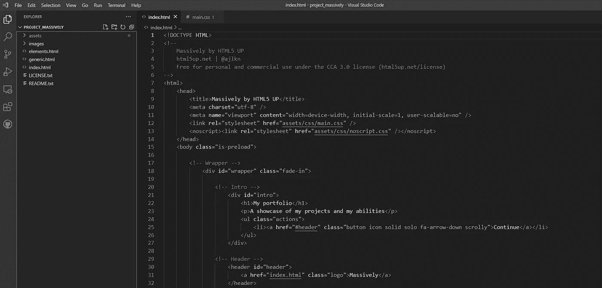
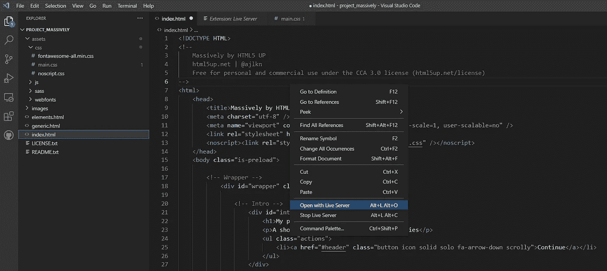
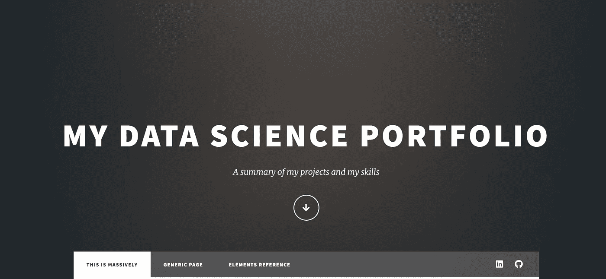
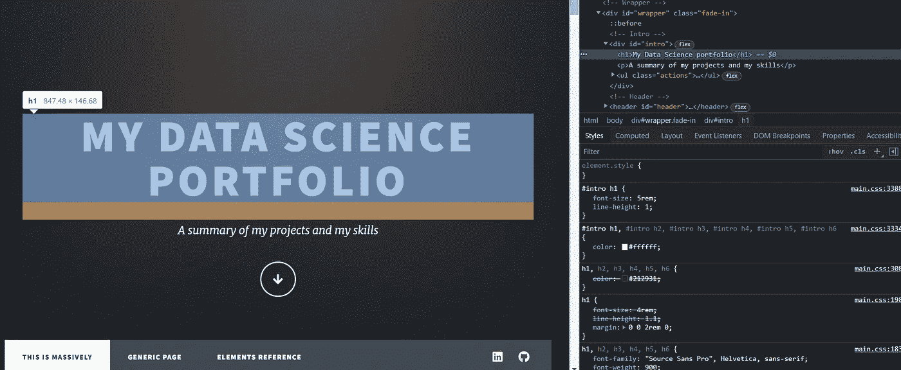
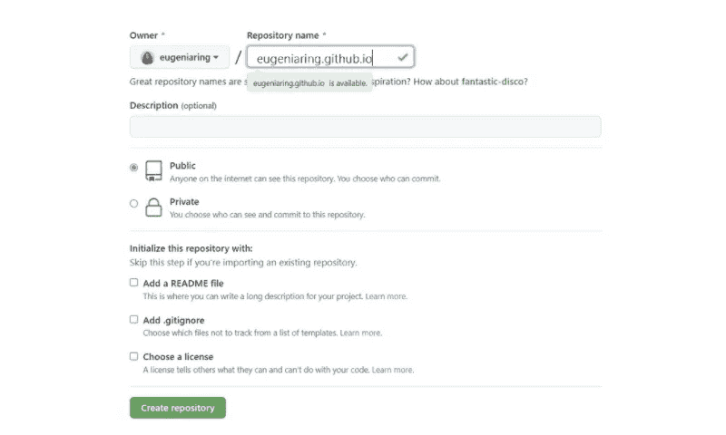

# 如何免费创建强大的数据科学产品组合

> 原文：<https://towardsdatascience.com/how-to-create-a-strong-data-science-portfolio-for-free-142588a0d754>

## 一个有效总结你的技能、数据科学项目和过去经验的网站

由 [kike vega](https://unsplash.com/@kikekiks) 在 [Unsplash](https://unsplash.com/photos/F2qh3yjz6Jk) 拍摄的照片

有没有想过建立自己的作品集网站？LinkedIn、Github 和标准简历似乎足以概括你的能力和过去的经历，但它们同时也是间接和分散的，因为它们不包含关于你的所有信息，因此，你会放很多链接来弥补这一点。相反，个人投资组合可以让你脱颖而出，而不是消失。

这很重要，因为它能让你把所有你需要的内容展示给面试官，并间接展示其他重要的技能，如创造力和批判性思维。这些品质让你从其他相同专业的人中脱颖而出，同时对自己更有信心。

如果你决定建立投资组合，不要因为你遇到的第一个困难而气馁。起初，我认为这项任务对我来说太有挑战性，我需要事先了解，但过了一段时间，我发现自己的力量，我发现它并不像我想象的那么难。毅力和耐心是解决任何问题的关键。

# 创建投资组合的步骤

建立你的作品集网站需要遵循一些步骤。首先，你需要一点 HTML 和 CSS 的知识。如果没有，可以看看我前段时间写的这个[帖子](https://betterprogramming.pub/understanding-html-basics-for-web-scraping-ae351ee0b3f9?sk=63f225c2557434bcb8cee1995995ebcb)，有必要的基础就够了。

这些是基本步骤:

1.  **下载作品集模板**
2.  [**修改您选中的模板**](#394b)
3.  [**建议要点补充**](#c4ac)
4.  [**创建一个包含所有代码的 Github 库**](#e2e3)

# **1。下载作品集模板**

作者插图。来自 [HTML5P](https://html5up.net/) 的免费模板

你不需要从头开始编写所有的 HTML 和 CSS 代码。有几个网站可以让你避免它，并提供了很多模板。这里有一个网站列表，如果你有兴趣有一个更完整的看法。在我的例子中，我使用了 [HTML5P](https://html5up.net/) ，它允许下载免费的 HTML5 网站模板。

你有很多选择，因为有大量不同的模板。试着想一想你的网站需要什么样的结构，然后点击现场演示来大致了解一下网站模板。它非常有效，因为它显示了模板在你的电脑、平板电脑或手机上的外观。

# 2.修改您选择的模板

作者插图。Visual Studio 代码中网站模板的结构。

一旦你下载了模板，解压文件并放入你喜欢的路径。我想指出的是，有一种简单有效的方法可以修改这个模板。最好的解决方案是使用一个众所周知的名为 [Visual Studio Code](https://code.visualstudio.com/download) 的 IDE。它通过添加扩展为任何编程语言提供支持。当你下载它的时候，选择“用代码打开”选项，比如在这个[溢出回答](https://stackoverflow.com/questions/37306672/visual-studio-code-open-with-code-does-not-appear-after-right-clicking-a-folde)，它会让你直接用 Visual Studio 打开一个文件夹。

作者插图。用 Live Server 打开。

在你右键点击“*打开代码*”之后，你应该可以看到你的项目文件夹，如上图所示。因为有很多文件，所以看起来可能有点乱，但是你可以直接关注 index.html 的文件。为了可视化这个项目如何出现在你的浏览器上，你只需要右击 HTML 文件选项“*用 Live Server* 打开”。

> 记得在 Visual Studio 上添加“Live Server”这个扩展，否则，你无法在浏览器上对网站有一个概览

您应该能够在浏览器中可视化网页，如下例所示:

作者插图。模板在浏览器上的可视化

我建议你每次修改模板上的一些文字时点击“用 Live Server 打开”来熟悉这个工具。

> 您还应该尝试检查网页的特定元素。例如，检查标题，右键单击该元素并选择“检查”。

这样，您就清楚地知道在哪里可以找到该元素，并最终可以对其进行修改。在这种情况下，短语“我的数据科学组合”包含在标签

# 和

中。

# **3。补充要点建议**

我建议你在网站上写下一些要点:

*   你的照片和主页上关于你自己的简介
*   你的数据科学项目。你不需要把所有的项目都放进去，把最相关的和对应的 Github 链接放进去更有效
*   在 LinkedIn 和 Github 等网站上放上你个人资料的链接
*   你也可以把你的教育路径和经历部分做出来

没有要遵守的精确规则，跟着你的直觉走，看看一些投资组合的例子。你可以看看[我的网站](https://eugeniaring.github.io/)寻找灵感。我还受到了朱莉娅·尼库尔斯基、布兰登·沃克和库蒂斯·派克斯创作的作品集的启发。还有一个 10 分钟的 Youtube 视频，由 Joshua Fluke 拍摄，展示了如何用 Github 创建一个文件夹。

# 4.创建 Github 存储库

作者插图。创建名为`**username.github.io**`的 Github 存储库

当您完成了对您的投资组合模板的修改后，您就可以在 Github 中创建一个存储库了，其名称需要采用以下格式:`username.github.io`。你只需要用你的 Github 用户名替换用户名，然后点击“创建资源库”按钮。

一旦创建完成，你上传模板中包含的所有文件，等待几秒钟，然后在浏览器上写`https://username.github.io`。例如，在我的例子中，链接将是`https://eugeniaring.github.io`。

现在，你的作品集的网站已经可以被看到了！

# 最终想法:

我希望这篇文章鼓励你开始建立你的数据科学投资组合。我相信开始的时候可能会有所畏惧，但是你的努力会得到满足感的补偿。这样，你会吸引更多的工作机会，扩大你在 LinkedIn 上的人脉。不错，你不觉得吗？感谢阅读！祝你有愉快的一天。

你喜欢我的文章吗？ [*成为会员*](https://eugenia-anello.medium.com/membership) *每天无限获取数据科学新帖！这是一种间接的支持我的方式，不会给你带来任何额外的费用。如果您已经是会员，* [*订阅*](https://eugenia-anello.medium.com/subscribe) *每当我发布新的数据科学和 python 指南时，您都可以收到电子邮件！*