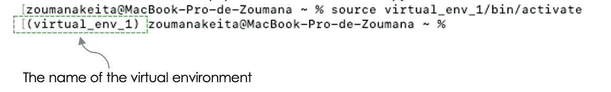
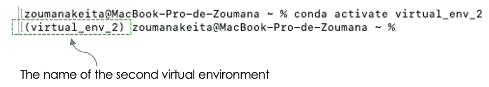
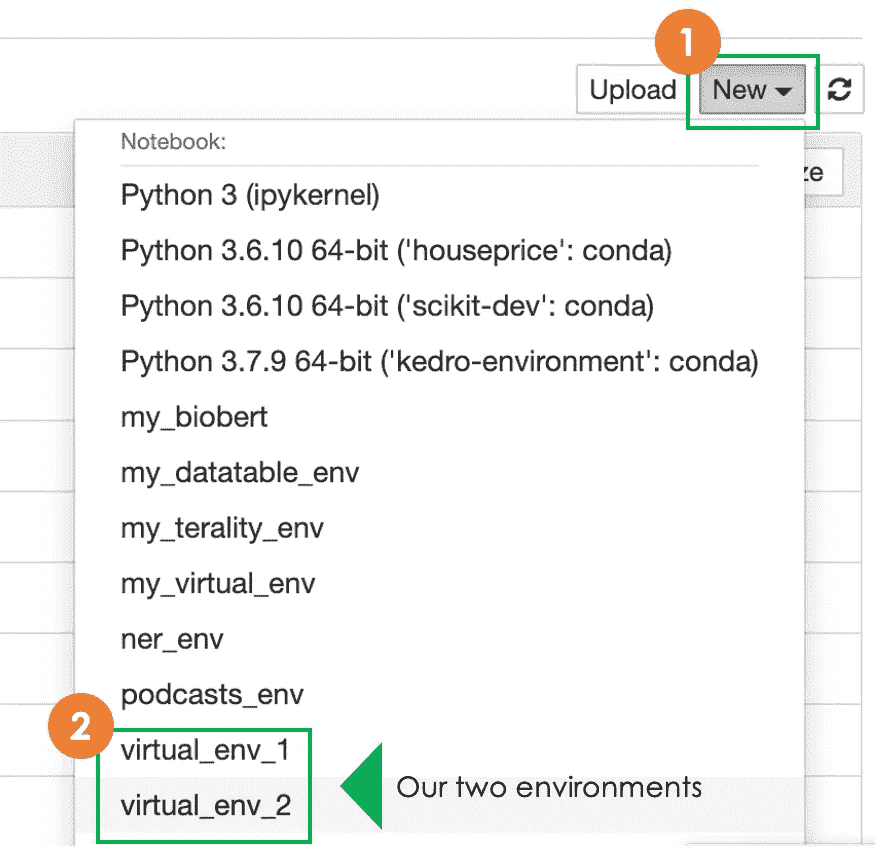

# 如何创建虚拟环境并在 Jupyter 笔记本上使用

> 原文：<https://towardsdatascience.com/how-to-create-a-virtual-environment-and-use-it-on-jupyter-notebook-6c0b7b1cfca0>

## 使用 Jupyter 笔记本中的虚拟环境

# 动机

创建虚拟环境是一个很好的实践。它将特定项目的依赖项与操作系统上全局安装的其他包隔离开来。作为一名数据科学家，在处理通常需要不同依赖关系的不同项目时，这可能是有益的。

在本概念性博客结束时，您将能够:

(1)使用`virtualenv`和`conda`创建虚拟环境

(2)将虚拟环境连接到 Jupyter 笔记本电脑。

# 创建您的虚拟环境

每个工具都用于管理 python 包和环境。两者的主要区别在于，`virtualenv`用于管理单个项目的 Python 包，而`conda`是一个更通用的包管理工具，可以用于多个项目和 Java、R、Python 等语言。

首先，你需要在你的电脑上安装 [Python](https://www.python.org/downloads/) 。一旦完成，我们就可以使用 Python 包管理器`pip`继续创建环境。

## 使用 virtualenv 创建环境

`virtualenv`可通过命令行界面或提示命令进行安装，如下所示:

```
pip3 install virtualenv
```

成功安装后，您可以使用以下语法继续创建虚拟环境:

```
virtualenv virtual_env_1
```

根据前面的语法，`virtual_env_1`对应于您的虚拟环境的名称。

下一步是激活它，以便能够使用它。激活取决于您的操作系统:

```
# On Mac
source virtual_env_1/bin/activate
```

```
# On Windows
virtual_env_1\Scripts\activate
```

运行前面的命令之一应该会显示虚拟环境括号的名称，如下所示:



来自 virtualenv 的第一个虚拟环境(图片由作者提供)

`**(virtual_env_1)**`表示`virtual_env_1`被认为是当前环境。现在，您可以继续安装软件包，并在环境中管理它们。这里有一个例子:

```
pip install pandas # to install pandas library
```

## 使用 conda

创建虚拟环境的第一步是在您的系统上安装`conda`。如果没有，你可以下载并安装已经包含了`conda`的 [Anaconda](https://docs.anaconda.com/anaconda/install/index.html) 或者 [Miniconda](https://docs.conda.io/en/latest/miniconda.html) 。

在创建环境之前，让我们用`deactivate`命令停用之前创建的环境:

```
deactivate
```

现在，您可以通过运行以下命令，用`conda`和`Python 3.8`创建您的新环境`virtual_env_2`:

```
conda create --name virtual_env_2 python=3.8
```

最后，您可以激活环境，如下所示。无论您使用何种操作系统，激活过程都是一样的:

```
conda activate virtual_env_2
```

该命令激活`virtual_env_2`，并使其成为当前环境。下面是预期的输出。



来自 conda 的第二个虚拟环境(图片由作者提供)

我们可以使用以下语法停用环境:

```
conda deactivate
```

# 将您的虚拟环境连接到 Jupyter 笔记本电脑。

作为数据科学家，我们的大部分分析和模型训练主要是在 Jupyter 笔记本上完成的。

> 从笔记本电脑上就能创建我们的虚拟环境不是很好吗？

这是本节的主要目标。它解释了如何将以前的环境连接到 jupyter 笔记本电脑。

第一步，安装`ipykernel`。这个包允许我们管理来自不同环境的内核。使用`pip`完成安装:

```
pip3 install --user ipykernel
```

使用`ipykernel`我们可以使用以下通用语法添加任何虚拟环境:

```
python -m ipykernel install --user --name=[my_virtual_env]
```

*   `[my_virtual_env]`是现有虚拟环境的名称。

因此，让我们添加我们的虚拟环境`virtual_env_1`和`virtual_env_2`:

```
# Add the first virtual environment
python -m ipykernel install --user --name=virtual_env_1
```

```
# Add the second virtual environment
python -m ipykernel install --user --name=virtual_env_2
```

前面的命令添加了您的环境！现在，如果您运行 Jupyter notebook，您应该能够在创建新笔记本时看到这两种环境。

```
# Run your notebook 
jupyter notebook
```

从笔记本中，我们应该看到如下所示的内核，我们可以决定使用哪一个:



Jupyter 笔记本中添加的环境(图片由作者提供)

# 结论

恭喜你！🎉你已经学会了如何使用`conda`和`virtualenv`创建虚拟环境。此外，您还了解了如何将您的环境连接到 Jupyter 笔记本电脑。

如果你喜欢阅读我的故事，并希望支持我的写作，考虑[成为一个媒体成员](https://zoumanakeita.medium.com/membership)。每月支付 5 美元，你就可以无限制地阅读媒体上的故事。

欢迎在[媒体](https://zoumanakeita.medium.com/)、[推特](https://twitter.com/zoumana_keita_)和 [YouTube](https://www.youtube.com/channel/UC9xKdy8cz6ZuJU5FTNtM_pQ) 上关注我，或者在 [LinkedIn](https://www.linkedin.com/in/zoumana-keita/) 上打招呼。讨论人工智能、人工智能、数据科学、自然语言处理和人工智能是一种乐趣！