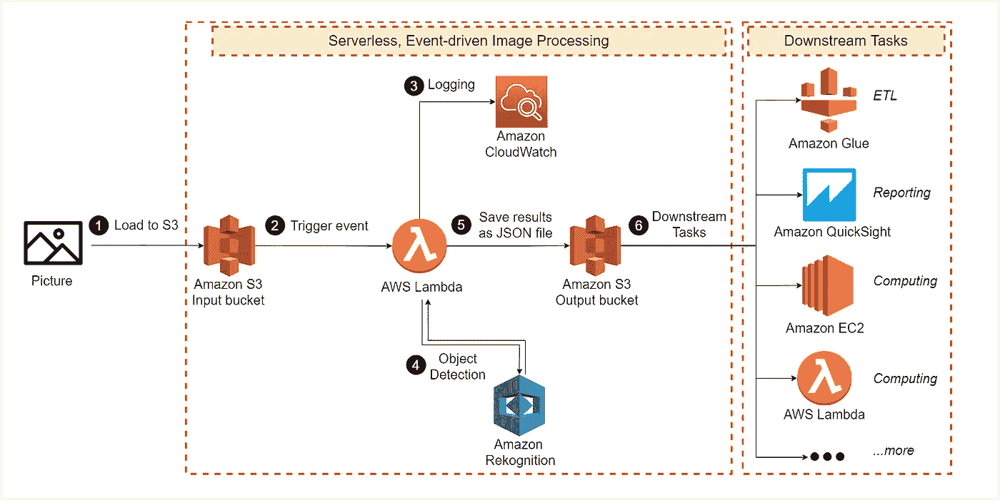
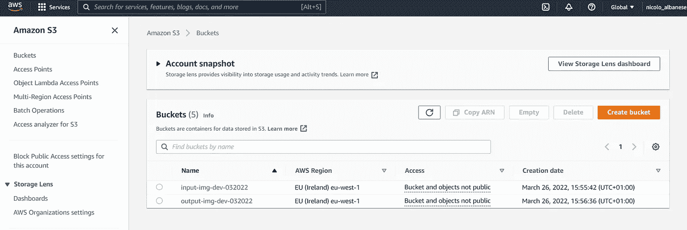
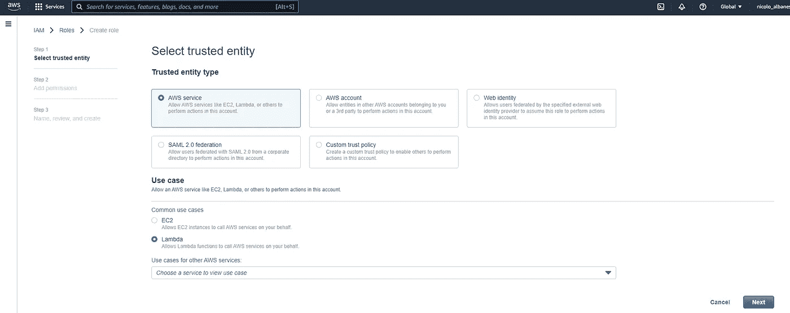
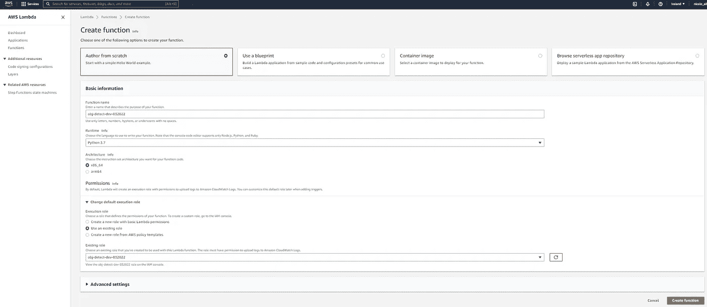
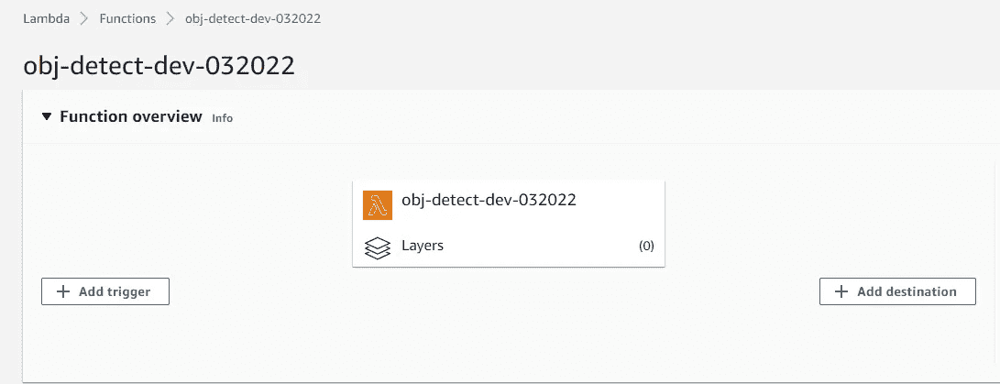
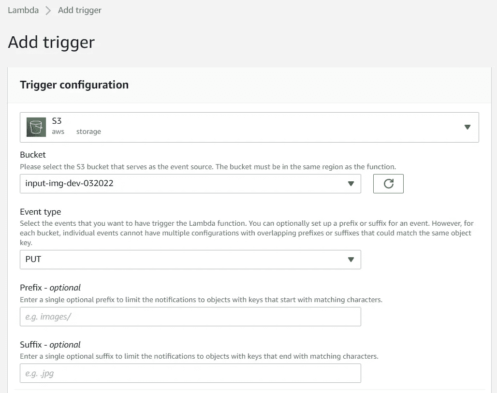
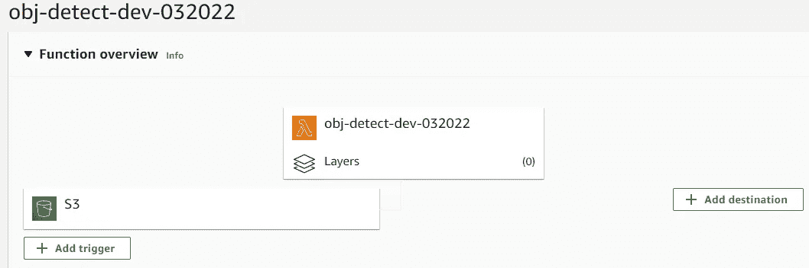
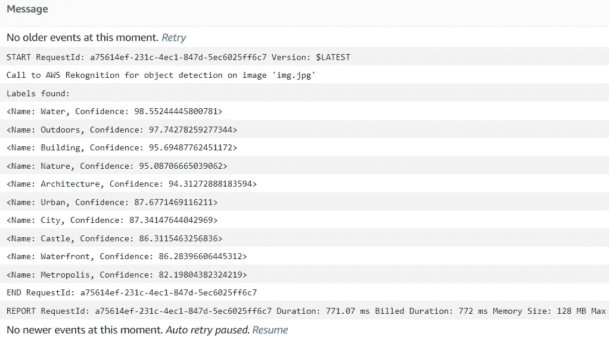
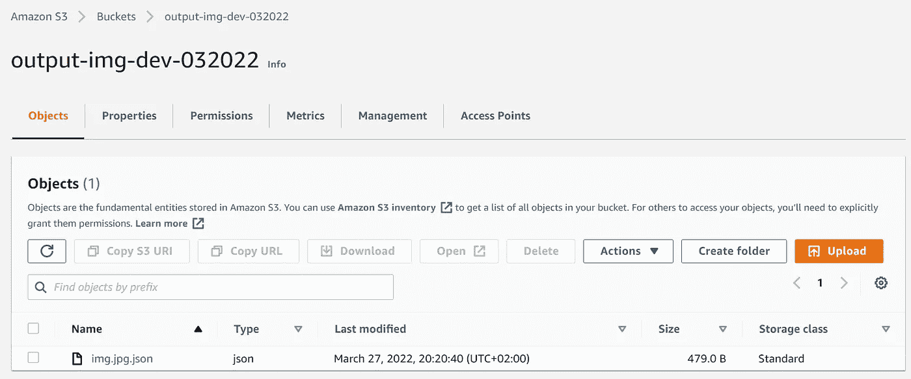

# 如何使用 AWS 和 Python 创建对象检测解决方案

> 原文：<https://towardsdatascience.com/how-to-create-an-object-detection-solution-with-aws-and-python-8b20690686c5>

## 从头开始部署无服务器、事件驱动的对象检测解决方案的端到端教程

图片作者。

# **目录**

1.  [简介](#0aa7)
2.  [实现](#5fd8)
    2.1 [S3 木桶](#289a)
    2.2 [角色和策略](#ba42)
    2.3[λ函数](#c235)
    2.4 [我们来试试](#d20b)！
3.  [结论](#ece8)
4.  [参考文献](#55a9)

# **1。简介**

对象检测是一种计算机视觉技术，允许识别和定位图像或视频中的对象。

在本帖中，我们将开发一个基于 AWS 的**无服务器、事件驱动的对象检测解决方案**，AWS 是一个流行的云提供商。

我们可以将解决方案描述如下:

1.  一张图片将被加载到亚马逊 S3 的一个对象存储服务中。
2.  将图片加载到 S3 的事件将触发使用 **AWS Lambda** 实现的功能的执行。AWS Lambda 是一个**无服务器**、**事件驱动的**计算服务。它支持在不提供或管理底层基础设施的情况下运行我们的代码。
3.  该功能将调用人工智能(AI)服务 **Amazon Rekognition** ，以分析图像并返回已识别的标签。
4.  我们的代码会将日志写到 **Amazon CloudWatch** 进行监控。
5.  该功能将把分析的输出作为 JSON 文件保存回 **S3** 以备将来使用。

本教程的唯一先决条件是一个活跃的 **AWS 账户**。由于 AWS 提供了**免费层**，我们可以零成本地学习本教程。

# 2.履行

接下来的段落将分享构建解决方案的详细、逐步的过程。

## **2.1 S3 吊桶**

桶是存放在 S3 的物品的容器。对于本教程，我们想要创建两个不同的存储桶，分别存储输入图像和分析输出。

我们按如下方式创建输入存储桶:

*   打开 AWS 控制台。
*   在页面顶部的搜索栏中输入“ *S3* ”。
*   打开“*亚马逊 S3* ，然后点击“*创建桶*”。
*   在“时段创建”页中，提供时段名称和 AWS 区域。
*   对于输入桶，我们选择名称`input-img-dev-032022`。

输入桶的创建。图片作者。

我们重复相同的步骤来创建输出桶，将其命名为`output-img-dev-032022`。

输入和输出桶。图片作者。

我们可以选择其他的存储桶名称，假设在接下来的步骤中应该一致地使用它们。

## 2.2 角色和政策

我们需要我们的 Lambda 函数有权限:

*   **从 **S3** 读取**图像。
*   **发送**图像到**识别**检测标签。
*   **写**结果回 **S3** 。
*   **将**日志写入 **CloudWatch** 。

在 AWS 中，这样的权限被称为 ***策略*** 。我们需要定义所需的策略，并将它们附加到一个身份上，比如一个 ***角色*** 。稍后，我们可以向服务授予身份，以定义与该服务相关联的权限。

在我们的例子中，我们将创建策略并将它们附加到角色。然后，我们将把角色与 Lambda 函数关联起来。

**创建策略**

*   单击 AWS 控制台顶部的帐户名称。
*   选择*安全凭证*。
*   从左侧菜单中选择“*策略*，然后选择“*创建策略*”。
*   在下一页中，点击 *JSON* 。
*   在文本框中，添加以下代码:

*   点击“*下一步:标签*”，然后点击“*下一步:查看*”。
*   最后，将策略命名为`obj-detect-policy-dev-032022`，并单击*创建策略*。

**政策详情**

*   我们的策略被定义为`Statement`属性中的 JSON 对象。
*   每个策略对象由
    - `Effect`组成:指定语句的结果是`Allow`还是`Deny`。
    - `Action`:所需权限列表。例如，`S3:GetObject`将让我们从 S3 读取对象，而`S3:PutObject`将允许我们将它们保存到一个桶中。
    - `Resource`:策略适用的资源。AWS 要求通过他们的*亚马逊资源名称(ARN)* 来识别资源。
*   在复制代码时，我们应该用创建服务的 AWS 区域替换:
    - `<REGION>`。
    - `<AWS ACCOUNT ID>`具有唯一标识 AWS 账户的 12 位数字。
*   要了解更多关于 ARN 和政策的信息，我们应该查阅官方文件。例如，资源`arn:aws:s3:::*`没有指定帐户 ID 的区域。这是因为在 S3，存储段名称在所有帐户和地区中都是唯一的。
*   通配符符号`*`用于标识所有资源。例如，resource: `arn:aws:s3:::*`标识所有的桶/对象。
*   尽管这超出了本文的范围，但我们应该记住最小特权原则:任何参与者都应该只拥有完成任务所需的最小权限。

**创建角色**

*   单击 AWS 控制台顶部的帐户名称。
*   选择*安全凭证*。
*   从左侧菜单中选择“*角色*，然后选择“*创建角色*”。
*   在*选择可信实体*页面:
    -对于*可信实体类型*，点击 *AWS 服务*。
    -对于*用例*，选择*λ*。
*   点击*下一个*。

选择可信实体。图片作者。

*   从“*权限策略*菜单中，选择之前创建的策略`obj-detect-policy-dev-032022`，并将其添加到角色中。
*   点击*下一个*。
*   给角色命名为`obj-detect-role-dev-032022`，点击*创建角色*。

我们已经定义了一组所需的权限(策略)，并将它们附加到一个身份(角色)上。我们可以继续创建 Lambda 函数。

## 2.3λ函数

*   从 AWS 控制台，在页面顶部的搜索栏上键入“ *lambda* ”。
*   选择“*λ*”服务。
*   lambda 函数的 AWS 区域应该与 S3 输入桶的区域相同。可以通过 AWS 控制台右上角的下拉菜单来更改区域。
*   点击*创建功能*，然后:
    ——从头选择*作者*。
    -对于函数名，键入:`obj-detect-dev-032022`。
    -对于*运行时*，选择 *Python 3.7* 。
    -对于*执行角色*，选择*使用现有角色*，并提供之前创建的角色名称。
*   点击*创建功能*。

Lambda 函数创建页面。图片作者。

*   在功能页面中，选择“ *+添加触发器*”。我们希望配置该函数来运行，以响应亚马逊 S3 上传。

图片作者。

*   在*添加触发*页面:
    -选择 *S3* 作为输入。
    -提供桶名:`input-img-dev-032022`。这是最初加载图像的桶。
    -事件类型:*放*。
*   勾选信息框，点击*添加*。

触发配置。图片作者。

功能页面现在如下所示:

图片作者。

*就是这样！*

我们终于可以用 Python 写应用程序逻辑了。在功能页面的“*代码*”选项卡下，让我们将它粘贴到文本框中:

**关于代码**

*   *Boto3* 是 Python 的 AWS SDK。我们用它与其他 AWS 服务进行交互:S3 ( `boto3.client("s3")`)和 Rekognition ( `boto3.client("rekognition")`)。
*   `Label`类存储 Rekognition 检测到的标签(名称和置信度)。
*   `Response`类存储被分析的对象、完整的元数据和一个列表`Labels`。`Response`类通过`rekognition.detect_labels()`方法实现对 Rekognition 的调用。
*   `rekognition.detect_labels()`方法接受以下参数:
    - `MaxLabels`:我们希望 Rekognition 返回的标签的最大数量。
    - `MinConfidence`:最小置信度阈值。Rekognition 不会返回置信度低于此值(默认值:55%)的标签。
*   `save_analysis()`函数将一个对象作为输入，并将其存储在输出 S3 桶中。它利用了`s3.put_object()`方法。
*   调用 Lambda 函数时运行`lambda_handler(event, context)`方法。它传递触发执行的事件对象。

## 2.4 我们来试试吧！

我们可以添加任何图片到输入桶(AWS 控制台>亚马逊 S3 >桶>输入桶> "*上传*")。一个例子:

意大利佛罗伦萨韦基奥桥。图片作者。

标签检测过程由上传自动触发。我们可以通过 AWS CloudWatch 日志来查看。要检查它们，我们应该进入 Lamba 功能页面，打开“*监视器*选项卡，然后“*查看 CloudWatch* 中的日志”:

图片作者。

识别出的标签很好的描述了图片:`urban`、`outdoors`、`water`、`waterfront`、`architecture`等。

亚马逊 Rekognition 可以返回的标签包括在一张图片中找到的 ***物体******场景******动作*** 和 ***概念*** 。产品文档中提供了更多信息。

让我们检查分析是否也保存在输出桶中:

输出桶。图片作者。

我们可以下载并检查该文件:

保存的文件。图片作者。

# 3.结论

在这篇文章中，我们利用 AWS 快速部署了一个无服务器和事件驱动的图像分析解决方案。

如今，像 S3 这样的对象存储服务是图片等非结构化数据最流行的存储目标。为此，类似的方法可以很容易地从大量图像文件中提取有用的信息。随着分析被保存回 S3，它可用于进一步的服务。搜索引擎和商业报告工具可能会产生吸引人的和可消化的见解。

在非功能性要点中，我们提醒:

*   **采用托管服务**，这样我们就不必处理复杂耗时的基础设施设置。
*   **成本效益**:有了 AWS Lambda，我们只需为我们有效使用的资源付费。代码不运行时不收费。此外，使用亚马逊 Rekognition 等人工智能服务可以消除开发复杂机器学习模型的相关成本。
*   **通过设计实现自动化和可伸缩性:**该过程是事件驱动的，并且在新映像可用时立即开始。此外，AWS Lambda 会自动缩放代码。

# 4.参考

*   [亚马逊简单存储服务(S3)文档](https://docs.aws.amazon.com/s3/index.html)
*   [AWS Lambda 文档](https://docs.aws.amazon.com/lambda/index.html)
*   [亚马逊认证文档](https://docs.aws.amazon.com/rekognition/index.html)
*   [亚马逊云观察文档](https://docs.aws.amazon.com/cloudwatch/index.html)
*   [AWS 身份和访问管理文档](https://docs.aws.amazon.com/iam/index.html)
*   [亚马逊参考架构](https://aws.amazon.com/architecture/)
*   [Boto3 文档](https://boto3.amazonaws.com/v1/documentation/api/latest/index.html)