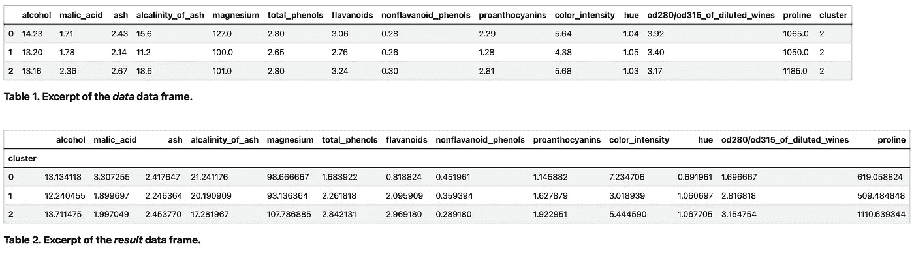
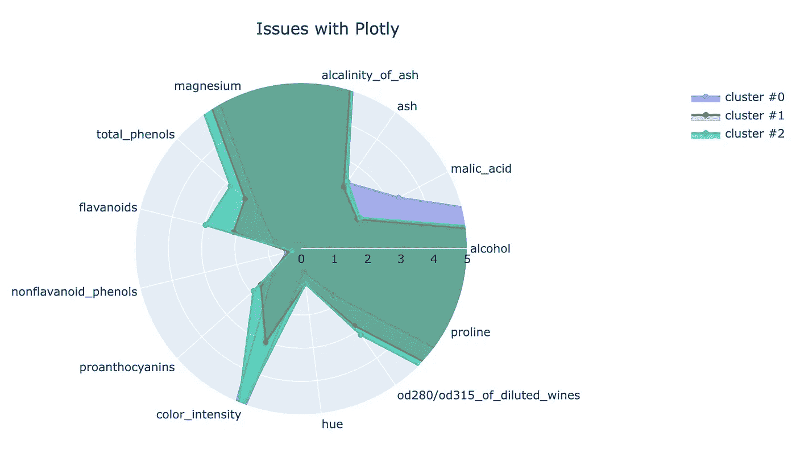
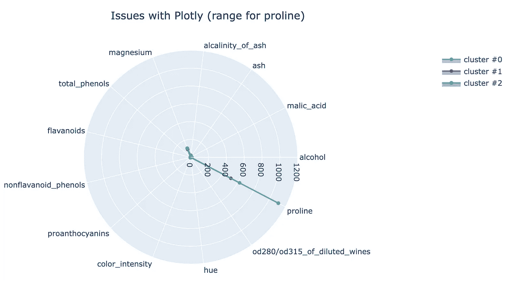
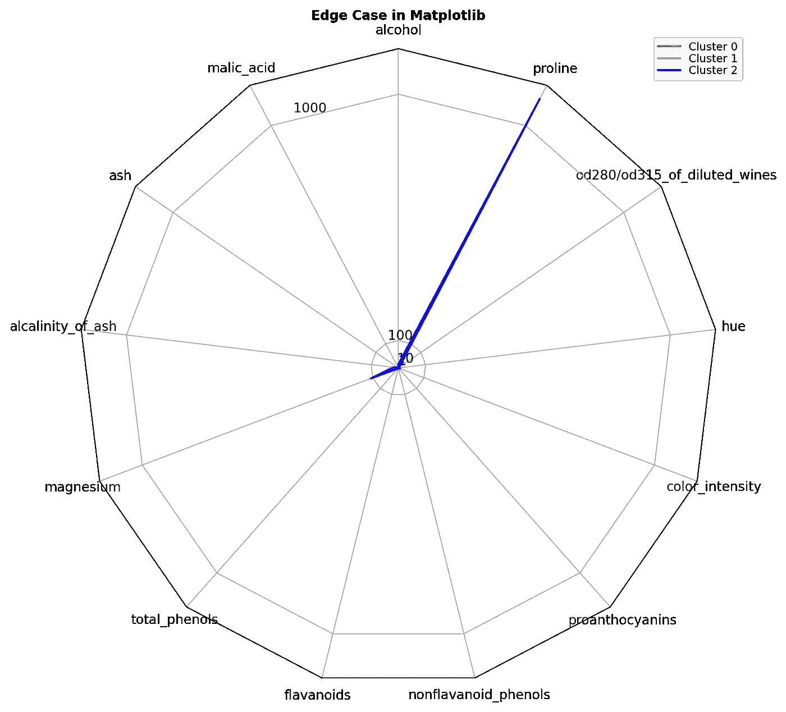
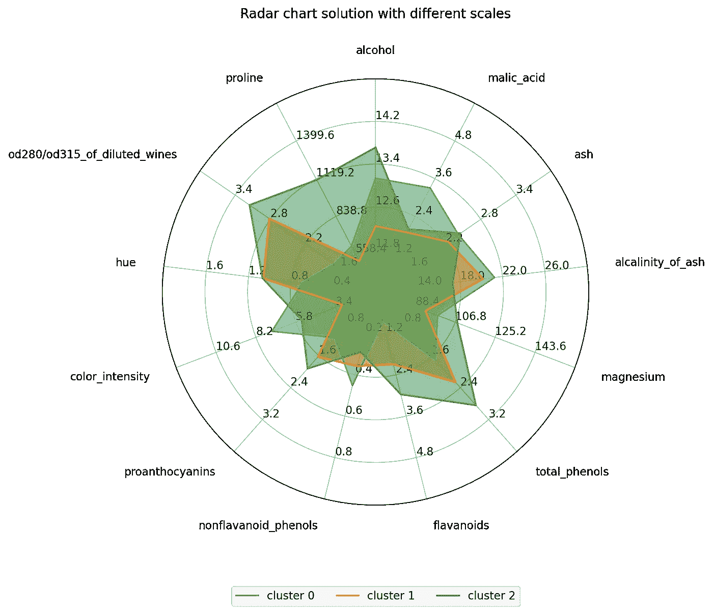
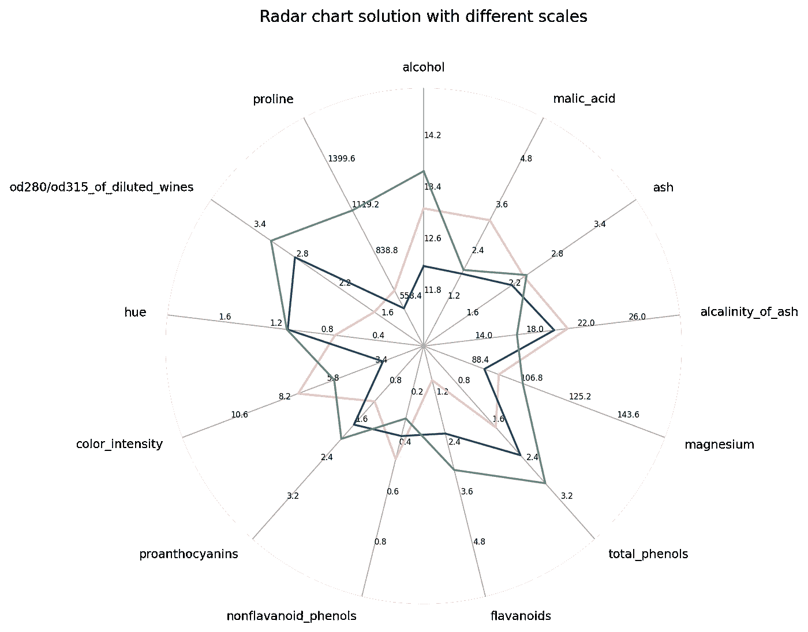

# 如何创建和可视化复杂的雷达图

> 原文：<https://towardsdatascience.com/how-to-create-and-visualize-complex-radar-charts-f7764d0f3652>

## 使用 Matplotlib 中的多种刻度和标签调整创建高级且高度灵活的极坐标图

图片作者。

adar 图表，也称为极坐标图、蜘蛛图或网状图，是在一张图片中清晰地可视化大量维度或特征(如[聚类结果](/best-practices-for-visualizing-your-cluster-results-20a3baac7426))的好方法。

用 Python 编写雷达图可能非常棘手。幸运的是，已经有关于它们的全面的操作指南[教程](https://matplotlib.org/stable/gallery/specialty_plots/radar_chart.html)和[文章](/how-to-make-stunning-radar-charts-with-python-implemented-in-matplotlib-and-plotly-91e21801d8ca)。**然而**，细节决定成败。想象你的数据有**不同的小数位数**或者你的**变量名**很长**。现有的解决方案将无法可视化这些情况。这就是我写这篇文章的原因。**

## **TL；博士；医生**

*   **当前的解决方案不支持多尺度，并且缺乏对标签的正确可视化**
*   **所提出的解决方案在彼此的顶部创建了几个轴，以提供多个刻度**
*   **如何使用这个解决方案的几个代码示例可以在[这里](https://colab.research.google.com/drive/1YftqOtPkJGIKbPqBQtjyZgikx20G7Z0M?usp=sharing)找到**

# **你将从这篇文章中学到什么**

*   **当前解决方案失败的案例**
*   **如何创建具有多种比例和更好的标签格式的高级雷达图**
*   **这种方法背后的概念以及针对高级用户的简单解决方案**
*   **一个(初学者友好的)扩展版本，有几个例子**

**每个解决方案都有一个代码片段。本文中使用的示例数据是由 [scikit-learn 包](https://scikit-learn.org/stable/modules/generated/sklearn.datasets.load_wine.html)提供的[葡萄酒数据集](https://archive.ics.uci.edu/ml/datasets/Wine) (CC BY 4.0 参见来源)。**

# **当现有解决方案失败时**

**如开头所述，我们可以找到经典雷达图绘制情况的现有解决方案。然而，有些情况下这些解决方案会失败。在我们讨论可能的解决方案之前，我会告诉你为什么这些解决方案会失败。**

## ****我们使用的示例数据集****

**以下代码片段加载葡萄酒数据集，应用经典聚类( *k-means* )方法，并将聚类数作为新列( *cluster* )添加回数据框。在最后一行中，我们通过*聚类*列对数据进行分组，并通过每个*聚类*计算每个*特征*的*平均值*。**

**代码片段 1。创建示例数据。**

**现在我们可以使用这两个数据框了(图 1)。*数据*数据框(表 1)包含每行的相关聚类，而*结果*数据框(表 2)是聚类特征的汇总(每个聚类的每个特征的平均值)。通过查看不同的值，我们可以看到，该数据集具有不同的标度(例如，灰分值与脯氨酸值的比较)。**

****

**图一。表格摘录(图片由作者提供)。**

## **Plotly**

**交互式图形库 Plotly 提供了用极坐标图可视化数据的选项。以下代码片段基于他们的[文档](https://plotly.com/python/polar-chart/)。**

**代码片段 2。用 Plotly 创建雷达图。**

**代码的结果如下面的图 2 所示。**

****

**图二。Plotly 的问题(图片由作者提供)。**

**正如我们所见，不同的集群破坏了剧情(我们看不到它们的结尾)。这个问题的解决方案是改变第 15 行中的*范围*参数。**

****然而**，我们的例子数据有**不同的尺度**。列*灰分*(图 1 表 2)的平均值约为 2.3，而*脯氨酸*的平均值约为 1.100。所以即使我们增加范围，脯氨酸的值仍然会破坏曲线。如果我们将整个图放在脯氨酸的适当范围内，其他变量(因为它们的尺度小得多)将不会清晰地可视化，因为它们的尺度小得多(见图 3)。**

****

**图 3。Plotly 的问题(脯氨酸的调整范围)(图片由作者提供)。**

**plot ly[意识到](https://github.com/plotly/plotly.js/issues/3086)当数据具有不同比例时，绘图崩溃的问题，但实现需要赞助。除了这个缺点之外，Plotly 的优点是，围绕圆的特征标签清晰可见。**

## **Matplotlib**

**Matplotlib 还提供了极坐标图[解决方案](https://matplotlib.org/stable/gallery/specialty_plots/radar_chart.html)。然而，他们的例子也只支持一种尺度。下面的代码片段利用了它们定义的类。**

**代码片段 3。用 Matplotlib 创建雷达图。**

**如果我们运行代码片段，我们可以看到他们的解决方案(图 4)没有正确定位标签而没有重叠，只有*脯氨酸*值(因为比例)清晰可见。**

****

**图 4。Matplotlib 提供的极坐标图解决方案的问题(图片由作者提供)。**

# **解决方案**

**这个解决方案的核心灵感来源于 stackexchange 上的一个[答案。主要思想是为每个变量创建一个 axes 对象。每个轴对象通过提供的最小-最大值获取并绘制其比例。为了确保图表的正确可视化，除了第一个对象及其副本之外，所有轴对象都被设置为不可见，以便只有它们的绘制刻度值保持可见。](https://datascience.stackexchange.com/questions/6084/how-do-i-create-a-complex-radar-chart)**

**第一个轴对象负责绘制网格，其副本绘制图表线并填充区域。为了确保*rgrid*、标签以及绘制的线条和区域的正确定位，必须采取这种解决方法。**

## **简单的解决方案**

**下面的代码片段展示了一个简单的解决方案。它可用于绘制雷达图，无需任何附加格式。高级 Matplotlib 用户可以轻松地修改/扩展代码，以格式化特定的部分，如网格。**

**代码片段 4。简单的解决方案。**

**下面的代码片段展示了如何将上面的代码用于我们的示例数据。**

**代码片段 5。对示例数据应用简单的解决方案。**

**我们的 *ComplexRadar* 类需要每个变量的范围作为元组(min，max)。当然，我们可以手动为每个变量创建一个元组，但我也想向您展示如何更加自动化地完成这项工作。第`3–5`行通过使用。describe()函数并把它们放在一个列表中(`line 8`)。结果如下所示(图 5)。**

****

**图 5。普通解决方案结果(图片由作者提供)。**

**正如您所看到的，雷达图可以处理几个轴(每个轴对应一个变量)，并负责清楚地放置变量的标签(多亏了 *textwrap* 模块)。**

> **如果你的每个变量都有一个相似的范围，你可以用一个(最小，最大)元组乘以变量的个数。例子:`ranges =[(1,10)]*len(df.columns)`**

## **扩展版本**

**基于上面的普通版本，我还创建了一个扩展版本。扩展版本使用字典来配置/样式化图中的每个对象，以在可视化方面提供更大的灵活性。这个版本也是在本文的特色图片中创建不同可视化效果的版本。**

**代码片段 6。扩展解决方案。**

**下面的代码片段显示了如何使用扩展版本。**

**代码片段 7。对示例数据应用扩展解决方案。**

**主要的变化是引入了一个可选的 *format_cfg* 字典。这一个可以被用来样式化和格式化极坐标图的不同部分。上面的示例代码在第`10–16`行显示了如何设置不同的参数。要了解哪些选项可用，可以查看源文件，我将链接放在该文件的相关部分。**

**上面代码的结果可以在下面的图 6 中看到。**

****

**图 6。使用扩展代码片段的结果(图片由作者提供)。**

> **如果你对进一步的例子感兴趣(例如，如何在特色图片中创建图表)，请查看我的 [colab 笔记本](https://colab.research.google.com/drive/1YftqOtPkJGIKbPqBQtjyZgikx20G7Z0M?usp=sharing)。**

# **结论**

**创建雷达图可能相当具有挑战性。现有的解决方案可能有助于简单的任务。但是，当您必须处理不同的比例和标签格式时，需要进行大量的调整和变通。本文希望通过提供管理复杂需求的解决方案，为您节省大量时间(和精力)。**

# **来源**

**[UCI 机器学习知识库:葡萄酒数据集](http://archive.ics.uci.edu/ml/datasets/Wine)。[知识共享署名 4.0 国际](https://creativecommons.org/licenses/by/4.0/legalcode) (CC BY 4.0)许可”。**

**[https://data science . stack exchange . com/questions/6084/how-do-I-create-a-complex-radar-chart](https://datascience.stackexchange.com/questions/6084/how-do-i-create-a-complex-radar-chart)**