# 如何创建定制的 Streamlit 组件

> 原文：<https://towardsdatascience.com/how-to-create-custom-streamlit-components-de6a00a7d5ab>

## 如何使用 Streamlit 构建一切


背景由[法库里安设计](https://unsplash.com/@fakurian?utm_source=medium&utm_medium=referral)在 [Unsplash](https://unsplash.com/?utm_source=medium&utm_medium=referral) 上，由作者编辑。

Streamlit 作为构建 web 应用程序的纯 Python 解决方案广受欢迎。它使得构建动态的、以数据为中心的应用程序变得异常简单。学习曲线实际上是不存在的。


Streamlit 应用程序的屏幕截图(左)和创建它所需的代码(右)。

只需几行代码，我们就可以通过简单地实现预构建的 Streamlit 组件来组装干净的交互式应用。

Streamlit 设计了大量预构建组件。如果你找不到你需要的，甚至还有社区构建的组件。

将这些几乎像“乐高”积木一样的组件放在一起很容易，这使得 Streamlit 成为 ML 工程师的理想选择。让我们专注于 ML，同时仍然能够与世界分享我们的应用和工具。

然而，有时我们会陷入困境，根本没有涵盖我们所需要的组件。如果需要，我们仍然可以构建自己的定制组件。

要做到这一点，我们需要从底层的网络技术着手，让 Streamlit 自己发挥作用。所以这不像使用预构建组件那么简单。然而，由于预制的模板，创建一个新组件并不太难。

在本文中，我们将确切地了解如何创建定制组件。我们将关注于使用材料 UI 设计元素设计一个交互式卡片组件。

# 设置和安装

我们将使用 *Node.js* 和 *NPM* 来开发我们的卡组件。它们可以从[这里](https://nodejs.org/en/download/)安装在 Windows/Mac/Linux 上，或者在 Mac 上使用*自制软件*:

```
**brew install node**
```

安装后，我们可以确认两个包都安装了:

```
**node -v***AND***npm -v**
```

确保您的 Python 环境中安装了 Streamlit。如果没有，就`**pip install streamlit**`。

# 从模板开始

自定义组件的 React 模板设置

我们将从克隆[*streamlit/组件模板* repo](https://github.com/streamlit/component-template) 开始:

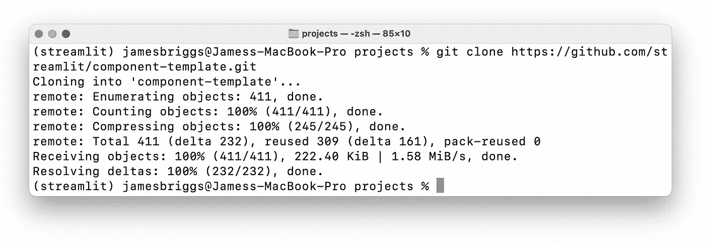

我们可以从 Streamlit 中克隆出组件模板。

在这里，我们将找到一个`/template`目录，其中包含:

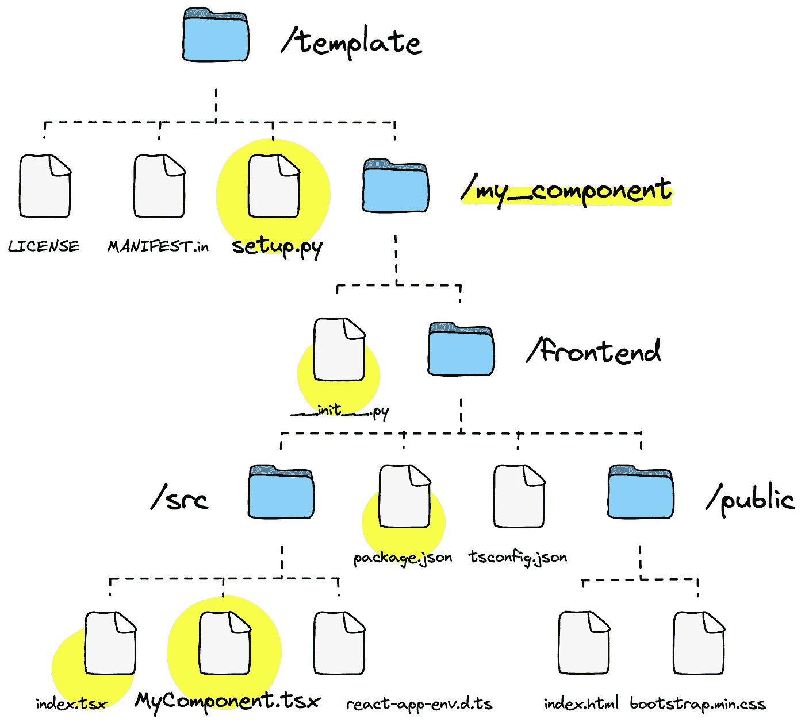

模板组件目录结构概述。

突出显示最重要的文件和目录。其余的我们可以完全忽略。

## 模板组织

在我们开始构建任何东西之前，让我们组织我们的模板。首先，我们将所有默认的`MyComponent`引用更新为更具描述性的`CardComponent`。

*   将`/my_component`更名为`/st_card_component`
*   将`index.tsx`中的`MyComponent`替换为`CardComponent`，将`__init__.py`中的`my_component`替换为`CardComponent`
*   重命名`MyComponent.tsx`并替换代码中的`MyComponent`引用

最后一次更新是对`package.json`中的`"name"`参数，我们将其命名为`streamlit_card_component`。

## 节点包

接下来，我们在终端窗口中导航到`/frontend`目录，并使用`npm install`安装`package.json`中指定的必要节点包。

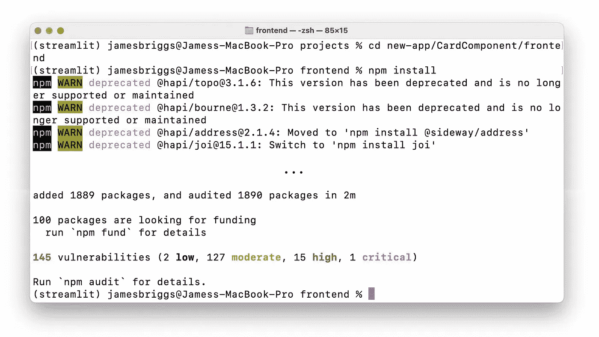

用 **npm install** 安装 **package.json** 包

并安装材料 UI 卡所需的其他依赖项:

```
npm install @mui/material @mui/icons-material @emotion/react @emotion/styled
```

如果您看到一个*上游依赖冲突*错误，通过在 install 命令中添加`--legacy-peer-deps`来强制安装。

## 运行组件

现在，我们可以通过在终端窗口中输入`npm start`来运行组件的当前状态。

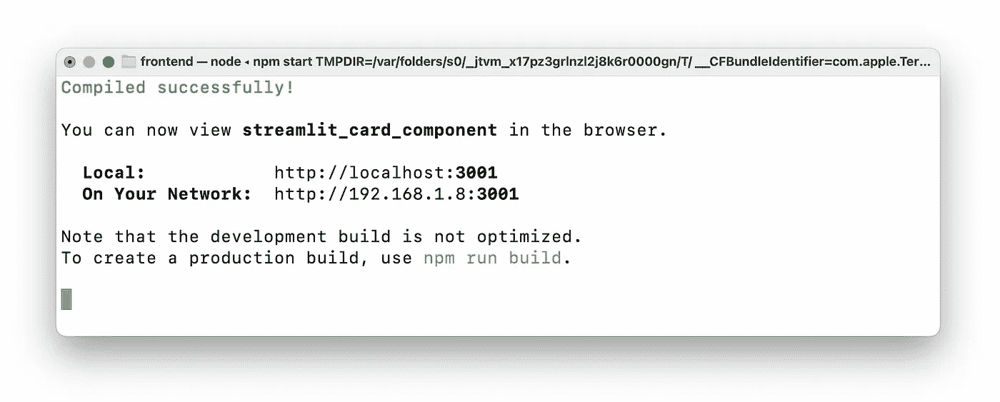

在 **localhost:3001** 上托管组件

前往`http://localhost:3001`我们将什么也看不到，因为我们托管的是组件，*而不是*Streamlit 应用。在开发过程中，我们需要两者都运行。组件正在运行，所以我们通过导航到`/card_component`目录(在一个*新的*终端窗口中)并键入`streamlit run __init__.py`来初始化我们的应用程序。

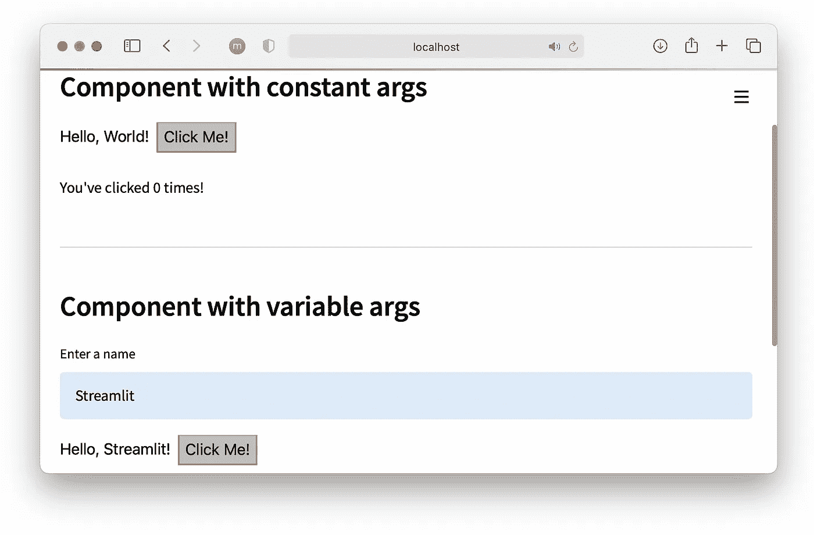

默认组件模板。

这将打开一个新的浏览器窗口，看起来像上面的默认 Streamlit 组件模板。

# 构建组件

创建 MUI 卡组件

我们现在需要修改这个模板来创建卡片格式。这大部分是在`CardComponent.tsx`文件中完成的。如果我们现在看，那里有很多。我们不需要大部分，所以让我们先把它拆了。

这些基本要素就是我们所需要的，`CardComponent`类，我们从`render`中的类返回的 HTML，以及我们的组件返回到我们的 Streamlit 实例的`export`。

我们可以修改它来创建我们的卡组件。首先，让我们设置组件的绝对核心。基本信息的简单显示。

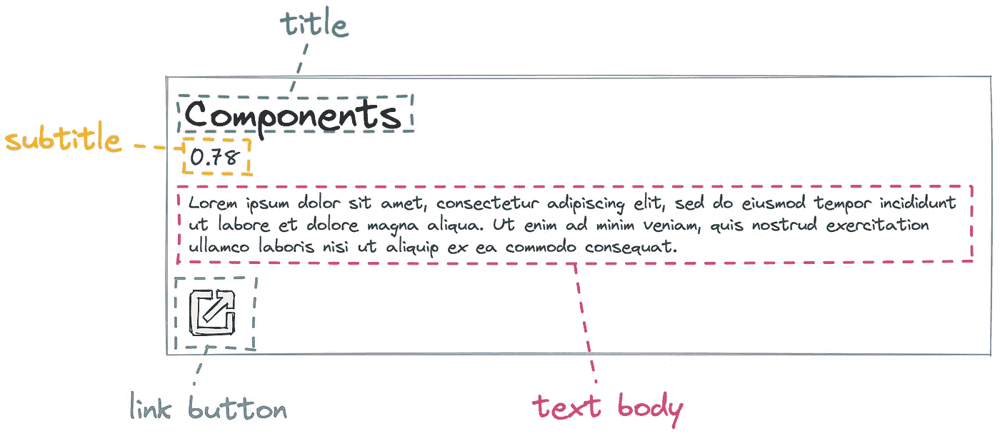

卡片元素的高级细分。

每张卡片将显示一个标题、副标题、段落和超链接，显示为材料图标。

我们在`CardComponent.tsx`和`__init__.py`中的`card_component`函数中向组件添加可通过的参数。

在`CardComponent.tsx`中，我们通过`this.props.args`引入参数。

`card_component`函数充当 React 组件的初始化，通常从前端 Streamlit 脚本调用。如果我们看一下我们的 Streamlit 窗口，我们会看到一个错误:

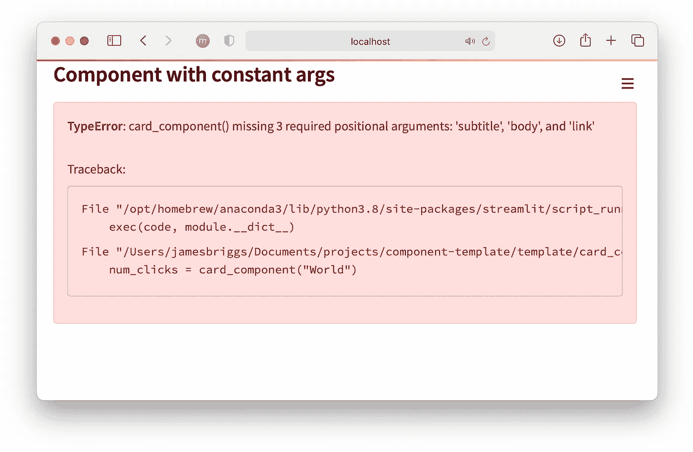

**TypeError** 由现在过时的代码引发。

这是因为调用我们的`card_component`的代码仍然只传递一个值`"World"`，而新组件需要四个参数；`title`、`subtitle`、`body`和`link`。

在开发过程中，前端脚本临时存储在`__init__.py`中，所以我们在调用`card_component`的地方更新这个脚本以反映这些变化。

现在我们可以看到我们的卡组件的第一个版本。

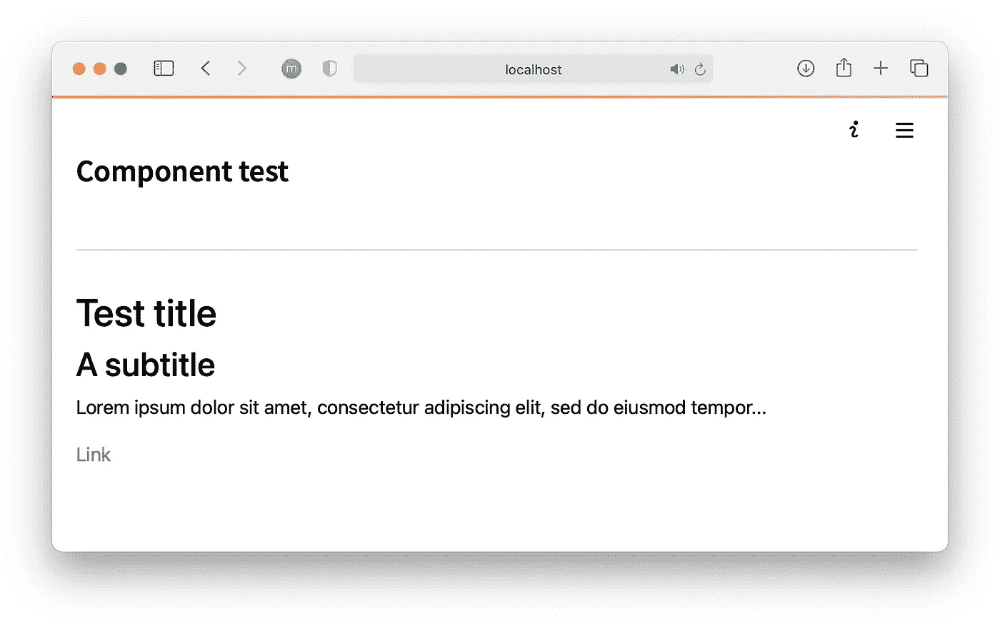

“卡”的简单实现，没有任何格式或结构。

它并不漂亮，但组件的核心在那里。我们有标题、副标题、正文和链接。我们开始做造型吧。

## 材质用户界面样式

我们将使用 MUI 来设计和实现卡的功能。幸运的是，我们几乎可以通过在 [MUI 组件页面](https://mui.com/components/cards/)中找到符合我们要求的卡来复制和粘贴所需的代码。

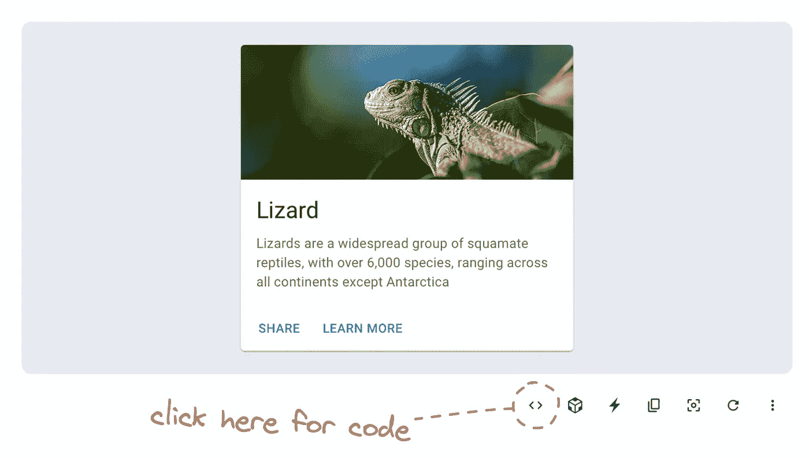

MUI 组件页面中的卡组件。我们点击 **< >** 图标查看代码示例。

我们需要在我们的`CardComponent.tsx`文件的顶部添加几个导入。

在组件本身中，我们添加了各种卡片和按钮标签。

这样，我们就可以刷新页面，看到新的卡片格式页面。

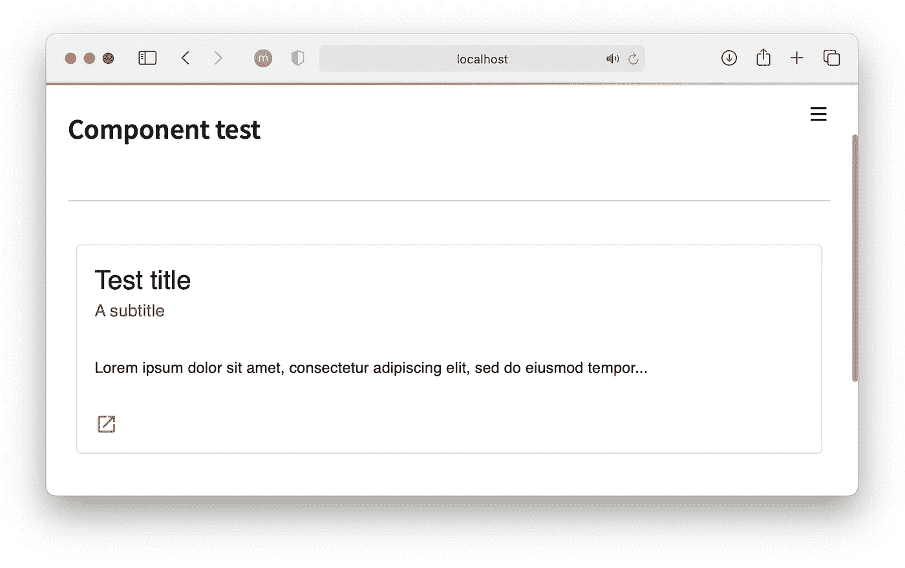

还缺少最后一个细节。使用的字体与 MUI 示例不一致。为此，我们需要安装并导入 *Roboto* 字体。从`/frontend`目录，我们在终端窗口中输入`npm install @fontsource/roboto`。然后将字体添加到`CardComponent.tsx`导入:

现在，我们的组件与 MUI 示例相匹配。

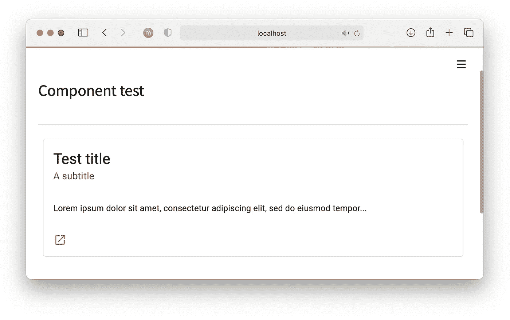

很好，现在让我们清理一下`__init__.py`，从我们的 cards 组件中删除任何不需要的东西，并将它作为一个单独的组件在 Streamlit 项目中实现。

# 发布组件

Streamlit 组件通常通过`pip install`和`import`集成到单个项目中。我们将发布我们的卡组件来遵循相同的示例。

将 Streamlit 组件发布到 PyPI

首先，我们通过设置`_RELEASE = True`告诉`__init__.py`使用脚本的*版本*版本。这告诉 Streamlit 从`/frontend/build`目录中提取组件。目前，这个目录不存在。我们必须通过 NPM 创造它。

为此，我们在终端中导航到`/frontend`并输入`npm run build`。该命令创建`/frontend/build`目录，其中包含组件发布版本中使用的编译代码。

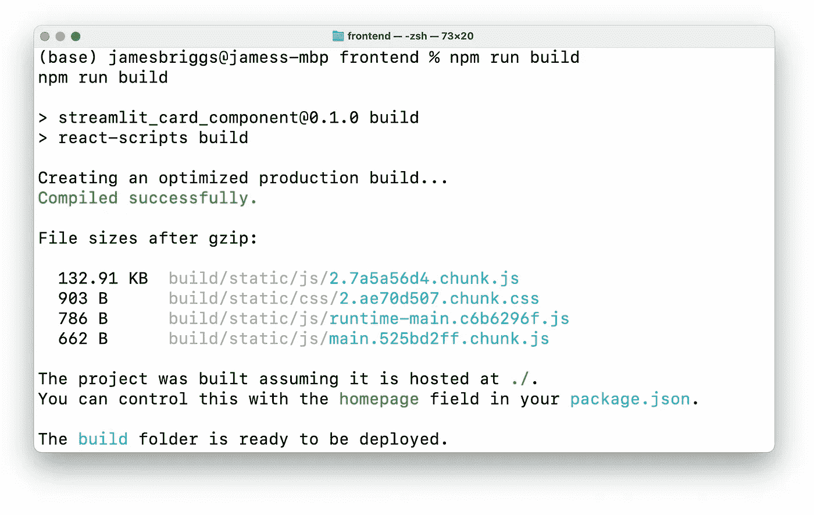

执行 **npm run build** 构建编译后的组件代码。

接下来，我们导航到顶层目录并创建一个 Python `/dist`文件夹，其中将包含 pip 包轮。

在构建 dist 文件夹之前，我们需要修改一些东西。首先将`setup.py`中的`name`参数改为`name="st_card_component"`。

为了将编译后的代码包含在构建目录中，我们必须将目录从`MANIFEST.in`更新到`recursive-include **st_card_component**/frontend/build *`。

最后，我们必须将`__init__.py`中的组件名称更新为`"st_card_component"`:

我们现在准备创建发行版。使用终端，我们执行`python setup.py sdist bdist_wheel`，在`/dist`文件夹中我们会看到:

*   st_card_component-0.0.1.tar.gz
*   ST _ card _ component-0 . 0 . 1 . py3-none-any . whl

现在我们继续上传到 [PyPi](https://pypi.org) ，在那里`pip install`包被下载。首先，我们用`pip install twine`安装 twine，然后用`python -m twine upload --repository pypi dist/*`上传我们的包(都来自组件的顶层目录— `/st-card-component`)。

*当发布我们组件的新版本时，我们必须更新* `*setup.py*` *文件中的版本号。*

# 使用组件

我们终于可以像使用其他组件一样使用我们的 Streamlit 组件了。组件包安装有`pip install st-card-component`。

让我们创建一个“测试”脚本。

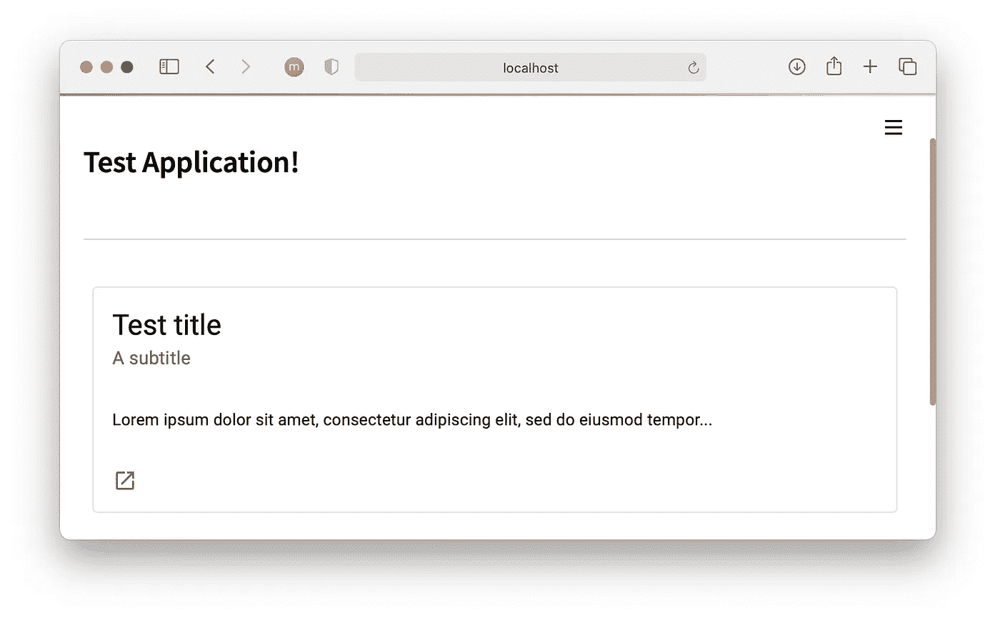

还有我们定制的 Streamlit 卡组件！

这就是为 Streamlit 构建定制和可共享组件的指南。我们已经介绍了很多，从默认模板到在 React 中构建组件，甚至在 PyPi 上发布组件。

当然，这是一个极其简单的组件。我们可以在这里做更多的事情。我把那个留给你。

您可以通过[此链接](https://jamescalam.medium.com/subscribe)了解最新的 ML 文章。我还在 YouTube 上上传每周的 ML 和 NLP 视频。

感谢阅读！

🎁[面向语义搜索的 NLP 免费课程](https://www.pinecone.io/learn/nlp)

🤖[带变形金刚课程的 NLP 70%折扣](https://bit.ly/nlp-transformers)

[文章笔记本脚本](https://github.com/jamescalam/dhivehi_nlp/blob/main/examples/00_create_dv_base/01_tokenizer_components.ipynb)

**所有图片均由作者提供，除非另有说明*