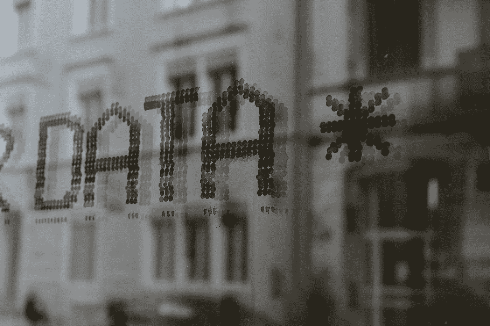
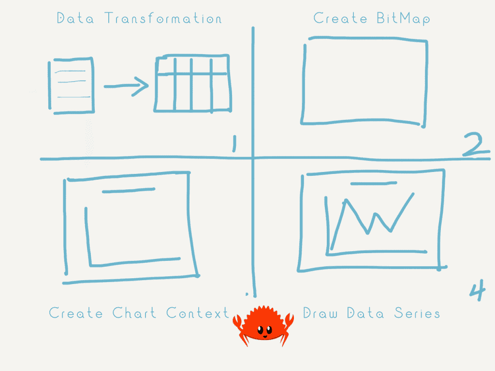
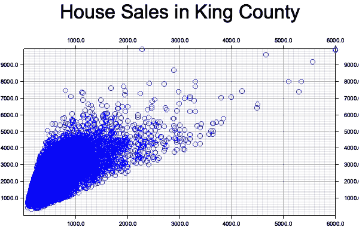
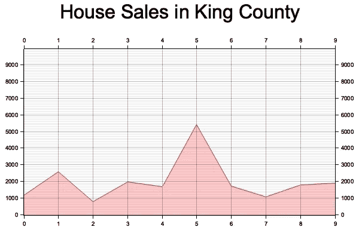
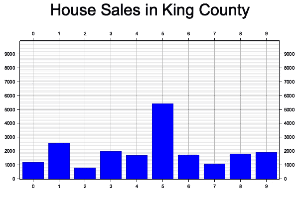
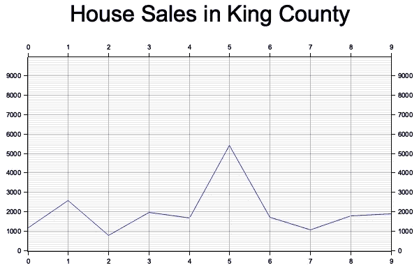

# 如何在《铁锈》中创造情节

> 原文：<https://towardsdatascience.com/how-to-create-plot-in-rust-fdc6c024461c>

## 铁锈绘图仪简介



克劳迪奥·施瓦茨在 [Unsplash](https://unsplash.com/s/photos/data-visualization?utm_source=unsplash&utm_medium=referral&utm_content=creditCopyText) 上的照片

据 [O'Reilly Data & AI 简讯](https://www.oreilly.com/radar/2021-data-ai-salary-survey/)报道，2021 年，数据/AI 专业人士中收入最高的编程语言之一是 Rust。随着 Rust 的出现，数据科学项目最近变得更加普遍。数据可视化无疑是这些项目中的一个领域。在这篇文章中，我将分享如何在 Rust 中使用一个名为 Plotters 的库创建绘图。

# 什么是密谋者？

Plotters 是一个绘图库，旨在加快 Rust 中高质量数据可视化的生产。它在 Github 上有超过 1.8k 的星星，是绘制数据的库之一。

plotters 没有直接解决绘图问题，而是采用了一种非常不同的方法，它提供了一种方便的绘图 API，使绘制绘图更加简单。在绘图仪中编写 Rust 代码可能比在 ggplot2 或 Matplotlib 中编写花费更多的时间。

# 绘图仪入门

由于这不是一个 Rust 博客帖子，而不是每一行代码的含义，我将更多地关注于获取数据以开发绘图仪中的绘图。

让我们首先创建名为 **rust_viz** 的项目

```
cargo new rust_viz --bin
```

创建 rust 项目后，还会创建一个名为“Cargo.toml”的清单。我们可以在这个清单中添加三个库供以后使用: **csv、绘图仪和快速浮点。**

```
[dependencies]
csv = "1.1"
plotters = "0.3"
fast-float = "0.2"
```

你现在应该准备好创建 Rust 中的第一个情节了！

在 Rust 中创建绘图仪图形的基本逻辑可以描述如下:

*   根据需要转换数据集
*   使用`BitMapBackend`绘制位图
*   创建图表上下文，用于高级图形绘制
*   绘制一个数据序列，它被抽象为绘图仪中元素的迭代器



按作者在 Rust | Image 中创建情节的步骤

# 散点图



散点图|作者图片

我们将创建的第一个地块基于 Top Genres 文件，它是名为“ [House Sales in King County，USA](https://www.kaggle.com/harlfoxem/housesalesprediction) ”的 Kaggle 数据集的一部分。我们将首先使用它的**价格**和 **sqft_living** 列来创建一个散点图。这是数据集的样子

```
id,date,price,bedrooms,bathrooms,sqft_living,sqft_lot,floors,waterfront,view,condition,grade,sqft_above,sqft_basement,yr_built,yr_renovated,zipcode,lat,long,sqft_living15,sqft_lot15"7129300520","20141013T000000",221900,3,1,1180,5650,"1",0,0,3,7,1180,0,1955,0,"98178",47.5112,-122.257,1340,5650"6414100192","20141209T000000",538000,3,2.25,2570,7242,"2",0,0,3,7,2170,400,1951,1991,"98125",47.721,-122.319,1690,7639
```

[*美国金县房屋销售*](https://www.kaggle.com/harlfoxem/housesalesprediction) *许可 CC0:公共领域*

下面是在 Rust 中读取 CSV 文件的代码行:

```
let mut rdr = csv::Reader::from_path("~/Downloads/kc_house_data.csv")?;
```

由于 Plotters 需要一个迭代器来绘制序列，我们需要将 Price 和 Sqft Living 字段读入两个向量，并为它们执行从 string 到 float 的数据转换。这里需要注意的一点是，当我们使用`f64`时，cartesian_2d 也将使用浮点数而不是整数。否则，错误将显示"*预期浮点数，找到整数 rustc(E0308)。*“我们把价格的数字除以 1000.0 来归一化数据，这样结合 sqft live 更容易观察。这里使用快速浮点库来解析价格字段中的科学概念。

```
for result in rdr.records() {
        // The iterator yields Result<StringRecord, Error>, so we check the
        // error here..
        let record = result?;
        match record.get(2) {
            Some(i) => {
                let tmp: f64 = parse(i).unwrap();
                price.push(tmp/1000.0)
            },
            _ => ()
        }
        match record.get(5) {
            Some(i) => {
                sqft_living.push(parse(i).unwrap())
            },
            _ => ()
        }
    }
```

然后，我们可以执行 zip 函数，将两个向量拼接成一个元组向量。

```
let price_sqft_living: Vec<(f64, f64)>= price.iter().cloned().zip(sqft_living.iter().cloned()).collect();
```

我们现在可以使用矢量并在绘图仪中创建散点图。首先，我们需要使用输出图像路径及其大小(本例中宽度:600px，高度:400px)绘制位图(就像在 Photoshop 中创建画布一样)。我们也可以指定颜色作为背景。Rust 提供以下预定义的颜色:白色、黑色、红色、绿色、蓝色、黄色、青色、洋红色、透明。

```
let root_area = BitMapBackend::new("/Users/chengzhizhao/Downloads/test.png", (600, 400)).into_drawing_area();
root_area.fill(&WHITE).unwrap();
```

一旦创建了位图。我们可以构建图表上下文，为显示图表提供更多的元数据。`set_label_area_size`是增加一些空间来显示标签。它是可选的，如果没有设置左或底部位置，它不会显示 x 轴或 y 轴标签。如果你也相应地设置顶部和正确的位置，它看起来会更好，因为它会给用户一种图没有正确显示的印象。

```
let mut ctx = ChartBuilder::on(&root_area)
        .set_label_area_size(LabelAreaPosition::Left, 40.0)
        .set_label_area_size(LabelAreaPosition::Bottom, 40.0)
        .set_label_area_size(LabelAreaPosition::Right, 40.0)
        .set_label_area_size(LabelAreaPosition::Top, 40.0)
        .caption("House Sales in King County", ("sans-serif", 40.0))
        .build_cartesian_2d(0.0..6000.0, 0.0..10000.0)
        .unwrap();
```

在上面提到的所有设置之后，我们终于要创建散点图了。是时候把 price_sqft_living 的向量映射到元素上了。该库有许多内置形状。可以参考他们的 [base_shape](https://github.com/38/plotters/blob/master/src/element/basic_shapes.rs) 。在这种情况下，我们将使用大小为四的红色圆作为轮廓。

```
// Draw Scatter Plot
    ctx.draw_series(
        price_sqft_living.iter().map(|point| Circle::new(*point, 4.0_f64, &BLUE)),
    ).unwrap();
```

# 面积图



面积图|作者提供的图像

因为我们已经有了散点图，所有的东西都将为额外的图就位。这里我们需要做的就是在现有的位图上`draw_series`并更新上下文值。

为了更好地展示 sqft 实时数据的面积图，我们将指定一个从 0 开始的增量整数作为 x 轴，sqft 实时数据作为 y 轴。并且只显示前 10 所房子。

它还将 x 轴的范围和数据类型从 float 更改为 int，我们可以在散点图中指定的图表上下文中执行以下更改:

```
.build_cartesian_2d(0.0..6000.0, 0..10000)–> .build_cartesian_2d(0..9, 0..10000)
```

然后我们就可以很容易地画出这个图了

```
// Draw Area Plot
ctx.draw_series(
        AreaSeries::new((0..).zip(sqft_living[..10].iter().map(|x| *x)), 0 ,&RED.mix(0.2)).border_style(&RED)
    ).unwrap();
```

# 条形图



条形图|作者图片

条形图给用户一种图表正在绘制的感觉。特别是我们必须定义`Rectangle::new`，它定义了矩形的 4 个点。为了简化，我们仍然将增量虚拟值作为 x 轴，将居住平方英尺数作为 y 轴。我们需要将 x 值映射到 x0，将 x+1 映射到 x1，这定义了矩形的宽度，然后将 0 和 y 值作为矩形的高度。最终，绘图仪将使用该映射来构建条形图`(x0, 0), (x1, y0)`

此外，我们需要更改图表上下文。它将当前范围值转换成分段坐标:`.build_cartesian_2d((0..9).into_segmented(), 0..40)`

```
// Draw Bar Plot
ctx.draw_series((0..).zip(sqft_living[..10].iter()).map(|(x, y)| {
    let x0 = SegmentValue::Exact(x);
    let x1 = SegmentValue::Exact(x + 1);
    let mut bar = Rectangle::new([(x0, 0), (x1, *y)], BLUE.filled());
    bar.set_margin(0, 0, 5, 5);
    bar
})).unwrap();
```

# 线形图



线图|作者图片

线形图类似于前面所示的图。

```
// Draw Line Chart
ctx.draw_series(
    LineSeries::new((0..).zip(sqft_living[..10].iter()).map(|(idx, y)| {(idx, *y)}),&BLUE)
).unwrap();
```

综上所述:

# 最后的想法

Rust 中的 Plotters 是数据科学在 Rust 上尝试数据可视化的一个极好的开始。虽然 Plotters 还为时尚早，但用户需要做大量繁重的工作来绘制情节。和 ggplot2 或者 Plotly 这样的成熟库相比是不公平的。我希望这篇文章向您展示了数据科学@Rust 的潜力，并期待 Rust 中有更多令人兴奋的数据相关项目。

希望这个故事对你有帮助。本文是我的工程&数据科学故事系列的**部分，目前包括以下内容:**


[赵承志](https://chengzhizhao.medium.com/?source=post_page-----fdc6c024461c--------------------------------)

## 数据工程和数据科学故事

[View list](https://chengzhizhao.medium.com/list/data-engineering-data-science-stories-ddab37f718e7?source=post_page-----fdc6c024461c--------------------------------)47 stories

你也可以 [**订阅我的新文章**](https://chengzhizhao.medium.com/subscribe) 或者成为 [**推荐媒体会员**](https://chengzhizhao.medium.com/membership) 也可以完全访问媒体上的故事。

如果有问题/评论，**请不要犹豫，写下这个故事的评论**或者通过 [Linkedin](https://www.linkedin.com/in/chengzhizhao/) 或 [Twitter](https://twitter.com/ChengzhiZhao) 直接**联系我**。