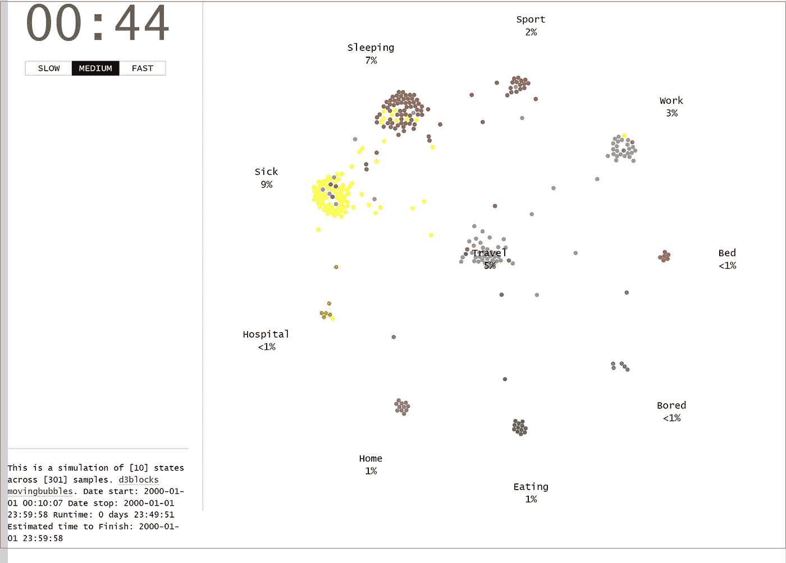
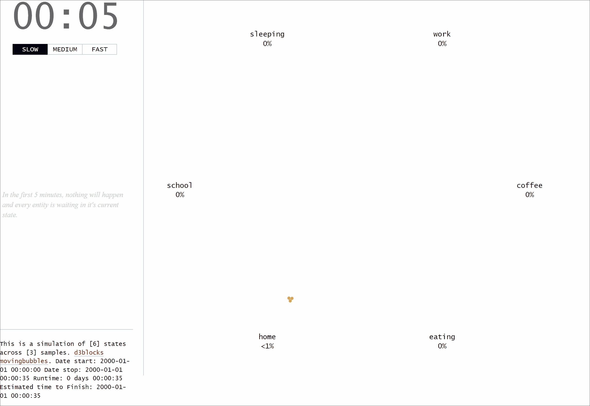
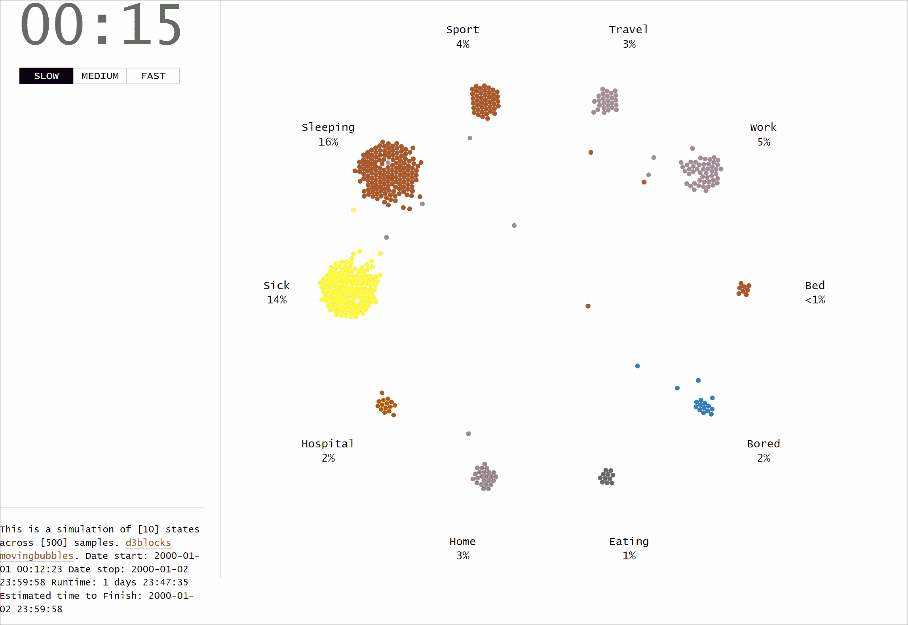
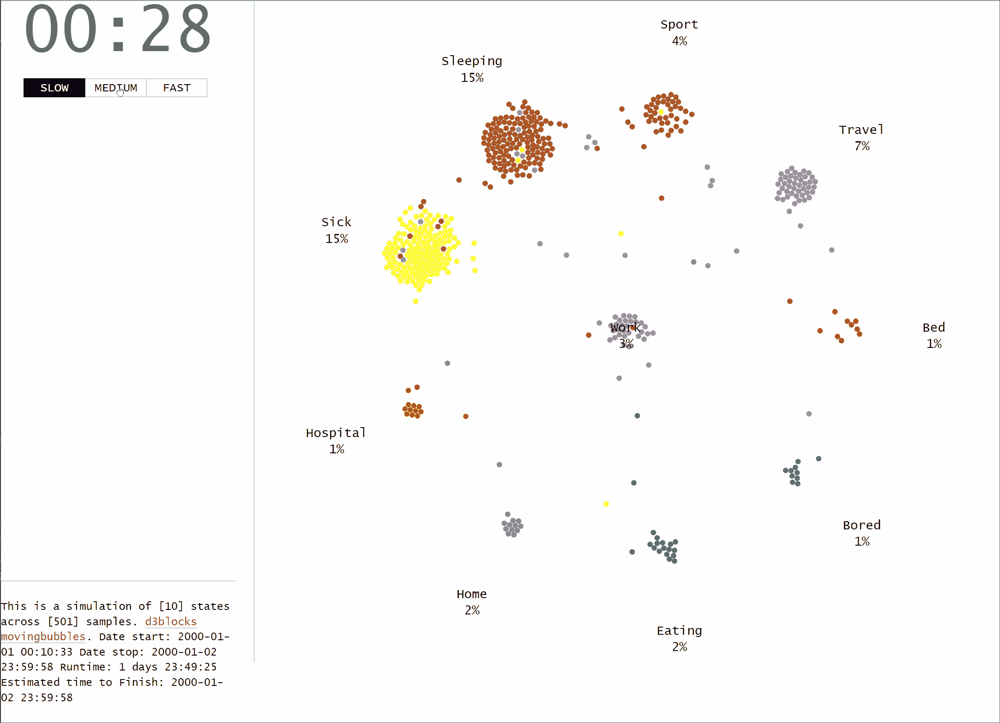

# 如何用 Python 在 d3js 中创建讲故事移动气泡图

> 原文：<https://towardsdatascience.com/how-to-create-storytelling-moving-bubbles-charts-in-d3js-with-python-b31cec7b8226>

## 移动气泡图是值得一看的令人兴奋的图表之一。这是从概念上更好地理解单个项目如何跨状态分布和跨时间移动的好方法。了解如何使用 Python 和您自己的数据集创建它们。



移动气泡图。(图片由作者提供)

移动气泡图是一种看起来令人兴奋的图表。这是一个很好的方式来讲故事，并从概念上更好地理解单个项目是如何跨州分布和跨时间移动的。尽管它们的外观很吸引人，但这样的图表并不常见，因为创建一个单独的图表需要付出巨大的努力。这里出现了 [*D3Blocks*](/d3blocks-the-python-library-to-create-interactive-and-standalone-d3js-charts-3dda98ce97d4) 库，因为*移动气泡*图是 [*D3Blocks*](/d3blocks-the-python-library-to-create-interactive-and-standalone-d3js-charts-3dda98ce97d4) 的一部分。它是开源的，不需要安装除 Python 之外的任何东西来创建一个*移动气泡*图表。输出是交互式的和独立的，除了浏览器，你不需要任何其他技术。因此，在网站上分享、发布和整合图表变得非常容易。 ***在这篇博客中，我将用一个实际操作的例子来介绍移动气泡图。***

*如果你觉得这篇文章很有帮助，可以使用我的* [*推荐链接*](https://medium.com/@erdogant/membership) *继续无限制学习，并注册成为中级会员。另外，* [*关注我*](http://erdogant.medium.com) *关注我的最新内容！*

# ***移动气泡*** 图是 D3Blocks 的一部分。

[*D3 blocks*](/d3blocks-the-python-library-to-create-interactive-and-standalone-d3js-charts-3dda98ce97d4)*是一个包含各种图表的库，其可视化部分基于(d3) javascript 构建，但可使用 Python 进行配置。以这种方式， *D3Blocks* 库结合了 d3 javascript 的优点，如速度、可伸缩性、灵活性和无限的创造力，以及 Python 的快速和简单使用。关于 *D3Blocks* 库的更多信息可以在[这个博客](/d3blocks-the-python-library-to-create-interactive-and-standalone-d3js-charts-3dda98ce97d4)【1】中找到。*

**移动气泡*图是 *D3Blocks* 的一部分，由两部分组成；Python 部分和 d3js 部分。Python 部分包含数据管理、预处理、标准化、颜色处理、标签等功能，而不用担心任何 d3 javascript 模块。可以加载该模块，指定参数，然后根据您的输入数据集创建*移动气泡*图表。 ***在幕后，***Python 模块会整合 d3js 部分的信息，比如数据集，颜色，调整位置，为状态数设置标签，包含用户自定义的参数。最后，所有的文件被连接并合并成一个单一的工作 HTML 文件。这样，*移动气泡*图表将根据您的特定数据集和参数自动调整。*

# *输入数据集、参数和输出。*

**移动气泡图*在视觉上令人满意地显示了力导向和碰撞节点。有助于理解*是否*和*何时*出现样本簇在特定的时间点和状态。在我们浏览*移动泡泡*的功能之前，我们首先需要安装 *D3Blocks* 库:*

```
*pip install d3blocks*
```

## *输入数据框。*

*在制作图表之前，我们需要构建输入数据集，以便 MovingBubbles 函数可以使用它。输入数据是一个包含以下三列的*数据帧*:*

*   ****日期时间*** :描述事件发生的日期时间。*
*   ****状态*** :描述 *sample_id* 在日期*的具体状态。**
*   ****sample _ id****:*样本可以是在不同时间点具有不同状态的个体/实体。它可以 ***而不是*** 在同一时间点有两个或多个状态。*

*输入数据帧的示例如下所示。在本例中，有 10.000 行，包括 3 列和索引列。唯一的*sample _ id*代表具有某种生活方式的个人(*美国*)。例如，第一行(索引 0)包含标识符为 ***61*** 的个体，并且在时间点 ***00:10:36*** 状态为***正在进食。*** 不多一会儿这个个体就要进入 ***睡眠状态*** (时间点 ***00:11:30)。*** 第二天我们再次看到这个特定的个体(以 ***id 61*** )在时间点 ***23:57:54*** ，以状态 ***【家】*** 。总结一下，id 为***61***的个体确实经历了三种状态: ***吃饭>睡觉>回家。*** 注意，个体将停留在特定状态，直到下一个状态被调用。*

```
*print(df)#                ** datetime sample_id     state**
**# 0    2000-01-01 00:10:36        61    Eating** # 1    2000-01-01 00:10:51        83      Sick
**# 2    2000-01-01 00:11:30        61  Sleeping** # 3    2000-01-01 00:11:37        66  Sleeping
# 4    2000-01-01 00:11:57        94  Sleeping
#                  ...       ...       ...
# 9995 2000-01-02 23:57:12         6      Home
# 9996 2000-01-02 23:57:23        48      Sick
**# 9997 2000-01-02 23:57:54        61      Home** # 9998 2000-01-02 23:58:22         4  Sleeping
# 9999 2000-01-02 23:59:34        88  Sleeping# [10000 rows x 3 columns]*
```

## *输入参数。*

*移动气泡块包含各种输入参数，在*代码段 1* 中有描述。这些状态将自动定位在一个圆圈中。*

*代码部分 1。输入参数(图片由作者提供)*

## *输出文件。*

*输出是存储在指定文件路径的单个 HTML 文件。HTML 包含一个可以共享和发布的全功能图表。*

# *数据如何转化为动作的实践示例。*

*让我们从一个小例子开始，演示输入数据帧是如何转换成运动的。我们将创建**三个**独特的样本，它们将跨越**六个**状态:**家>学校>工作>吃>咖啡>睡觉**，每个样本间隔 5 分钟。为了清楚起见，让我们将三个样本或个体的运动存储在三个独立的数据帧中； ***df1*** ， ***df2，*** 和 ***df3。*** 最终数据帧 ***df*** 是三个数据帧的组合集。通过打印数据帧 ***df*** ，如*代码第 2 节*所示，可以看到日期时间有 5 分钟的间隔，每个样本在六个状态之间移动。*

*代码部分 2。演示数据如何转化为运动。*

*有三列的数据框 ***df*** 是你创建*移动气泡图*所需要的。可以指定其他输入参数，例如标准化。在本例中，使用了 *samplewise* 标准化，并且指定了将在左侧面板上弹出的 *time_notes* (可选)。其他参数设置为默认值，以尽可能保持整洁。*

*代码第三部分。创建移动气泡图的示例。*

*运行这几行代码后，下面的图表就创建好了。每个点代表一个个体，颜色代表状态，当有人改变状态时，点会相应移动。一天中的时间显示在左上面板中，而时间注释显示在左中面板中。*

**

*演示 3 个人穿越 6 个预先定义的状态的移动。速度设置为慢、中和快。就等着吧。(图片由作者提供)*

# *不同配置和更多样本的示例。*

*在本例中，我们将生成一个数据集，其中包含样本在不同州之间的随机移动。这个想法和前面的例子是一样的，但是现在我们将使用`d3.import_example(graph='random_time')`。输入数据集打印在*代码段 4* 中，应包含三列。设置以下参数:`speed`设置为*自定义*，`center`设置为*空*表示*无状态*显示在图表中间。没有应用标准化(见下一节关于标准化的更多细节)。*

*代码第 4 部分。随机状态作为 movingbubbles 函数输入的示例。*

**

*展示跨越 6 个州的数百个样本的移动。速度设置为慢、中和快。就等着吧。(图片由作者提供)*

*我们现在也可以很容易地设置`center=’work’`，这将自动改变状态的顺序和位置。*

**

*以一个中心州为例，演示数百个样本在 6 个州之间的移动。速度在慢、中和快之间变化。就等着吧。(图片由作者提供)*

# *样本时间标准化。*

*标准化功能允许以 ***方式*以**方式对时间点进行转换。这意味着每个样品 id 的时间是标准化的，并且独立于其他样品 id。或者换句话说，每个样本的起始点是对齐的，因此起始日期时间将是相同的。为了演示 samplewise 标准化的效果，我将加载在*代码部分 1* 中创建的小数据帧。如果我们仔细观察数据，我们可以看到 *sample_id 1* 和 *sample_id 2* 具有相同的开始日期时间，而 *sample_id 3* 几乎在 1 年后开始:*

*   **sample _ id 的日期时间*# 1:***2000–01–01****00:00:00*。*
*   **sample _ id*# 2:***日期时间 2000–01–01****00:00:00*。*
*   **Datetime*of*sample _ id*# 3:***2000–12–12***00:00:00*

*当我们现在应用*样本方式*标准化时，在数据帧中添加了两个新列。列 *datetime_norm(代码段 5)* 包含对齐的日期时间点，其中 *sample_id 3* 中的一年差异是对齐的。delta 列描述了在原始数据中看到的时差。*

## *没有标准化。*

*如果我们不应用标准化，则时间按原样建模。一年之差(确切地说是 345 天，*第 67 行代码第 5 段*)可以从时差( *delta* )中看出。现在您可能需要等待很长时间，然后 *sample_id 3* 才会移动。但是可以使用`speed`参数改变时间的速度(参见*代码第 1 节*)。*

*代码第 5 部分:标准化的差异。*

# *最后的话。*

*我演示了如何使用 Python 创建自己的*移动气泡*图表。图表的开发方式可以处理各种状态、时间范围和颜色。*移动气泡*图表是 [*D3Blocks*](/d3blocks-the-python-library-to-create-interactive-and-standalone-d3js-charts-3dda98ce97d4) 中的一个模块，d3js 的使用显示了它的力量和优势，例如速度、灵活性和将你所有的创造力添加到图表中的可能性。*随意摆弄库！**

**注意安全。保持冷静。**

****干杯，E.****

**如果您觉得这篇文章很有帮助，请使用我的* [*推荐链接*](https://medium.com/@erdogant/membership) *继续无限制学习，并注册成为中级会员。另外，* [*关注我*](http://erdogant.medium.com) *关注我的最新内容！**

## *软件*

*   *[D3Blocks Github](https://erdogant.github.io/d3graph)*

## *我们连线吧！*

*   *[我们在 LinkedIn 上联系吧](https://www.linkedin.com/in/erdogant/)*
*   *[在 Github 上关注我](https://github.com/erdogant)*
*   *在媒体上跟我来*

## *参考*

1.  **Taskesen，E，*[*D3 blocks:Python 库，用于创建交互式和独立的 D3js 图表。*](/d3blocks-the-python-library-to-create-interactive-and-standalone-d3js-charts-3dda98ce97d4) 中等，2022 年 9 月*