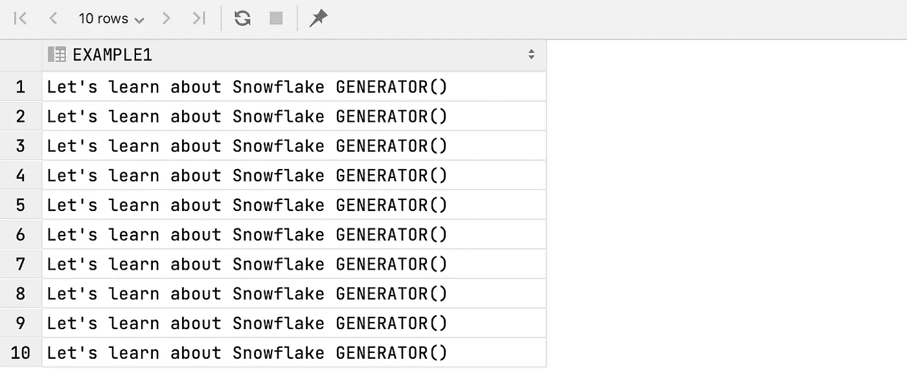
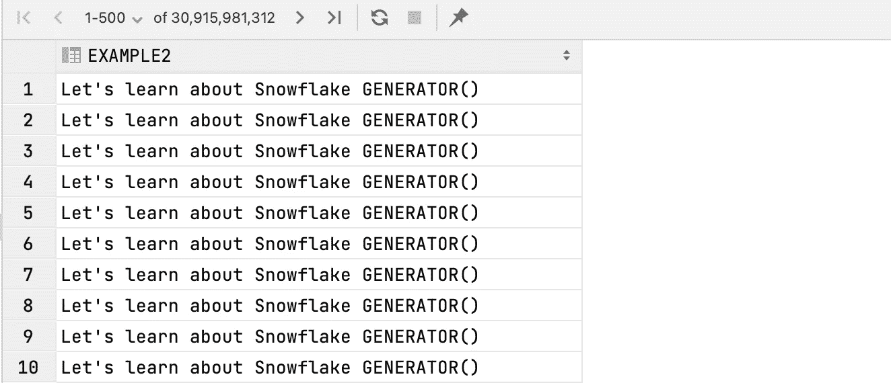
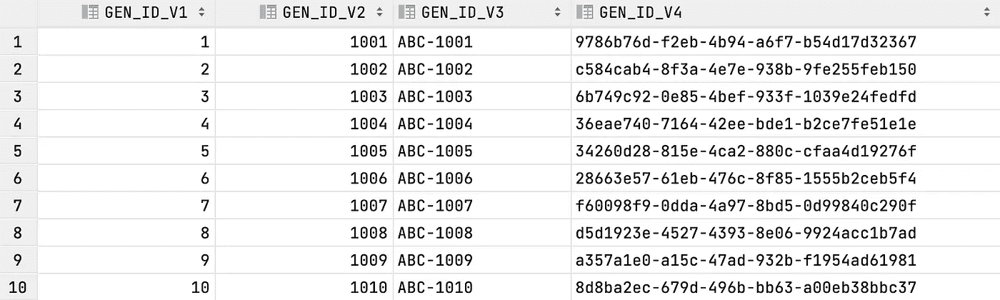
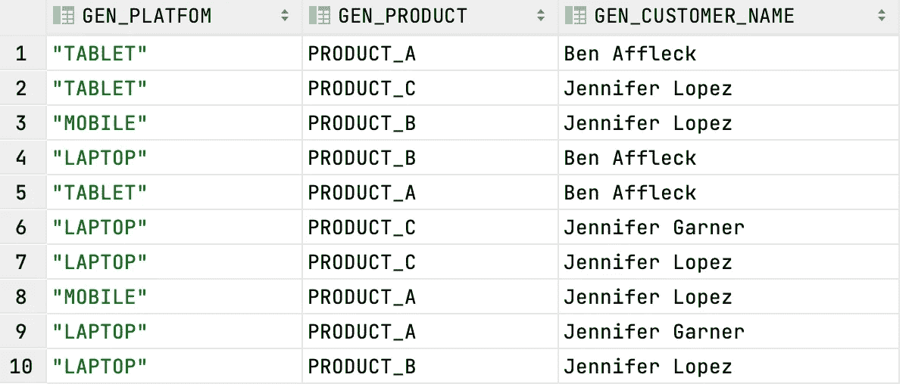
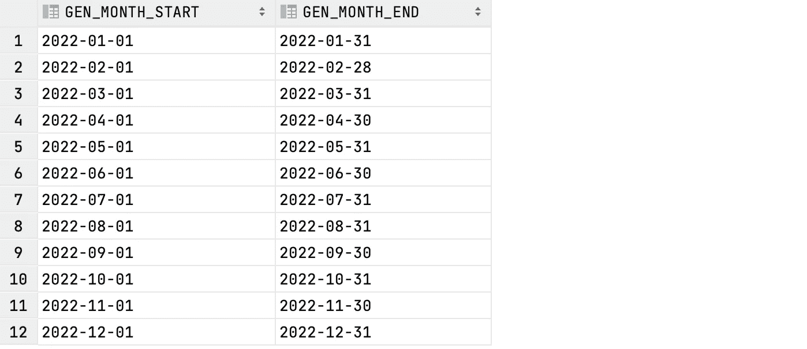
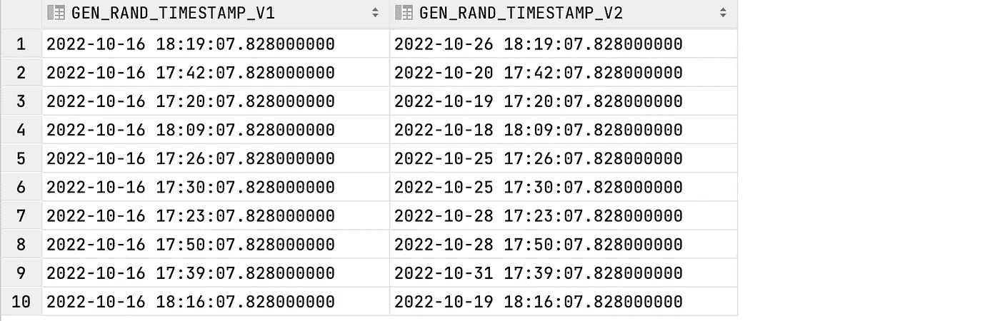
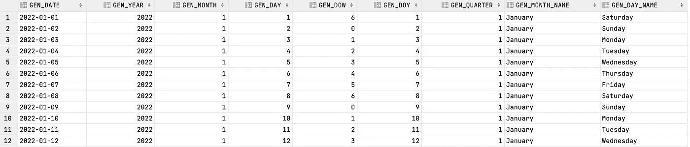

# 如何用雪花的 GENERATOR()函数创建合成行

> 原文：<https://towardsdatascience.com/how-to-create-synthetic-rows-with-snowflakes-generator-function-8f947d40d9b3>

## 当 SQL 变得比你想象的更好时…


图片由[弗朗斯·范·海登](https://www.pexels.com/photo/aurora-borealis-624015/)在[像素](https://www.pexels.com/)上拍摄

## 建议的点播课程:

*努力工作* ***推进事业*******数据行业*** *？如果是这样的话，我强烈建议您查看以下课程:**

*   *[***SQL & Python 高级编码问题(StrataScratch)***](https://platform.stratascratch.com/coding?via=antonello)***→****最佳平台我发现准备 Python & SQL 编码面试到此为止！比 LeetCode 更好更便宜。**
*   *[**SQL 中的关系数据库介绍(DataCamp)**](https://datacamp.pxf.io/qnP7zn)*
*   *[**Python 中的数据库介绍(DataCamp)**](https://datacamp.pxf.io/BX4609)*
*   *[**数据工程纳米学位(Udacity)**](https://imp.i115008.net/jWWEGv)*

# *雪花的生成器功能是什么？*

**你有过无中生有创造数据的需求吗？**

*如果您看过，您可能已经转到了关于如何用 Python、JAVA 和其他编程语言创建假数据的教程。*

*然而，事实证明，SQL 不仅是查询(DQL)和操作数据(DML)的伟大语言，还可以用来创建 ***合成行*** 。*

*在雪花中，这可以通过利用`GENERATOR()`函数来实现，如[文档](https://docs.snowflake.com/en/sql-reference/functions/generator.html#syntax)所述，该函数的语法为:*

```
***GENERATOR(** ROWCOUNT => *<count>* [ , TIMELIMIT => *<sec>* ] **)**

**GENERATOR(** [ TIMELIMIT => *<sec>* ] **)***
```

*这意味着您可以通过以下方式生成数据集:*

*   *指定输出表应该包括的确切的`ROWCOUNT`；*
*   *以秒为单位指定一个`TIMELIMIT`(*生成周期*)，在此之后行创建将停止。*

*请记住，第二个选项既强大又危险，因为 SQL 查询甚至可以在几秒钟内生成大量合成行。*

*下面的例子可以更好地解释这一点:*

*   *第一个`SELECT`语句使用`GENERATOR(ROWCOUNT(=>10))`语法输出一个数据集，其中正好有 10 ( *相同的*)行显示字符串`Let's learn about Snowflake GENERATOR()`。使用`ROWCOUNT`，使您的语句结果具有确定性，因为它涉及到输出中的行数:*

**

*   *第二个`SELECT`语句使用了`GENERATOR(TIMELIMIT(=>3))`语法。这意味着，在执行时，查询将在 3 秒钟内持续生成行。这似乎不是很长的时间，但仍然足以让雪花产生大约 310 亿行:*

**

*请注意`GENERATOR()`函数本身是如何包装在`TABLE()`子句中的。这样做的原因是，`GENERATOR()`实际上用于创建所谓的**虚拟表** " [*"具有 0 列，但可能有许多行*](https://docs.snowflake.com/en/sql-reference/functions/generator.html#generator) "。*

*反过来，每当查询完全由数据生成函数组成时，语法中就需要虚拟表。*

## *什么时候应该使用发电机？*

*每当您没有或不希望使用物理数据来执行特定任务时，您应该考虑使用`GENERATOR()`功能，例如:*

*   ***构建数据管道的本地或分级版本**。*
*   ***生成由与您部署的输出*、*、**的形状和格式相似的列组成的非常大的数据集，以测试生产数据管道的未来性能**。***
*   ***创建虚拟数据对象***这在写教程的时候也特别有用。**
*   ****用与原始数据保持相同结构的数据替换个人敏感信息(PII)** 。**
*   ****创建日期模板表**用于生产，同时在给定的时间范围内转换数据。**

## **生成器可以创建什么类型的数据？**

**通过`GENERATOR`功能可以创建的不同合成数据的类型是无穷无尽的——您的创造力在这里是极限——而且当与雪花提供的其他 [**数据生成功能**](https://docs.snowflake.com/en/sql-reference/functions-data-generation.html#data-generation-functions) 结合使用时，该功能会大放异彩。**

**然而，在下面的三个常见用例中，`GENERATOR`函数变得非常方便。**

## **#1 生成顺序 id**

**有时，您可能需要生成合成的序列(*唯一的*)id。这可能只是为了模拟包含物理 id 的生产表，或者为了能够对不同的行进行计数。**

**以下是用`GENERATOR`创建连续 id 的 4 种方法:**

****输出:****

****

**这里有两个亮点:**

*   **像`ROW_NUMBER() OVER()`这样的**窗口函数**在与`GENERATOR`结合使用时可以用来产生连续的 id。我发现让合成行更动态是一个聪明的把戏。**
*   **使用**数据生成功能**T5 生成唯一的 UUID。在很多情况下，这个功能在生产中有直接的应用，所以值得你在这里查看一下[。](https://docs.snowflake.com/en/sql-reference/functions/uuid_string.html#uuid-string)**

## **#2 生成字符串属性**

**在某些情况下，您可能希望通过生成包含随机**字符串属性**的行来复制表的结构，比如`PLATFORM`、`PRODUCT`、`CUSTOMER_NAME`等等。**

**在雪花中，这可以通过结合使用`GENERATOR`和`UNIFORM`和`RANDOM`功能来实现。例如:**

****输出:****

****

**如你所见，`RANDOM`函数用于*随机*选择一个通过`UNIFORM`函数在指定间隔内生成的整数。然后，注意整数是如何:**

*   **传递给分配字符串属性的`CASE WHEN`语句；**
*   **传递给一个`ARRAY_CONSTRUCT`作为索引，在组中选择一个随机的字符串。这个解决方案是一行程序，我觉得它非常优雅。**

*****还有，你能说出哪个客户不应该在那里吗？*** :D**

## **#3 生成日期和时间戳**

**`GENERATOR`功能最常见的用例之一是创建合成**日期**和**时间戳**。**

**例如，下面的查询返回 2022 年每个月的`START`和`END`日期**:****

****输出:****

****

*   **请注意`ROW_NUMBER()`是如何再次被用来产生从 1 到 12 的连续数字的，这些数字已经通过`DATEADD`函数作为月份添加到**开始日期** ( `2021-12-01`)中。**
*   **还要注意如何利用`LAST_DAY`函数来获取当月的最后一天。**

**要随机生成**时间戳**，您可以再次利用数据生成函数，并将它们作为`DATEADD`的参数传递，如下所示:**

****输出:****

****

# **最后一个例子:生成一个日期模板表**

**一个**日期模板表**(也称为**日期脚手架**)是一个包括一组日期以及直接导出的参数的表，从过去的某一天开始，一直到未来。**

**这些类型的表通常由数据团队创建，用作*辅助数据集*，而**执行与事实表**的连接:**

*   **验证给定时间范围内记录的存在与否；**
*   **当需要与前期进行比较时，计算 KPIs**
*   **对数据集的季节性进行建模。**

**如果您想知道如何在`GENERATOR`函数的帮助下创建它们，您可以在下面找到一个为 2022 年创建此类辅助日期模板表的脚本:**

****输出:****

****

# ****结论****

**当第一次介绍雪花的`GENERATOR`功能时，我被它的多功能性惊呆了，这提醒我，即使在“*大数据*时代，SQL 仍然可以用来解决大量的数据任务。**

**事实上，有很多实际的用例，其中`GENERATOR`可以方便地大规模生成合成行，而无需掌握任何其他编程语言。**

**在本教程中，您学习了函数语法，并探索了一些实际应用。希望你和我一样对`GENERATOR`功能强大印象深刻。**

# ****来源****

*   **[生成器—雪花文档](https://docs.snowflake.com/en/sql-reference/functions/generator.html)**
*   **[数据生成功能—雪花文档](https://www.google.com/search?q=data+generator+functions+snowflake&rlz=1C5GCEM_enGB958DE959&oq=data+generator+functions+snowflake&aqs=chrome..69i57j33i22i29i30.7074j0j7&sourceid=chrome&ie=UTF-8)**
*   **[利用雪花的生成器功能创建日期时间脚手架表](https://interworks.com/blog/2022/08/02/using-snowflakes-generator-function-to-create-date-and-time-scaffold-tables/)**