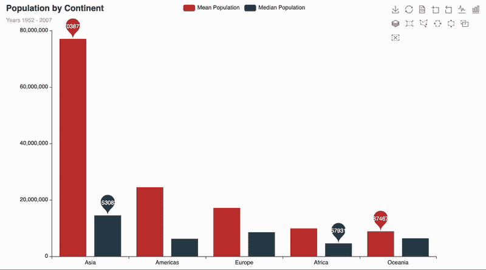
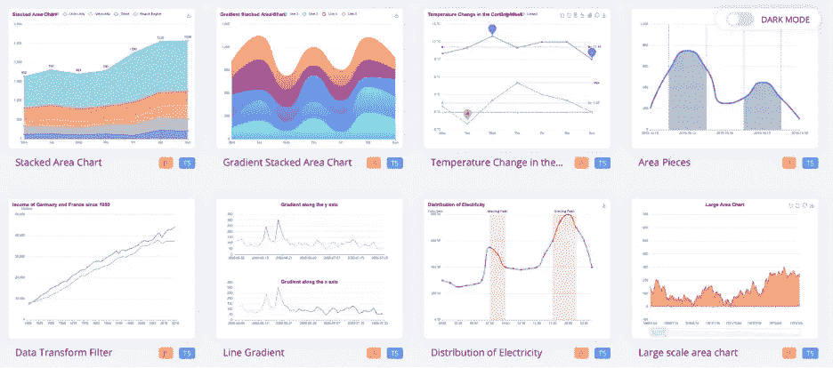
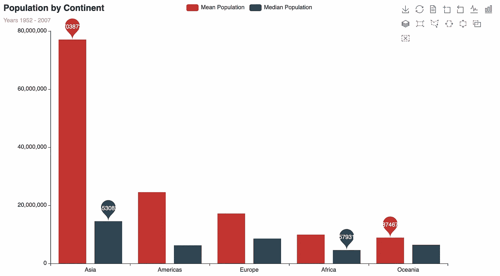
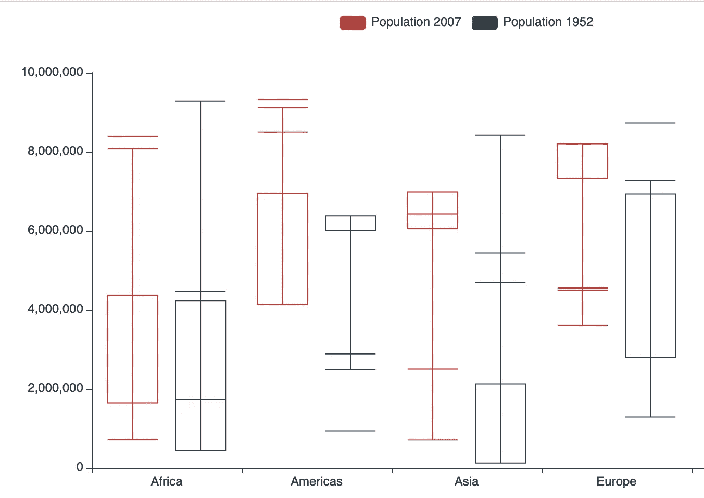

# 如何使用 Apache ECharts 和 Python 创建网络友好的图表

> 原文：<https://towardsdatascience.com/how-to-create-web-friendly-charts-with-apache-echarts-and-python-402fa7f79791>

## 教程-PYTHON-pye charts

## 使用 PYECHARTS 通过 Python 和 JavaScript 创建 Apache ECharts 的分步教程

戴维·克洛德在 [Unsplash](https://unsplash.com/s/photos/python?utm_source=unsplash&utm_medium=referral&utm_content=creditCopyText) 上的照片

# 介绍

大家好，我是 Gregor，一名顾问和技术书呆子，对数据可视化和数据科学非常感兴趣。我一直在寻找新的更快的方法来显示隐藏在数据中的信息。我经常用 [Python(熊猫)](https://medium.com/towards-data-science/the-flawless-pipes-of-python-pandas-30f3ee4dffc2?source=user_profile---------14-------------------------------)或者 [R (Tidyverse)](https://medium.com/towards-data-science/7-data-wrangling-r-functions-for-your-next-data-science-project-in-under-5-minutes-d5a4ad55f99b?source=user_profile---------5-------------------------------) 处理数据。

通常，这种练习的结果是将图形保存为图像，最终以 PowerPoint 文档的形式呈现给客户。由于这些是静态图像，附加信息以文本形式作为 PowerPoint 文档的一部分提供。

最近我发现了 Apache ECharts，这是一个使用 JavaScript 在 web 上可视化数据的开源工具。使用 Apache ECharts 而不是 Python 的 matplotlib 会给您带来以下好处:

1.  内置的交互和自动生成的图表描述
2.  网络友好，即在桌面和移动设备上工作
3.  开箱即用的优雅

Apache ECharts 条形图示例；作者视频

由于 Apache ECharts 需要我编写 JavaScript，所以我研究了可用的 Python APIs。pyecharts 是一个 Python API，使用 Python 创建必要的 HTML 和 JavaScript 代码。

本文将向您介绍 Apache ECharts 和 pyecharts，这是一个用于创建 Apache ECharts 的 Python 库。我还将向您展示如何设置您的设置，并通过两个示例向您展示。

# Apache Echarts & PYECHARTS

## 阿帕奇·埃查尔兹

> Apache EChartsTM 是一个开源的 JavaScript 可视化工具，可以在 PC 和移动设备上流畅地运行。它兼容大多数现代网络浏览器，如 IE9/10/11、Chrome、Firefox、Safari 等。

Apache EChart 特性— [链接](https://echarts.apache.org/en/index.html)

换句话说，您可以直接在 HTML 页面上使用 JavaScript 对数据可视化进行编程。Apache ECharts 提供了必要的库，因此任何访问者的网站浏览器都可以呈现可视化效果。结果是一个动态和交互式的图形(参见上面的视频)。

Apache ECharts 提供了常用的图表类型作为数据可视化库，包括折线图、条形图、地图和树形图。

Apache EChart 图表类型— [链接](https://echarts.apache.org/examples/en/index.html)

## 肾盂造影图

如果您习惯于用 R、Python 或 Julia 以编程方式创建可视化，那么用 JavaScript 编程可能会让您感到害怕。 [Pyecharts](https://pyecharts.org/#/en-us/) 是一个 Python 库，允许您为数据可视化创建与 Apache EChart 兼容的 JavaScript 文件。这让你不用学习 JavaScript，不用呆在你的编程环境里。在 pyecharts 旁边，有可用于 [R](https://github.com/cosname/recharts) 和 [Julia](https://github.com/randyzwitch/ECharts.jl) 的包装器。

# 设置

在我们开始之前，您需要使用 pip 安装 pyecharts。

`pip install pyecharts`

对于本教程，我还使用了漂亮的 Gapminder 数据集。Gapminder 的数据是在知识共享署名 3.0 未授权[许可](https://cran.r-project.org/web/packages/gapminder/README.html#license)下发布的。我很乐意参考这些文章来了解更多信息: [7 个不到 5 分钟的数据辩论 Python 函数](/7-data-wrangling-python-functions-in-under-5-minutes-a8d9ec7cf34b)和[如何为您的数据可视化使用调色板](https://medium.com/towards-data-science/how-to-use-color-palettes-for-your-data-visualization-ac4eaf3de37b)。

# 辅导的

接下来，我们需要导入必要的库。

在下面的部分中，我用 pyechart 创建了两个不同的图:条形图和箱线图。

## 条形图

对于柱状图，我使用熊猫按洲对 Gapminder 数据进行分组。如果你想知道我是如何构建我的代码的，它被称为**方法链**或管道(在 R 社区中)。我在我的另一篇文章中解释了[基础知识。](/the-flawless-pipes-of-python-pandas-30f3ee4dffc2)

最后，让我们使用创建的数据集创建一个基本的条形图。我们从调用 Bar 函数开始。我将一些选项传递给了 Bar 函数，比如宽度和高度。add_xaxis 和 add_yaxis 接收 x 轴和 y 轴所需的数据列。在本例中，我在 x 轴上传递洲信息，在 y 轴上传递平均人口。Set_global_options 设置此图表的标题和副标题。set_series_opts 允许添加附加信息。在这种情况下，我为最小和最大平均人口添加标记。最后，render()优雅地呈现必要的 JavaScript 和相应的 HTML 文件。如果您使用的是 Jupyter 笔记本或实验室，请使用函数 render_notebook()。这将直接在您的笔记本中渲染情节。

各大洲平均人口；作者图片

请注意，不可能将熊猫系列直接传递给 pyecharts。相反，您需要将系列转换成列表。这对我有用。如果你知道如何不同地做它，请联系我。

## 箱线图

对于箱线图，我想比较 1952 年和 2007 年各大洲的人口。首先，我创建了一个包含所有五大洲的列表。这将作为 x 轴，并创建包含 1952 年和 2007 年人口的列表。

创建所有列表后，我使用 Boxplot()函数初始化绘图。使用 add_xaxis，我传递大陆列表。接下来，我对每个人口列表使用 add_yaxis 两次。

按洲和年份分列的人口分布；作者图片

# 结论

本文将向您介绍 Apache ECharts 和 pyecharts，这是一个用于创建 Apache ECharts 的 Python 库。我还向您展示了如何设置您的系统，并通过两个例子向您展示了这一点。请注意，我只能触及表面。Apache ECharts 和 pyecharts 还有更多的可能性。但是这篇文章可以让你开始。

Apache ECharts 是一个强大的数据可视化库。它的目标是在网络上创建和发布交互式图表。pyecharts 帮助 Python 开发人员在他们最喜欢的编程语言中创建 echarts 图，这也提高了开发速度。然而，我发现 pyecharts 并不像我希望的那样完美，尤其是与 [ggplot2](/data-visualization-in-python-like-in-rs-ggplot2-bc62f8debbf5) 或 [Altair](/how-to-visualize-your-runners-high-with-python-and-altair-45dde7803141) 相比。使用 pyecharts，您需要处理列表而不是熊猫系列。它还要求您对数据集进行切片，以便为每个图表创建多个系列。最重要的是，我发现文档有点过时，这阻碍了我进行更多的测试。你怎么想呢?

如果你想阅读更多关于我的旅程，请考虑关注我，或者如果你不是一个媒体成员，请考虑[加入这里](https://gscheithauer.medium.com/membership)。非常感谢。

谢谢你，
格雷果

<https://gscheithauer.medium.com/membership> 