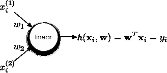
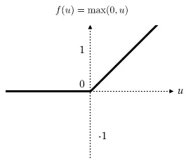

# 如何只用 Numpy 创建自己的深度学习框架

> 原文：<https://towardsdatascience.com/how-to-create-your-own-deep-learning-framework-using-only-numpy-dfc26b9659ef>

## *本文将向您展示创建基本深度学习框架所需的挑战、组件和步骤*

由[弗拉多·帕诺维奇](https://unsplash.com/@vlado?utm_source=medium&utm_medium=referral)在 [Unsplash](https://unsplash.com?utm_source=medium&utm_medium=referral) 上拍摄的照片

让我们首先定义我们想要创建什么，并找出我们需要什么组件:我们需要一个支持**自动微分**的框架来计算几个操作的梯度，一个标准化的方法来构建**神经网络层**，使用前面提到的操作和模块化方法将它们组合在一个更大的**神经网络模型**中，以及几个用于训练神经网络的工具，如**优化器、激活函数、数据集**。

我们已经确定了以下组件:

*   **亲笔签名的系统**
*   **神经网络层**
*   **神经网络模型**
*   **优化师**
*   **激活功能**
*   **数据集**

接下来，我们将逐一介绍这些组件，看看它们的目的是什么，以及我们如何实现它们。作为例子和参考，我将使用 [**gradflow**](https://github.com/DACUS1995/gradflow) ，这是一个个人开源教育签名系统，具有深度神经网络支持，遵循 **PyTorch API** 。

## **自动签名系统**

这是最重要的组件，代表了所有深度学习框架的基础。它将允许我们跟踪将要应用于输入张量的操作，并使用损失函数相对于每个参数的梯度来更新我们的模型的权重。一个条件是这些运算必须是可微的。

我们自动签名系统的基础是**变量，**通过为我们需要的操作实现 dunder 方法，我们将能够跟踪每个实例的 ***父*** 以及如何计算它们的梯度。为了帮助一些操作，我们将使用一个 **numpy** 数组来保存实际数据。

**变量**的另一个重要部分是*向后*方法，这将计算当前实例相对于计算图中每个祖先的梯度。在具体步骤中，我们将使用来自 origin 操作的父引用和嵌入的渐变函数来更新一个 *grad* 成员字段。

以下代码片段包含主**变量**类初始化函数、 *add* 操作的 dunder 方法以及之前的 *backward* 方法:

在 *_back_grad_fn，*中需要注意两件事，首先我们需要将梯度添加到现有值中，因为我们需要累积它们，以防在计算图中有多条路径到达该变量，其次，我们还需要利用子当前梯度，如果您想要关于自动微分和矩阵演算的更多细节，我强烈推荐这篇[文章](https://arxiv.org/abs/2106.08962)。

## **神经网络模块**

对于实际的神经网络模块，我们希望灵活地实现新的层和模块，并重用现有的层和模块。

遵循 PyTorch API，我们将创建一个基类*模块*，它需要实现 *init* 和 *forward* 方法。除了这两个，我们还需要几个基于实用程序的方法来访问参数和子模块。

基础模块

## **线性图层**

使用上一节的抽象模块*我们将实现一个简单的线性层。我们需要执行的数学运算非常简单:*

线性层变换

因为我们将使用之前实现的变量*自动计算操作的实际结果和梯度，所以实现很简单:*

线性的

## 激活功能

现实世界中的大多数数据在自变量和因变量之间具有非线性关系，我们也希望我们的模型能够学习这种关系。如果我们不在线性层上添加非线性激活函数，无论我们添加多少线性层，最终我们都可以只用一层(一个权重矩阵)来表示它们。

最常用的激活功能是 **Relu:**

热卢

当我们实现 relu 函数时，我们还需要指定反向传播函数:

## **优化器**

在我们通过我们的模型执行正向传递并通过我们的层反向传播梯度之后，我们需要实际更新参数，以便使损失函数更小，并且这里介入优化器。

最简单的优化器之一是 **SGD (** 随机梯度下降**)，**，在我们的实现中，我们将保持一切都非常简单。仅使用梯度和学习率，我们将剪切变化值*δ*并更新权重:

【计算机】优化程序

## **数据集**

拼图的最后一块是一个组件，它将允许我们组织数据集，并轻松地将其集成到训练过程中。为此，我们创建了一个**数据集**类，它实现了迭代器的 dunder 方法，并将特性和标签转换为*变量*类型:

资料组

## 培养

最后，我们将把所有东西放在一起，并使用人工生成的数据集训练一个简单的线性模型，该数据集使用 **sklearn.datasets** :

培养

## 结论

所展示的实现决不是产品级的，而且非常有限，但是我认为它们是一个很好的学习工具，可以更好地理解在其他流行框架下发生的一些操作。

虽然基于标量的运算的基本演算非常简单，但当我们添加多维度并切换到张量时，情况就变得有点复杂，我们必须格外注意。

感谢您的阅读，我希望您会发现这篇文章很有帮助，如果您想了解最新的编程和机器学习新闻以及一些优质的模因:)，您可以在 Twitter 上关注我[这里](https://twitter.com/SurdoiuT)或者在 LinkedIn 上联系[这里](https://www.linkedin.com/in/tudor-marian-surdoiu/)。

## 参考

*   特伦斯·帕尔，杰瑞米·霍华德:*深度学习需要的矩阵演算(*[https://arxiv.org/abs/2106.08962](https://arxiv.org/abs/1802.01528)*)*
*   [https://github.com/DACUS1995/gradflow](https://github.com/DACUS1995/gradflow)