# 如何自定义图形中的注释

> 原文：<https://towardsdatascience.com/how-to-customize-annotations-in-graphics-3d2e37a4b466>

## 了解如何像专业人士一样使用 Python 中的 Matplotlib 进行注释。

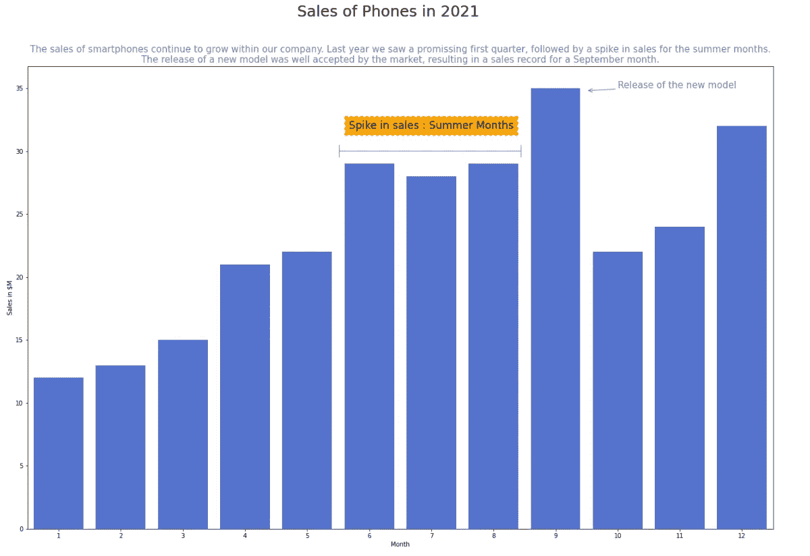

讲故事:副标题和注释帮助我们快速阅读和理解。图片由作者提供。

## 介绍

如果你读过 Cole Nussbaumer Knaflic 的《用数据讲故事》，你会知道你在图形中添加的注释可以帮助你向你的观众讲述这个故事。

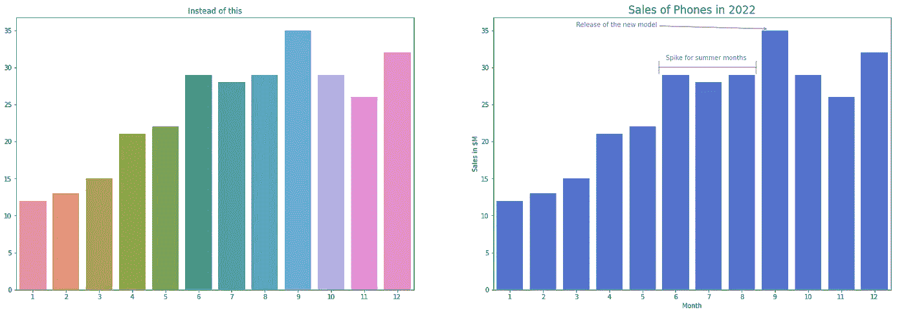

图 1:代替这个，做这个…图片作者。

看着上面的图片 1，你可能会注意到两种可视化效果之间的巨大差异。第一个滥用了颜色，没有任何轴标签也没有标题，而右边的图形更统一，只有一种颜色，因为我们处理的是单个变量，它有轴标签，标题和**注释，帮助我们快速阅读情节。**

## **快速浏览图形图层**

可视化可以按照图形 的 [*语法来构建(参见 Dipanjan (DJ) Sarkar 的链接帖子)，这是一组帮助你为图形的每一层做出决定的规则。简而言之，你将决定:*](/a-comprehensive-guide-to-the-grammar-of-graphics-for-effective-visualization-of-multi-dimensional-1f92b4ed4149)

> 你在策划什么**数据**？

了解你的数据。你想讲什么故事？数据的类型是什么(定量还是分类)？在进入下一步之前，必须回答这些问题。

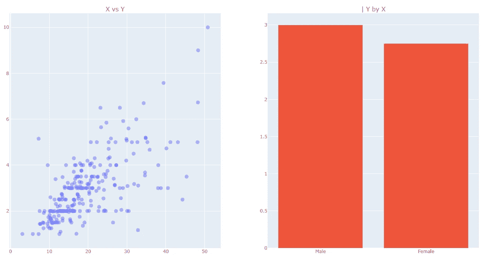

图 2:定量还是分类。图片由作者提供。

> 运用什么**美学？**

x 是什么？y 轴是什么？用什么颜色？这些都是这个话题要回答的问题。通常我们用 X 轴表示解释变量，Y 轴表示响应或目标。因此，如果你用售出的数量来解释销售，Y 轴表示销售，x 轴表示数量更有意义。

> 哪个**秤？**

线性刻度是最常见的。你画出它是什么。

当有两个变量保持某种关系时，对数标度或归一化数据会更好，但它们的标度相差太大，无法比较，因为一条曲线会使另一条曲线变平。你应该画出更有意义的东西。

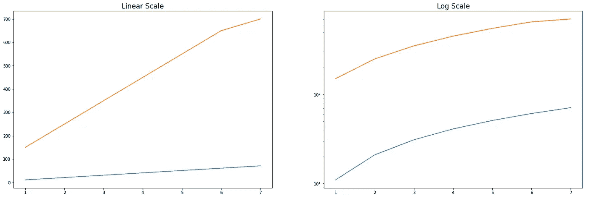

图 3:线性与对数标度。图片由作者提供。

> **几何图形**

如果显示时间序列，使用*线*。比较两个数值变量之间的关系，考虑一个*箱线图*。是分类数据之间的比较吗，一个*柱状图*怎么样？单变量，你有 *ecdf，直方图* …

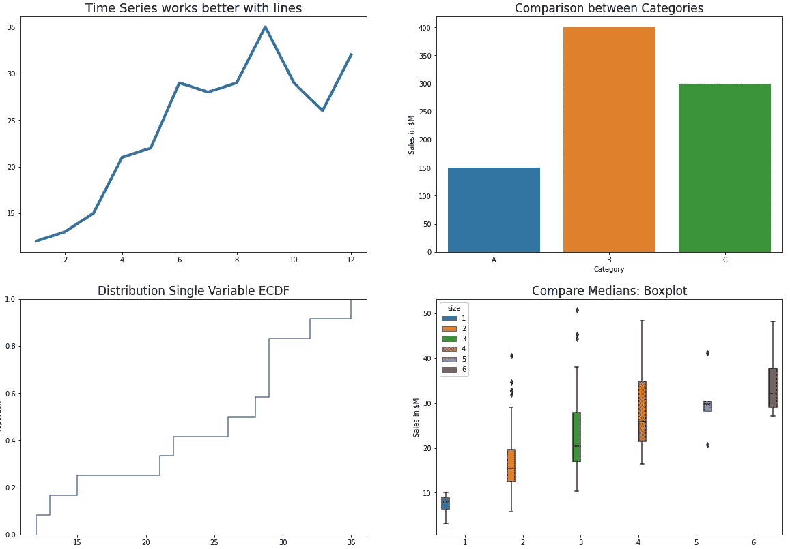

图形的类型。图片由作者提供。

了解你的数据。据此决定。

> **统计数据**

有时需要加上计数、均值、置信区间。Seaborn 提供了很多很酷的东西，比如每个条形顶部的置信区间。

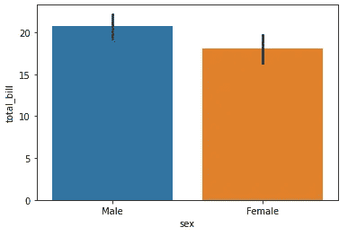

具有置信区间的 Seaborn 柱状图。图片由作者提供。

> **坐标**系统

笛卡尔坐标使用得更频繁，但有时极坐标也很有用。

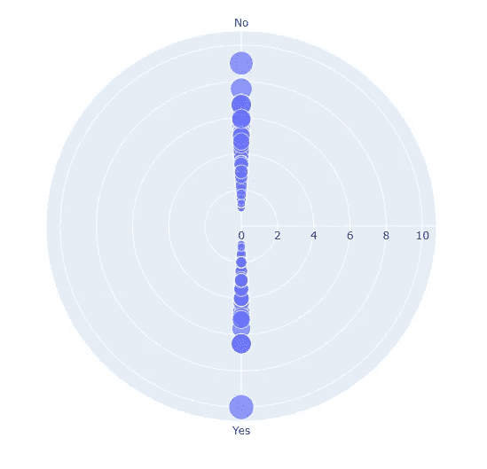

极坐标的一个例子。图片由作者提供。

像`ggplot2`这样的库就是建立在这个概念上的，你可以看到正在使用的语法。其他像`seaborn`这样的人更倾向于统计学。`plotly`喜欢互动。对我来说，定制就是一切。

## 释文

但是回到我们在这里的目的，使用这些层，你会更容易思考，勾画和绘制你的视觉效果。你会更加小心地使用颜色、标签、图例，并会创造出更好的图形。

然后，注释将是一个讲得好的故事的最后一笔。

matplotlib 中 annotate 的基本语法如下。

```
plt.annotate("text", xy=(x_pos, y_pos), color='red', size=12)
```

让我们看一个例子。

```
# Plot
data = [12,13, 15, 21, 22, 29, 28, 29, 35, 29, 26, 32]
g = sns.ecdfplot(x=data)
g.set_title('ECDF Plot with basic annotation', size=17)# Basic annotation
plt.annotate("50% of our distribution \nis below 27 = = = = =>", xy=(16, 0.5));
```

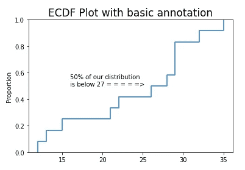

基本注解。图片由作者提供。

你也可以使用`plt.text`，这是非常基本的。您将在图形中的某个位置添加文本。我们所做的就是提供 x 和 y 位置以及字符串。

```
plt.text(x, y, s, color, size)
---
# Example
data = [12,13, 15, 21, 22, 29, 28, 29, 35, 29, 26, 32]
g = sns.histplot(x=data)# Text annotation
plt.text(x=15, y=4, s='Random text', color='green')
```

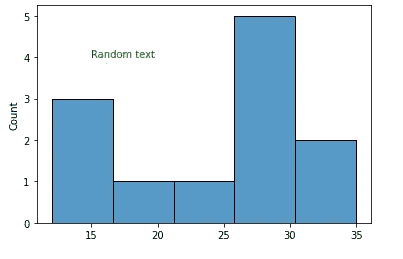

plt.text()。作者图片

您也可以使用下面的代码在文本周围创建一个框。

```
plt.text(16, 4, "Random Text", ha="center", va="center", rotation=0, size=15, bbox=dict(boxstyle="round4, pad=0.4", fc="lightgray", ec="r", lw=0));
```

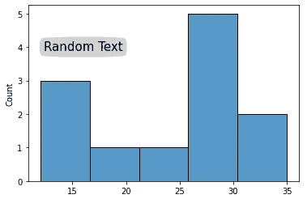

文本周围的框。图片由作者提供。

## 箭头和副标题

但是我们可以用注释做更多的事情。我们也可以添加里面有文字的箭头。

```
# Plot
data = [12,13, 15, 21, 22, 29, 28, 29, 35, 29, 26, 32]
g = sns.histplot(x=data)# Arrow with comments inside
plt.text(19, 4, "Look at this bin!", ha="center", va="center", rotation=0, size=15, **bbox=dict(boxstyle="rarrow, pad=0.4", fc="lightgray", ec="r", lw=0)**);
```

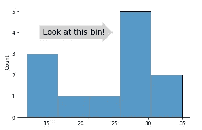

带注释的箭头。图片由作者提供。

或者最后，我们可以创建一个带有注释和解释的精美图形，帮助我们用数据讲述一个精彩的故事。要添加一个副标题，您实际上将使用`plt.title()`作为解释文本，使用`plt.suptitle()`作为您的主标题。请参见下面的代码。

```
# Setup figure size
plt.figure(figsize=(18,8))**# Data**
months = [1, 2, 3, 4, 5, 6, 7, 8, 9, 10, 11, 12]
data1 = [12,13, 15, 21, 22, 29, 28, 29, 35, 22, 24, 32]**# Plot**
g = sns.barplot(x=months, y=data1, color='royalblue')**#Title**
plt.suptitle('Sales of Phones in 2021', size=18)
g.set_title(*'''The sales of smartphones continue to grow within our company. Last year we saw a promissing first quarter, followed by a spike in sales for the summer months.
The release of a new model was well accepted by the market, resulting in a sales record for a September month.'''*, color='gray')
g.set(xlabel='Month', ylabel='Sales in $M' )**# Add annotation for the arrow type |--|**
plt.annotate( " ", xy=(4.5, 30), 
            horizontalalignment='center', verticalalignment='center',
            xytext=(7.5,30),
            arrowprops=dict(arrowstyle='|-|', color='gray') )**# Text and Arrow pointing to the top bar in September**
plt.annotate( "Release of the new model", xy=(8.5, 34.8), xytext=(9, 35), arrowprops=dict(arrowstyle="->",color='royalblue'), color='gray', size=12 )**# Text "Spike for Summer Months"**
plt.text(6, 32, "Spike in sales : Summer Months", ha="center", va="center", rotation=0, size=12, bbox=dict(boxstyle="roundtooth, pad=0.5", fc="orange", ec="r", lw=0));plt.show()
```

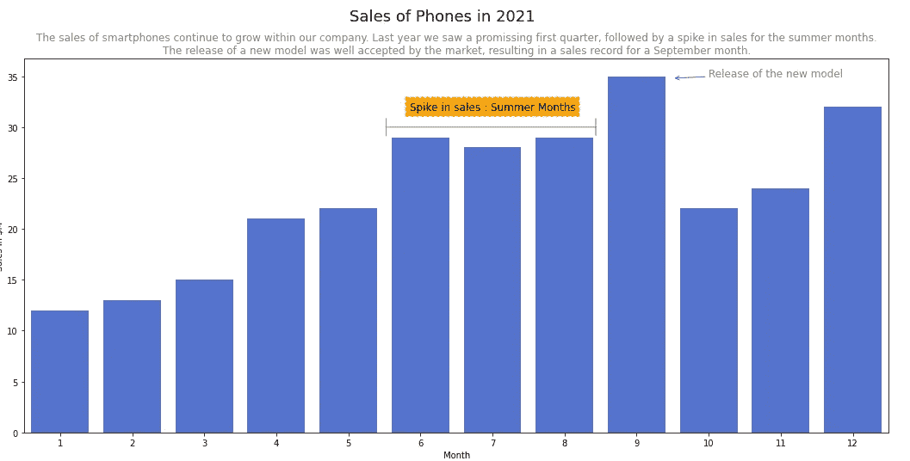

讲故事:副标题和注释帮助我们快速阅读和理解。图片由作者提供。

## 在你走之前

学习新的数据可视化技术总是好的，因为它们将帮助您发展讲故事的技能。

在这篇文章中，我给了你一些新的(或者对某些人来说不算新的)工具，我相信这些工具会增强你的视觉效果，并让你在数据科学家的工作中取得进步。

如果你想加入 Medium，你可以使用这个[推荐链接](https://gustavorsantos.medium.com/membership)，不要忘记关注我的博客了解更多。

<https://gustavorsantos.medium.com/>  

查看我的 GitHub 中的[完整代码](https://github.com/gurezende/Studying/blob/master/Python/DataViz/Annotate_PLT.ipynb)。

## 参考

在此处找到文档。

> 注意:对于一些可视化，我使用了 Python 中 Seaborn 库中的玩具数据集*提示*。

<https://matplotlib.org/3.5.1/api/_as_gen/matplotlib.pyplot.text.html>  <https://matplotlib.org/3.5.0/tutorials/text/annotations.html> 