# 如何在不训练神经网络的情况下去除图像模糊

> 原文：<https://towardsdatascience.com/how-to-de-blur-images-without-training-neural-networks-72f8597c0014>

## 背景

我发现在点击图片时很难保持手的稳定。很自然，他们中的许多人都有模糊不清的感觉。如果你和这个问题有关，那你就来对地方了。虽然我不能教你摄影，但我可以用几行 python 代码向你展示一种消除图像模糊的技术。鉴于围绕深度学习的热潮，一个解决方案是训练一个自动编码器。但是，训练它们在计算上很昂贵，有时，经典方法工作得很好。因此，我们将使用傅立叶变换。

傅立叶变换在信号和图像处理中有着广泛的应用。它的性能可能不如最先进的深度学习方法令人印象深刻，但它的速度要快得多。如果你在智能手机上点击一张图片后注意到一个处理提示，那么傅立叶变换可能正在后台运行以提高图像质量。它还可以帮助更好地训练现代深度学习架构。任何模型都取决于它所依赖的数据。使用傅立叶变换，您可以应用大量的图像处理技术(降噪、边缘检测等)来提高训练数据的质量。

我不会深究傅立叶变换的数学细节。如果你对此感兴趣，你会在 youtube 上找到很多视频。我特别喜欢的一个是 3Blue1Brown 的主持人[格兰特·桑德森](https://www.youtube.com/watch?v=spUNpyF58BY)。在这篇文章中，我们将重点讨论如何使用傅立叶变换去模糊图像。


[汤姆·史密斯](https://unsplash.com/@_shootthephoto_?utm_source=medium&utm_medium=referral)在 [Unsplash](https://unsplash.com?utm_source=medium&utm_medium=referral) 上拍照

## 数学上模糊是什么？

既然我们已经同意进入傅立叶变换的领域，我们首先需要一个图像模糊的数学定义。模糊使图像变得平滑。也就是说，图像丢失了边缘细节。我们可以通过用高斯核卷积图像来实现这一点。下面是一个(3，3)高斯核。

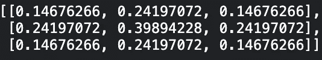

作者图片

请注意，当我们远离中心时，内核权重会减少。因此，当与这样的矩阵卷积时，图像位置将丢失来自周围像素的信息，导致平滑(模糊)。除了高斯，还有其他类型的[平滑内核](https://quincemedia.com/2017/10/04/9-types-of-blur-effects-in-after-effects/)。这里的要点是，模糊图像(B)是对原始图像(I)进行卷积(H)的结果。

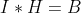

模糊图像方程

如果我们能以某种方式逆转这一操作，我们将能够生成原始图像(I)。这个过程称为**去卷积**，在频域(傅立叶变换)中更容易完成。

## 图像的傅立叶变换

傅立叶变换( **FT** )的思想是任何函数都可以近似为无限正弦曲线的加权和。一维正弦波需要 3 个参数来定义。

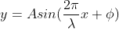

正弦方程

1.  振幅(A)决定了波的范围。它从-A，A 开始延伸
2.  频率(2π/λ)决定两个连续峰值之间的距离
3.  相位(φ)决定了波的水平移动

因此，傅立叶变换将函数从空间域转移到频率域。

```
def plot_sine_1D(amp,wavelength,phase):
    x = np.arange(-500, 501, 1)
    y = np.sin((2 * np.pi * x / wavelength)+phase)
    plt.plot(x, y)
    plt.show()
plot_sine_1D(1,300,0)
```

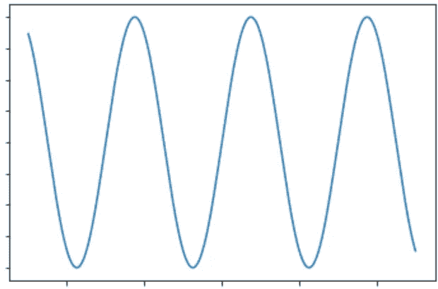

作者图片

任何图像都是二维离散函数。也就是说，像素是其空间位置的函数。

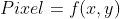

离散傅立叶变换将图像移动到频率空间，在那里它们由 2D 正弦波表示。

```
def plot_sine_2D(amp,wavelength,phase,angle):
    x = np.arange(-500, 501, 1)
    X, Y = np.meshgrid(x, x)
    wavelength = 100
    sine_2D = np.sin(
        2*np.pi*(X*np.cos(angle) + Y*np.sin(angle)) / wavelength
    )
    plt.set_cmap("gray")
    plt.imshow(sine_2D)
plot_sine_2D(1,200,0,np.pi)
```

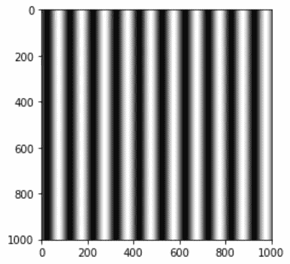

2D 正弦波

2D 正弦波也可以相对于 x，y 轴旋转。下面是旋转了π/6 弧度的同一个 2D 波。

```
plot_sine_2D(1,200,0,np.pi/6)
```


旋转正弦波

让我们设想一些傅立叶变换。我们使用 np.fft.fft2 来实现。该函数的第二行将像素 0，0 移动到图的中心，使可视化更容易。我们的数组大小为 1001，1001，因此中心移动到 500，500。同样，我们取绝对值，因为 FT 返回一个复数。

```
def compute_fft(f):
    ft = np.fft.fft2(f)
    ft = np.fft.fftshift(ft)
    return ft

sin = plot_sine_2D(1,200,0,np.pi,False)
ft = compute_fft(sin)
plt.xlim([480,520])
plt.ylim([520,480]) 
plt.imshow(abs(ft))
```

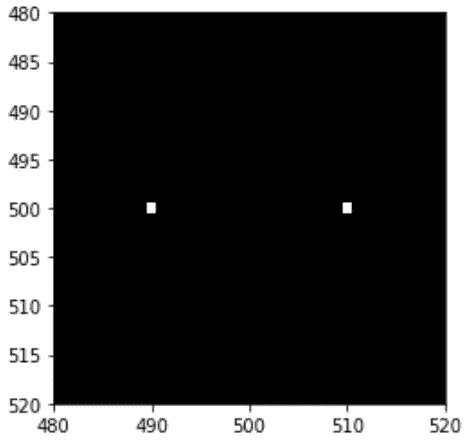

角度为π的正弦波英尺

```
sin = plot_sine_2D(1,200,0,np.pi/6,False)
ft = compute_fft(sin)
plt.xlim([480,520])
plt.ylim([520,480]) 
plt.imshow(abs(ft))
```

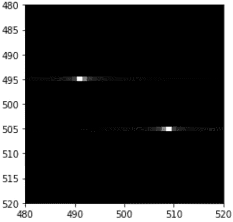

π/6 旋转的正弦波英尺

在第一个 FT 中，我们得到两个距离中心 10 个单位的点。离中心的距离代表频率。在第二个 FT 图中，我们得到了相同的两个点，但进行了旋转。旋转角度代表波的旋转(30 度)。两点处的像素值描述了振幅。相位信息编码在复数部分，我们不画出来。

```
f,ax = plt.subplots(1,2,figsize=(15,20))
ax = ax.flatten()
im = cv2.imread('/kaggle/input/randomimages/pic2.jpeg',-1)
im = cv2.cvtColor(im, cv2.COLOR_BGR2GRAY)
ax[0].imshow(im,cmap='gray')
ax[1].imshow(20*np.log(abs(compute_fft(im))),cmap='gray')
```

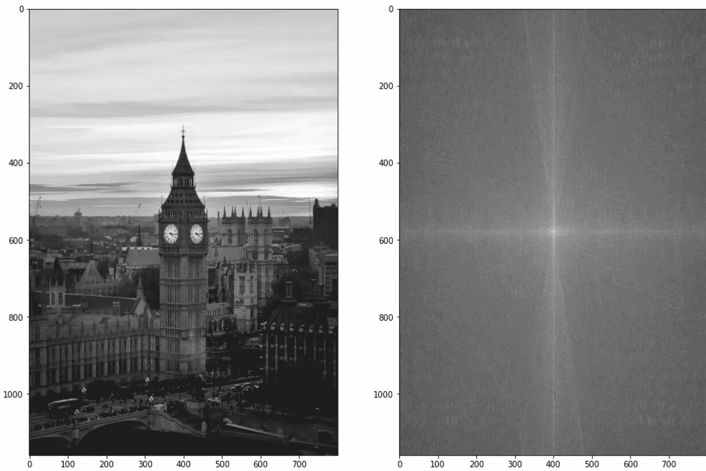

资料来源:联合国人类住区规划署

英尺的真实图像更难想象。我们在 FT 上进行对数运算，缩小数值，以图像形式绘制出来。

**使用傅立叶变换的反卷积**

我们已经对 FTs 大惊小怪了，但是它们对我们的情况有什么帮助呢？在频域中，卷积转换为乘法。因此，我们的等式变成了

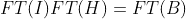

或者，

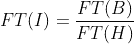

对 RHS 进行逆傅立叶变换应该会产生原始图像。但是等等，如何找到正确的平滑核(H)？根据模糊程度，你可以尝试不同的内核。现在让我们坚持使用高斯函数，并用代码实现它。

我们将读入一幅图像，并使用 sigma = 5(内核的标准偏差)的 7，7 高斯内核模糊它

```
# Plotting image and its blurred version
f,ax = plt.subplots(1,2,figsize=(15,20))
ax = ax.flatten()
im = cv2.imread('../input/randomimages/pic1.jpeg',-1)
im = cv2.cvtColor(im, cv2.COLOR_BGR2GRAY)
im_blur = cv2.GaussianBlur(im,(7,7), 5, 5)
ax[0].imshow(im,cmap='gray')
ax[1].imshow(im_blur,cmap='gray')
```

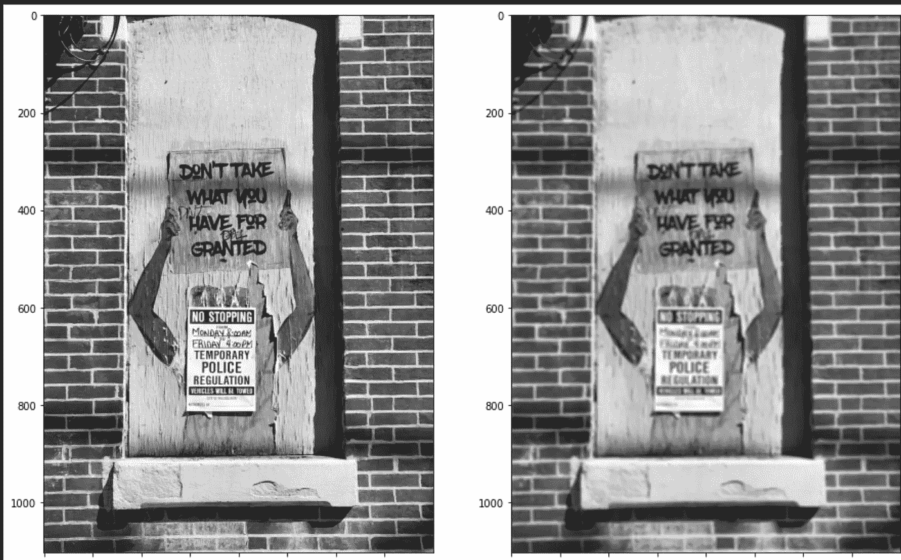

资料来源:联合国人类住区规划署

接下来，我们将定义两个函数。一个用于生成给定大小的高斯核，另一个用于获取模糊图像并使其变得清晰。

```
def gaussian_filter(kernel_size,img,sigma=1, muu=0):
    x, y = np.meshgrid(np.linspace(-1, 1, kernel_size),
                       np.linspace(-1, 1, kernel_size))
    dst = np.sqrt(x**2+y**2)
    normal = 1/(((2*np.pi)**0.5)*sigma)
    gauss = np.exp(-((dst-muu)**2 / (2.0 * sigma**2))) * normal
    gauss = np.pad(gauss, [(0, img.shape[0] - gauss.shape[0]), (0, img.shape[1] - gauss.shape[1])], 'constant')
    return gauss

def fft_deblur(img,kernel_size,kernel_sigma=5,factor='wiener',const=0.002):
    gauss = gaussian_filter(kernel_size,img,kernel_sigma)
    img_fft = np.fft.fft2(img)
    gauss_fft = np.fft.fft2(gauss)
    weiner_factor = 1 / (1+(const/np.abs(gauss_fft)**2))
    if factor!='wiener':
        weiner_factor = factor
    recon = img_fft/gauss_fft
    recon*=weiner_factor
    recon = np.abs(np.fft.ifft2(recon))
    return recon
```

让我们深入研究一下 fft_deblur 函数。

1.  我们生成一个给定大小和标准偏差的高斯滤波器。我们也用零填充它，这样它就和图像的形状匹配了。这对于计算频域中的除法是必要的
2.  计算模糊图像的傅立叶变换
3.  计算内核的傅立叶变换
4.  定义维纳因子。我们稍后会谈到这一点。现在，假设它是 1
5.  将重建定义为(3)和(4)的划分
6.  将(6)乘以(5)
7.  逆傅立叶变换(7)并计算其绝对值

让我们分析一下结果。

```
recon = fft_deblur(im_blur,7,5,factor=1)
plt.subplots(figsize=(10,8))
plt.imshow(recon,cmap='gray')
```

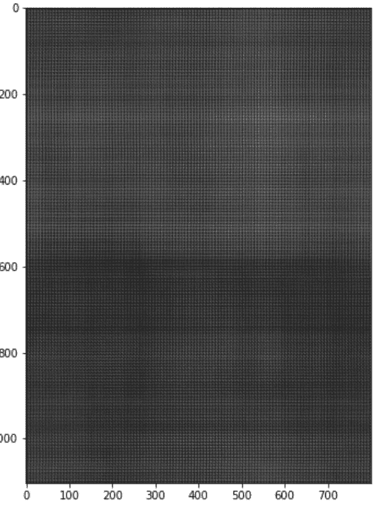

上述操作的结果

哎呀！这不起作用。之所以如此，是因为我们没有考虑到一个至关重要的因素——噪音。噪声可以从各种来源进入图像。因此，模糊图像等式修改为

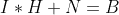

现在，在计算模糊图像(B)的傅立叶变换时，我们也隐含地计算噪声分量的傅立叶变换。噪声的傅立叶变换有很多高频值。

```
noise = np.random.rand(100,100)
noise_fft = np.fft.fft2(noise)
noise_fft = np.fft.fftshift(noise_fft)
f,ax = plt.subplots(1,2,figsize=(15,20))
ax = ax.flatten()
ax[0].imshow(noise,cmap='gray')
ax[0].set_title('Original Image')
ax[1].imshow(20*np.log(abs(compute_fft(noise_fft))),cmap='gray')
ax[1].set_title('Fourier Transform')
```

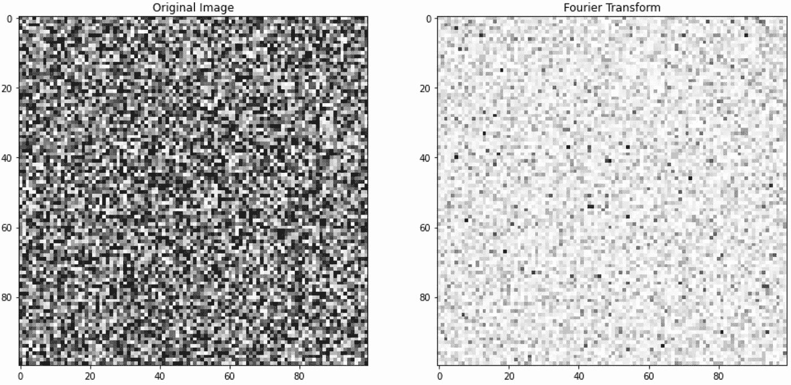

另一方面，平滑内核有很多低频值。正如你在下图中看到的，如果我们偏离中心，我们会进入一个主要是黑色的区域(0 像素)。它的原始图像也大部分是黑色的，因为我们用零填充了它。靠近左上方有一小块白色区域。

```
gauss = gaussian_filter(7,im,5)
gauss_fft = np.fft.fft2(gauss)
gauss_fft = np.fft.fftshift(gauss_fft)
f,ax = plt.subplots(1,2,figsize=(15,20))
ax = ax.flatten()
ax[0].imshow(gauss,cmap='gray')
ax[0].set_title('Original Image')
ax[1].imshow(np.abs(gauss_fft),cmap='gray')
ax[1].set_title('Fourier Transform')
```

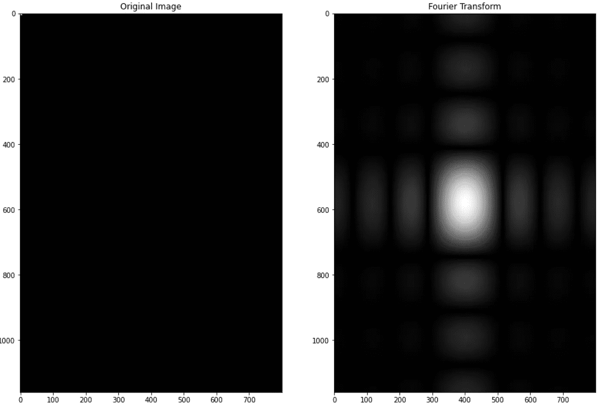

本质上，FT(B)中的高频值对应于噪声。当我们将其除以 FT(H)时，大部分由零组成，我们放大了噪声。因此，我们需要一个常客。香肠因素出现了。你可以在这里找到更多关于维纳滤波器的细节。我们可以用任何其他常数值代替 0.002。

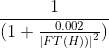

```
f,ax = plt.subplots(1,2,figsize=(15,20))
recon = fft_deblur(im_blur,7,5,factor='wiener')
ax[0].imshow(im_blur,cmap='gray')
ax[1].imshow(recon)
ax[0].set_title('Blurry Image')
ax[1].set_title('Image reconstruction')
plt.show()
```

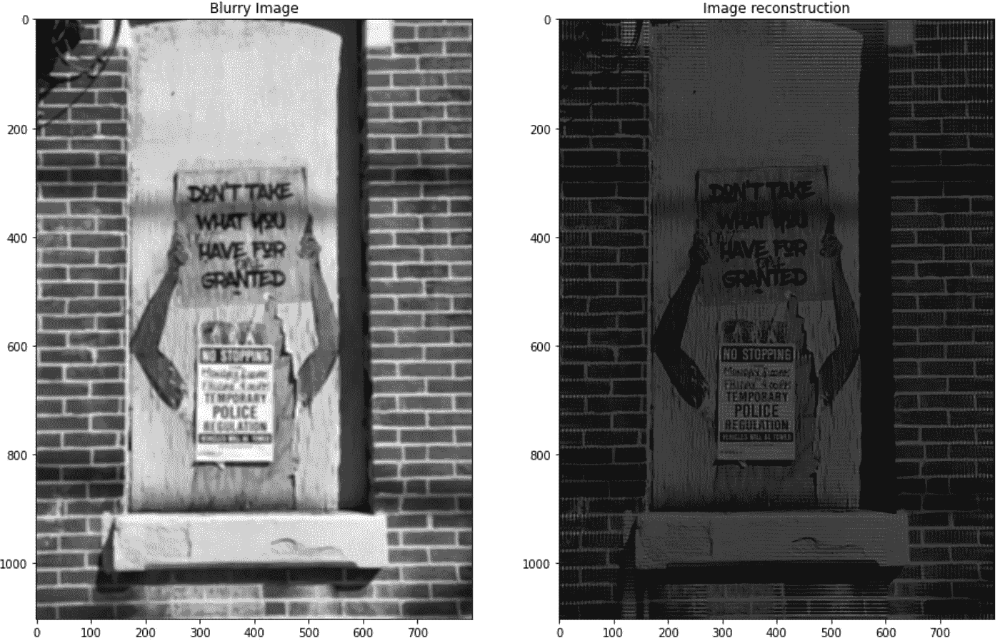

资料来源:联合国人类住区规划署

有了维纳因子，我们得到了更好的结果。我们现在可以用这个常数来得到更清晰的重建。

```
f,ax = plt.subplots(1,2,figsize=(15,20))
recon = fft_deblur(im_blur,7,5,factor='wiener',const=0.5)
ax[0].imshow(im_blur,cmap='gray')
ax[1].imshow(recon)
ax[0].set_title('Blurry Image')
ax[1].set_title('Image reconstruction')
plt.show()
```

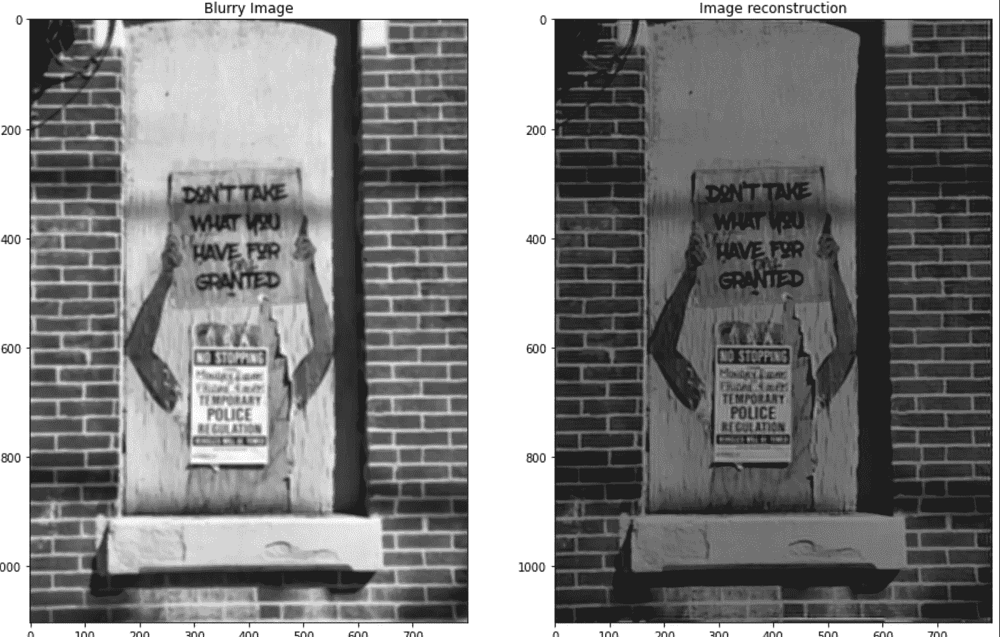

资料来源:联合国人类住区规划署

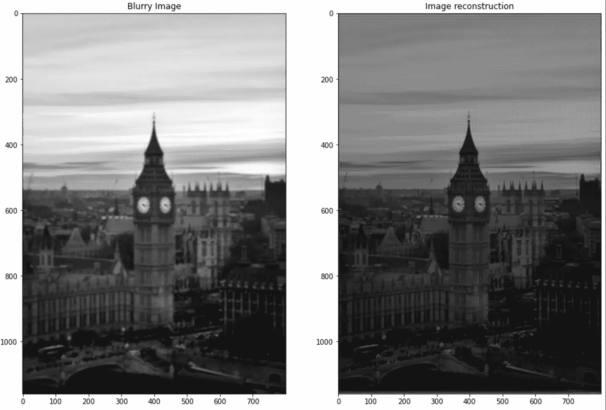

资料来源:联合国人类住区规划署

我们不能直接在 RGB 图像上操作 FT。为了消除 RGB 图像的模糊，我们可以在每个颜色维度上分别运行去模糊功能，然后将它们连接起来。

## 结论

这是一个关于如何使用傅立叶变换去模糊图像的简短指南。虽然去模糊本身是一种应用，但它也可以用作深度学习训练管道中的重要预处理步骤。对傅里叶变换的透彻理解将有助于从事视觉/信号科学的任何人。这是一个宏伟的算法，根据[真理](https://youtu.be/nmgFG7PUHfo)的说法，它改变了世界。

## 参考

[https://thepythoncodingbook . com/2021/08/30/2d-python 中的傅里叶变换和图像的傅里叶合成/](https://thepythoncodingbook.com/2021/08/30/2d-fourier-transform-in-python-and-fourier-synthesis-of-images/)