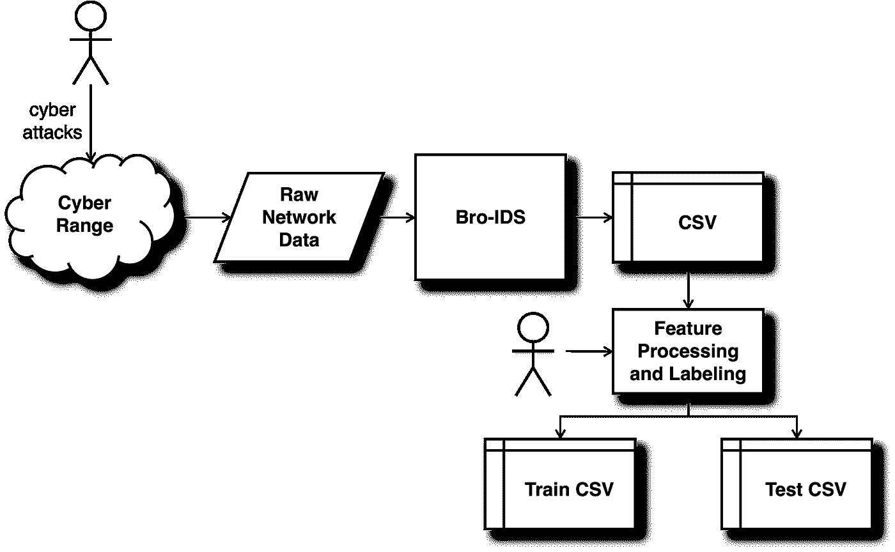
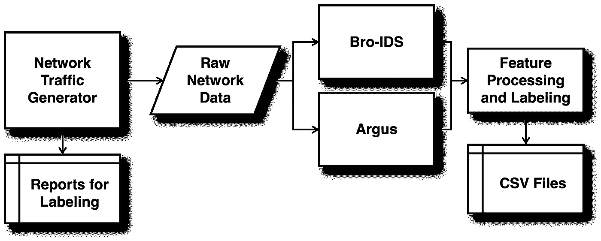

# 如何确定用于检测网络入侵的数据集

> 原文：<https://towardsdatascience.com/how-to-decide-on-a-dataset-for-detecting-cyber-attacks-c92e4f78e7a7>

## 选择正确入侵检测数据集的简史和标准

Alexander Schimmeck 在 [Unsplash](https://unsplash.com/s/photos/decision-sign?utm_source=unsplash&utm_medium=referral&utm_content=creditCopyText) 上的照片

你创造了一个惊人的机器学习算法。你采取了一种新颖的方法，应用了被证明是高度准确的技术。您的结果显示了非常高的真阳性率和非常低的假阳性率。你写一篇论文，阐述你的杰出成果，并提交给一个领先的学术会议。你期望这项研究将会受到好评，你将会收到许多对你的工作的引用。

经过漫长的同行评议过程，你终于得到了坏消息。你的论文没有被接受。发生了什么事？你的研究哪里出错了？当你阅读评论者的评论时，你会发现问题不在于你的科学方法。这不是你如何选择功能。这不是你的算法或者你如何计算你的结果。相反，它是你的数据集。

机器学习研究通常基于非常流行的数据集，研究社区已经普遍接受了它们。然而，如果您在过去二十年中参与了入侵检测研究，您可能会发现您的结果被拒绝发表或在发表后受到批评。

是什么让入侵检测数据集与众不同？本文探讨了机器学习对网络安全的挑战。它回顾了入侵检测数据集的短暂历史，探索了当前有用的数据集，概述了选择最佳数据集的标准，并探索了创建相关数据集的未来方向。

# 1999 年 KDD 杯——原版

第一个入侵检测数据集是为 DARPA 竞赛开发的，被称为 1999 年 KDD 杯[1]。它是使用 cyber range 创建的，cyber range 是一个小型网络，专门为网络安全专业人员创建，用于练习对现实目标的攻击。网络数据包数据是从网络范围捕获的，并使用一种称为 Bro-IDS 的入侵检测系统进行处理。结果是一组从原始网络数据中提取重要特征的 CSV 文件。研究人员处理了数据并添加了标签。

概述 1999 年 KDD 杯是如何产生的。图片作者。

KDD 杯 1999 数据集包括 490 万条连接记录。该数据包括四大类攻击。首先是拒绝服务攻击，这种攻击试图消耗计算机的资源并扰乱正常运行。第二种是用户到根攻击，即拥有用户级访问权限的个人试图提升其权限以获得管理员级访问权限。第三种是远程到本地攻击，这种攻击试图获得远程访问权限。第四，探测攻击，代表攻击者的侦察活动[2]。对正常记录和特定类型的攻击进行标记，使数据集非常适合有监督或无监督的机器学习。

从一开始，1999 年 KDD 杯就为入侵检测数据集设定了标准，因为它是唯一一个允许在不同研究人员之间推广研究的标准。此外，很少有研究人员愿意花时间捕获和标记数百万条记录，结果却让研究界质疑他们数据的质量或真实性。

随着时间的推移，对 1999 年 KDD 杯的批评开始浮出水面。第一个批评是，计算机和网络这些年来发生了变化，这使得 1999 年的数据集在 20 年后变得不那么相关。今天的计算机网络有更新的操作系统、不同的网络技术和改进的网络安全防御。

第二，KDD 杯 1999 年数据集因其许多重复记录而受到批评。复制真的是个问题吗？大多数计算机网络都以正常的节奏运行，因此入侵数据集也包含副本可能是现实的。对于拒绝服务数据来说尤其如此，当有正在进行的攻击时，这些数据看起来非常一致。然而，研究界鄙视重复，因为它会产生过度拟合的问题。

第三个批评是，由于记录的数量如此之多，研究人员通常只使用数据集的一个子集进行测试。随着每个研究人员对不同的子集进行采样，消除重复，并增强数据集，跨研究人员比较结果变得更加困难。

随着时间的推移，衍生产品被创造出来以应对一些批评。古里·KDD 使用了 1999 年 KDD 杯的原始数据，但加入了 DARPA 挑战赛的原始网络数据。包括网络有效载荷和报头数据提高了网络攻击的检测能力[3]。

NSL-KDD 的数据集采用了不同的方法。研究人员清理了 1999 年 KDD 杯的数据，而不是回到原始的网络数据。他们删除了冗余记录和重复记录，以实现更好的数据分布。古雷·KDD 和 NSL-KDD 仍然有一个根本性的问题——它们基于过时的计算机网络，不再适用。

LUT13 是使用与 1999 年 KDD 杯数据集相似的方法创建的。研究人员使用了一个带有现代计算机技术的试验台。他们收集了原始的网络数据包数据，并提取了一个新的特征集。该数据与 1999 年 KDD 杯的数据更相关，并且有所改进，但是没有被研究团体广泛采用。它没有成为入侵检测研究的标准。

尽管有这些改进的数据集，许多研究人员仍然专注于 1999 年 KDD 杯和 NSL-KDD 数据集。这些数据集的使用受到了挑战。会议论文被拒绝，出版物开始建立 1999 年 KDD 杯不再有效的先例。

# 什么是好的入侵数据集？

用于入侵检测研究的权威数据集可能很难找到。技术变化。威胁不断演变。数据集很快就会失去相关性。

一个好的入侵检测数据集应该基于完善的标准。研究人员已经公布了评估这些数据集的几个标准[5]。在选择数据集或创建新数据集时，请记住这些标准。

数据集应该是完整的，这意味着它们应该包括审计日志和原始网络数据。大多数审计日志包含关于网络攻击的不完整信息。用原始数据补充审计日志可以改进威胁检测。

入侵数据集应包括代表当前威胁形势的各种攻击类型。随着组织投资于网络安全防御，对手会调整他们的战术，这就造成了恶性循环的升级。因此，使用最近创建的数据集或使用可以适应和创建相关攻击的数据集生成器是很重要的。

数据集对于正常活动也需要是真实的。计算机网络可能非常庞大和复杂，因此包含来自小型测试平台的正常流量的数据集可能无法转移到真实的计算机网络。数据集应该包括终端用户工作站、服务器和网络拓扑的多样化选择。

标签尤其重要，但这可能是一项艰巨的任务。无论您使用的是监督学习还是非监督学习，表示基本事实的标注对于计算算法的准确性都是至关重要的。一些研究人员使用网络范围，在允许攻击者利用系统之前先收集正常流量。这允许他们首先创建正常流量的标签，然后标记攻击流量。其他研究人员将攻击数据流注入正常流量。还有一些要经过更费力的取样和人工标记。

隐私也很重要。组织中的计算机网络是最好和最可靠的数据来源。然而，组织不愿意提供详细的网络和审计日志，因为这可能会侵犯隐私。大多数研究人员远离捕捉实际的计算机网络流量。相反，他们专注于模拟数据和网络范围，以避免隐私问题。

数据集也需要被研究界广泛接受。如果没有社区的支持，数据集可能只能在少数研究项目中使用。如果您正在进行入侵检测研究，如果社区支持您的数据，您的结果会更容易被接受。

# 寻找更好的数据集

UNSW-NB15 已经成为一个较新的数据集，解决了一个好数据集的大部分标准。它创建于 2015 年，带有网络流量生成器，用于产生包括正常流量和模拟攻击流量的合成网络数据[6]。研究人员使用 Bro-IDS 处理原始网络数据，就像 1999 年 KDD 杯数据是如何创建的一样。他们还使用了一个名为 Argus 的附加安全工具来创建更丰富的功能。因为他们生成合成流量，所以他们使用网络流量生成器中的报告功能来导出标签。除了正常的流量之外，它们总共产生了九种不同类型的攻击。

概述 UNSW-NB15 是如何创建的。图片作者。

与优秀入侵检测数据集的标准相比，UNSW-NB15 同时拥有审计日志和原始网络数据。它有更完整的攻击手段。它包含了真实的网络活动，并且被很好地标记。因为它是合成数据，所以不存在隐私问题。完整的数据集甚至包括源和目标 IP 地址，这些地址通常被大多数组织视为过于敏感而不能公开。研究团体已经接受了 UNSW-NB15。因此，它出现在许多同行评议的出版物中。

# 未来方向

既然你理解了对 1999 年 KDD 杯数据集的批评，你可能想知道 UNSW-NB15 是否仍然相关。毕竟，自 2015 年以来，技术和网络攻击已经发生了变化。这个数据集会遭受与 1999 年 KDD 杯同样的命运吗？

未来的研究人员将继续处理为入侵检测寻找可接受的数据集的挑战。UNSW-NB15 的一个重要贡献是，研究人员开发了一种高效且公认的方法，用于创建真实的(尽管是合成的)入侵检测数据集。

较新的数据集正在出现，如 CICIDS2017，以及专门的数据集，如 Bot-IoT。如果您正在开始学习入侵检测的机器学习，请找到一个数据集:

*   包括审计日志和原始网络数据
*   包含各种现代攻击
*   代表真实多样的正常交通
*   被标记为
*   提供隐私保证
*   被社区所接受

花些时间为你的目标选择最好的数据集。更好的是，使用几个数据集来测试你的算法，看看你是否得到相同的结果。

## 参考

[1] S. Stolfo，W. Fan，W. Lee，A. Prodromidis 和 P. Chan,《欺诈和入侵检测的基于成本的建模》( 2000 年),美国国防高级研究计划局信息生存性会议和展览会议录

[2] M. Tavallaee，E. Bagheri，W. Lu 和 A. Ghorbani，对 KDD 杯 99 数据集的详细分析(2009 年)，2009 年 IEEE 安全和国防应用计算智能研讨会会议录

[3] I .佩罗娜、I .古鲁查加、o .阿伯雷茨、j .马丁、j .穆盖尔扎和 j .佩雷斯，改进网络流量中入侵检测的服务独立有效载荷分析(2008 年)，第七届澳大拉西亚数据挖掘会议记录

[4] V. Cao，V. Hoang 和 Q. Nguyen，为入侵检测系统建立数据集的方案(2013 年)，第三届世界信息和通信技术大会

[5] W. Haider，J. Hu，J. Slay，B. Turnbull 和 Y. Xie，基于模糊定性建模生成现实入侵检测系统数据集(2017)，网络与计算机应用杂志

[6] N. Moustafa 和 J. Slay，UNSW-NB15:网络入侵检测系统的综合数据集(2015)，军事通信和信息系统会议