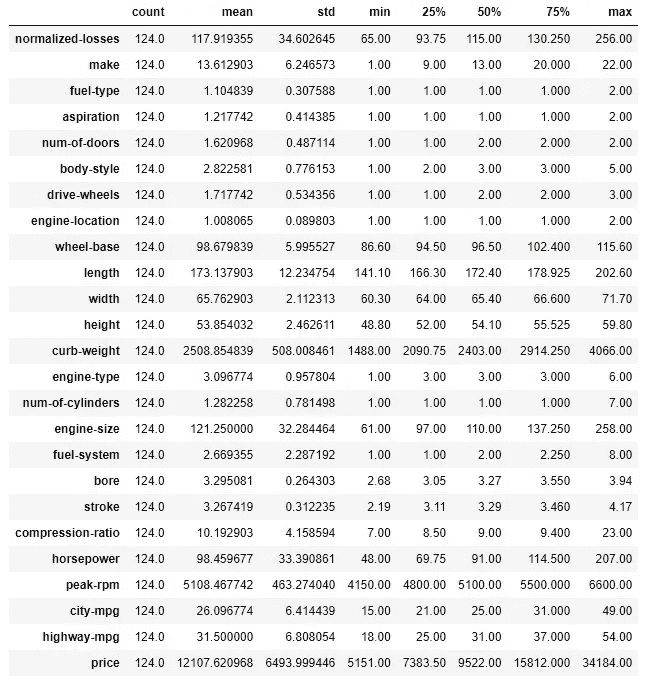

# 如何在 TensorFlow 中定义自定义图层、激活函数和损失函数

> 原文：<https://towardsdatascience.com/how-to-define-custom-layer-activation-function-and-loss-function-in-tensorflow-bdd7e78eb67>


[阿德里安·匡威](https://unsplash.com/@adrienconverse?utm_source=medium&utm_medium=referral)在 [Unsplash](https://unsplash.com?utm_source=medium&utm_medium=referral) 上的照片

## 一步一步的解释和完整代码的例子

我有几个关于 Tensorflow 的教程，其中一直使用内置损失函数和层。但是 Tensorflow 比这更有活力。它允许我们编写自己的自定义损失函数，并创建自己的自定义层。所以，在 Tensorflow 中制作高效模型的方法有很多。

最好的学习方法是边做边学。因此，我们将通过使用免费公共数据集的练习来学习，我在上一篇关于多输出模型的教程中使用了该数据集。

我假设你已经知道数据分析、数据清理和 Tensorflow 的基础知识。所以，我们会在开始的时候动作快一点。

## 数据处理

我将在本教程中使用的[开放公共数据集](https://opendatacommons.org/licenses/pddl/)相当干净。但是，一点点的清洁是必要的。

以下是数据集的链接:

[](https://datahub.io/machine-learning/autos#resource-autos)  

我已经根据需要清理了数据集。请随时从这里下载干净的数据集，以便跟进:

[](https://github.com/rashida048/Tensorflow/blob/main/auto_price.csv)  

我们开始吧。

首先在这里导入所有必需的包:

```
import numpy as np
import pandas as pdimport tensorflow as tf 
from tensorflow.keras import Sequential 
from tensorflow.keras.layers import Dense 
from tensorflow.keras.optimizers import Adam 
from tensorflow.keras import backend as K
from tensorflow.keras.layers import Layer
```

这是数据集:

```
df = pd.read_csv("auto_price.csv")
```

尽管我说过这是一个干净的数据集，但它仍然有两个不必要的列需要删除:

```
df = df.drop(columns=['Unnamed: 0', 'symboling'])
```

我们将把数据集分成三部分。一个用于培训，一个用于测试，一个用于验证。

```
from sklearn.model_selection import train_test_split
train, test = train_test_split(df, test_size=0.2, random_state=2)
train, val = train_test_split(train, test_size=0.2, random_state=23)
```

要使用 z 得分方法对训练数据进行规范化，我们需要知道所有训练特征的平均值和标准差。我是这样得到它的:

```
train_stats = train.describe()
train_stats= train_stats.transpose()
train_stats
```



还有额外的信息，但平均值和标准差也在那里。

该范数函数获取数据，并使用我们在上一步中获得的平均值和标准差对其进行归一化处理:

```
def norm(x):
    return (x - train_stats['mean']) / train_stats['std']
```

让我们标准化训练、测试和验证数据:

```
train_x = norm(train)
test_x = norm(test)
val_x = norm(val)
```

在本练习中，汽车的价格将用作目标变量，其余变量用作训练特征。

```
train_x = train_x.drop(columns='price')
test_x = test_x.drop(columns='price')
val_x=val_x.drop(columns='price')train_y = train['price']
test_y = test['price']
val_y = val['price']
```

训练和目标变量准备好了。

## 自定义损失和自定义图层

先说损失函数，大家都知道。这就是均方根误差。我们将它定义为一个函数，并在编译模型时传递该函数。

```
def rmse(y_true, y_pred):
    return K.sqrt(K.mean(K.square(y_pred - y_true)))
```

看起来很眼熟吧？让我们把这个函数放在手边，以备后用。你可以尝试许多其他种类的损失函数。

现在，转到自定义层。同样，我们将使用简单的线性公式 Y=WX+B 作为公式。该公式要求权重是 X 和偏差的系数(在公式中表示为“B”)。在您看到代码后，我会更详细地解释这一点:

```
class SimpleLinear(Layer):def __init__(self, units=64, activation=None):
        super(SimpleLinear, self).__init__()
        self.units = units
        self.activation=tf.keras.activations.get(activation)def weightsAndBias(self, input_shape):
        w_init = tf.random_normal_initializer()
        self.w = tf.Variable(name="kernel",
            initial_value=w_init(shape=(input_shape[-1], self.units),
                                 dtype='float32'),
            trainable=True)b_init = tf.zeros_initializer()
        self.b = tf.Variable(name="bias",
            initial_value=b_init(shape=(self.units,), dtype='float32'),
            trainable=True)def call(self, inputs):
        return self.activation(tf.matmul(inputs, self.w) + self.b)
```

在上面的代码中，我们从传递单元和激活作为参数开始。这里我使用的单位是 64，这意味着 64 个神经元。我们将最终在模型中指定不同数量的神经元。这里没有激活。我们也将在模型中使用激活。

在上面的“权重和偏差”中，我们初始化权重和偏差，其中权重初始化为随机数，偏差初始化为零。

在调用函数中，我们使用矩阵乘法(matmul 方法执行矩阵乘法)将输入和权重相乘，并添加偏差(记住公式 wx+b)

> 这是最基本的一条。请随意尝试一些非线性层，可能是二次或三次公式。

## 模型开发

模型开发是比较简单的部分。我们有 24 个变量作为训练特征。所以输入形状是(24，)。以下是完整的模型:

```
model = tf.keras.models.Sequential([
    tf.keras.layers.Flatten(input_shape=(24,)),
    SimpleLinear(512, activation='relu'),
    tf.keras.layers.Dropout(0.2),
    SimpleLinear(256, activation='relu'),
    SimpleLinear(128, activation='relu'),
    tf.keras.layers.Dense(1, activation='relu')
])
```

正如你所看到的，我们简单地称我们之前定义的简单线性方法为层。 **512、256 和 128 是单位，激活是“relu”**。

不过也可以使用自定义激活方法，这将在下一部分中介绍。

让我们编译模型并使用我们之前定义的损失函数“rmse ”:

```
model.compile(optimizer='adam',
              loss = rmse,
              metrics=tf.keras.metrics.RootMeanSquaredError())
h = model.fit(train_x, train_y, epochs=3)
model.evaluate(val_x, val_y)
```

输出:

```
Epoch 1/3
4/4 [==============================] - 0s 3ms/step - loss: 13684.0762 - root_mean_squared_error: 13726.8496
Epoch 2/3
4/4 [==============================] - 0s 3ms/step - loss: 13669.2314 - root_mean_squared_error: 13726.8496
Epoch 3/3
4/4 [==============================] - 0s 3ms/step - loss: 13537.3682 - root_mean_squared_error: 13726.8496
```

在下一部分中，我们将实验一些自定义的激活函数。

## 自定义激活功能

我将在这里解释使用自定义激活功能的两种方法。第一个是使用λ层。lambda 层定义了该层中的函数。

例如，在下面的模型中，lambda 层获取 SimpleLinear 方法的输出，并获取其绝对值，因此我们不会得到任何负值。

```
model = tf.keras.models.Sequential([
    tf.keras.layers.Flatten(input_shape=(24,)),
    SimpleLinear(512),
    tf.keras.layers.Lambda(lambda x: tf.abs(x)),
    tf.keras.layers.Dropout(0.2),
    SimpleLinear(256),
    tf.keras.layers.Lambda(lambda x: tf.abs(x)),
    tf.keras.layers.Dense(1),
    tf.keras.layers.Lambda(lambda x: tf.abs(x)),
])
```

请随意尝试 lambda 层中的任何其他类型的操作。

> 您不必在 lambda 层本身定义操作。它可以在函数中定义，并传递给 lambda 层。

这是一个获取数据并求平方的函数:

```
def active1(x):
    return x**2
```

现在，这个函数可以像这样简单地传递给 lambda 层:

```
model = tf.keras.models.Sequential([
    tf.keras.layers.Flatten(input_shape=(24,)),
    SimpleLinear(512),
    tf.keras.layers.Lambda(active1),
    tf.keras.layers.Dropout(0.2),
    SimpleLinear(256),
    tf.keras.layers.Lambda(active1),
    tf.keras.layers.Dense(1),
    tf.keras.layers.Lambda(active1),
])
```

根据您的项目和需求，可以使用许多其他不同的功能。

## 结论

Tensorflow 可以如此动态地使用。有很多不同的方法可以操纵它。在这篇文章中，我想分享一些让 Tensorflow 更加灵活的方法。我希望它是有帮助的，并且你在你自己的项目中尝试它。

欢迎在[推特](https://twitter.com/rashida048)上关注我，并喜欢我的[脸书](https://www.facebook.com/rashida.smith.161)页面。

## 更多阅读

[](/a-step-by-step-tutorial-to-develop-a-multi-output-model-in-tensorflow-ec9f13e5979c)  [](/regression-in-tensorflow-using-both-sequential-and-function-apis-314e74b537ca)  [](/what-is-a-recurrent-neural-network-and-implementation-of-simplernn-gru-and-lstm-models-in-keras-f7247e97c405)  [](/30-very-useful-pandas-functions-for-everyday-data-analysis-tasks-f1eae16409af)  [](/pivot-and-unpivot-functions-in-bigquery-for-better-data-manipulation-f0230295bd5e) 