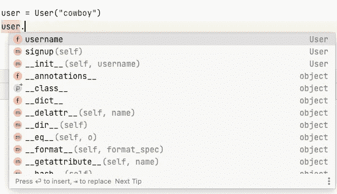
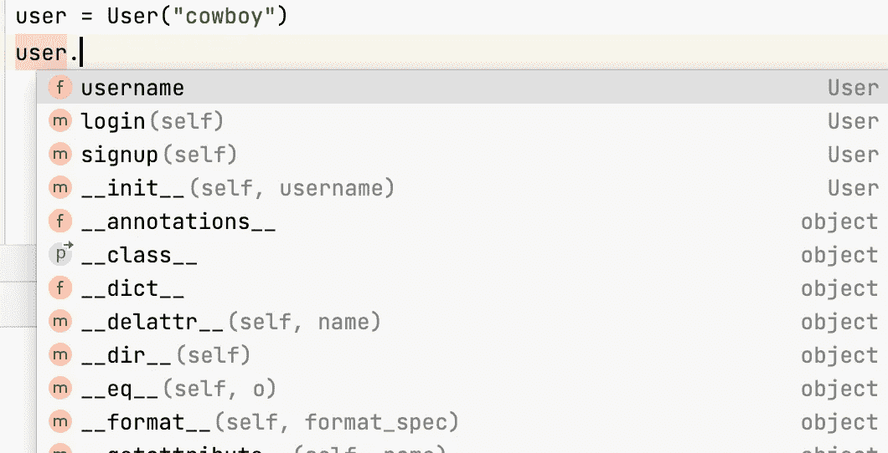
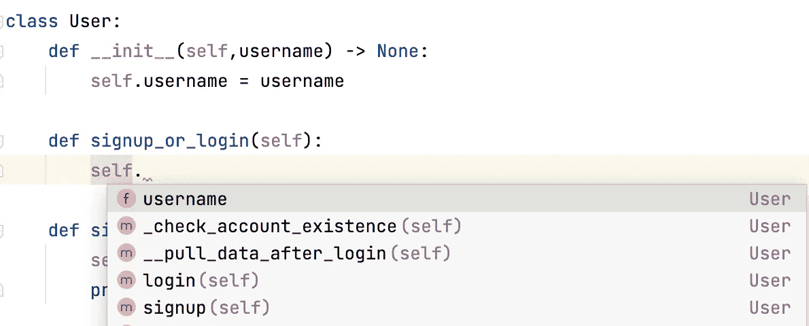

# 如何在 Python 类中定义非公共方法

> 原文：<https://towardsdatascience.com/how-to-define-nonpublic-methods-in-a-python-class-f477a1ddf3c0>

## 使用 Python 作为 OOP 的惯用方法


妮娜·梅尔卡多在 [Unsplash](https://unsplash.com?utm_source=medium&utm_medium=referral) 拍摄的照片

从本质上讲，Python 是一种面向对象的编程(OOP)语言，它围绕对象构建自己的特性。字符串是对象，自定义类的实例是对象，类、模块甚至包也是对象。OOP 编码中的一个长期原则是**封装**——在这种设计模式中，您公开用户需要的功能，同时隐藏用户不需要访问的实现细节。

对于任何项目，我们都定义了一系列定制类作为建模各种数据的基础。因此，一个好的项目意味着你定义了结构良好的定制类。当我们处理这些类时，我们应该应用封装技术。虽然我不认为我们应该把封装当作教条，但是您可以考虑两个特殊的封装特性来增加您项目的可维护性— **protected** **和** **private** 方法，它们旨在供内部使用。本文将向您展示如何做到这一点。

## 介绍

你们中的一些人可能知道，在一些 OOP 语言中，我们为封装保留了关键字，例如 protected、private 和 public，它们定义了如何在类外访问属性(或方法)。然而，Python 没有这些关键字，这是因为**严格来说，Python 类中定义的一切都是公共的。也就是说，如果你愿意，你可以访问一个类中的任何东西。**

尽管如此，Python 中仍然有一些封装约定。为了便于讨论，我们将使用通用 OOP 领域的术语。在访问级别控制方面，属性和方法没有区别。所以，我们只是用方法来演示相关的技术。

## 定义受保护的方法

我们可以在 Python 中定义受保护的属性。惯例是在方法名前使用下划线。让我们考虑下面的例子:

```
class User:
    def __init__(self,username) -> None:
        self.username = username def login(self):
        print(f"{self.username} just logged in.") def signup(self):
        self._check_account_existence()
        print(f"{self.username} just signed up an account.") def _check_account_existence(self):
        print(f"Checking if {self.username} has signed up already.")
```

在这个`User`类中，`signup`方法是公共的，而`_check_account_existence`方法是受保护的。因为这个方法不是公共的，所以当我们使用`User`类的实例时，它不包含在自动完成提示中:



自动完成提示不包括受保护的方法(作者截图)

如您所见，该列表只包括`signup`，而不包括`_check_account_existence`方法。值得注意的是，如果您确实调用了这个受保护的方法，您仍然可以这样做:

```
>>> user = User("cowboy")
>>> user._check_account_existence()
Checking if cowboy has signed up already.
```

原因是，正如我前面所说的，Python 对类的方法没有严格的访问控制，它只是一个约定，在方法名前面加上前缀以表明(不是 **enforce** )它是一个受保护的方法。

## 定义私有方法

另一种封装技术是关于定义私有方法的。您可以使用两个下划线作为方法名的前缀，而不是使用一个下划线，以表明它是一个私有方法。观察下面的例子:

```
class User:
    def __init__(self,username) -> None:
        self.username = username

    def signup(self):
        self._check_account_existence()
        print(f"{self.username} just signed up an account.")

    def _check_account_existence(self):
        print(f"Checking if {self.username} has signed up already.")

    def login(self):
        print(f"{self.username} just logged in.")
        self.__pull_data_after_login()

    def __pull_data_after_login(self):
        print(f"Pull additional data for the user: {self.username}")
```

在`User`类中，`__pull_data_after_login`是一个私有方法。同样，这个私有方法也不会进入自动完成提示列表。



自动完成提示不包括私有方法(作者截图)

我之前提到过，如果我们愿意，我们可以访问类外的非公共方法，并且我们看到我们可以使用受保护的方法。它也适用于私有方法吗？

```
>>> user = User("cowboy")
>>> user.__pull_data_after_login()
# AttributeError: 'User' object has no attribute '__pull_data_after_login'
```

错误是否意味着我们不能访问类外的私有方法？不完全是。访问类外的私有方法需要了解名称篡改的概念，如果从外部访问，私有方法会有一个被篡改的名称。具体来说，它有这个规律:`__private_method`->-T5。因此，我们可以这样访问`__pull_data_after_login`:

```
>>> user = User("cowboy")
>>> user._User__pull_data_after_login()
Pull additional data for the user: cowboy
```

## **使用非公开方法的好处**

从这些截图中，您可以看到，通过隐藏非公共(受保护的和私有的)方法，您正在帮助代码的用户提高编码效率，因为他们不需要担心选择一个他们无论如何都不应该使用的非公共方法。

值得注意的是，这些方法在类内部仍然可用。下图显示了自动完成提示理解这些非公共方法的可访问性。



对非公共方法的内部访问(作者截图)

封装只适用于类外的代码。当您在类内部工作时，如上图所示，我们仍然可以从自动完成提示列表中选择非公共方法。

## 受保护方法和私有方法之间的其他区别

当我们在它们各自的部分中介绍受保护的和私有的方法时，我们隐含地展示了受保护的和私有的方法之间的两个区别。

*   受保护的方法使用一个下划线作为前缀，而私有方法使用两个下划线作为前缀。
*   我们可以通过使用方法名直接在类外调用受保护的方法。然而，调用私有方法需要名字混淆。

除了 protected 和 private 方法之间的这两个明显区别之外，这两种方法之间的主要区别在于它们在子类中的可访问性。也就是说， **protected 方法在子类内是可访问的，而 private 方法在子类**内是不可访问的(虽然原因也是因为名字 mangling)。考虑下面的例子。

```
class Administrator(User):
    def admin_signup(self):
        super()._check_account_existence()

    def admin_login(self):
        super().__pull_data_after_login() >>> admin = Administrator("rodeo")>>> admin.admin_signup()
Checking if rodeo has signed up already.>>> admin.admin_login()
**# AttributeError**: 'super' object has no attribute '_Administrator__pull_data_after_login'
```

如上所示，在`Administrator`类中，我们使用超类的 protected 和 private 方法来定义`admin_signup`和`admin_login`。当我们使用这两种方法时，只有`admin_signup`有效，而`admin_login`无效。原因是私有方法使用当前类的名称自动触发名称篡改。尽管我们的目的是使用超类的私有方法，但它们在子类中并不容易获得。

因此，如果你想定义非公共方法，并且不想让它们在子类中被访问，你应该使用私有方法。否则，您应该使用受保护的方法，使它们可以在子类中访问。

## 结论

在本文中，我们回顾了在 Python 类中定义受保护方法和私有方法的技术。这些技术属于一个重要的 OOP 概念——封装。虽然 Python 不使用 protected 或 private 作为关键字，但是您应该遵守我们使用下划线作为这些非公共方法前缀的惯例。

如果你想了解更多关于 Python 的知识，可以考虑注册我的时事通讯邮件。如果你想系统地提高你的 Python 技能，请阅读我的新书[Python How-To](https://www.manning.com/books/python-how-to)Manning。