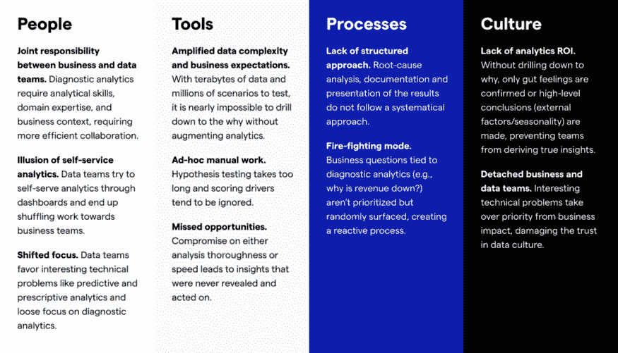

# 如何提供真正的数据驱动的洞察力

> 原文：<https://towardsdatascience.com/how-to-deliver-real-data-driven-insights-e94f2b386c18>

## 什么是真正的洞察力，如何发现它们，以及没有发现它们的代价

*合著*[*joo Sousa*](https://www.linkedin.com/in/joaoantoniosousa/)*成长总监 at*[*Kausa*](http://www.kausa.ai/)*和 [Umesh Ramakrishnan](https://medium.com/u/b616a9e7f441?source=post_page-----e94f2b386c18--------------------------------) *，数据经理 at*[*Traveloka*](https://www.traveloka.com/)*。**

*Freepik 上 pvproductions 的图片*

如今，每个人都在寻找真知灼见。阅读任何职位描述分析团队的使命是“产生洞察力”。但是这个任务很暧昧。首先，他们的角色是发现这些见解(即，进行深入分析并传达见解)还是仅仅让企业能够发现它们(即，构建大多数情况下不提供任何真正见解的仪表板)？

其次，洞察力的定义非常模糊，这个术语经常被误用。大多数人把观察称为洞察力。

因此，数据从业者常常对业务没有根据“生成的见解”采取行动感到沮丧。事实上，他们并没有分享真正的见解。这阻碍了团队交付真正的业务价值，浪费了数据和业务团队的时间，使得追求所谓的洞察力非常昂贵。

# **什么是洞察力？**

洞察力不仅仅是在数据中发现一些“有趣”的东西。在仪表板上显示正在发生的事情不是分享见解。在各种各样的描述中，我最喜欢的是布伦特·戴克斯的描述，它集中在三个标准上:

理解上的转变:不仅仅指出观察到的现象或不正常的现象，而且指出造成这种现象的原因

意想不到的原因:不是有意的，但令人惊讶的事情

**3)与您/利益相关者关心的事情一致:**与业务目标紧密一致

并将其归结为“我们理解事物的方式发生了意想不到的转变，从而激励我们采取行动。”

可悲的是，即使是可行的见解也会被浪费掉。所以我想补充第四个标准:

## 4)有效沟通

你的观众只有完全掌握了某样东西，才能付诸行动。否则，这种情况可能会让人想起一个哲学思想实验“如果一棵树倒在森林里，周围没有人听到它，它会发出声音吗？”

现在我们有了一个明确的最终目标，你如何能超越观察并提供真正的见解呢？

# 如何定期发掘洞察力

可行的见解始于一个为什么的问题，而不是什么。

你不会在仪表板或报告上找到任何见解。他们只是监控度量标准，并涵盖高层次的假设(即，通常的嫌疑人)。因此，你只是在测试重复出现的假设，而这些假设只是触及了表面。你需要利用所有可用的数据，而不是只关注一小部分。(查看这篇[文章](https://www.kausa.ai/blog/Six-bad-analytics-habits)，学习如何打破其他不良分析习惯。)

不知所措的分析师试图使用仪表盘深入分析，图片由 Freepik 上的 DCStudio 提供

关键在于诊断分析。理解业务指标为什么会变化以及是什么驱动了它们，这是提供真正洞察力的方法。首先询问您的关键业务指标的变化如何满足定义的 3 个标准:

*   *是什么导致了*业务指标的变化？
*   我们计划过会发生这种事吗？
*   它与我们的业务优先级相关吗？

揭示这些真正的见解需要深入探究原因，即试图利用所有可用数据并结合多个因素/维度和相关指标来找到更精细的见解。

# 现状

让我们用一个例子来说明这一点。假设你是一家电子商务公司的数据分析师，在过去的 3 周里，活跃用户群(即访问你的应用程序/网站的用户)没有增长。增长/营销部门对此表示担忧，并要求您进一步调查。

您知道指标(活跃用户群)及其趋势(即，过去 3 周持平)。我们听说大多数团队会首先检查数据的准确性…当您可以责怪数据质量时，通过挖掘数据的麻烦有什么乐趣呢？

## 观察

一旦你确认数据是准确的，是时候放下你的思考帽，想出一套假设了:

*   按国家和地区细分数字，以比较趋势
*   检查季节性——像学校假期甚至长周末这样的事件往往会产生前推效应
*   根据收购月份/渠道等进行群组分析(即新用户与现有用户的对比)

在花了大量时间后，你发现新用户数量(即下载量)下降了，这进一步导致活跃用户在过去几周内持平。
这很有趣，但不是一种洞见。它只是部分地回答了这个问题，业务团队没有任何具体的行动可以据此采取。你需要深入挖掘真正的洞察力。

## 真正的洞察力

经过头脑风暴，你已经确定了一些额外的假设，关于为什么新用户可能会下降。经过多次分析后，你发现在过去几周内，某个特定搜索词的转化率下降了。这是一个很好的发现，但仍不完整。为了缩小差距，你分析了 app/android 商店上的特定搜索词，发现你的竞争对手正在为这个词开展广告活动。竞争对手正在夺走你的产品。

是的——现在，您已经找到了一种对您的营销团队真正可行的见解。现在，他们可以反击这场运动，带回应用安装数量。

# 反应式方法的含义

你终于找到了洞察力。然而，这花了很长时间，而且你是在竞争对手发起新的广告活动后 1 个月才发现的。在上个月，您失去了许多活跃用户，这对业务绩效产生了重大影响。

> **实现数据价值最大化需要主动性。不采取行动，直到你观察到你的仪表板急剧下降，然后花几天时间进行根本原因分析可能会非常昂贵。**

理想情况下，数据团队不会等待增长/营销领导来询问为什么会出现这种情况，而是主动分享见解和建议。在这种情况下，可以更早采取行动，将损失降至最低，并迅速采取行动将结果转化为积极的业务影响。

# 为什么大多数团队没有发现真正的洞察力

最先进的数据团队主动跟踪指标并调查变化，以分享见解和建议。但是许多团队仍然是非常描述性的(例如，发生了什么)，只识别高层次的趋势，而忽略了诊断分析。正如我在文章“[诊断分析差距](https://www.kausa.ai/blog/diagnostic-analytics-gap)”中所探讨的，许多原因导致了这种情况。

诊断分析差距背后的 4 个要素(图片由 Kausa 提供)

# 如何缩小这一差距

弥合这一差距需要积极主动的“全面诊断分析”([详见文章](/the-diagnostic-analytics-gap-3f9d0a44e8f8))。关注哪里取决于每个元素(文化、人员、工具、流程)的起点。简而言之:

*   **文化**:提倡一种深入探究原因的数据文化，而不是停留在业务主导的高层次假设上(例如，典型的答案——这是季节性的，这是因为新的营销活动)。确保业务和数据利益相关方保持一致，以推动管理层参与的计划。
*   **人员**:将分析师嵌入业务团队，以发展业务和领域专长。促进数据和业务团队之间的紧密协作。创建对最重要用例/指标的共同理解，让分析师主动分享见解。
*   **工具**:考虑决策智能平台来增强现有工作流，以运行全面快速的分析，使团队能够主动了解指标变化，并分享数据驱动的见解和建议。
*   **流程**:回顾当前的诊断分析流程。确保团队有一致的方法和途径来执行根本原因分析。开发在数据和业务团队之间共享见解和建议的最佳实践。

**底线:**

*发现导致理解转变并与业务成果联系起来的意外原因的团队通过以下方式做到了这一点:*

*   *在业务和数据团队之间建立强大的协作*
*   *通过利用所有可用数据、综合考虑多个维度并考虑相关指标，深入探究原因*
*   *制定清晰的流程，说明如何传播这些见解并迅速采取行动。*

—

*想法？把手伸向* [*若昂索萨*](https://www.linkedin.com/in/joaoantoniosousa/)*[*成长总监考萨*](http://www.kausa.ai/)*或* [*乌米什罗摩克里希南*](https://medium.com/u/b616a9e7f441) *，数据经理*[*Traveloka*](https://www.traveloka.com/)*。我们希望收到您的来信。我们的目标是分享我们的集体经验，让数据团队能够产生更大的业务影响。**

**敬请关注更多关于如何增加数据商业价值的文章&分析。**

*Umesh Ramakrishnan 的说明:所表达的观点是我个人的，并不代表我目前的雇主(Traveloka)*

*—*

*参考资料:*

1.  *Brent Dykes，[洞察力素养:为什么我们需要澄清什么是真正的洞察力](https://www.forbes.com/sites/brentdykes/2022/03/08/insight-literacy-why-we-need-to-clarify-what-insights-really-are/) (2022)，Forbes.com*