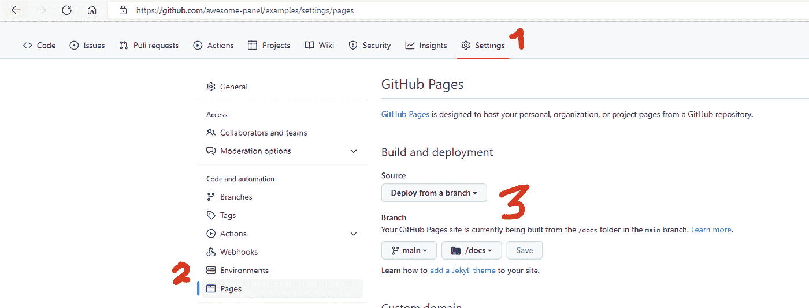
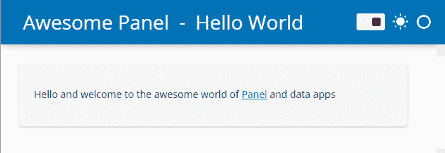
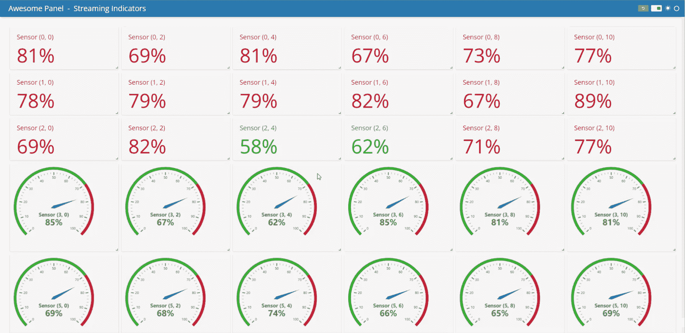

# 如何将面板可视化仪表板部署到 GitHub 页面

> 原文：<https://towardsdatascience.com/how-to-deploy-a-panel-visualization-dashboard-to-github-pages-2f520fd8660>

## 部署 Python 数据应用程序的最快方式

由马克·斯科夫·麦德森和索菲亚·杨拍摄

Python 工具使得构建可视化仪表板变得容易，但是在云中使用 Python 服务器来共享它们可能会很困难且昂贵。如果像将文件推送到 GitHub 页面一样简单，不需要运行服务器，会怎么样？现在是了！感谢 HoloViz 团队，特别是 [Philipp Rudiger](https://twitter.com/PhilippJFR) ，有了新的 [Panel 0.14 版本](https://blog.holoviz.org/panel_0.14.html)，你可以完全在你的浏览器中运行 Panel data 应用，不需要服务器！

这是目前在 Python 中部署应用程序的最快方式。这些应用程序在加载时性能非常好，因为服务器和客户端之间的通信没有延迟。

在 WebAssembly 中运行仪表板(通过 Pyodide 和 PyScript)是 Python 中 dataviz 的未来。

在本文中，我们将向您展示如何在 Github 页面上轻松部署 Panel 应用程序，并与全世界分享您的应用程序！

# **什么是面板？**

Panel 是开源 HoloViz 生态系统中的仪表板库，包括八个库:Panel、hvPlot、HoloViews、GeoViews、Datashader、Lumen、Param 和 Colorcet，由 Philipp Rudiger、Jim Bednar 和一个贡献者社区开发。查看我们之前关于[构建面板仪表盘的三种主要方法](/3-ways-to-build-a-panel-visualization-dashboard-6e14148f529d?sk=2cd93ae39586305bae8cfaead2bf7bb4)的博客文章，了解更多信息。

# **如何将面板可视化仪表盘部署到 GitHub 页面？**

*   **步骤 0:设置环境**

您需要安装最新版本的 Panel:

```
conda install panel hvplot -c pyviz
```

检查以确保您的面板至少是 0.14.0:

```
conda list panel
```

*   **第一步:将面板应用程序转换为 web assembly**

如果您有一个面板应用程序文件 app.py，您可以使用一行代码将现有的面板应用程序转换为 WebAssembly:

```
panel convert app.py --to pyodide-worker --out docs/app
```

步骤 1 将把你的代码写入一个 HTML 文件和一个 JS 文件。`pyodide-worker`被指定使用在单独线程中运行的 [Pyodide](https://pyodide.org/en/stable/) 来生成这两个文件，以提高性能。这两个文件都在 docs/文件夹下。底层技术是[web assembly](https://webassembly.org/)、 [Pyodide](https://pyodide.org/en/stable/) 和 [PyScript](https://pyscript.net/) 。查看[Panel web assembly 文档](https://panel.holoviz.org/user_guide/Running_in_Webassembly.html#formats)、[pyscript.net、](https://pyscript.net/)以及我们之前在 PyScript 上发布的[博客来了解更多信息。](https://anaconda.cloud/pyscript-python-in-the-browser)

*   **第二步:向 GitHub 添加文件**

```
git add docs/*git commitgit push
```

*   **第三步:设置 GitHub 页面**

将创建的文件添加到 GitHub 后，可以从 main /docs 在 GitHub 设置-页面-构建部署中配置 GitHub 页面。



# **一个 hello world 的例子**

代码:[https://github . com/awesome-panel/examples/blob/main/src/hello-world/app . py](https://github.com/awesome-panel/examples/blob/main/src/hello-world/app.py)

GitHub 页面:[https://awesome-panel . GitHub . io/examples/hello-world/app . html](https://awesome-panel.github.io/examples/hello-world/app.html)



在第一个 hello world 示例中，我们有一个简单的面板应用程序文件 [app.py](https://github.com/awesome-panel/examples/blob/main/src/hello-world/app.py) ，它使用面板模板并显示一个句子。

## 自己试一试:

*   叉本资源库:[https://github.com/awesome-panel/examples](https://github.com/awesome-panel/examples)
*   Git 克隆您的分叉存储库
*   设置 Conda 环境，并通过`conda install panel hvplot -v pyviz`安装最新的面板
*   你可以`panel convert`例如通过 WebAssembly 的 hello-world 应用程序

```
panel convert src/hello-world/app.py --to pyodide-worker --out docs/hello-world
```

*   上面的`panel convert`命令在 docs/hello-world 文件夹中创建了两个文件:app.html 和 app.js。将这两个文件都添加到 GitHub(按照上面的步骤 2)，并使用主分支和/docs 文件夹设置 GitHub 页面(参见上面的步骤 3)。几分钟后，你会看到这个应用出现在 [Github 页面](https://awesome-panel.github.io/examples/hello-world/app.html)(你会从自己的分叉回购中获得一个新的 Github 页面链接)。

## 可选步骤:

*   要在本地提供 Panel 应用程序，您可以通过`panel serve src/hello-world/app.py -autoload`在 Panel 服务器上提供 hello-world 应用程序。将于 [http://localhost:5006/app 发售。](http://localhost:5006/app.)
*   在 panel convert 步骤中，如果你想避免一遍又一遍地重复大下载，你甚至可以转换成可以安装在笔记本电脑上的渐进式 web 应用程序！它就像添加— pwa 和— title 标志一样简单。
*   在本地提供 WebAssembly 应用程序:

```
python3 -m http.server
```

该应用程序现已在[http://localhost:8000/docs/hello-world/app . html](http://localhost:8000/docs/hello-world/app.html)上发布

# **交互式数据框架仪表板示例**

代码:[https://github.com/sophiamyang/hvplot_interactive](https://github.com/sophiamyang/hvplot_interactive)

GitHub 页面:

[https://sophiamyang . github . io/HV plot _ interactive/HV plot _ interactive . html](https://sophiamyang.github.io/hvplot_interactive/hvplot_interactive.html)


之前，我们发布了一篇详细的[博文](/the-easiest-way-to-create-an-interactive-dashboard-in-python-77440f2511d1?sk=e1ea8c40c090cdbe7689333267f73b25)和一个[视频教程](https://www.youtube.com/watch?v=tNAFtyjDPsI)，讲述了用 Python 创建交互式仪表盘的最简单方法。通过类似的步骤，我们可以将这个应用程序转换为 WebAssembly，并将其部署在 Github 页面上。

请注意，Panel 应用程序文件可以是. py 文件或. ipynb 笔记本文件。在这个例子中，我们的面板应用程序文件是[HV plot _ interactive . ipynb](https://github.com/sophiamyang/hvplot_interactive/blob/main/hvplot_interactive.ipynb)。

要将此应用程序部署到 Github 页面:

*   我们使用`panel convert`将这个应用程序转换为 WebAssembly

```
panel convert hvplot_interactive.ipynb --to pyodide-worker --out docs
```

*   然后，我们按照本文开头的步骤 2 将创建的文件添加到 Github。
*   最后，我们按照步骤 3 来设置 GitHub 页面。

然后我们可以在 [Github 页面](https://sophiamyang.github.io/hvplot_interactive/hvplot_interactive/hvplot_interactive)上找到我们的应用。

# **流媒体仪表盘示例**

代码:[https://github . com/awesome-panel/examples/blob/main/src/streaming-indicators/app . py](https://github.com/awesome-panel/examples/blob/main/src/streaming-indicators/app.py)

Github 页面:[https://awesome-panel . github . io/examples/streaming-indicators/app . html](https://awesome-panel.github.io/examples/streaming-indicators/app.html)



通过同样的步骤，我们甚至可以在 GitHub 页面上部署一个实时流仪表板！

# **您可以从哪里了解更多信息？**

*   查看新的[面板 0.14.0 发行说明](https://blog.holoviz.org/panel_0.14.html)
*   查看官方文件:holoviz.org、panel.holoviz.org 和 hvplot.holoviz.org。
*   去 https://awesome-panel.org/[找找灵感。](https://awesome-panel.org/)

希望这篇文章对你有帮助！如果你有问题或者想联系其他 HoloViz 用户，请查看 https://discourse.holoviz.org/。

# **鸣谢:**

感谢 Jim Bednar 和 Phillipp Rudiger 的指导和反馈！

# **参考文献:**

*   [https://blog.holoviz.org/panel_0.14.html](https://blog.holoviz.org/panel_0.14.html)
*   [https://panel . holo viz . org/user _ guide/Running _ in _ web assembly . html # formats](https://panel.holoviz.org/user_guide/Running_in_Webassembly.html#formats)
*   [构建面板可视化仪表板的 3 种方式](/3-ways-to-build-a-panel-visualization-dashboard-6e14148f529d?sk=2cd93ae39586305bae8cfaead2bf7bb4)
*   [https://holoviz.org/](https://holoviz.org/)
*   [https://panel.holoviz.org/](https://panel.holoviz.org/)
*   [https://holoviews.org](https://holoviews.org/)
*   [https://hvplot.holoviz.org/](https://hvplot.holoviz.org/)
*   [https://anaconda.cloud/dashboardlandscape](https://anaconda.cloud/dashboardlandscape)
*   [https://anaconda.cloud/easiest-interactive-dashboard](https://anaconda.cloud/easiest-interactive-dashboard)

. . .

由[马克·斯科夫·麦德森](https://twitter.com/MarcSkovMadsen)和[索菲亚·杨](https://twitter.com/sophiamyang)于 2022 年 10 月 6 日。

Sophia Yang 是 Anaconda 的高级数据科学家。在 [LinkedIn](https://www.linkedin.com/in/sophiamyang/) 、 [Twitter](https://twitter.com/sophiamyang) 和 [YouTube](https://www.youtube.com/SophiaYangDS) 上与我联系，并加入 ds/ml[❤️读书俱乐部](https://discord.com/invite/6BremEf9db)