# 如何将 Scikit-Learn 模型部署到 Azure 容器实例

> 原文：<https://towardsdatascience.com/how-to-deploy-scikit-learn-models-to-azure-container-instances-a0a59d0d07a1>

## *使用 Azure 容器实例生产您的 Scikit-Learn 模型*

# 1.介绍

现在你已经训练了你的 scikit-learn 模型，下一步是什么？如何将它作为 API 提供给下游应用程序？在本文中，我们将研究如何使用 MLFlow、Azure 机器学习和 Azure 容器实例将 scikit-learn 模型作为 API 进行训练和部署。以下是我们将使用的服务的简要描述。


由 [SpaceX](https://unsplash.com/@spacex?utm_source=medium&utm_medium=referral) 在 [Unsplash](https://unsplash.com?utm_source=medium&utm_medium=referral) 上拍摄的照片

**什么是 MLFlow？**

**ML flow**【1】是一个管理 ML 生命周期的开源平台，包括实验、可复制性、部署和中央模型注册。MLFlow 提供 4 种不同的组件:

1.  **MLFlow Tracking:** 记录和查询实验:代码、数据、配置和结果
2.  **MLFlow 项目:**将数据科学代码打包成可在任何平台上运行的格式
3.  **MLFlow 模型:**在不同的服务环境中部署机器学习模型
4.  **模型注册:**在中央存储库中存储、注释、发现和管理模型

我们将使用 MLFlow 跟踪功能来记录机器学习实验的参数、结果和工件。

**什么是 Azure 机器学习？**

Azure 机器学习 [2]是微软 Azure 云计算平台的一部分，帮助数据科学家和工程师管理他们的机器学习工作流程。

**什么是 Azure 容器实例？**

**Azure Container Instances(ACI)**[3]是微软 Azure 的托管服务，它允许我们运行负载平衡的容器化服务，并具有带 REST API 的 HTTP 端点。

# 2.安装 Azure

## Azure 帐户

我们将使用 Azure ML 和 ACI，因此 Azure 帐户是强制性的。注册一个免费的 Azure 帐户，如果你是新用户，头 30 天可以获得 200 美元的信用点数。

## Azure 机器学习工作区

> 工作区[4]是 Azure 机器学习的顶级资源，提供了一个集中的地方来处理您在使用 Azure 机器学习时创建的所有工件。工作区保存了所有训练运行的历史，包括日志、指标、输出和脚本的快照。您可以使用这些信息来确定哪一次训练能够产生最佳模型。

资源组是创建 Azure 机器学习工作空间的先决条件。

**1。创建资源组**

> *资源组是保存 Azure 解决方案相关资源的容器。*

*   转到[https://portal.azure.com/](https://portal.azure.com/)
*   在 Azure Services 下或通过搜索栏找到“资源组”

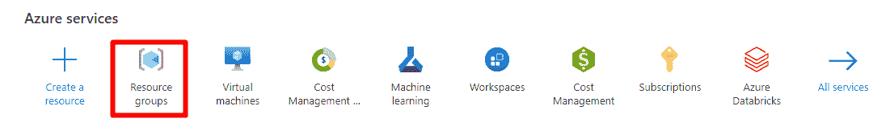

作者图片

*   创建新的资源组

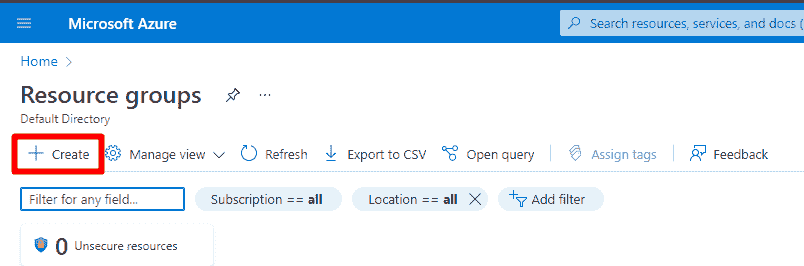

作者图片

*   填写详细信息，如订阅、资源组名称和区域

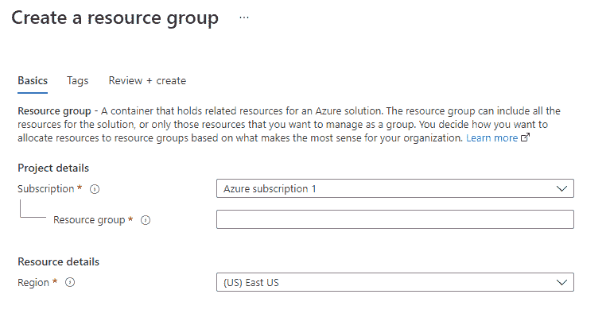

作者图片

**2。创建 Azure ML 工作区**

*   在 Azure Services 下或者通过搜索栏找到“机器学习”。

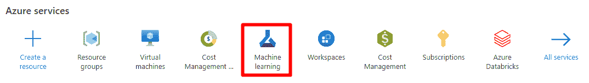

作者图片

*   点击创建

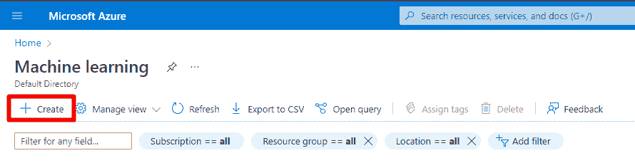

作者图片

*   填空。资源组是我们在上一步中创建的。

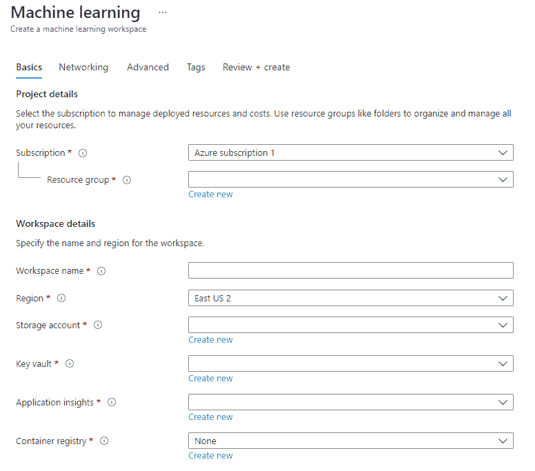

作者图片

*   MLFlow 跟踪服务器是作为 Azure ML 工作区的一部分自动创建的

# 3.设置培训环境

## **IDE**

我使用的是 Visual Studio 代码，但是你可以使用任何你选择的 IDE

## **康达环境**

确保您的机器上安装了 miniconda3。从命令行界面创建 python 3.7 conda 环境。环境名是任意的，我将其命名为`general`。

```
#command line 
conda create -n general python=3.7
```

激活康达环境。我们将在这种环境下进行所有的开发工作。

```
#command line
conda activate general
```

安装必要的软件包

```
azureml-core==1.39
pandas==1.3.5
scikit-learn==0.23.2
cloudpickle==2.0.0
psutil==5.9.0
mlflow==1.24.0
```

## 码头工人

您的本地机器上需要 Docker，因为我们将在本地部署 webservice 作为 docker 容器，以便在将其部署到 Azure 容器实例之前进行调试。

## **Azure 机器学习工作区配置**

下载 Azure 机器学习工作区配置。

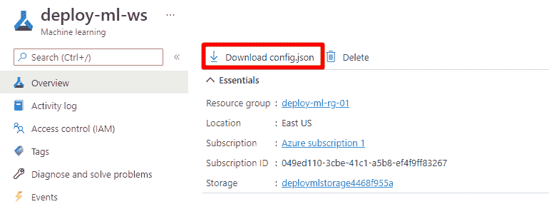

作者图片

配置文件采用 JSON 格式，包含以下信息:

```
# config.json{
    "subscription_id": "your-subscription-id",
    "resource_group": "your-resource-group-name",
    "workspace_name": "your-workspace-name"
}
```

我们将需要这些信息来连接到 AML workspace 以记录实验。

## **项目结构**

这些是项目文件夹中的笔记本和脚本。我们将在下一节中逐一介绍。

*   `train.ipynb`:实验的预处理、训练和记录
*   `register_model.ipynb`:向 Azure ML 注册模型和环境
*   `test_inference.ipynb`:调用带有样本数据的 web 服务(本地或 ACI)进行测试
*   `local_deploy.ipynb`:使用 Docker 在本地部署模型
*   `aci_deploy.ipynb`:模型部署到 ACI
*   `score.py`:用于推理的模型的输入脚本
*   `conda.yaml`:包含创建推理环境的依赖关系

# 4.项目演练

该示例带我们完成了以下步骤:

*   在本地训练 scikit-learn 模型
*   在 Azure 机器学习上跟踪 MLFlow 的 scikit-learn 实验
*   在 Azure 机器学习上注册模型
*   将模型作为本地 web 服务进行部署和测试
*   将模型作为 ACI 服务进行部署和测试

我们将使用来自国家糖尿病、消化和肾脏疾病研究所的 Pima 印度糖尿病数据集[5]。数据集的目的是基于数据集中包含的某些诊断测量结果，诊断性地预测患者是否患有糖尿病。数据集由几个医学预测变量和一个二元目标变量`Outcome`组成。预测变量包括患者的怀孕次数、身体质量指数、胰岛素水平、年龄等。

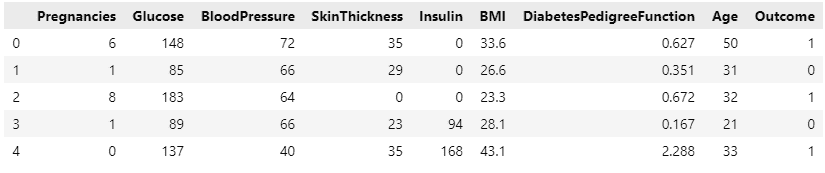

作者图片

## 4.1.培训 sci kit-学习模型

本节中的所有代码都在`train.ipynb`中。

**导入包**

```
import mlflow
from azureml.core import Workspace
import pandas as pd
import numpy as np
from sklearn.ensemble import RandomForestClassifier
from sklearn.model_selection import GridSearchCV, train_test_split
from sklearn.pipeline import Pipeline
from sklearn.preprocessing import FunctionTransformer
from sklearn.impute import SimpleImputer
```

**设置工作空间**

```
ws = Workspace.from_config()
```

运行此单元后，您可能会得到一个 URL 来执行 web 身份验证。这是连接到 Azure 机器学习工作区所必需的。完成后，您可以返回 IDE 并继续下一步。

**设置跟踪 URI**

MLFlow 跟踪 URI 是我们可以找到 MLFlow 跟踪服务器的地址。我们设置跟踪 URI 来让 MLFlow 知道在哪里记录实验。

```
mlflow.set_tracking_uri(ws.get_mlflow_tracking_uri())
```

跟踪 URI 的格式如下

```
azureml://<region>.api.azureml.ms/mlflow/v1.0/subscriptions/<subscription-id>/resourceGroups/<resource-group>/providers/Microsoft.MachineLearningServices/workspaces/<aml-workspace>?
```

**设置 MLFlow 实验**

下面的代码定义了 MLFlow 实验的名称。MLFlow 实验是组织不同运行的一种方式。一个实验包含多次运行，每次运行都是训练代码的一次执行。我们可以为每次运行定义要存储的参数、结果和工件。如果实验名称不存在，将创建一个新的实验，否则它会将运行记录到同名的现有实验中。

```
experiment_name = 'diabetes-sklearn'
mlflow.set_experiment(experiment_name)
```

**加载数据集**

```
input_path = 'path\\to\\data.csv'df = pd.read_csv(input_path, sep = ',')y = df.pop('Outcome')
X = dfX_train, X_test, y_train, y_test = train_test_split(X, y)
```

**预处理**

```
def change_type(x): x = x.copy()
    for col in ['Pregnancies', 'Glucose', 'BloodPressure', 'SkinThickness', 'Insulin', 'Age']:
        x[col] = x[col].astype('float') return xdef replace_zeros(x): x = x.copy()
    x[['Glucose','BloodPressure','SkinThickness','Insulin','BMI']] = x[['Glucose','BloodPressure','SkinThickness','Insulin','BMI']].replace(0,np.NaN) return xft_change_type = FunctionTransformer(change_type)
ft_replace_zeros = FunctionTransformer(replace_zeros)
num_imputer = SimpleImputer()
```

我们创建了两个 scikit-learn `FunctionTransformer`，用于将所选列的数据类型更改为 float，并用 NaN 替换零值。

**创建一个 scikit-learn 管道**

```
rf_clf = RandomForestClassifier()
pipe = Pipeline([('change_type', ft_change_type), ('replace_zeros', ft_replace_zeros), ('fillna', num_imputer), ('clf', rf_clf)])
```

**超参数调谐**

```
mlflow.sklearn.autolog(max_tuning_runs=None)param_grid = {'clf__n_estimators': [10,20,30], 'clf__max_depth':[2,7,10]}clf = GridSearchCV(pipe, param_grid = param_grid, scoring = ['roc_auc', 'precision', 'recall', 'f1', 'accuracy'], refit = 'roc_auc')
clf.fit(X_train, y_train)
```

记录的结果可以在 Azure ML 实验中找到。

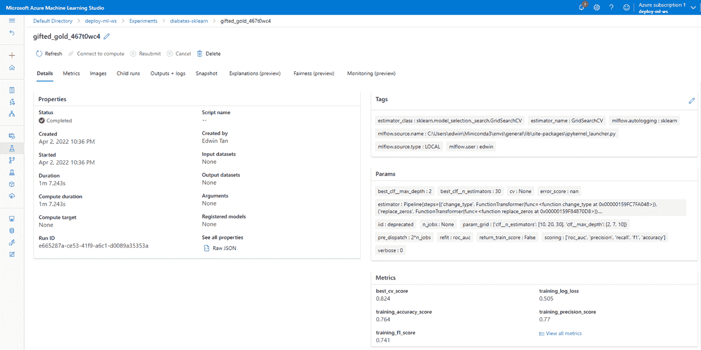

作者图片

最佳模型的模型工件和`run_id`可以在`Outputs + logs`选项卡中找到。

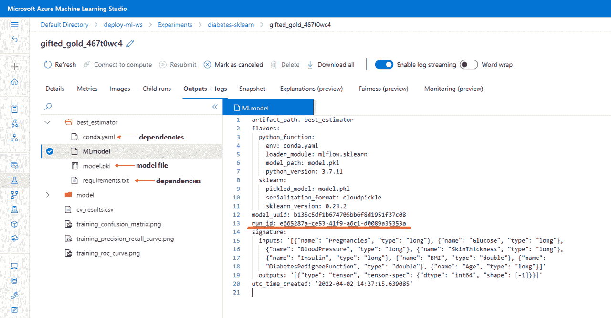

作者图片

*   `model.pkl`是包含 scikit-learn 模型对象的文件。这个模型的文件路径是`best_estimator/model.pkl`,我们将在下一步中需要模型注册的路径。
*   `conda.yaml`和`requirements.txt`包含训练模型所需的 conda 和 pip 包。
*   `run_id`:ml flow 运行的唯一标识符。我们将在下一步中使用它来检索模型文件。

## 4.2.注册模型

将模型注册到 Azure Machine Learning 的模型注册中心的目的是让用户能够通过模型版本控制来跟踪模型的变化。以下代码写在`register_model.ipynb`笔记本上。

**检索实验**

我们通过定义工作区和实验名称从工作区中检索实验。

```
from azureml.core import Experiment, Workspaceexperiment_name = 'diabetes-sklearn'ws = Workspace.from_config()
experiment = Experiment(ws, experiment_name)
```

**检索运行**

使用上一节中获得的`run_id`从实验中检索运行。

```
run_id = 'e665287a-ce53-41f9-a6c1-d0089a35353a'
run = [r for r in experiment.get_runs() if r.id == run_id][0]
```

**注册型号**

```
model = run.register_model(model_name = 'diabetes_model', model_path = 'best_estimator/model.pkl')
```

*   `model_name`:赋予注册型号的任意名称
*   `model_path`:到`model.pkl`文件的路径

我们可以在 Azure 机器学习的“模型”选项卡中找到注册的模型。将模型文件注册到相同的模型名称会创建不同版本的模型。


作者图片

我们可以通过单击模型名称来查看模型的最新版本的详细信息。详细信息包括生成模型的实验名称和运行 id，这对于维护数据链非常有用。

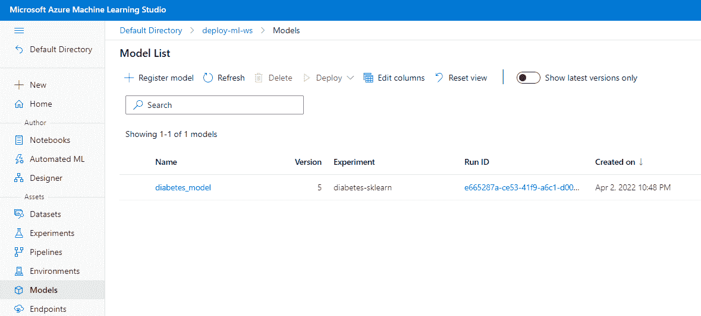

作者图片

## 4.3.创建评分脚本

通常称为`score.py`的评分脚本在推理过程中用作模型的入口点。

`score.py`由两个强制功能组成:

1.  `init()`:将模型作为全局变量加载
2.  `run()`:通过`data`参数
    接收待评分的新数据 a .对新数据进行预处理
    b .对新数据进行预测
    c .对预测进行后处理
    d .返回预测结果

```
# score.pyimport json
import os
import joblib
import pandas as pddef init():
    global model
    model_path = os.path.join(os.getenv('AZUREML_MODEL_DIR'), 'model.pkl')
    model = joblib.load(model_path)def run(data):
    test_data = pd.DataFrame(json.loads(json.loads(data)['input']))
    proba = model.predict_proba(test_data)[:,-1].tolist()
    return json.dumps({'proba':proba})
```

## 4.4.本地部署

在本节中，我们将在部署到 ACI 之前在本地调试 webservice。代码写在`local_deploy.ipynb`中。

**定义工作空间**

```
from azureml.core import Workspace
ws = Workspace.from_config()
```

**检索模型**

通过定义工作空间、模型名称和模型版本来检索注册的模型。

```
from azureml.core.model import Model
model = Model(ws, 'diabetes_model', version=5)
```

**创建自定义推理环境**

在训练模型时，我们已经将环境依赖性作为一个`conda.yaml`文件记录到 MLFlow 中。我们将使用这个文件来创建一个定制的推理环境。

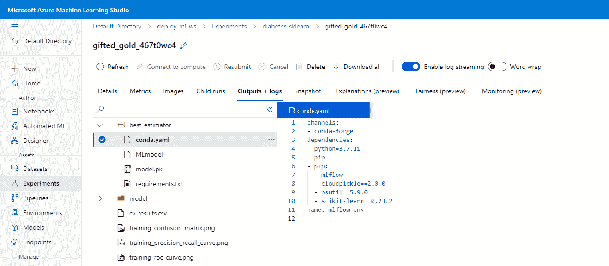

作者图片

将`conda.yaml`文件下载到您的项目文件夹中，并在`pip`依赖项下添加`azureml-defaults`以及推理过程中需要的任何其他依赖项。下面是`conda.yaml`现在的样子。

```
# conda.yamlchannels:
- conda-forge
dependencies:
- python=3.7.11
- pip
- pip:
  - mlflow
  - cloudpickle==2.0.0
  - psutil==5.9.0
  - scikit-learn==0.23.2
  **- pandas==1.3.5
  - azureml-defaults**
name: mlflow-env
```

接下来，我们用来自`conda.yaml`文件的依赖项创建一个名为`diabetes-env`的 Azure ML 环境，并将其注册到 Azure ML Workspace。

```
from azureml.core import Environment
env = Environment.from_conda_specification(name='diabetes-env', file_path="./conda.yaml")
env.register(ws)
```

我们可以在“自定义环境”下的 Azure 机器学习“环境”选项卡中查看注册的环境。

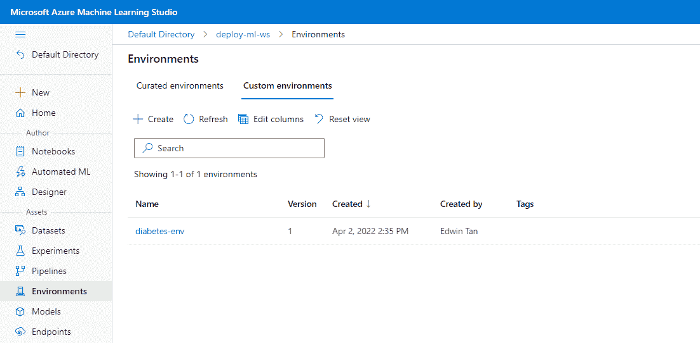

作者图片

**定义推理配置**

这里我们定义了环境和评分脚本。

```
from azureml.core.model import InferenceConfig
inference_config = InferenceConfig(
    environment=env,
    source_directory=".",
    entry_script="./score.py",
)
```

**定义部署配置**

```
from azureml.core.webservice import LocalWebservice
deployment_config = LocalWebservice.deploy_configuration(port=6789)
```

**部署本地 web 服务**

在运行下面的单元之前，确保 Docker 正在您的本地机器上运行。

```
service = Model.deploy(
    workspace = ws,
    name = 'diabetes-prediction-service',
    models = [model],
    inference_config = inference_config,
    deployment_config = deployment_config,
    overwrite=True)

service.wait_for_deployment(show_output=True)
```

`model.pkl`文件将从 Azure Machine Learning 下载到一个临时的本地文件夹中，一个带有依赖关系的 docker 映像将被创建并注册到 Azure Container Registry (ACR)中。该映像将从 ACR 下载到本地机器上，运行 webservice 的 docker 容器将从该映像本地构建。下面显示了成功部署的输出消息。

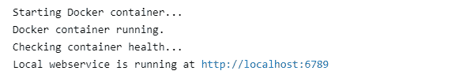

作者图片

我们可以使用以下公式获得得分 URI:

```
print (service.scoring_uri)>> '<http://localhost:6789/score>'
```

这是我们将向其发送评分请求的 URI。

## 4.5.测试本地 web 服务

在本节中，我们将测试本地 web 服务。代码是用`inference_test.ipynb`写的。

```
import requests
import json
import pandas as pdlocal_deployment = True
scoring_uri = '<http://localhost:6789/score>'
api_key = None
input_path = 'path/to/data.csv'# load the data for testing
df = pd.read_csv(input_path, sep = ',')
y = df.pop('Outcome')
X = df
input_data = json.dumps({'input':X.head(1).to_json(orient = 'records')})if local_deployment:
    headers = {'Content-Type':'application/json'}
else:
    headers = {'Content-Type':'application/json', 'Authorization':('Bearer '+ api_key)}
resp = requests.post(scoring_uri, input_data, headers=headers)print("prediction:", resp.text)
```

我们向`scoring_uri`发送了 post 请求以及 JSON 格式的数据。下面是`input_data`的样子:

```
'{"input": "[{\\\\"Pregnancies\\\\":6,\\\\"Glucose\\\\":148,\\\\"BloodPressure\\\\":72,\\\\"SkinThickness\\\\":35,\\\\"Insulin\\\\":0,\\\\"BMI\\\\":33.6,\\\\"DiabetesPedigreeFunction\\\\":0.627,\\\\"Age\\\\":50}]"}'
```

下面是对单个记录进行推断的响应示例。返回值包含被诊断为糖尿病的人的概率。

```
>> "{\\"proba\\": [0.6520730332205742]}"
```

以下是对 3 条记录的推断的示例响应。

```
>> "{\\"proba\\": [0.5379796003419955, 0.2888339011346382, 0.5526596295928842]}"
```

响应格式可以在`score.py`文件的`run`功能中自定义。

**终止本地 web 服务**

通过使用命令提示符终止 Docker 容器来终止 webservice。

```
# CLI
docker kill <container id>
```

## 4.6.部署到 Azure 容器实例

在本地成功测试该模型后，就可以部署到 ACI 了。部署步骤类似于本地部署。在`aci_deploy.ipynb`笔记本中:

```
from azureml.core import Workspace
ws = Workspace.from_config()from azureml.core.model import Model
model = Model(ws, 'diabetes_model', version=5)from azureml.core import Environment
env = Environment.get(workspace = ws, name = 'diabetes-env', version = 1)
```

*   定义工作空间
*   从模型注册表中检索模型
*   检索我们以前从环境注册表中注册的环境

**定义推理配置**

```
from azureml.core.model import InferenceConfig
inference_config = InferenceConfig(
    environment=env,
    source_directory=".",
    entry_script="./score.py")
```

**定义部署配置**

```
from azureml.core.webservice import AciWebservice
deployment_config = AciWebservice.deploy_configuration(cpu_cores=0.1, memory_gb=0.5, auth_enabled=True)
```

我们向 ACI 服务分配资源，如`cpu_cores`和`memory_gb`。当`auth_enabled`为`True`时，调用 API 时，web 服务需要一个认证密钥。

**部署 ACI Webservice**

```
service = Model.deploy(
    workspace = ws,
    name = 'diabetes-prediction-service',
    models = [model],
    inference_config = inference_config,
    deployment_config = deployment_config,
    overwrite=True)

service.wait_for_deployment(show_output=True)
```

当部署成功时，将显示以下消息:

```
>> ACI service creation operation finished, operation "Succeeded"
```

要得到得分的 URI:

```
print (service.scoring_uri)>> <http://7aa232e8-4b0b-4533-8a84-13f1ad3e350a.eastus.azurecontainer.io/score>
```

要获取身份验证密钥:

```
print (service.get_keys())>> ('MbrPwtQCkQqGBVcg9SjKCwJjsL3FMFFN', 'bgauLDXRyBMqvL7tBnbLAgTLtLMP7mqe')
```

或者，我们也可以从 Azure 机器学习的“端点”选项卡中获取评分 URI 和认证密钥。

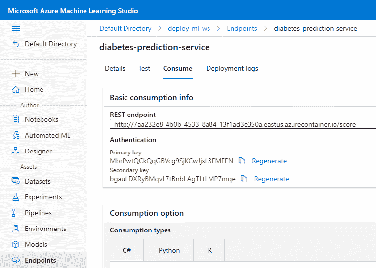

作者图片

## 4.7.测试 ACI 服务

部署完模型后，让我们再次使用`inference_test.ipynb`来测试 ACI webservice。更改以下参数，其余代码与本地测试相同。

```
local_deployment = False
scoring_uri = '<http://7aa232e8-4b0b-4533-8a84-13f1ad3e350a.eastus.azurecontainer.io/score>'
api_key = 'MbrPwtQCkQqGBVcg9SjKCwJjsL3FMFFN'
```

ACI 的价格表可在[这里](https://azure.microsoft.com/en-us/pricing/details/container-instances/)找到。

# 5.摘要

在本文中，我们研究了以下内容:

*   在本地训练 scikit-learn 模型
*   在 Azure 机器学习上跟踪 MLFlow 的 scikit-learn 实验
*   在 Azure 机器学习上注册模型
*   将模型作为本地 web 服务进行部署和测试
*   将模型作为 ACI 服务进行部署和测试

ACI 建议用于测试或小型生产工作负载。对于大型工作负载，请查看[如何部署到您的模型 Azure Kubernetes 服务](https://docs.microsoft.com/en-us/azure/machine-learning/how-to-deploy-azure-kubernetes-service)。

# 6.参考

[1] [MLFlow](https://mlflow.org/)

[2] [Azure 机器学习](https://docs.microsoft.com/en-us/azure/machine-learning/overview-what-is-azure-machine-learning)

[3] [Azure 容器实例](https://docs.microsoft.com/en-us/azure/container-instances/)

[4] [Azure 机器学习工作区](https://docs.microsoft.com/en-us/azure/machine-learning/concept-workspace)

[5] [皮马印第安人糖尿病数据集](https://www.kaggle.com/uciml/pima-indians-diabetes-database)，特许 CC0 公共领域