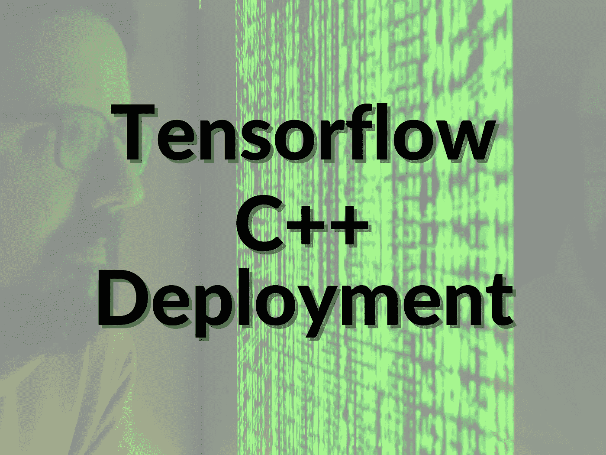
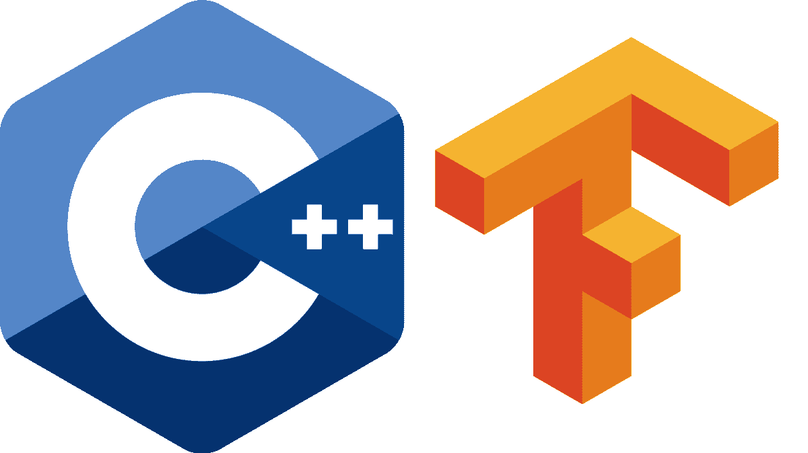

# 如何以 3 种不同的方式在 C++中部署张量流模型

> 原文：<https://towardsdatascience.com/how-to-deploy-tensorflow-models-in-c-in-3-different-ways-f7e25046be29>

## 这是我过去 4 年来做这件事的总结

由作者制作

# 介绍

在机器学习项目中，有几种方法可以部署您的最终模型。可以是云部署、移动设备上的部署、嵌入式系统上的部署等。

为此，根据您在日常工作或项目中使用的技术，您可以利用几种编程语言。

在我工作的一些公司中，我们需要在 C++环境中部署我们的深度学习模型。这些模型主要处理图像分类和目标检测。

我记得大约 4 年前在 stackoverflow 上问了一个问题，关于我如何在 C++环境中部署 tensorflow 模型。在这 4 年的时间里，我只收到了 2 个答案！

那是我第一次开始研究在 C++环境中部署 tensorflow 模型的不同选项。

我主要尝试了 3 个选项，因为它们看起来最有希望:

1.  使用 OpenCV DNN 模块部署模型。
2.  使用 Tensorflow C++ API 部署模型。
3.  使用 ONNX 运行时部署模型。

在我告诉你每个选项发生了什么之前，让我问你这个问题。您目前是否想学习如何将 Tensorflow 用于计算机视觉？如果有，那就来看看我的 [***免费 tensorflow 课程***](https://aifee.teachable.com/p/introduction-to-tensorflow-2-for-computer-vision) 。

现在，这里是我上面提到的每一个选项的结果。

# 使用 OpenCV DNN 模块在 C++中部署张量流模型

​

opencv 徽标

我记得尝试的第一个选项是 OpenCV DNN 模块。这要追溯到 2018 年。

DNN 代表深度神经网络，这是 OpenCV 开发人员推出的一个模块，用于将深度神经网络集成到已经运行 OpenCV 代码的进程中。

这被证明是对我们目标的快速修复，但这是一种非常有限的方法，因为这个模块当时还是新的，它为部署深度神经网络提供了有限的选择。

例如，我需要部署 InceptionV2 模型，但是我不能，因为 OpenCV DNN 模块只支持 InceptionV1 架构。

DNN 模块在最近几年得到了发展，它似乎为分类和对象检测 部署模型提供了更多的灵活性。

我尝试过的另外两个选项是 Tensorflow C++ API 和 ONNX 运行时。

# 使用 Tensorflow C++ API 部署模型

​

tensorflow 徽标

Tensorflow 是使用 C++构建的，它提供了一个 API，使得在 C++中部署模型(甚至训练模型，如果您愿意的话)变得相对容易。这听起来很棒，直到你开始尝试实现一个使用这个 API 的程序。

作为一名开发人员，你知道文档非常重要，但是 Tensorflow 的 C++ API 非常非常有限。仅仅通过阅读文档很难找到您想要的信息。

其次，不支持 Windows 32bits。因此，如果你(或你的客户)有这样一个系统，那么你在这里面临一堵墙，最好尝试寻找其他选择。

但是这个 API 的伟大之处在于，您不必担心您用 Python 训练的模型的兼容性，并且您希望使用 C++ API 来部署它。尤其是在 Python 和 C++中使用相同版本的 Tensorflow 的情况下。

我个人已经使用这个 API 部署了图像分类模型和对象检测模型，除了我上面提到的限制因素之外，这些模型完全按照预期工作。

在 C++中部署 Tensorflow 模型时，我个人尝试的最后一个选项是 ONNX 运行时。

# 使用 ONNX 运行时部署模型

图片来自维基百科

ONNX 代表开放神经网络交换，它是一个完整的生态系统，旨在标准化机器学习模型的表示。它是由微软开发的。

ONNX 的目标是更容易部署任何类型的机器学习模型，这些模型来自任何类型的 ML 框架，包括 Tensorflow。

要在 C++中使用 ONNX 部署 Tensorflow 模型，您需要做两件事:

1.  将 Tensorflow 模型转换为 ONNX 格式。有一个开源工具叫做 tf2onnx。
2.  使用 ONNX 运行时来部署转换后的模型。

我亲自在这么多深度学习模型上测试了这种方法，效果非常好。例如，我将 tensorflow 对象检测 API 中的几乎所有模型都转换为 ONNX 格式，并且能够毫无问题地使用它们进行推理。

在一个朋友向我推荐这个工具并看到它的所有功能后，我爱上了它。

# 您希望我帮助您构建 Python/C++ ML 管道吗？

如果您目前正在尝试构建一个完整的机器学习管道，其中:

*   你用 Python 训练和评估深度学习模型。
*   用 C++部署这些模型。
*   你的模型仅仅基于计算机视觉(图像识别、物体检测、实例分割、语义分割等等)。

然后随时联系我，在[**LinkedIn**或](https://www.linkedin.com/in/nour-islam-mokhtari-07b521a5/)[**Twitter**](https://twitter.com/NourIslamMo)**或通过电子邮件**(nourislam.mokhtari@gmail.com)**。我将帮助您在短时间内设置管道，并提供符合您要求的选择！**

# **关于作者**

**我是一名机器学习工程师，致力于解决具有挑战性的计算机视觉问题。在 [**LinkedIn**](https://www.linkedin.com/in/nour-islam-mokhtari-07b521a5/) 和 [**Twitter**](https://twitter.com/NourIslamMo) 上关注我的每日内容。此外，通过加入我的 [**时事通讯**](https://nourislam.ck.page/dc3e8b7e12) **，让这样的文章直接进入你的收件箱。****