# 如何使用 DagsHub+MLflow+AWS Lambda 部署您的 ML 模型

> 原文：<https://towardsdatascience.com/how-to-deploy-your-ml-model-using-dagshub-mlflow-aws-lambda-c85e07b06ef6>

## 一个直观的教程，展示了如何部署训练好的模型并对新数据进行预测


[张杰瑞](https://unsplash.com/@z734923105)在 [Unsplash](https://unsplash.com/photos/OnXvKZldSJ0) 上拍照

机器学习模型的部署是数据科学家最重要的技能之一。清理数据、从数据集中选择最佳要素、设置超参数并训练模型后，最后一步是将模型投入生产，以便根据新数据对其进行评估。

有许多方法可以部署模型。第一种方法是使用像 Flask 和 Django 这样的 web 托管框架。另一种方法是利用众所周知的云平台框架，如 AWS Sagemaker 和 Azure ML framework。第三种也是最后一种方式是利用无服务器计算服务，如*AWS Lambda、* Google Cloud 函数和 Azure 函数。

在这篇文章中，我们将在 **AWS Lambda** 上投入生产一个经过训练的模型，这是一个由亚马逊提供的计算平台，作为亚马逊 Web 服务的一部分，使开发人员能够部署模型和构建应用程序。它还允许避免设置任何环境，并加快我们的工作。我们开始吧！

# 我们试图解决什么问题？

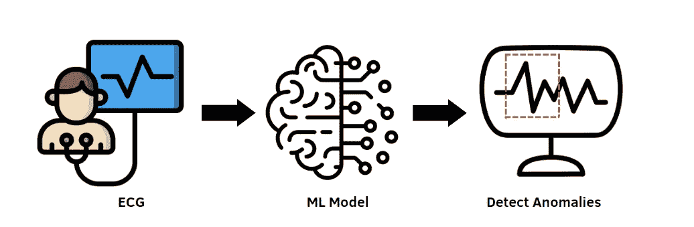

训练和部署模型以从 ECG 信号中检测异常。来源: [flaticon](https://www.flaticon.com/premium-icon/programmer_3270999?related_id=3270999&origin=search)

我们将训练和部署一个模型来从 ECG 信号中检测不规则的心律。由于与正常心律相比，不规则心律通常占少数，我们正在解决异常检测问题。对于机器学习模型来说，这是一项具有挑战性的任务，但如果它工作良好，它将使专业技术人员和医生能够快速检测患者的心律失常，避免任何手动和重复工作。

在本教程中，我们将使用 [ECG5000 数据集](http://www.timeseriesclassification.com/description.php?Dataset=ECG5000)，其中包含从一名心力衰竭患者身上随机选取的 5000 次心跳。它最初是在 PhysioNet 中发现的，这是一个可供研究人员使用的医疗数据存储库，指示心律是否异常的类值是通过自动注释获得的。

# 动机

数据科学家不仅需要建立机器模型，还需要跟踪实验、版本数据、代码和模型。其实不同的目的有不同的平台。GitHub 拥有不同版本的代码和数据，并与其他队友协作，MLflow 是最常用的跟踪和部署模型的平台之一。但是从一个平台到另一个平台可能是低效的。

直接用一个平台不是更好吗？此外，GitHub 在处理数据版本和不允许大文件方面并不真正高效。由于这些原因，我在这个项目中使用 DagsHub。这是一个能够更有效地比较不同实验和数据版本的平台。界面很直观，和 GitHub 上的非常相似。换句话说，这就像在一个独特的地方使用 GitHub 和 MLflow。在这里查看文档，开始使用 [DagsHub](https://dagshub.com/docs/getting_started/create_a_dagshub_project/) 及其要求。

# 设置 DVC 并将 DagsHub 配置为 DVC 远程存储

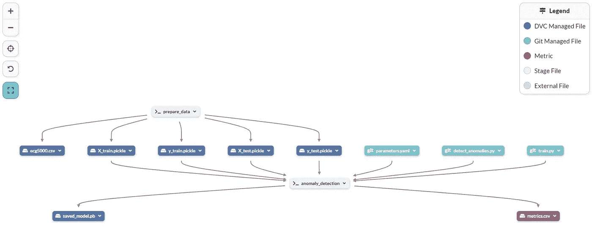

最终 DagsHub 管道概述。作者插图。

一旦您创建了 DagsHub 存储库，并且在您的本地 PC 上有了它的副本，我建议您将 Visual Studio 代码作为 IDE 来使用，因为它通过扩展支持多种语言，并且包含了一个终端，这在本部分和接下来的部分中是需要的。

Dagshub 的美妙之处在于，您可以在存储库中找到所有结果实验，并轻松地更改相关的列来比较这些实验。这是可能的，因为 DagsHub 是建立在 GitHub 和 [DVC](https://dvc.org/) 之上的，这是一个工具，使您能够在 Git 提交中捕获您的数据和模型的版本。

首先，我们需要在本地环境中安装 DVC:

```
pip install dvc
```

关于更详细的说明，还有这个[网站](https://dvc.org/doc/install/linux)展示了与 macOS、Windows 和 Linux 一起工作时的不同解决方案。

安装完成后，我们可以在我们的项目中运行`dvc init`。这是 DVC 初始化和创建包含配置的新的`[.dvc/](https://dvc.org/doc/user-guide/project-structure/internal-files)`目录的重要一步。

要在 DagsHub 上上传数据，您可以在您的存储库中找到必要的命令行。

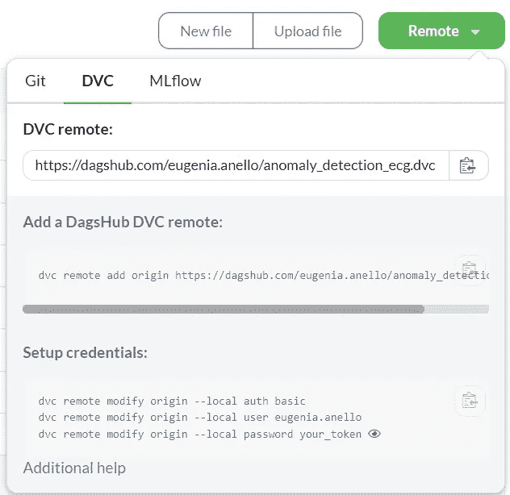

从 DVC 开始。作者插图。

## 目录:

*   [**第 1 部分:带 MLflow 跟踪的 Keras 模型训练**](#807a)
*   [**第 2 部分:使用 BentoML 和 AWS Lambda**](#e3ca) 部署模型

# 第 1 部分:使用 MLflow 跟踪的 Keras 模型训练

在我们准备好环境之后，我们可以开始使用 MLflow，这是一个非常高效的开源平台，可以跟踪实验，打包机器学习模型，并将其部署到生产中。

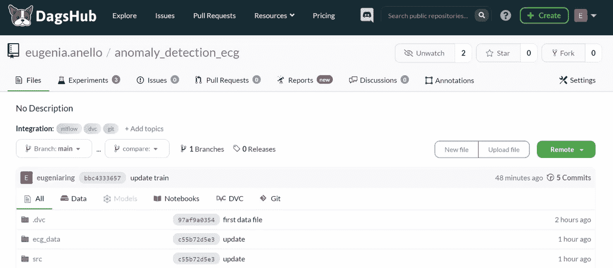

作者插图。

下面几行代码对于创建环境变量至关重要。通过单击 Remote 按钮下的 MLflow 选项，可以将您的凭据复制到 DagsHub 存储库中。用户名和密码包含在 parameters.yaml 文件中。

之后，我们终于可以利用 MLflow 来记录超参数、度量和模型人工制品。

`mlflow.tensorflow.autolog()`允许从 Tensorflow 到 MLflow 自动记录指标，如优化器和时期数。

在脚本的最后，我们还使用`Autoencoder.save(Path("Autoencoder"))`将模型保存到本地 PC 上的一个文件中。之后，我们加载模型并保存到 BentoML 本地存储

*这里* *可以找到 train.py* [*的完整代码。*](https://dagshub.com/eugenia.anello/anomaly_detection_ecg/src/branch_2/src/train.py)

我们可以运行 python 脚本 train.py，并每次更改超参数，以了解哪些超参数对提高自动编码器检测 ECG 信号异常的性能贡献更大。

```
cd src
python train.py
```

Dagshub 的美妙之处在于，您可以在存储库中找到所有结果实验，并轻松地更改相关的列来比较这些实验。

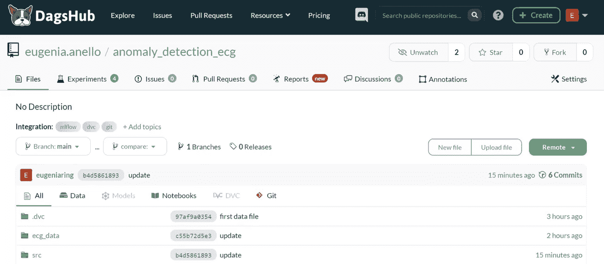

显示 MLflow 实验的表格。作者 GIF。

它不仅允许将结果收集到一个表格中，而且还可以用一个更加直观和完整的表格来比较不同的运行，该表格包含为每个实验选择的所有超参数。此外，还有一个平行坐标图，用于关注前 5 个超参数对损失和其他图表的贡献，这些图表比较了不同实验的评估指标。

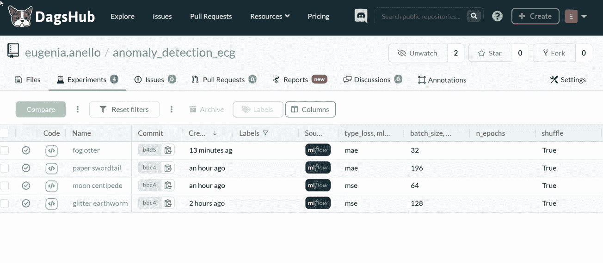

比较不同的实验。作者 GIF。

# 第 2 部分:用 BentoML 和 AWS Lambda 部署模型

这项任务可以分为不同的步骤:

*   创建 BentoML 服务
*   做便当
*   部署到 AWS Lambda

## 创建 BentoML 服务

在继续之前，让我们通过在终端上编写以下命令行来检查存储在 BentoML 本地商店中的所有模型:

```
bentoml models list
```

它返回以下输出:

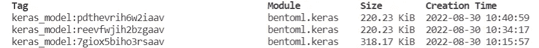

作者插图。

正如您可以从存储模型的列表中推断的那样，它们是根据创建时间以降序排列的。因此，我们对带有以下标签的模型感兴趣:`keras_model:pdthevrih6w2iaav`。

现在我们已经确定模型存储在 Bento 中，我们可以创建一个名为`service.py`的文件，在其中我们创建一个服务来部署我们的深度学习模型。这将导致 API 端点的创建。

首先，我们指定我们想要的模型标签，然后，我们在 Keras 模型上创建一个转轮实例。在我们创建了一个属于类`bentoml.Service`的实例之后，我们指定服务的名称`ecg_model`和之前定义的运行器。

现在，我们为 BentoML 服务创建一个端点，称为`predict`。您还可以注意到有一个由@，service 表示的装饰器，它是前面定义的服务实例。输入和输出的类型也在装饰器中指定，都是 *bentoml.io.NumpyNdarray* 。点击此处查看更多[文档](https://docs.bentoml.org/en/v1.0.0-a7/concepts/api_io_descriptors.html)。

*你可以在这里* *找到 service.py* [*的完整代码。*](https://dagshub.com/eugenia.anello/anomaly_detection_ecg/src/branch_2/service.py)

在函数 predict 中，我们再次期望输入一个 NumPy 数组，因为我们有一个由 140 个要素和一个目标标签组成的数据集。输出的类型也是一个数组，它告诉我们 ECG 信号是否异常。在获得最终输出之前有几个步骤。

第一步是使用预训练的自动编码器重建原始输入。然后，我们计算原始输入和自动编码器产生的输出之间的损耗，并检查损耗是否大于模型训练结束后计算的固定阈值。

最后，我们可以使用以下命令行运行服务:

```
bentoml serve service.py:service --reload
```

输出:

之后，我们可以发出服务请求，以检查经过培训的模型是否正常工作。所有的代码都在一个名为`servicerequest.py`的文件中。我们从测试集中随机选择 10 个数据观察值，并将它们传递给训练好的模型，并通过向 BentoML 服务发出请求来提供基于这些观察值的预测。

*你可以在这里* *找到 service request . py*[*的完整代码。*](https://dagshub.com/eugenia.anello/anomaly_detection_ecg/src/branch_2/servicerequest.py)

当前面的命令行仍在运行时，我们可以在另一个终端中编写这个命令行:

```
python servicerequest.py
```

输出:

似乎模型预测对 10 个数据点中的 10 个是正确的！在您的浏览器中打开 [http://127.0.0.1:3000](http://127.0.0.1:3000) ，您应该会看到这样一个窗口:

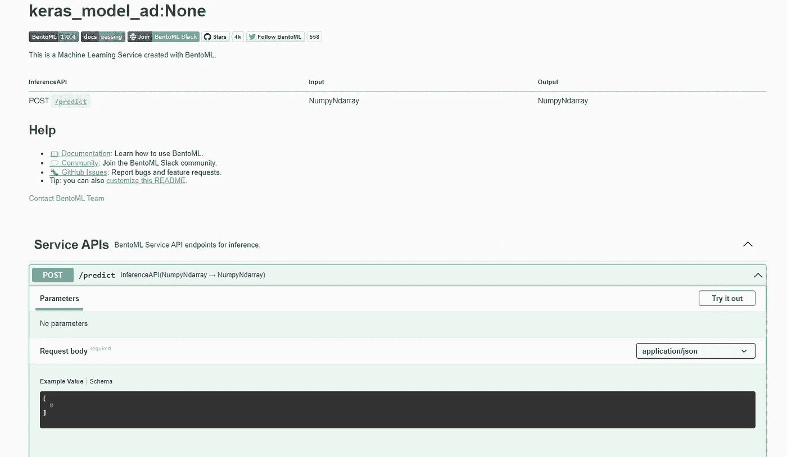

作者插图。

## 做便当

一旦我们定义了 BentoML 服务，我们就可以将所有的源代码、模型文件和依赖项放入一个名为 Bento 的档案中。做便当，有尊重的要求。我们需要在项目文件夹中创建文件`bentofile.yaml`。

然后，我们可以在终端中运行命令行`bentoml build`,并获得如下输出:

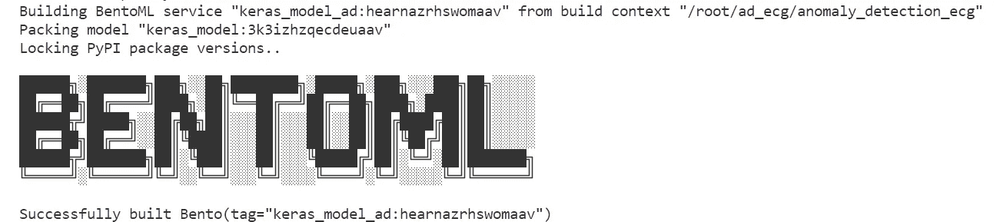

作者插图。

我们可以用命令行`bentoml list`再次可视化我们的便当列表:

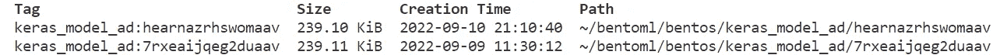

作者插图。

恭喜你！困难的部分已经完成了。模型、服务、Python 需求和 Docker 文件被保存到前面输出指定的文件夹中。

## 部署到 AWS Lambda

这是我们将要执行的步骤的摘要:

1.  创建 AWS 帐户并配置凭据
2.  用 bentoctl 初始化部署。
3.  构建并推送与 AWS Lambda 兼容的 Docker 映像
4.  使用 Terraform 应用部署

如果您发现任何问题，这里还有这些步骤的详细文档。

1.  **创建 AWS 帐户并配置凭证**

我们将把我们的异常检测模型作为 Lambda 函数部署在 AWS 上。首先，你需要在这里创建一个 **AWS 账户** [。不要担心，它允许您免费部署模型:免费层允许 AWS Lambda 每月 100 万个请求，这对于像我们这样的小项目来说没有问题。一旦创建了帐户，您需要**配置 AWS 凭证**。建议你关注这个](https://aws.amazon.com/free/?trk=74082305-452d-479a-b9dd-603d703a3cd2&sc_channel=ps&s_kwcid=AL!4422!3!455721528479!e!!g!!aws&ef_id=Cj0KCQjw6_CYBhDjARIsABnuSzpKbPLLcoY3c7gXWg98jRgpVJxTbY22LUz7MtYRuEXVJpG-H74_soMaAuvqEALw_wcB:G:s&s_kwcid=AL!4422!3!455721528479!e!!g!!aws&all-free-tier.sort-by=item.additionalFields.SortRank&all-free-tier.sort-order=asc&awsf.Free%20Tier%20Types=*all&awsf.Free%20Tier%20Categories=*all) [youtube 视频](https://www.youtube.com/watch?v=qmtDRmplMG4&ab_channel=Webiny)。我还建议你在本地电脑上安装 Docker Desktop。

对于 Linux 或 osX:

```
export AWS_ACCESS_KEY_ID=<YOUR_AWS_ACCESS_KEY_ID>
export AWS_SECRET_ACCESS_KEY=<YOUR_AWS_SECRET_ACCESS_KEY>
```

对于 Windows:

```
setx AWS_ACCESS_KEY_ID <YOUR_AWS_ACCESS_KEY_ID>
setx AWS_SECRET_ACCESS_KEY <YOUR_AWS_SECRET_ACCESS_KEY>
```

还有两个包需要从终端安装，即`aws-lambda`操作符和它的依赖项`boto3`包。

```
pip install bentoctl boto3
bentoctl operator install aws-lambda
```

**2。用 bentoctl** 初始化部署

在我们用 bentoctl 初始化部署之后，这是 Bento 的交互式 CLI 命令。

```
bentoctl init
```

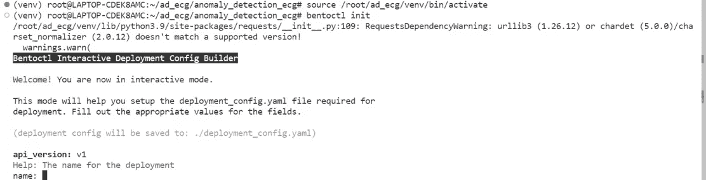

作者插图。

这个命令行将生成三个文件，这是用 AWS Lambda、`deployment_config.yaml`、`bentoctl.tfvars`和`main.tf`部署模型所必需的。最后需要安装的软件包是`terraform`。查看此处的安装说明[。检查安装是否成功的一个好方法是编写命令行:](https://learn.hashicorp.com/tutorials/terraform/install-cli)

```
terraform --version
```

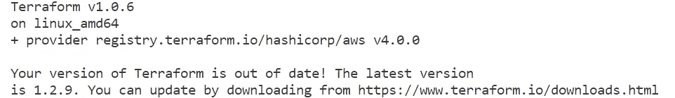

**3。构建一个 AWS Lambda 兼容的 Docker 映像**

现在，我们可以构建 AWS Lambda 兼容的 docker 映像并将其推送到 AWS ECR 存储库。

```
bentoctl build -b keras_model_ad:latest -f deployment_config.yaml
```

它返回以下输出:

```
Created the repository keras_model_ad
The push refers to repository [849711432510.dkr.ecr.us-west-1.amazonaws.com/keras_model_ad]
957db15fed12: Pushed 
1df100fb8cb9: Pushed 
3fef49d17991: Pushed 
11e8b0510c67: Pushed 
9e9bb09e42f7: Pushing 1022.1MiB/1.4GiB...920ee87a2ed2: Pushed 
3ce7d4d72da9: Pushed 
630337cfb78d: Pushed 
6485bed63627: Pushed 
🚀 Image pushed!
✨ generated template files.
  - bentoctl.tfvarsbentoctl has built and pushed the bento and generated the terraform files
```

**4。使用 Terraform 应用部署**

最后，我们可以初始化 terraform 项目，它将被应用于创建 Lambda 部署。

```
terraform init
terraform apply -var-file=bentoctl.tfvars -auto-approve
```

这是我们预期的输出:

```
aws_apigatewayv2_api.lambda: Creating...
aws_iam_role.lambda_exec: Creating...
aws_apigatewayv2_api.lambda: Creation complete after 2s [id=libobddgz8]
aws_cloudwatch_log_group.api_gw: Creating...
aws_iam_role.lambda_exec: Creation complete after 3s [id=keras_model_ad-iam]
aws_iam_role_policy_attachment.lambda_policy: Creating...
aws_lambda_function.fn: Creating...
aws_iam_role_policy_attachment.lambda_policy: Creation complete after 1s [id=keras_model_ad-iam-20220910214539285200000001]
aws_cloudwatch_log_group.api_gw: Creation complete after 5s [id=/aws/api_gw/keras_model_ad-gw]
aws_apigatewayv2_stage.lambda: Creating...
aws_apigatewayv2_stage.lambda: Creation complete after 5s [id=$default]
... 
```

我的 API 服务的链接是[https://libobddgz8.execute-api.us-west-1.amazonaws.com/](https://libobddgz8.execute-api.us-west-1.amazonaws.com/)。我们可以使用前面几节中显示的文件 servicerequest.py 快速测试部署的端点。

如果再次运行 servicerequest.py，应该会得到以下输出:

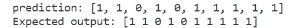

作者插图。

# 最终想法:

我希望你找到这篇教程，开始用 MLflow 跟踪你的实验，用 BentoML 和 AWS Lambda 部署你的机器学习模型。它是完全免费的，对于初学者来说是一个很好的入门方式。

查看我的 DagsHub 存储库中的代码:

<https://dagshub.com/eugenia.anello/anomaly_detection_ecg>  

你喜欢我的文章吗？ [*成为会员*](https://eugenia-anello.medium.com/membership) *每天无限获取数据科学新帖！这是一种间接的支持我的方式，不会给你带来任何额外的费用。如果您已经是会员，* [*订阅*](https://eugenia-anello.medium.com/subscribe) *每当我发布新的数据科学和 python 指南时，您都可以收到电子邮件！*