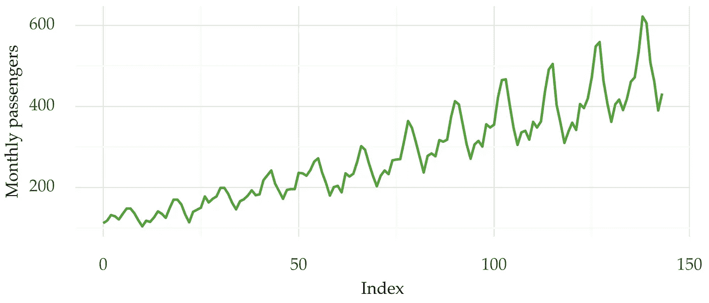
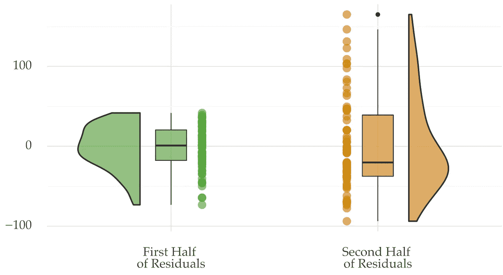
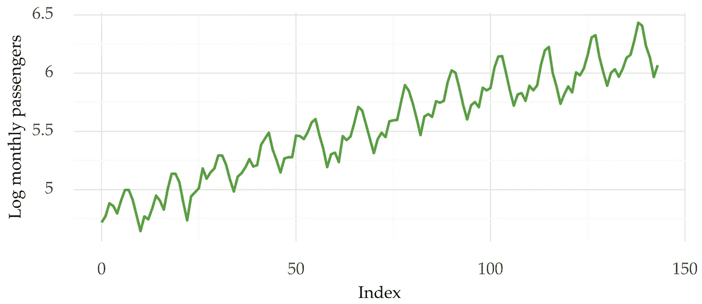
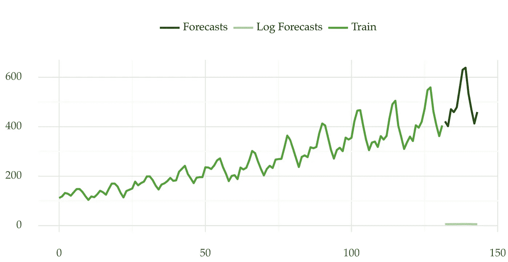

# 如何检测时间序列中的异方差

> 原文：<https://towardsdatascience.com/how-to-detect-heteroskedasticity-in-time-series-3413a8aa8da9>

## 时间序列中非恒定方差的检测和处理


Jannes Glas 在 [Unsplash](https://unsplash.com?utm_source=medium&utm_medium=referral) 上的照片

如果时间序列的方差随时间变化，那么它就是异方差的。否则，数据集是同质的。

异方差影响时间序列的建模。因此，检测和处理这种情况非常重要。

# 介绍

让我们从一个直观的例子开始。

下图 1 显示了热门航班乘客的时间序列。你可以看到不同系列的变化是不同的。在数列的后半部分，方差更大。这也是数据水平较高的地方。



图 1:某航空公司的月度乘客。[数据集在 *pmdarima* Python 库中公开。](https://alkaline-ml.com/pmdarima/modules/generated/pmdarima.datasets.load_airpassengers.html)图片作者。

方差的变化对于预测是有问题的。它会影响适当模型的拟合，从而影响预测性能。

但是，仅目视检查是不实际的。你如何以一种更系统的方式发现和处理异方差？

# 检测异方差

您可以使用统计测试来检查时间序列是否异方差。其中包括以下内容:

*   [白色测试](https://www.statsmodels.org/stable/generated/statsmodels.stats.diagnostic.het_white.html#statsmodels.stats.diagnostic.het_white)；
*   [布鲁赫-帕甘试验](https://www.statsmodels.org/stable/generated/statsmodels.stats.diagnostic.het_breuschpagan.html#statsmodels.stats.diagnostic.het_breuschpagan)；
*   [戈德菲尔德–Quandt 测试](https://www.statsmodels.org/stable/generated/statsmodels.stats.diagnostic.het_goldfeldquandt.html#statsmodels.stats.diagnostic.het_goldfeldquandt)

这些测试的主要输入是回归模型的残差(如普通最小二乘法)。零假设是残差以等方差分布。如果 p 值小于显著性水平，我们拒绝这个假设。这意味着时间序列是异方差的。显著性水平通常设置为高达 *0.05* 的值。

*statsmodels* Python 库实现了上述三个测试。下面是一个片段，它将这些封装在一个类中:

```
import pandas as pd
import statsmodels.stats.api as sms
from statsmodels.formula.api import ols

TEST_NAMES = ['White', 'Breusch-Pagan', 'Goldfeld-Quandt']
FORMULA = 'value ~ time'

class Heteroskedasticity:

    @staticmethod
    def het_tests(series: pd.Series, test: str) -> float:
        """
        Testing for heteroskedasticity

        :param series: Univariate time series as pd.Series
        :param test: String denoting the test. One of 'white','goldfeldquandt', or 'breuschpagan'

        :return: p-value as a float.

        If the p-value is high, we accept the null hypothesis that the data is homoskedastic
        """
        assert test in TEST_NAMES, 'Unknown test'

        series = series.reset_index(drop=True).reset_index()
        series.columns = ['time', 'value']
        series['time'] += 1

        olsr = ols(FORMULA, series).fit()

        if test == 'White':
            _, p_value, _, _ = sms.het_white(olsr.resid, olsr.model.exog)
        elif test == 'Goldfeld-Quandt':
            _, p_value, _ = sms.het_goldfeldquandt(olsr.resid, olsr.model.exog, alternative='two-sided')
        else:
            _, p_value, _, _ = sms.het_breuschpagan(olsr.resid, olsr.model.exog)

        return p_value

    @classmethod
    def run_all_tests(cls, series: pd.Series):

        test_results = {k: cls.het_tests(series, k) for k in TEST_NAMES}

        return test_results
```

类别*异方差*包含两个函数。函数 *het_tests* 应用了一个特定的测试(White、Breusch-Pagan 或 Goldfeld-Quandt)。函数 *run_all_tests* 一次性应用所有三个测试。这些函数的输出是相应测试的 p 值。

下面是如何将这些代码应用于图 1 中的时间序列。

```
from pmdarima.datasets import load_airpassengers

# https://github.com/vcerqueira/blog/blob/main/src/heteroskedasticity.py
from src.heteroskedasticity import Heteroskedasticity

series = load_airpassengers(True)

test_results = Heteroskedasticity.run_all_tests(series)

# {'Breusch-Pagan': 4.55e-07,
# 'Goldfeld-Quandt': 8.81e-13,
# 'White': 4.34e-07}
```

所有测试的 p 值都接近于零。所以，你可以拒绝零假设。这些测试为异方差的存在提供了令人信服的证据。

以下是时间序列前半部分和后半部分的残差分布:



图 2:时间序列前半部分和后半部分的残差分布。图片作者。

这两部分的残差分布是不同的。Goldfeld-Quandt 检验使用这种类型的分割来检验异方差性。它检查两个数据子样本中残差的方差是否不同。

# 转换数据

时间序列中异方差的一个常见补救方法是转换数据。对时间序列取对数有助于稳定其可变性。

这是与之前相同的时间序列，但采用对数标度:



图 3:与图 1 相似，但采用对数标度。这里，时间序列显示了一段时间内的稳定变化。

这一次，这个系列的可变性看起来很稳定。让我们使用对数标度的时间序列重新运行测试:

```
import numpy as np

test_results = Heteroskedasticity.run_all_tests(np.log(series))

# {'Breusch-Pagan': 0.033,
# 'Goldfeld-Quandt': 0.18,
# 'White': 0.10}
```

这次 p 值更大。只有一个测试(Breusch-Pagan)拒绝了恒定方差的假设。假设显著性水平为 *0.05* 。

## 恢复日志转换

假设您正在使用经过对数转换的数据进行预测。在这种情况下，您需要将预测恢复到原始比例。这是通过变换的逆变换来完成的，在对数的情况下，您应该使用指数。

因此，预测流程的步骤如下:

1.  转换数据以稳定方差；
2.  拟合预测模型；
3.  获取预测，并将其还原到原始比例。

这里有一个例子。

```
import numpy as np
from pmdarima.datasets import load_airpassengers
from pmdarima.arima import auto_arima
from sklearn.model_selection import train_test_split

series = load_airpassengers(True)

# leaving the last 12 points for testing
train, test = train_test_split(series, test_size=12, shuffle=False)
# stabilizing the variance in the train
log_train = np.log(train)

# building an arima model, m is the seasonal period (monthly)
mod = auto_arima(log_train, seasonal=True, m=12)

# getting the log forecasts
log_forecasts = mod.predict(12)

# reverting the forecasts
forecasts = np.exp(log_forecasts)
```



图 4:在对转换后的序列建模后，将预测恢复到原始规模。图片作者。

# 外卖

*   如果方差不是常数，时间序列就是异方差的；
*   您可以使用统计测试来测试时间序列是否异方差。这些包括白布鲁希-帕甘试验，或戈德菲尔德-夸特试验；
*   使用对数变换来稳定方差；
*   不要忘记将预测恢复到原来的比例。

感谢阅读，下一个故事再见！

## 进一步阅读

[1]圣母大学理查德·威廉斯的幻灯片讲义。[https://www3.nd.edu/~rwilliam/stats2/l25.pdf](https://www3.nd.edu/~rwilliam/stats2/l25.pdf)

[2] *Statsmodels* 用于[白色测试](https://www.statsmodels.org/stable/generated/statsmodels.stats.diagnostic.het_goldfeldquandt.html#statsmodels.stats.diagnostic.het_goldfeldquandt)、[戈德菲尔德-夸恩特测试](https://www.statsmodels.org/stable/generated/statsmodels.stats.diagnostic.het_goldfeldquandt.html#statsmodels.stats.diagnostic.het_goldfeldquandt)和[布鲁赫-帕甘测试](https://www.statsmodels.org/stable/generated/statsmodels.stats.diagnostic.het_breuschpagan.html)的文档。