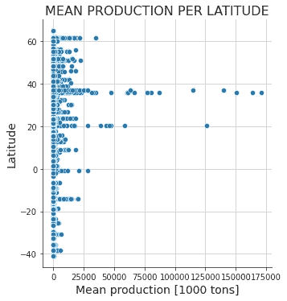
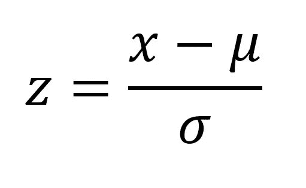

# 如何检测数据科学项目中的异常值

> 原文：<https://towardsdatascience.com/how-to-detect-outliers-in-a-data-science-project-17f39653fb17>

## 检测异常值的三种方法，以及 Python 中的示例


威尔·梅尔斯在 [Unsplash](https://unsplash.com/s/photos/outlier?utm_source=unsplash&utm_medium=referral&utm_content=creditCopyText) 上拍照

在一个数据科学项目的开始，一个重要的部分是离群点检测。当我们执行探索性数据分析时，事实上，要做的事情之一是发现异常值并以某种方式对待它们。

在本文中，我们将看到三种检测异常值的方法。但是，在此之前……什么是离群值？让我们引用维基百科:

> 在统计学中，**异常值**是与其他观察值显著不同的数据点。异常值可能是由于测量中的可变性造成的，或者它可能表明实验误差；后者有时被排除在数据集之外。异常值会在统计分析中引起严重的问题。

因此，异常值是指相对于我们正在分析的其他数据而言，值**过高或过低**的数据。当然，在一个数据集中我们不会找到一个唯一的异常值:有几个异常值；这就是为什么我们经常将它们从数据集中排除:否则，异常值会在我们的分析中引起统计问题。

但是排除离群值的标准是什么呢？我们会看到三种方法。

# 1.图解方法

这是我最喜欢的方法，因为它给了你决定的权力；事实上，正如我之前所说的，我们经常从数据集中删除离群值，由于这种方法是图形化的，您负责决定删除哪些离群值；此外，你决定哪些数据必须被认为是离群值，只是看着图。

让我们看几个我做过的项目的例子。

首先，假设我们有一个名为“cons”的数据框架；让我们用 seaborn 创建一个散点图:

```
import seaborn as sns*#plotting the scatterplot* 
sns.relplot(data=food, x='mean', y='latitude')

*#defining the size of the figure*
sns.set(rc={'figure.figsize':(30,15)})

*#labeling*
plt.title(f'MEAN PRODUCTION PER LATITUDE', fontsize=16) *#plot TITLE*
plt.xlabel('Mean production [1000 tons]', fontsize=14) *#x-axis label*
plt.ylabel('Latitude', fontsize=14) *#y-axis label*

*#showing grid for better visualization*
sns.set_style("ticks",{'axes.grid' : True})
```



散点图。图片作者。

不考虑“纬度”和“平均产量”指的是什么，只看数据:哪些点你会认为是异常值？这里我们清楚地看到，异常值只是“较高”的数字；您可以决定离群值是那些值大于 75'000 的值。即使 50 英尺也行。你照我说的做决定；而是决定一个整体的分析(仅仅这个情节是不够的)。

无论如何，这是一种检测异常值的方法。还有一种图形方法是绘制箱线图。让我们看看我的一个项目中的另一个例子。

假设我们有一个数据帧叫做“相位”；我们想画一个箱线图:

```
import seaborn as sns#boxplot
sns.boxplot(data=phase, x='month', y='time')#labeling
plt.title(f"BOXPLOT", fontsize=16) #plot TITLE
plt.xlabel("MONTH", fontsize=14) #x-axis label
plt.ylabel("CYCLE TIME[m]", fontsize=14) #y-axis label#adding an horizotal line to the mean cycle time
plt.axhline(mean, color="red") 
red_line = mpatches.Patch(color="red",
label=f"mean value: {mean:.1f} [m]")#handling the legend
plt.legend(handles=[red_line],prop={"size":12})
```


箱线图。图片作者。

即使在这里，让我们只考虑情节，而不是 x 和 y 的意思。即使在这里，异常值也只是那些具有“较高”值的异常值(小点)。使用箱线图，您的控制会少一点，但是异常值是基于统计数据检测出来的:在这种情况下，是那些值大于最大值的异常值；请记住，在箱线图中，最大值的计算方法是“Q3+1.5*IQR”，其中 IQR 是四分位数间距，计算方法是 IQR=Q3-Q1，其中 Q1 是第一个四分位数，Q3 是第三个四分位数。

使用这种图形方法，您对哪些点被认为是异常值的控制会少一些，考虑到值；我会说更好:你有一个统计(图形)方法来定义哪些值可以被认为是离群值；因此，这不是“你决定一切”:在这里，统计数据可以帮助你，我发现这是一个非常好的方法。

这些图形方法只有一个很大的缺点:**它们只能用于二维数据**。我的意思是，如果只有一列表示输入，一列表示输出，就可以使用这些图。例如，如果你有 20 列代表输入数据，一列代表输出，如果你想使用这些图，你必须绘制 20 个图形；如果有 100 列代表输入呢？你可以理解这些方法非常强大，但是只能在有限的情况下使用。那么，我们需要别的东西。

# 2.Z 得分法

Z-score，也称为“标准分数”，是一种统计方法，它告诉你给定的观察值与平均值相差多少标准差。

例如，Z 值为 1.2 意味着数据点距离平均值有 1.2 个标准差。

用这种方法，你必须定义一个阈值:当一个数据点的值大于阈值，那么它就是一个异常值。

我们计算 Z 如下:



Z 的公式。图片作者。

其中:

*   x 是数据点的值
*   μ是平均值
*   σ是标准偏差

举个例子吧。假设我们有这些数字:

```
import numpy as np#my random data
data = [1, 2, 2, 2, 3, 1, 1, 15, 2, 2, 2, 3, 1, 1, 2]#calculating mean
mean = np.mean(data)#calculating standard deviation
std = np.std(data)#printing values
print(f'the mean is: {mean: .2f}')
print(f'the standard deviation ins:{std: .2f}')----------------->>>the mean is:  2.67
the standard deviation ins: 3.36
```

现在，我们可以设置一个阈值来识别异常值，如下所示:

```
#treshold
threshold = 3#list of outliers
outlier = []#outlier detection
for i in data:
    z = (i-mean)/std
    if z > threshold:
        outlier.append(i)

print(f'the outliers are: {outlier}')----------------->>>the outliers are: [15]
```

我们甚至可以使用 Scipy 库中的“stats.zscore ”,它可以应用于 Numpy 数组和数据帧。让我们以数据框为例:

```
import pandas as pd
import scipy.stats as stats#creating dataframe
data = pd.DataFrame(np.random.randint(0, 10, size=(5, 3)), columns=['A', 'B', 'C'])#z-score
data.apply(stats.zscore)---------------->>>

     A          B           C
0 -0.392232  -0.707107   0.500000
1 -0.392232  -0.353553   -1.166667
2 1.568929    1.767767    1.333333
3 -1.372813  -1.060660   -1.166667
4 0.588348    0.353553    0.500000
```

在这种情况下，我们必须定义一个阈值，并决定删除哪些值。

Z 分数法有几个**缺点**:

*   它只能与**一维数据**(单列数据帧、数组、列表等)一起使用
*   它必须与**正态分布数据**一起使用
*   我们必须根据数据**定义一个阈值**

# **3。隔离林**

我们来理解一下什么是隔离森林，引用维基百科:

> **隔离森林**是一种异常检测算法。它使用隔离(一个数据点到其余数据的距离)来检测异常，而不是对正常点进行建模

更深入地说，我们可以说隔离森林是基于决策树构建的，类似于随机森林，它是一个无监督的模型，因为没有预定义的标签。它只不过是一个二元决策树的**集合，**其中每棵树都被称为一棵“隔离树”。

这意味着在隔离林中，我们根据随机选择的特征，在树形结构中处理随机子采样数据。**深入到树中的样本不太可能是异常，因为它们需要更多的切割来隔离它们。**

让我们以 scikit-learn 提供的著名“糖尿病数据集”为例:

```
from sklearn.datasets import load_diabetes #importing data
from sklearn.ensemble import IsolationForest #importing IF#importing dataset
diab = load_diabetes()#defining feature and label
X = diab['data']
y = diab['target']#creating dataframe
df = pd.DataFrame(X, columns=["age","sex","bmi","bp", "tc", "ldl", "hdl","tch", "ltg", "glu"])#checking shape
df.shape------------------>>>(442, 10)
```

因此，该数据帧有 442 行和 10 列。现在让我们使用隔离林:

```
#identifying outliers 
iso = IsolationForest()
y_outliers = iso.fit_predict(df)#droping outliers rows
for i in range(len(y_outliers)):
    if y_outliers[i] == -1:
        df.drop(i, inplace = True)#chechink new dataframe shape
df.shape--------------------->>>(388, 10)
```

正如我们所看到的，行数减少了，因为我们删除了有异常值的行。

我们不得不提醒，我们已经使用了一个集合，无监督的模型；这意味着，如果我们再次运行所有代码，最终的形状(删除有异常值的行后的数据框的形状)可能与 388 不同(作为练习，自己尝试一下)。

**隔离森林**，即使没有给你留下任何对数据的控制权(是一个无监督的模型)，也是我们在本文中看到的三个模型中唯一的一个，它给了我们在多维数据框架中**处理**(和丢弃**对象的可能性；事实上，我们已经处理了整个数据集，没有减少它。**

# 结论

我们已经看到了三种检测异常值的方法。正如我们已经看到的，隔离森林是(三个中)唯一一个让我们处理多维数据的，所以通常是要使用的一个；除非我们正在研究一组非常简单的数据，在这些数据中我们可以使用图形方法(我是图形的忠实粉丝！)或 z 值。

*我们一起连线吧！*

[***中等***](https://federicotrotta.medium.com/) *(跟我来)*

[***LINKEDIN***](https://www.linkedin.com/in/federico-trotta/)*(向我发送连接请求)*

*如果你愿意，你可以* [***订阅我的邮件列表***](https://federicotrotta.medium.com/subscribe) *这样你就可以一直保持更新了！*

考虑成为会员:你可以免费支持我和其他像我一样的作家。点击 [***这里的***](https://federicotrotta.medium.com/membership) *成为会员。*