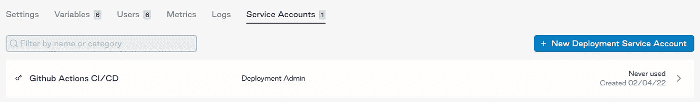

# 如何开发气流 CD 管道

> 原文：<https://towardsdatascience.com/how-to-develop-a-cd-pipeline-for-airflow-9a99047907ee>

## 利用 GitHub actions 和天文学家将代码更新快速推送到生产环境中


照片由[迈克·本纳](https://unsplash.com/@mbenna?utm_source=medium&utm_medium=referral)在 [Unsplash](https://unsplash.com?utm_source=medium&utm_medium=referral) 拍摄

Apache Airflow 是一个流行的数据编排工具，用于管理工作流和任务。然而，我不断遇到的一个大问题是如何部署生产就绪的气流实例。托管气流的选项包括虚拟机上的自我管理、部署到基于云的平台天文学家、利用 AWS MWAA 等等。

在这些选项中，我发现天文学家在易用性和每月成本方面是最有价值的，尽管在本文中我不会深入到特定平台的比较中。

天文学家是软件/基础设施即服务平台，使数据团队能够更专注于他们的工作流和管道，而不是基础设施和扩展。在本文中，我打算演示如何在不到 10 分钟的时间内，从本地气流环境中自动完成到天文学家的连续部署(CD)管道。

## 要求

1.  [天文气候](https://github.com/astronomer/astro-cli) ( [文件](https://docs.astronomer.io/astro))
2.  [天文学家账户](https://www.astronomer.io/get-started/)
3.  码头工人
4.  通过 astro 运行的局部气流
5.  本地气流实例的 GitHub 帐户和存储库
6.  GitHub 操作

第一步是用 astro CLI 初始化本地气流实例。用`astro dev init`初始化你的气流项目。然后，用`astro dev start`测试您的本地环境。

在您的项目目录(`git init`)中初始化一个新的 Git 存储库，并推送到 GitHub。

## 天文学家

在您的天文学家帐户中，确保当前部署处于活动状态。在活动部署中创建新的服务帐户。服务帐户将是您的 Github repo 和您部署的 Airflow 实例之间的纽带。*确保在创建服务帐户时复制 API 密钥，这是您唯一的机会。*



天文学家仪表板和服务帐户作者的照片

使用 astro CLI，通过`astro login`或`astro auth login`登录您的天文学家账户。这将提示您输入电子邮件和密码，或者 oauth 凭证。然后运行`astro cluster list`来获得你的基本域名(后面会提到)。比如`gcp0001.us-east4.astronomer.io`。

要验证服务帐户的创建，请在终端中运行以下命令:

```
export BASE_DOMAIN=gcp0001.us-east4.astronomer.io
export API_SECRET_KEY=<your_secret_key_for_service_account>
docker login registry.{BASE_DOMAIN} -u _ -p ${API_SECRET_KEY}
```

如果您能够通过这些命令进行身份验证，那么一切都将步入正轨。

## 开源代码库

创建一个新的 GitHub secret 来保存天文学家服务帐户 API 密钥。创建一个名为`ASTRONOMER_SERVICE_ACCOUNT_KEY`的新存储库秘密，并粘贴 API 键值。天文学家的 GitHub actions 工作流在将代码推向生产时会引用这个秘密。

接下来，在存储库中创建新的工作流操作。通过 GitHub 动作选择`Docker image`。此工作流构建 Docker 映像以部署或推送至存储库。使用这个预配置的`main.yml`文件(如下)来构建您的 dockerized airflow 实例。

确保添加`{ your_release_name }`而不是`primitive-asteroid-5670`。这可以在你的天文学家部署设置中找到。

还要注意，在第 13 行，您需要用 Dockerfile 位置的目录建立`workdir`。当工作流在 GitHub actions 上运行时，它会将您的存储库编译到一个虚拟环境中，并且需要引用 Dockerfile。在我的 repo 中，Dockerfile 位于 airflow 子目录中。

## 测试

我们现在准备测试！在 GitHub 上打开一个 PR，将变更合并到`dev`或`main`中。将代码合并到所需的分支中，工作流就开始了。完成后，您可以查看您的天文学家仪表板，将会看到当前标签的格式:`cd-commit hash`。


作者照片。天文学家中的部署标签示例。

现在，您的气流存储库已启用持续交付/部署管道！如需更多信息/调试帮助，请查看这些[文档](https://docs.astronomer.io/software/ci-cd)。

概括地说，在本文中，我们通过 GitHub actions 将在天文学家上部署本地天文/气流环境的任务自动化，并开始为 CI/CD 管道奠定基础。

CI/CD 使团队能够采用更“敏捷”的开发框架。我最喜欢的 CI/CD 渠道目标包括:

1.  效率—减少建立开发环境所花费的时间
2.  自动发布—避免堵塞和人为错误
3.  快速部署代码—消除瓶颈，让代码更快投入生产
4.  拥抱迭代——通过频繁的变更而不是单一的提交和发布来缩短反馈周期

查看这篇[帖子](https://www.devbridge.com/white-papers/cicd-pipeline-continuous-delivery-deployment/benefits/)，了解更多与敏捷和 CI/CD 相关的目标。

我们实现了一个简单的 CD 管道(只有一个生产环境)，但我们也可以利用在天文学家上的多个部署来快速扩展并包括开发和 QA 环境。这将为您的气流环境提供更强大的开发和发布流程。