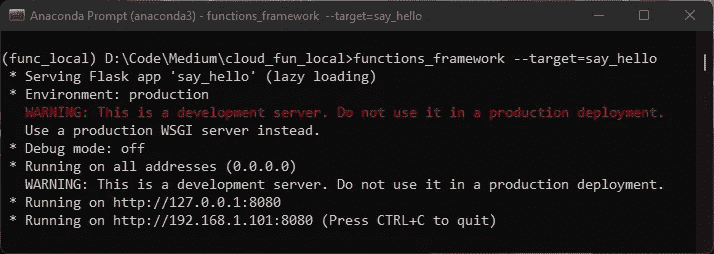
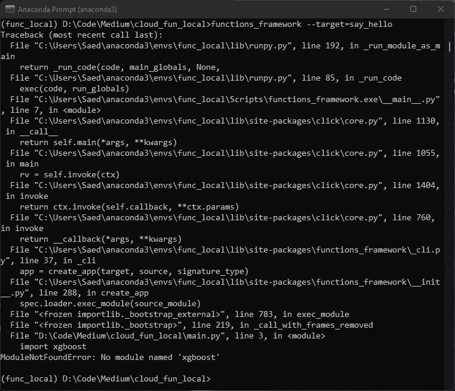
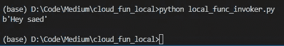
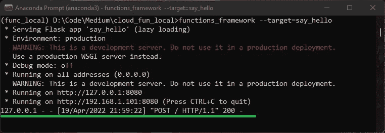

# 如何在本地开发和测试您的谷歌云功能

> 原文：<https://towardsdatascience.com/how-to-develop-and-test-your-google-cloud-function-locally-96a970da456f>

## 因此，您已经编写了无服务器云功能，但不想浪费时间部署它并希望它能工作。让我向您展示如何在本地开发和测试您的云功能。

托马斯·索贝克在 Unsplash[拍摄的照片](https://unsplash.com?utm_source=medium&utm_medium=referral)

# 快速介绍:云函数

如果你正在阅读这篇文章，我相信你已经知道什么是谷歌云功能。但以防万一，这是一个无服务器的计算产品，它允许你编写函数，当附加到它的事件被触发时，这些函数就会被触发。

由于这是一项无服务器服务，我们不必担心设置或管理服务器或任何基础设施。这种产品也被称为功能即服务(FaaS)。查看以下文章，了解更多信息，并了解如何在生产中使用它:

 [## 使用谷歌云功能作为无服务器端点的机器学习模型

### 因此，你已经建立了一个模型，并希望将其生产为谷歌云平台(GCP)上的无服务器解决方案。让我…

towardsdatascience.com](/machine-learning-model-as-a-serverless-endpoint-using-google-cloud-function-a5ad1080a59e) 

绕远路之后，让我们回到我们为什么在这里。

# 本地开发设置

要在本地开发云功能，我们需要安装[功能框架](https://cloud.google.com/functions/docs/functions-framework)。functions 框架允许我们快速启动本地开发服务器进行测试。您可以在本地调用该函数，它会像在生产环境中一样做出响应。

唯一的区别是在本地完成它允许我们快速调试和迭代，而不是等待很长时间来部署它，然后发现是否有错误！是的，部署需要很长时间！😅

在我们安装之前，请确保创建一个虚拟环境来处理项目。为什么？因为这是一个很好的实践，尤其是当你打算生产它的时候。这适用于任何 python 项目，而不仅仅是这个项目。

如您所知，云功能需要两个文件:

*   **main.py:** 其中函数的主代码是。
*   **requirements.txt:** 需要安装的所有库的列表，以使函数工作。

一旦我们的功能为生产做好准备，创建虚拟环境将允许我们轻松地创建*需求*文件。例如，在 conda 虚拟环境中，我可以运行以下代码来生成需求文件:`pip list --format=freeze > requirements.txt`

说完这些，让我们从一些代码开始。💻

# 地方发展步骤

按照以下步骤在本地开发和测试云功能:

## 步骤 0:目录和虚拟环境

为云功能项目创建一个虚拟环境和一个目录。我在虚拟环境中使用 conda 作为 Anaconda 安装的一部分。

*   在 Windows 机器上，在命令行中使用`mkdir YOUR_DIRECTORY_NAME`创建目录。
*   对于公寓虚拟环境，使用`conda create --name YOUR_ENV_NAME python=3.8`用 python 版创建一个虚拟环境。
*   要激活环境，使用`conda activate YOUR_ENV_NAME`。

**⚠️ *注:*** *如果你不关心虚拟环境和项目间的分隔，忽略步骤 0。第一步是导入的开始！*

## 步骤 1:安装功能框架

使用以下内容安装函数框架:

`pip install functions-framework`

## **第二步:功能代码主文件**

像平常一样，在工作目录中为云函数创建一个 *main.py* 文件。出于本文的目的，我创建了一个示例文件 *main.py* 。

它所做的只是检查是否发送了任何 JSON 有效载荷，并尝试提取作为有效载荷一部分发送的名称。然后它会对名字打招呼。

使用 hello 响应 JSON 有效负载的云函数。(来源:作者)

## 步骤 3:启动本地开发服务器

在与 *main.py* 文件相同的目录下，在命令行/终端中运行以下命令来启动一个开发服务器，为您的云功能服务:`functions_framework --target=say_hello`

上面的代码将 main.py 文件加载到开发服务器中，并指向 *say_hello* 作为入口点函数。

您现在应该能够调用这个函数了，它在您的本地主机上可用，很可能在端口 8080 上。(http://localhost:8080)

本地机器上运行的云函数。使用虚拟环境(func_local)。(来源:作者)

请注意，这类似于在云中部署该功能。如果有一个库没有安装在本地环境中(类似于在生产环境中 requirements.txt 文件中没有它)，服务器将抛出一个错误，就像在生产环境中一样。

例如，我知道在我的虚拟环境中没有安装 XGBoost 库。如果我现在编辑 *main.py* 来添加`import xgboost`，保存文件，并通过重新运行上面的代码来重启服务器，它应该会抛出一个错误。为了本地部署成功，我需要在我的虚拟环境中安装这个库。

在编辑 main.py 文件以导入 XGBoost 后，当我尝试再次启动服务器时出错。(来源:作者)

好了，现在我们已经运行了开发服务器，我们需要调用这个函数。

## 步骤 4:调用本地部署的函数

调用该函数类似于您通常会做的事情。您所要做的就是指向正确的 HTTP 端点。在这种情况下，端点位于本地主机上。您可以使用 cURL 或 python 中的请求库来调用该函数。

出于本文的目的，我编写了一个调用本地部署的云函数的 invoker 函数。它只传递我的名字作为键 *hello 的值。*

当您运行上面的代码(`> python local_func_invoker.py`)时，您应该会看到它打印出`hello saed`，这是来自本地部署的云函数的响应。

调用本地部署的云函数并打印其响应。(来源:作者)

函数框架开发服务器响应传入的请求。(来源:作者)

瞧！现在，您已经了解了在本地开发和测试 Google Cloud 功能所需的一切。

**⚠️ *注意:*** *如果您使用前面提到的方法从虚拟环境中生成 requirments.txt 文件，请确保删除 functions_framework 库，因为我们不需要在生产中安装它。Google Cloud Functions 产品就是建立在这个框架之上的！*😄

# 最后的想法

至少可以说，在等待谷歌云部署很长时间之后，试图在生产中调试它是令人沮丧的。在本文中，我们学习了如何在本地机器上开发和测试 Google Cloud 功能。

有很多方法可以定制函数框架，为了简洁起见，我没有介绍。我强烈推荐查看这个框架的[页面](https://cloud.google.com/functions/docs/functions-framework)和这个框架的 python 版本的 [GitHub repo](https://github.com/GoogleCloudPlatform/functions-framework-python) 。

我们简要介绍了在任何本地开发中使用虚拟环境的最佳实践。这非常有用，尤其是对于生成生产中需要的 *requirements.txt* 文件。

恭喜你！！您现在知道如何在本地开发和测试您的 Google Cloud 功能，并在转移到生产时节省大量时间和麻烦。🎊

**🚀希望这篇文章对你有用。** **如果你愿意支持我，可以考虑使用我的** [**推荐链接**](https://saedhussain.medium.com/membership) **加入 medium。**

**这样你就可以在这个平台上看到我所有的文章以及更多来自其他优秀作者的文章！😄**

*您可能喜欢的其他文章:*

 [## 如何从 PDF 文件中提取表格并转换成 Pandas Dataframe？

### 因此，您有一些包含表格的 pdf 文件，并希望将它们读入熊猫数据框。让我告诉你怎么做。

towardsdatascience.com](/how-to-extract-and-convert-tables-from-pdf-files-to-pandas-dataframe-cb2e4c596fa8)  [## 使用谷歌云功能作为无服务器端点的机器学习模型

### 因此，你已经建立了一个模型，并希望将其生产为谷歌云平台(GCP)上的无服务器解决方案。让我…

towardsdatascience.com](/machine-learning-model-as-a-serverless-endpoint-using-google-cloud-function-a5ad1080a59e)  [## 使用谷歌应用引擎的无服务器应用的机器学习模型

### 因此，您构建了一个模型，并希望将其部署为一个无服务器应用程序。让我告诉你如何使用 Docker 来做这件事…

towardsdatascience.com](/machine-learning-model-as-a-serverless-app-using-google-app-engine-b760de59156)  [## 记录您的 Python 代码

### 正确记录 python 代码需要练习的 3 件事

towardsdatascience.com](/documenting-your-python-code-9e69671f046a)