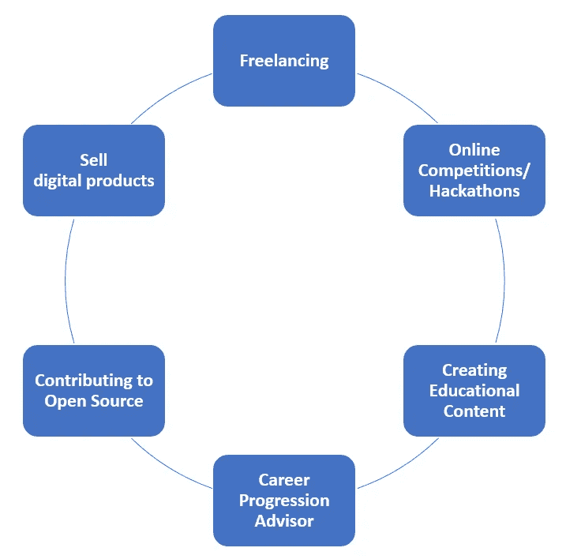

# 作为数据科学家，如何开发在线收入流

> 原文：<https://towardsdatascience.com/how-to-develop-online-revenue-streams-as-a-data-scientist-af290fad64ef>

## 探索一些不同的方法，可以用来创造一个网上收入。

Chiara Daneluzzi 在 [Unsplash](https://unsplash.com?utm_source=medium&utm_medium=referral) 上拍摄的照片

# 介绍

在一家公司担任数据科学家可能是一个非常有益的机会，2021 年美国的平均工资约为 117，806 美元[1]。尽管如此，作为一名数据科学家也有可能创造不同的收入流，你可以利用这些收入流来获得额外收入或创建自己的企业。

作为本文的一部分，我们将探索一些最常见的技术，你可以使用这些技术来开始使用你的在线技能来获得某种形式的收入(图 1)。

图 1:附带收入技术(图片由作者提供)。

# 当自由职业者

作为一名自由职业者，这是一种最常见的兼职方式。在这种情况下，你可以提出解决数据科学/机器学习问题，并设定每小时/项目的预期成本。为了推广您的服务并获得潜在客户的联系，一些最常用的平台是:

*   [五五](https://www.fiverr.com/)
*   [向上工作](https://www.upwork.com/)
*   [每小时人](https://www.peopleperhour.com/)

如果你决定选择 Upwork，该平台最近还允许你分享你的 Azure 认证，以便从其他自由职业者中脱颖而出。

# 在线竞赛/黑客马拉松

专业地参加在线竞赛和黑客马拉松也是另一项不错的投资，因为这类活动挑战你学习新技术和在压力下工作，同时给你赢得可观奖金的可能性。

对于数据科学来说， [Kaggle](https://www.kaggle.com/) 是迄今为止最受欢迎的平台之一，可以参加这类比赛，奖金高达 **10 万美元**。类似的比赛还可以在 [DrivenData](https://www.drivendata.org/competitions/) 和 [Topcoder](https://www.topcoder.com/) 等平台上找到。

或者，您可以使用许多不同的其他在线平台来尝试找到您喜欢的竞争对手，例如:

*   [Eventbrite](https://www.eventbrite.com/)
*   [安杰拉克](https://angelhack.com/)
*   [StartupWeekend](https://www.techstars.com/communities/startup-weekend)
*   [Hackthon.io](https://www.hackathon.io/events)
*   [MLH](https://mlh.io/)

最后，大型科技公司和大学也倾向于组织这种比赛，如果你有兴趣亲自参加当地的比赛，这可能是一个很好的起点。

举个例子，在过去的几年里，我有机会参加由脸书、谷歌和摩根大通等公司组织的不同的黑客大会。参加这种活动不仅挑战我在短时间内学习新的东西，而且使我有可能与志同道合的人建立新的联系，甚至赢得一些奖项！

# 创建教育内容

创建在线教育内容是挑战自己的另一个很好的方式，它可以让你在获得额外收入的同时跟上专业领域的最新发展。

你可以采取的一些可能的方法是创造:

*   博客(例如[媒体合作伙伴计划](https://help.medium.com/hc/en-us/articles/115011694187-Getting-started-with-the-Partner-Program)，个人网站)
*   YouTube 视频
*   在线课程(如 Udemy、Skillshare、Educative.io)
*   有免费和付费层的时事通讯(杂志，子栈)
*   在线活动/会议讲座

例如，在介质上写作使我能够不断提醒自己学习新的东西，并且由于这一点，后来我也有机会被邀请在英国、德国和意大利的会议和在线活动上发言！

# 职业发展顾问

一旦你成为一名有经验的专业人士，你还可以通过向缺乏经验或打算转行的人提供不同形式的服务来获得额外收入。一些例子是:

*   指导(如跳板、指导俱乐部、敏捷、速滑、指导俱乐部)
*   模拟面试
*   数据科学辅导

此外，现在也存在不同的在线平台，如 [TechTree](https://techtree.dev/) ，它可以通过向朋友/同事推荐新的工作机会来获得奖励。

就我而言，我以前作为最终用户使用过辅导网站，我一直觉得它们非常有用，尤其是在考虑去另一个国家找新工作的时候(以便更多地了解那里的文化和该地区可能的薪资范围)。

# 为开源做贡献

从事开源软件也有可能提供许多不同形式的回报。一些例子是:

*   为专业人士和企业创建一个具有免费层和付费层的开源库(例如，Plotly 和 Streamlit 等 Python 库遵循这种方法)。
*   加入付费开源贡献计划，如[Google Season of Docs](https://developers.google.com/season-of-docs)(Season of Docs 是 Google 组织的一项年度计划，旨在将技术作者与开源组织联系起来，以改进图书馆文档)。
*   为您的免费服务创建一个捐赠页面，使您的用户能够帮助您维护您的项目(例如 Github 捐赠按钮、给我买杯咖啡、Patreon 等)。
*   使用在线市场，如 [GitMarket](https://git.market/) ，出售你的私有 Git 库和代码片段

# 销售数码产品

如今，在网上创造一个产品并尝试在各种网络平台上销售是非常容易的。数字产品的一些例子可以是:

*   书籍、教程、文章、模板
*   按需提供的应用编程接口(API)

为了销售数码产品，最常用的平台之一是 [Gumroad](https://gumroad.com/) 。API 可以在平台上公开发布，比如 RapidAPI。如果您有兴趣了解更多有关如何创建自己的 API 并使其在线可用以产生利润的信息，请点击[此链接获取更多信息。](/api-as-a-product-how-to-sell-your-work-when-all-you-know-is-a-back-end-bd78b1449119)

例如，我在过去创建了一个 API 来自动将中型博客转换成 Markdown 格式(准备用于基于 Jekyll 的网站),并创建了一个数字产品来帮助概念用户创建学习笔记。

# 联系人

如果你想了解我最新的文章和项目[，请在媒体](https://pierpaoloippolito28.medium.com/subscribe)上关注我，并订阅我的[邮件列表](http://eepurl.com/gwO-Dr?source=post_page---------------------------)。以下是我的一些联系人详细信息:

*   [Linkedin](https://uk.linkedin.com/in/pier-paolo-ippolito-202917146?source=post_page---------------------------)
*   [个人网站](https://pierpaolo28.github.io/?source=post_page---------------------------)
*   [中型型材](https://towardsdatascience.com/@pierpaoloippolito28?source=post_page---------------------------)
*   [GitHub](https://github.com/pierpaolo28?source=post_page---------------------------)
*   [卡格尔](https://www.kaggle.com/pierpaolo28?source=post_page---------------------------)

# 文献学

[1]Indeed.com，建立一份你会热爱的职业。访问地点:[https://www.indeed.com/career/data-scientist/salaries](https://www.indeed.com/career/data-scientist/salaries)