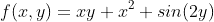
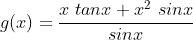

# 如何用 Python 做微积分

> 原文：<https://towardsdatascience.com/how-to-differentiate-and-integrate-using-python-1dc9444c9278>

## 学习如何使用 SymPy 计算符号方程的导数和积分


约书亚·阿拉贡在 [Unsplash](https://unsplash.com?utm_source=medium&utm_medium=referral) 上拍摄的照片

如果你像我一样，准确地记住如何微分和积分方程可能是一个挑战。或者你有一个很长很复杂的方程，你必须积分。根据方程式的不同，手工操作可能需要 10-15 分钟。你不会想这么做的。让我们学习使用 Python 来为我们完成繁重的工作，而不是手工完成所有这些工作。

## 导入 SymPy 库

与大多数 Python 项目一样，为了成功运行代码，您需要导入适当的库和包。在本文中，我们将使用 *SymPy* 库。它拥有我们区分和整合所需的一切。该库还包含了其他有用的函数，我们将在后面看到。

```
# Importing Library
import sympy
```

## 定义符号

现在我们已经导入了 *SymPy* ，我们可以用它来创建我们的符号，这些符号将用于创建方程。我们可以通过调用*符号*类并使用一个字符串来定义符号来实现。我通常使用与我将要用来操作符号的 Python 变量相同的字符串。

```
# Defining Symbols
x = sympy.Symbol("x")
y = sympy.Symbol("y")
```

## 创建方程式

让我们用刚刚定义的符号创建一个等式。我们可以创建以下等式:



下面是等效的代码:

```
# Creating Equation
f = x * y + x ** 2 + sympy.sin(2 * y)
```

## 区别

为了对等式进行微分，我们可以使用来自 *SymPy* 库的函数 *diff* 。你可能已经注意到，我们的方程有两个变量， *x* 和 *y* 。这意味着我们可以区分这两个变量。 *diff* 函数允许我们选择想要用什么符号来微分，所以让我们对 *x* 求导。

```
# Differentiate wtr x
df_dx = sympy.diff(f, x)
print("The derivative of f(x,y) wrt x is: " + str(df_dx))
```

输出:

```
The derivative of f(x,y) wrt x is: 2*x + y
```

这个结果符合我们对这个导数的预期。 *diff* 函数的另一个特点是采用高阶导数。为了做到这一点，我们包括我们的方程，我们的符号和我们的函数中的导数阶。作为一个例子，让我们对 *y* 取二阶导数并打印结果。

```
# Second Derivative wrt y
d2f_dy2 = sympy.diff(f, y, 2)
print("The 2nd derivative of f(x,y) wrt y is: " + str(d2f_dy2))
```

输出:

```
The 2nd derivative of f(x,y) wrt y is: -4*sin(2*y)
```

## 综合

*SymPy* 也有一个易于使用的符号整合功能。我们可以使用之前创建的相同等式，并针对 *x* 对其进行积分。代码和输出如下所示。

```
# Integrate wrt x
F = sympy.integrate(f, x)
print("The integral of f(x,y) wrt x is: " + str(F))
```

输出:

```
The integral of f(x,y) wrt x is: x**3/3 + x**2*y/2 + x*sin(2*y)
```

同样， *integrate* 函数返回我们期望的结果。我们也可以用*积分*函数进行定积分。在下面的代码中，我们使用相对于 *x* 的边界 *0* 到 *2* 对原始方程进行积分。

```
# Definite Integral wrt x [0, 2]
F = sympy.integrate(f, (x, 0, 2))
print("The definite integral of f(x,y) wrt x with bounds [0, 2] is: " + str(F))
```

输出:

```
The definite integral of f(x,y) wrt x with bounds [0, 2] is: 2*y + 2*sin(2*y) + 8/3
```

## SymPy 的其他有用函数

虽然本文的主要观点是区分和整合，但是 SymPy*还有其他很棒的内置函数可能会派上用场。这些可以与积分和微分一起使用，使你的输出更容易理解。我经常使用的两个功能是:*

*   *简化*是一个很棒的函数，可以用来把一个方程简化成更简单的形式。例如，我们可以简化以下等式:



```
# Simplifying Equations
g = (x * sympy.tan(x) + x ** 2 * sympy.sin(x))/sympy.sin(x)
g = sympy.simplify(g)
print("The simplified form of g(x) is: " + str(g))
```

输出:

```
The simplified form of g(x) is: x*(x + 1/cos(x))
```

*   *Solve* 是另一个很棒的函数，可以用来解代数方程组。要使用*求解*功能，我们需要调整方程组，使其中一边等于零。然后，我们可以使用如下图所示的*求解*函数，得到 *x* 和 *y* 的答案。假设我们有以下一组等式:


```
# Solving System of Equations
sol = sympy.solve((x + y - 3, 2 * x + 3 * y - 7), (x, y))
print("The solution of the system is (x, y): (" + str(sol[x]) + ", " + str(sol[y]) + ")")
```

输出:

```
The solution of the system is (x, y): (2, 1)
```

现在，您可以使用 Python 进行整合和区分。这些函数可以用来双重检查你的工作或者作为一个快速的解决方案(当然是双重检查数学！).

感谢您阅读文章！如果你有任何问题，请留言告诉我。如果你喜欢阅读，给我一个关注，看看我的其他 Python 和工程文章！