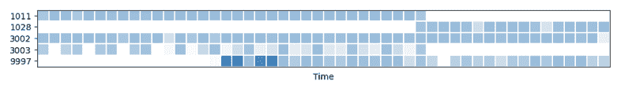
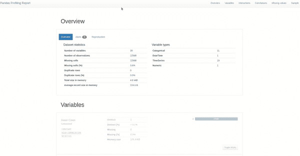
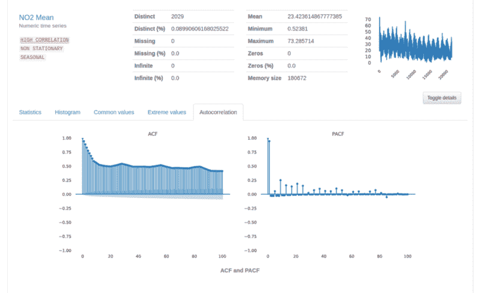

# 如何对时间序列进行 EDA

> 原文：<https://towardsdatascience.com/how-to-do-an-eda-for-time-series-cbb92b3b1913>

## 熊猫-剖析时间序列探索性分析

在 [Unsplash](https://unsplash.com?utm_source=medium&utm_medium=referral) 上由 [Aron 视觉](https://unsplash.com/@aronvisuals?utm_source=medium&utm_medium=referral)拍摄的照片

数据科学开发周期的早期步骤之一是理解和探索您正在解决的问题的数据。EDA 是更好的数据科学工作流的关键一步，Pandas profiling 是我的首选，它可以用一行代码快速完成，同时为我提供更好地理解数据和发现有意义的见解的输出。

您可能一直在使用 Pandas Profiling 来分析结构化表格数据，这通常是我们学习探索的第一种数据类型，我们都知道 Iris 数据集，对吗？然而，在现实世界的应用中，我们在日常生活中经常会发现另一种类型的数据结构:从交通，到我们的日常轨迹，甚至是我们的电力和水消耗，它们都有一个共同点——时间依赖性。

在一个越来越受数据驱动的世界中，时间序列或序列数据已经成为最有价值的商品之一，这使得执行 EDA 和挖掘时间序列数据成为数据科学从业者迫切需要的技能。

由于时间序列数据的性质，当探索数据集时，它的分析类型不同于当数据集记录被认为是全部独立时。随着在同一数据集中增加一个以上的实体，分析的复杂性也随之增加。

在这篇博文中，我将探索数据集分析中的一些关键步骤，同时利用 pandas 的时间序列特征进行分析。探索的数据集参考了美国[的空气质量](https://www.epa.gov/outdoor-air-quality-data)，可以从[环保局网站](https://www.epa.gov/outdoor-air-quality-data/download-daily-data)下载。*

完整的代码和例子可以在 [GitHub 库](https://github.com/ydataai/pandas-profiling/tree/master/examples/usaairquality)中找到，所以你可以跟随教程。

# 分析时序数据集中的多个实体

数据描述称，这是美国、波多黎各和美属维尔京群岛的户外监测器收集的空气质量数据。有了这些信息，我们知道这是一个多变量时间序列数据，有几个我们需要考虑的实体。

了解这一点后，我有一些后续问题:有多少位置可用于污染物测量？所有传感器在同一时间段内收集的数据量是否相同？收集的度量在时间和位置上是如何分布的？

这些问题中的一部分可以很容易地通过热图来回答，热图将所有测量和位置与时间进行比较，如下面的代码片段和图像所示:

使用 pandas-profiling 生成时间热图的代码

美国空气质量数据集热图(图片由作者提供)

上图展示了一段时间内每个实体的数据点。我们看到并非所有站点都同时开始收集数据，根据热图的强度，我们可以了解到在给定时间段内，一些站点比其他站点拥有更多的数据点。

这意味着在对时间序列建模时，为训练和测试数据集使用动态时间戳可能比使用预先确定的时间戳更好。我们还必须进一步调查丢失的记录和输入记录的范围。

有了对我们的实体时间分布的基本理解，我们可以开始深入数据分析以获得更多的见解。由于有多个时间序列，让我们来看看每个实体的行为。

# 对时间序列指标的探究

如果您已经在使用 pandas-profiling，您可能知道如何[生成配置文件报告](https://pub.towardsai.net/advanced-eda-made-simple-using-pandas-profiling-35f83027061a)。

可以通过传递参数 *tsmode* = **true** 来启用对时间序列的支持，并且库将自动识别具有自相关的特征的存在(稍后将详细介绍)。为了让分析正常工作，数据帧需要按照实体列和时间进行排序，否则您总是可以利用 **sortby** 参数。

这方面的代码非常简单:

下面是使用时序模式时输出报告的样子:

熊猫概况报告的截屏(作者截屏)

## 季节性和不稳定的警报

具体到时间序列分析，我们可以发现两个新的警告— **非平稳**和**季节性。**快速掌握你的时间序列的最简单的方法是查看警告部分。对于这个特定的用例，每个配置文件报告将描述每个美国位置在污染物测量方面的特定行为。

以下是我们报告中的警告:

分析中的警报。(作者截屏)

当一个时间序列的统计特性(如均值和方差)在观察时间内不发生变化时，称该时间序列是平稳的。相反，当时间序列的统计特性依赖于时间时，它是非平稳的。例如，具有趋势和季节性的时间序列(稍后将详细介绍)不是静态的，这些现象会影响时间序列在不同时间的值。

平稳过程相对更容易分析，因为时间和变量之间存在静态关系。事实上，平稳已经成为大多数时间序列分析的普遍假设。

虽然有针对非平稳时间序列的[模型，但大多数 ML 算法确实期望输入特征和输出之间存在静态关系。当时间序列不稳定时，根据数据建模的模型的精度在不同点会有所不同。这意味着建模选择受到时间序列的平稳/非平稳性质的影响，当您想要](https://people.stat.sc.edu/hitchcock/stat520ch5slides.pdf)[将时间序列](https://analyticsindiamag.com/how-to-make-a-time-series-stationary/)转换成平稳序列时，需要应用不同的数据准备步骤。

因此，此警报将帮助您识别此类列，并相应地预处理时间序列。

时间序列中的季节性是一种情况，在这种情况下，数据会经历定期和可预测的变化，这些变化在一个定义的周期内重复出现。这种季节性可能会在时间序列建模时掩盖我们希望建模的信号，甚至更糟的是，它可能会向模型提供一个强烈的信号。此警报可以帮助您识别此类列，并提醒您解决季节性问题。

**关于时间相关特性的更多信息**

您将注意到的第一个区别是，线形图将取代被标识为依赖于时间的列的直方图。使用线图，我们可以更好地理解所选列的轨迹和性质。对于该 NO2 均值线图，我们看到轨迹呈下降趋势，具有连续的季节变化，最大值记录在系列的初始阶段。

专栏的特征细节(按作者分类的图片)

接下来，当我们切换到该列的更多详细信息时(如上图所示)，我们将看到一个带有自相关和偏自相关图的新选项卡。

对于时间序列，自相关显示了时间序列在其当前值与其先前值之间的关系。部分自相关是时间序列在去除先前时间滞后的影响后的自相关。这意味着这些图对于提供关于被分析序列的自相关程度以及移动平均程度的信息是至关重要的。

上面的 ACF 和 PACF 的情节有点像预期的那样模棱两可。纵观我们的警告，我们可以看到 **NO2 意味着**是一个*非平稳的*时间变量，这消除了这些图的可解释性。然而，ACF 图有助于证实我们已经怀疑的东西——**NO2 意味着**是非平稳的——因为 ACF 图值下降非常缓慢，而不是像平稳序列的情况下预期的那样快速下降到零。

从数据分析中收集的信息、时间序列的性质以及非平稳性和季节性等警报让您能够更好地理解手头的时间序列数据。这并不意味着您已经完成了探索性数据分析，我们的目标是将这些见解作为起点，继续进行深入的数据分析和进一步的数据准备步骤。

通过分析空气质量数据集，我们看到几个恒定的列，这些列在建模时可能不会增加太多价值。从缺失值图表中，我们看到 SO2 和 CO2 空气质量指数存在缺失数据，我们应进一步探讨这种情况的影响以及插补或完全删除这些列的范围。发现几个列具有非平稳和季节性警报，下一步将是使它们平稳或确保我们将使用的模型能够处理非平稳数据点。

您已经明白了——作为数据科学家，使用分析工具快速获得数据的整体视图(在我们的案例中是时间序列)并进一步检查数据预处理和建模阶段并做出明智的决策是非常重要的。

# 结论

熊猫概况的座右铭一直是一样的:“读数据？暂停。生成 Pandas Profiling 报告，并检查数据。现在开始清理，重新迭代探索数据。”

虽然结构化表格数据仍然是数据科学初级阶段最常见的数据，但时间序列数据被广泛使用，并且是许多业务和高级数据驱动解决方案开发的核心。由于时间序列的性质以及记录如何依赖于时间并影响未来事件，数据科学家在探索性数据分析阶段会寻求不同的见解。

因此，在 Pandas Profiling library 整合功能以启用时间序列分析模式来揭示这些见解之前，这只是一个时间问题。从用户获取特定于时间序列的分析报告所需的更改，到提示关注特定于时间序列分析的数据、折线图和关联图的新警报的输出，我们在本文中演示了所有内容。

但是今天探索的度量和分析仅仅是一个开始！更多的问题有待解答。对你来说，你通常用什么方法分析时间序列数据？使用顺序数据集时，您最怀念的是什么？

**引文:**

“EPA 美国环境保护署”(公共领域)【http://www.ics.uci.edu/~mlearn/MLRepository.html T2

[*法比亚娜*](https://www.linkedin.com/in/fabiana-clemente/) *是 CDO 在*[*y data*](https://ydata.ai/?utm_source=medium&utm_medium=signature&utm_campaign=blog)*。*

**用改进的数据加速 AI。**