# 如何为 ML 做数据标记、版本控制和管理

> 原文：<https://towardsdatascience.com/how-to-do-data-labeling-versioning-and-management-for-ml-ba0345e7988>

## 丰富食品数据集的案例研究

**简介**

几个月前，Toloka 和 ClearML 一起创建了这个联合项目。我们的目标是向其他 ML 实践者展示如何首先收集数据，然后在将数据输入 ML 模型之前对数据进行版本化和管理。

我们相信，遵循这些最佳实践将有助于其他人构建更好、更强大的人工智能解决方案。如果你很好奇，可以看看我们一起创建的项目。

**项目:食品数据集**

我们是否可以丰富现有的数据集，并让算法学会识别新的特征？

我们在 Kaggle 上找到了下面的[数据集](https://www.kaggle.com/sainikhileshreddy/food-recognition-2022)，并很快决定它非常适合我们的项目。该数据集由使用 MyFoodRepo 收集的数千张不同类型的图像组成，并在 Creative Commons CC-BY-4.0 许可下发布。你可以在官方的[食物识别基准论文](https://www.frontiersin.org/articles/10.3389/fnut.2022.875143/full)中查看更多关于这个数据的细节。

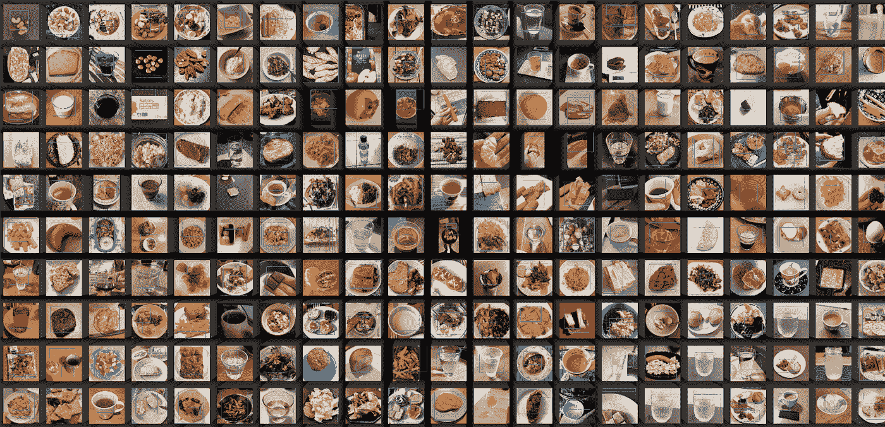

食物数据集预览——作者照片

我们注意到食物可以分为两大类:固体和饮料。

食物类型的例子:出售的和流质的——作者照片

此外，我们注意到一些食物比另一些更开胃。

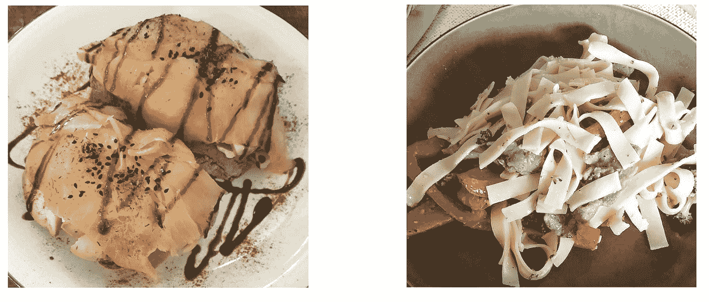

食物类型示例—作者照片

那么，我们能否用这些额外的信息来丰富这个数据集，然后制作一个能够识别新特征的算法呢？

答案是肯定的，我们使用 Toloka 和 ClearML 做到了这一点。

**如何标注数据？**

对于这一步，我们使用了 [Toloka](https://toloka.ai/) 众包平台。在这个工具中，您可以创建一个注释项目，然后将它分发给世界各地的远程注释者。

项目的第一步是创建界面和详细的说明。在这种情况下，我们想问两个问题:

*   客观问题:关于食物的种类，固体还是液体
*   主观问题:关于一个人是否觉得食物开胃

我们使用了您可以在下面看到的界面:

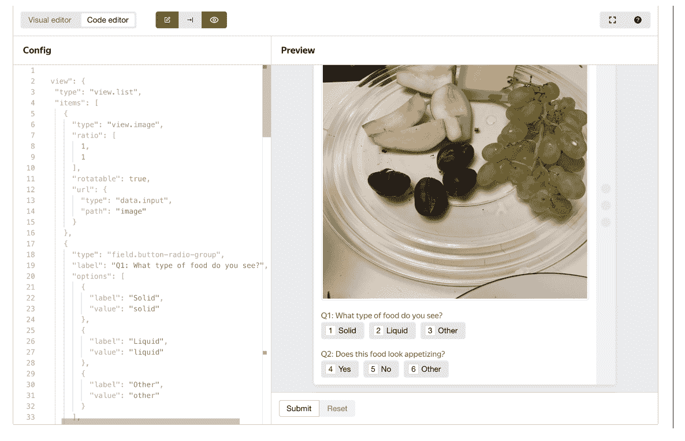

界面——作者照片

此外，在说明书中，我们清楚地说明了什么是固体和液体食物，给出了例子，并提供了边缘案例。

一旦说明和界面准备好了，我们必须为我们的项目邀请表演者。Toloka 注释者遍布世界各地，所以我们必须仔细选择谁能够参与我们的项目。

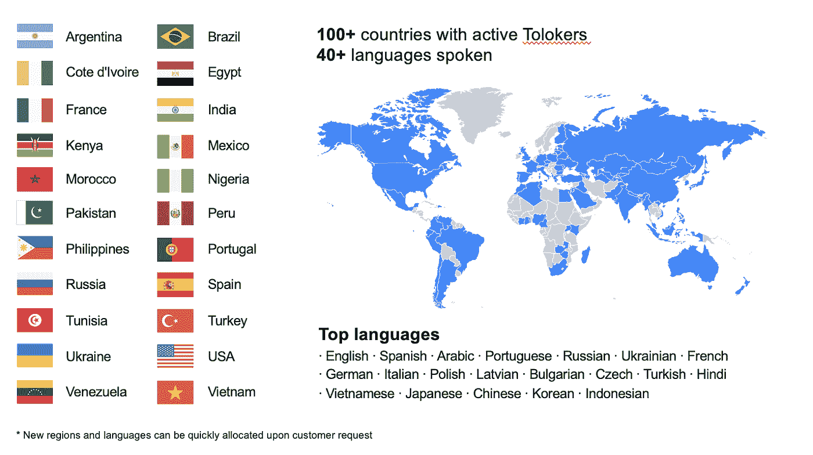

作者照片

因为我们给出的说明是用英语写的，所以我们决定只邀请说英语的人，并通过考试来测试他们理解这些说明的程度。考试由 10 个任务组成，我们测试了关于食物类型的第一个问题的答案。我们有 5 个固体、4 个液体和 1 个应标记为“其他”的边缘案例。我们要求考试成绩达到 100 分才能进入注释项目。

下图是参加考试的人给出的答案分布。

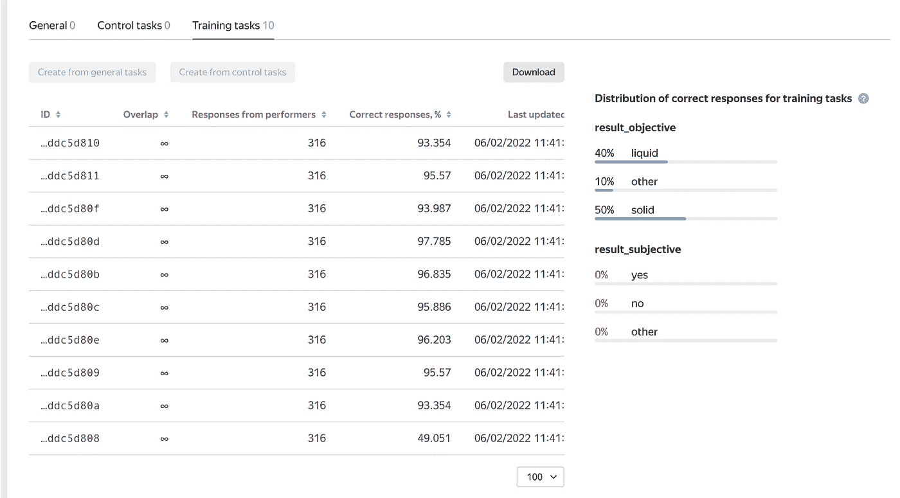

作者照片

如果你仔细观察最后一个条目，你会注意到它的正确回答率相对较低，只有 49%,相比之下，其余条目的正确回答率都在 90%以上。这是我们用来抓住不注意阅读说明的表演者的边缘案例。最后一张图片由各种类型的食物组成，包括液体和固体，因此应该标记为“其他”。

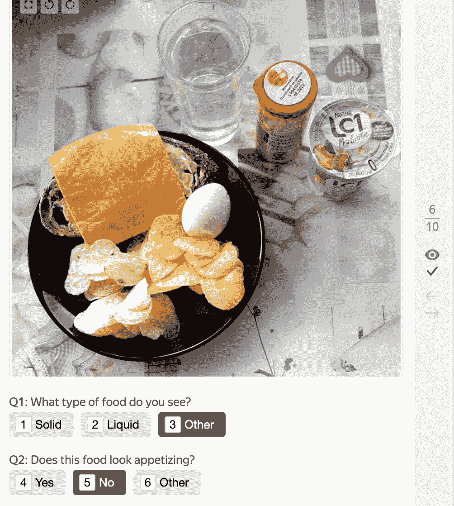

作者照片

幸运的是，我们过滤掉了回答错误的人。

为了控制注释的质量，我们实施了以下措施:

*   快速响应规则，
*   重叠，
*   和控制任务。

当用户对给定任务的响应太快时，使用快速响应规则。这意味着他甚至没有时间去正确地观察和检查任务，也不可能得到正确的回答。

另一方面，Overlap 让我们对响应更有信心，因为每个任务都被分配给几个注释者，他们的工作可以被聚合。在这种情况下，我们使用了三个重叠。

我们还在正常任务之间分配了控制任务。这意味着每给注释者九个任务，就会有一个控制任务检查他给出的响应是否正确。如果注释者对控制任务给出了不正确的响应，他将被从项目中删除。

作为这个注释的结果，我们使用三个不同的注释器对 980 张图片进行了注释。收集结果大约需要 30 分钟，花费 6.54 美元。我们还有总共 105 人参与了这个项目。

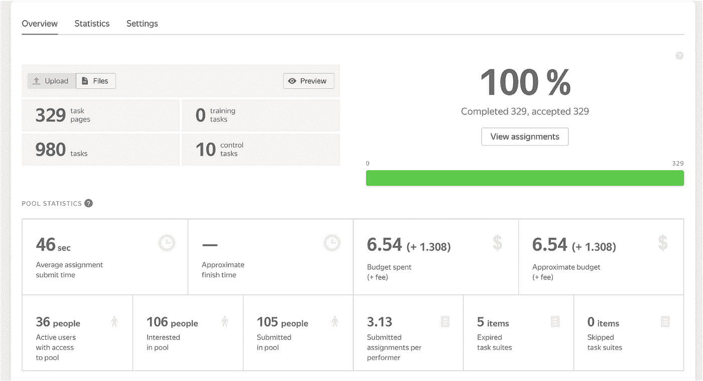

作者照片

现在可以将结果传递给 ClearML 工具，这些工具将用于对收集的数据进行版本化和分析。如果你的项目需要其他类型的注释，你可以在这里浏览不同的注释演示。

**数据管理**

既然我们实际上已经创建了一个框架来获取和注释数据，我们可以直接使用它，或者更好的是，对它进行版本化，以便我们记住谁在何时做了什么:)

ClearML 是一个开源的 MLOps 平台，它提供了一个名为 **ClearML Data** 的数据管理工具，可以与平台的其余部分无缝集成。

一旦创建了带注释的数据集，我们只需将其注册到 ClearML 中。

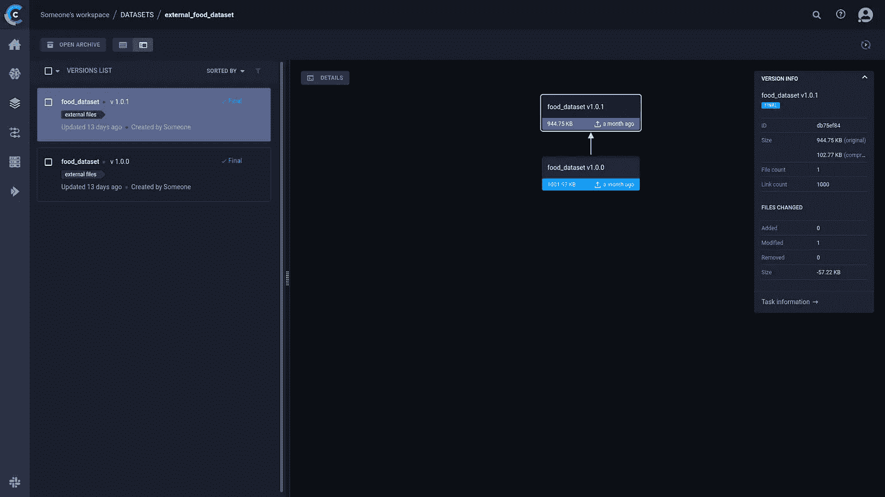

作者照片

一旦在 ClearML 中注册了数据，用户就能够创建和查看数据谱系树，添加数据预览、元数据，甚至图表，如标签分布！这意味着所有信息都封装在一个实体中。

在我们的例子中，我们可以将数据集注释成本保存为元数据。我们还可以存储其他注释参数，如指令、语言参数或其他任何东西！并将其附加到数据集，以便我们以后可以引用它。

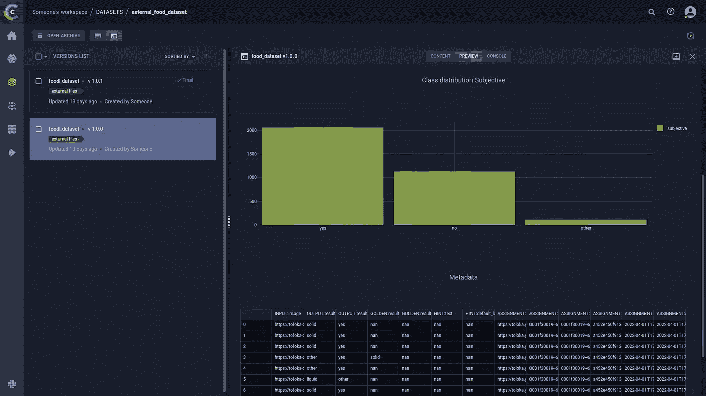

作者照片

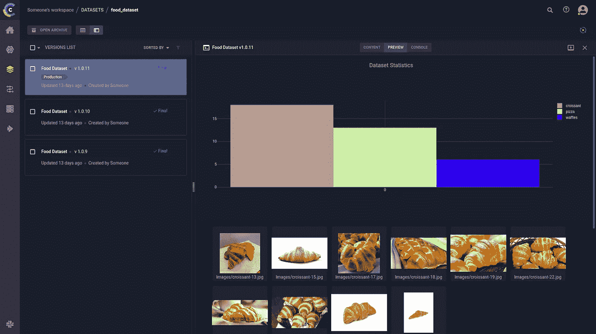

作者照片

**数据现在被追踪到了什么？**

好了，现在数据得到了跟踪和管理，但接下来你可能会问。

那么，将它连接到 ClearML [实验管理](https://clear.ml/products/clearml-experiment/)解决方案的力量来了！

只需一行代码，用户就可以将数据集存储到他们的目标机器上，完全抽象出数据实际存储的位置(或者是在专用的 ClearML 服务器上，或者只是存储在您喜欢的云提供商的存储器上)

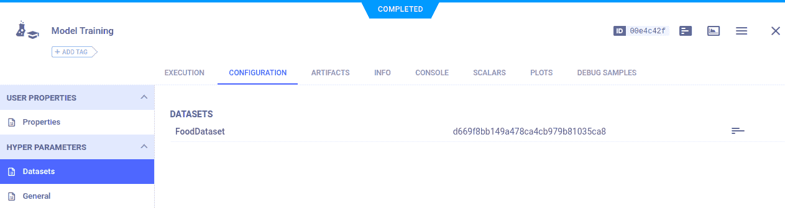

作者照片

ClearML Data 从存储数据的任何地方获取数据，并缓存数据，这样连续运行就不需要重新下载数据了！

连接到 ClearML 的实验管理解决方案，用户可以享受它提供的所有功能，如实验比较，我们可以比较两个实验，唯一的区别是注释的成本，并实际查看支付更多注释对我们的模型有什么影响！

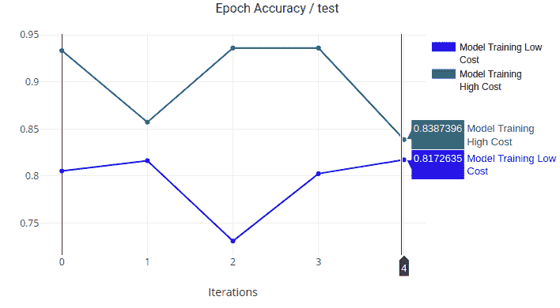

作者照片

由于我们将成本保存为元数据，如果我们使用 Toloka 的 SDK 自动化注释任务，我们实际上可以结合 Toloka 和 ClearML 来自动运行注释成本的超参数优化，并计算出我们应该在注释上真正投资多少！

**利用超级数据集提升您的数据管理水平**

需要从数据集管理工具中获得更多好处？看看[超级数据集](https://clear.ml/products/clearml-hyper-datasets/)！

超级数据集本质上是将注释和元数据存储在数据库中，以便在训练\测试时可以查询！

用户可以将对数据的查询(称为数据视图)与实验联系起来，并对其进行版本控制！使用 Datviews，您可以在需要时轻松获得数据集的特定子集(甚至多个数据集)，这提供了另一个级别的数据管理粒度。

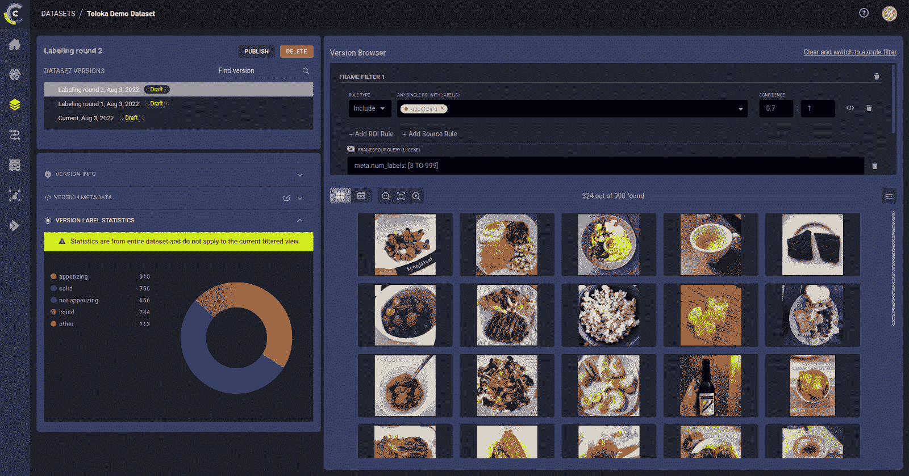

作者照片

如果您需要更好的数据统计数据、更好地控制向网络中输入的数据，以及如果您处理数据的子集并希望避免数据重复(需要大量存储和管理)，那么数据视图和超数据集非常有用。

**总结**

在本文中，您已经学习了如何使用 Toloka 和 ClearML 工具，以食品数据集为例构建 ML 数据工作流。如果你想检查本博客中概述的步骤所需的所有代码，请查看我们准备的 [colab 笔记本](https://colab.research.google.com/drive/1d_FyxlevpyzWR8K4VzVDevQcpaW5aV4R?usp=sharing)。

此外，我们以网络研讨会的形式展示了我们的实验结果，并为您保存了记录( [Toloka part](https://www.youtube.com/watch?v=j_z9cauU3yQ) 、 [ClearML part)](https://www.youtube.com/watch?v=CcL8NNZfHlY) )。

你觉得这个指南对管理你自己 ML 项目的数据有用吗？如果您对这个项目有任何反馈或想问问题，请在下面发表评论。

还要特别感谢本文的合著者 [@victor.sonck](https://medium.com/@victor.sonck) 和 [Erez Schnaider](https://www.linkedin.com/in/erez-schnaider-0b711890/) 。

*PS:我正在 Medium 和*[***aboutdatablog.com***](https://www.aboutdatablog.com/)*上撰写深入浅出地解释基本数据科学概念的文章。你可以订阅我的* [***邮件列表***](https://medium.com/subscribe/@konkiewicz.m) *以便在我每次写新文章时得到通知。如果你还不是中等会员，你可以在这里加入*<https://medium.com/@konkiewicz.m/membership>**。**

*下面还有一些你可能喜欢的帖子*

*</adapting-a-sentiment-analysis-model-to-a-custom-domain-62ec386516bc>  </data-centric-ai-82fea1fc678d>  </top-8-magic-commands-in-jupyter-notebook-c1582e813560> *