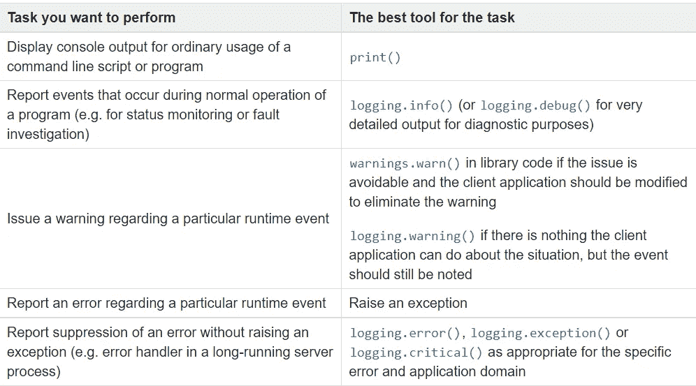

# 如何在 Python 中进行日志记录

> 原文：<https://towardsdatascience.com/how-to-do-logging-in-python-37fee87b718c>

## 跟踪程序中的事件


维克多·塔拉舒克在 [Unsplash](https://unsplash.com?utm_source=medium&utm_medium=referral) 上拍摄的照片

Python 编程语言中最常用的函数之一是`print()`语句；`print()`是您在学习 Python 时首先要学习的函数之一。就功能而言，没有任何东西可以与之媲美。但是它不应该用于所有的情况，比如你在调试的时候——尤其是当你在处理一个复杂的程序的时候。

在一个简单的程序中使用`print()`语句可能不会有什么问题，但我个人不建议这样做。您最好养成使用日志来调试代码的习惯。日志是程序员工具箱中最有用的工具之一。它用于帮助更好地理解程序的流程，并识别在开发程序时可能没有考虑到的场景。

Python 为我们提供了一个名为`logging`的内置日志模块。在这篇文章中，我们将介绍一些重要的概念，这些概念将允许你开始把`logging`添加到你的应用程序中。

```
**Table of contents:** 
--> [A simple introduction to Python's logging module](#e4e6)
--> [Configuring the logger](#826c)
--> [Creating your own logger object](#7300)
--> [Understanding when to use logging](#dd42)
```

# Python 日志模块的简单介绍

日志是与程序相关的事件的自动生成的、带有时间戳的文档。为了产生这样的信息，记录器不断地监视应用程序的流程并存储必要的信息(即谁在什么时间访问了程序)。

在 Python 中，可以使用`logging`模块来创建日志。它是大多数第三方库使用的一种流行的内置 Python，这意味着您可以将您的日志消息与您正在使用的库的日志消息集成在一起，但这并不是它唯一酷的地方。

`logging`模块的另一个很酷的特性是它提供了一组函数来简化日志记录过程。每个日志记录函数都以事件的严重级别命名，这使得记录程序中最紧急的事件成为可能。

定义的级别(按严重性递增顺序排列)如下:

*   **DEBUG** : *用于记录与源代码相关的底层细节，例如，通知开发人员某个函数已被调用或者某个对象的值存储在变量*中。
*   **INFO** : *用于与程序中发生的事情相关的通用信息，例如正在读取的文件或正在发送的电子邮件。*
*   **警告** : *用来警告你现在还没有错误，但是将来可能会有错误。*
*   **错误** : *用于可预防的错误。*
*   **关键** : *用于导致系统失败或无法恢复的错误*

换句话说，并非所有日志消息都是平等的。

让我们来看看`logging`模块附带的默认记录器:

```
**import** logging **>>>** logging.debug("debug message")
**>>>** logging.info("info message")
**>>>** logging.warning("warning message")
WARNING:root:This is a warning message
**>>>** logging.error("error message")
ERROR:root:error message
**>>>** logging.critical("critical message")
CRITICAL:root:critical message
```

您可能会注意到两件事:

1.  `logging.debug()`和`logging.info()`功能未被记录。这是因为默认配置是只记录严重级别为`WARNING`或以上的消息。
2.  记录信息的输出格式为`severity_level:logger_name:logging_message`。

我们可以配置我们的日志消息，您将在下一节看到。

# 配置记录器

在上一节中，我们已经用默认设置介绍了日志模块，但是有时默认设置并不是我们想要的。在这种情况下，我们可以通过配置`logging.basicConfig()`来设置我们的记录器。

`logging.basicConfig()`最常用的参数包括:

*   `filename` —指定使用指定的`filename`而不是`StreamHandler`创建一个`FileHandler`；记录输出被发送到带有给定`filename`的磁盘文件。
*   `filemode` —如果指定了`filename`，那么文件将在给定的`filemode`中打开。默认模式为“a”:了解更多关于不同[模式](https://docs.python.org/3/library/functions.html#filemodes)的信息。
*   `format` —指定的格式字符串将用于处理程序；默认的格式字符串是`levelname:name:message`[如上所示]。
*   `level`—root logger 应设置的指定严重性级别。

让我们进一步探索这些参数。

我们可以使用`level`参数来设置日志消息的严重性级别。

```
**import** logging
**from** datetime **import** datelogging.basicConfig(level=logging.INFO)**def** calculate_age(year_of_birth:**int**) -> **int**:
    """Compute the age of a person"""
    current_year = date.today().year
    **return** current_year - year_of_birth

year_of_birth = 1994logging.info(f"User was born in {year_of_birth} and is approximately {calculate_age(year_of_birth)} years old")"""
INFO:root:User was born in 1994 and is approximately 28 years old
"""
```

如果我们想把我们的日志消息发送到一个文件而不是控制台，我们必须把参数`filename`传递给我们的`logging.basicConfig()`并提供一个我们想用来保存文件的名字。

***注意*** *:* `*basicConfig()*` *只有在 root logger 尚未配置的情况下才能调用——只能调用一次。因此，想象接下来的几个代码片段正在更新上面的脚本，而不是扩展它。*

```
logging.basicConfig(level=logging.INFO, filename="example.log") 
```

对我们的代码执行这个更新，现在会将所有后续的日志消息附加到当前工作目录中名为`example.log`的文件中——这意味着如果该文件已经存在，那么 logger 会简单地将您的新日志添加到文件的末尾。

您可以通过设置`filemode`来改变这种行为。默认情况下，`filemode`参数设置为`"a"`，表示文件为*打开写入，如果存在*则追加到文件末尾**源** : [测井文件](https://docs.python.org/3/library/functions.html#filemodes)。让我们将`filemode`改为`"w"`::*打开进行写入，首先截断文件。*

```
logging.basicConfig(level=logging.INFO, 
                    filename="example.log",
                    filemode="w")
```

每次程序运行时，日志文件都会被重写，因为我们对`filemode`做了更改。

目前，正在存储的日志消息来自默认格式— `levelname:name:message`。我们可以通过在默认配置中设置`format`参数来改变这一点。

```
"""
INFO:root:User was born in 1994 and is approximately 28 years old
"""
```

该消息看起来像这样，但是将被写入一个名为`app.log`的文件，而不是控制台。

模块`logging`还提供了[几个速记元素](https://docs.python.org/3/library/logging.html#:~:text=LogRecord%20attributes%C2%B6)，可以很容易地添加到输出格式中。例如，我们可以使用`%(asctime)s`来输出一个人类可读的`LogRecord`创建时间。

```
logging.basicConfig(level=logging.INFO, 
                    filename="example.log",
                    format="%(asctime)s - %(message)s")logging.info(f"User was born in {year_of_birth} and is approximately {calculate_age(year_of_birth)} years old")
```

我们在`example.log`文件中的新日志消息将如下所示:

```
2022-05-17 08:13:16,693 - User was born in 1994 and is approximately 28 years old
```

# 创建您自己的记录器对象

到目前为止，我们一直在使用名为`root`的默认记录器。`logging`文档建议我们创建自己的`Logger`类的 logger 对象——当应用程序中有多个模块时，这甚至更重要。

> *记录器永远不要直接实例化，而要一直通过模块级函数* `*logging.getLogger(name)*` *。对同名的* `*getLogger()*` *的多次调用将总是返回对同一个 Logger 对象的引用。
> ——****来源****:*[*Logger 对象文档*](https://docs.python.org/3/library/logging.html#:~:text=Loggers%20should%20NEVER%20be%20instantiated%20directly%2C%20but%20always%20through%20the%20module%2Dlevel%20function%20logging.getLogger(name).%20Multiple%20calls%20to%20getLogger()%20with%20the%20same%20name%20will%20always%20return%20a%20reference%20to%20the%20same%20Logger%20object.) *】。*

以下是我的[欺诈检测项目](https://github.com/kurtispykes/fraud-detection-project)中的一些代码:

python 文件的名称是`predict.py`:因此，我们在名为`predict`的`_logger`变量中实例化了一个定制日志记录器(见第 11 行)。

> “建议我们使用模块级记录器，通过将名称参数`__name__`传递给`getLogger()`来创建一个记录器对象，因为记录器本身的名称会告诉我们从哪里记录事件。`__name__`是 Python 中一个特殊的内置变量，它计算当前模块的名称。
> —【来源:[记录器对象文档](https://docs.python.org/3/library/logging.html#:~:text=Loggers%20should%20NEVER%20be%20instantiated%20directly%2C%20but%20always%20through%20the%20module%2Dlevel%20function%20logging.getLogger(name).%20Multiple%20calls%20to%20getLogger()%20with%20the%20same%20name%20will%20always%20return%20a%20reference%20to%20the%20same%20Logger%20object.)】。

# 了解何时使用日志记录

如果你和我一样，你可能还在思考如何知道应该给出什么样的日志消息。

日志文档为我们提供了有用的指导。



**何时使用日志记录；【来源:** [**日志记录 HOWTO**](https://docs.python.org/3/howto/logging.html#:~:text=Task%20you%20want,and%20application%20domain) **】。**

关于日志，我们还可以讨论很多，但是这已经足够让你开始了。将我们在这篇文章中讨论的东西应用到一个个人项目中来巩固知识。需要时，不要害怕参考[文档](https://docs.python.org/3/howto/logging.html)。

*感谢阅读。*

**联系我:**
[LinkedIn](https://www.linkedin.com/in/kurtispykes/)
[Twitter](https://twitter.com/KurtisPykes)
[insta gram](https://www.instagram.com/kurtispykes/)

如果你喜欢阅读这样的故事，并希望支持我的写作，可以考虑成为一名灵媒。每月支付 5 美元，你就可以无限制地阅读媒体上的故事。如果你使用[我的注册链接](https://kurtispykes.medium.com/membership)，我会收到一小笔佣金。

已经是会员了？[订阅](https://kurtispykes.medium.com/subscribe)在我发布时得到通知。

[](https://kurtispykes.medium.com/subscribe) 