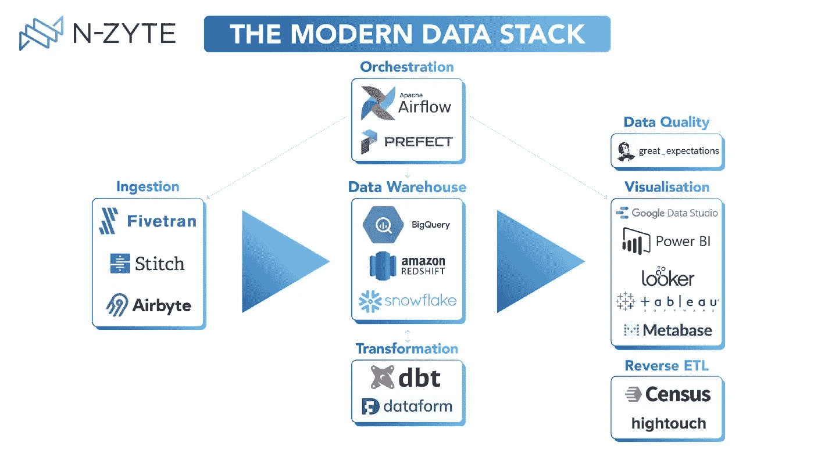
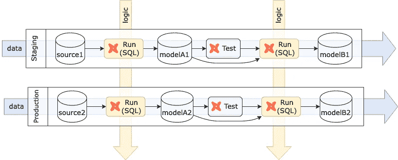
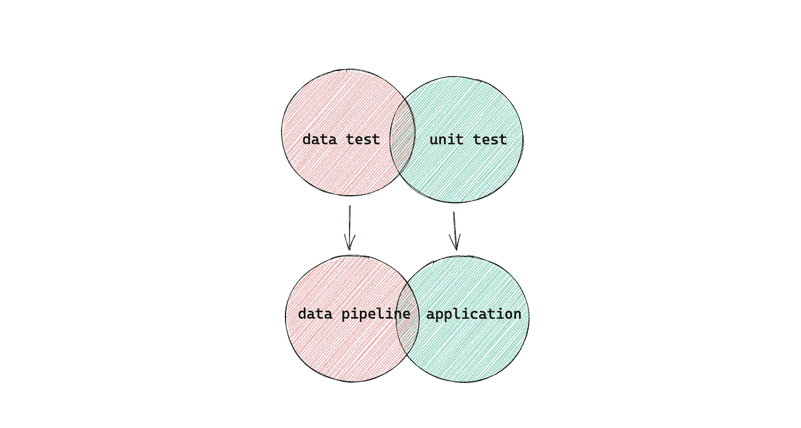
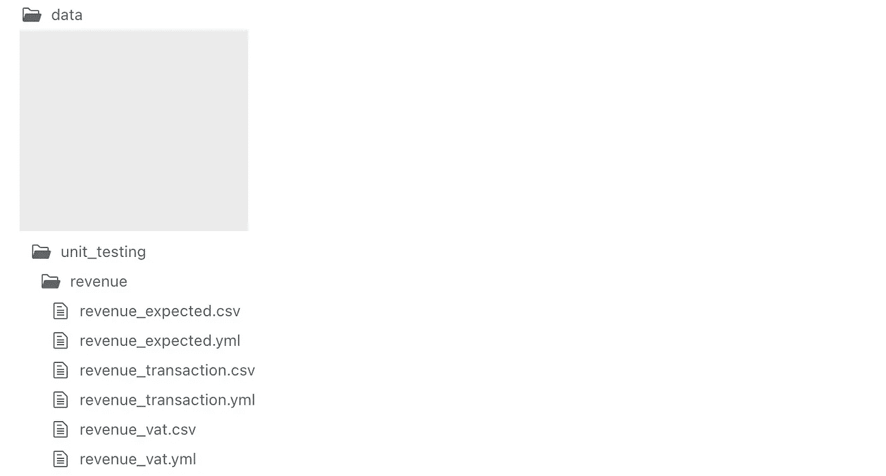

# 如何在 dbt 中进行单元测试

> 原文：<https://towardsdatascience.com/how-to-do-unit-testing-in-dbt-cb5fb660fbd8>

## 解决测试数据管道的挑战


克劳迪奥·施瓦茨在 [Unsplash](https://unsplash.com/) 上的照片

在最近几年，我们已经看到了构建数据堆栈的技术和工具的巨大发展。现在，在没有大量投资的情况下，构建现代数据管道比以往任何时候都更容易。标准的现代数据堆栈包括但不限于:

*   云优先数据仓库—一个高度可扩展的分布式云数据仓库，允许使用 SQL 转换万亿字节的数据。BigQuery、雪花、亚马逊红移目前市场领先。
*   工作流程编排—以编程方式安排和监控数据转换的平台。数据仓库只是来自不同来源的集成数据的中央存储库。我们需要一个像 Airflow 和 dbt 这样的平台，将原始数据转换成对业务有意义的干净数据。与数据仓库不同，许多编排工具是开源的，基础设施由数据团队维护，因此工程师们提出了许多最佳实践，如如何构建 CICD 管道、执行测试、监控、警报等。本文就是其中的一篇，主要讨论 dbt 中的测试。
*   商业智能—一种工具，允许每个人通过创建仪表板来探索数据和自助服务他们的数据请求。示例工具有 Tableau 和 Looker。员工应该能够利用该工具进行决策。



照片由[达尼洛·德罗巴克](https://medium.com/u/755512a464bb?source=post_page-----cb5fb660fbd8--------------------------------)从[中](https://medium.com/@danilo.drobac/the-modern-data-stack-4f0094017edb)拍摄

如题，在本文中，我们将回答一个问题:如何在 dbt 中执行单元测试？在看到解决方案之前，让我们先了解一下 dbt 的背景，它的测试策略，以及为什么它对 dbt 是一个挑战？

## dbt

[dbt](https://www.getdbt.com/) 是一个基于 SQL 的数据转换工具，支持数据分析师和工程师转换、测试和记录云数据仓库中的数据。工程师利用领域专业知识创建可重用的数据模型。公司中的任何人都可以使用数据模型来帮助他们决策。

## dbt 中的数据测试

为了确保数据模型的正确性，我们需要应用不同类型的测试。dbt 中必备的一个[测试是**数据测试**。这是确保数据质量的一个完整步骤。工程师通常会对管道做出假设:源数据是有效的，模型是合理的，转换后的数据是准确的。但事实通常并非如此。应进行一系列测试以确保数据质量。由于源数据每天都在变化，这些测试应该是生产管道中运行时测试的一部分。根据严重程度，一些测试可能会堵塞管道，以免污染下游。这里我列出了一些常见的数据质量测试:](https://docs.getdbt.com/docs/building-a-dbt-project/tests)

*   空值-检查不应有空值的列。
*   唯一性检查—几列的组合应该是唯一的，以避免重复。
*   [新鲜度检查](https://docs.getdbt.com/reference/resource-properties/freshness) —模型是否包含最近的记录？
*   关系检查-源表中的所有必需数据是否都转换到了目标表中？
*   …

像 [dbt-utils](https://github.com/dbt-labs/dbt-utils#generic-tests) 这样的一些 dbt 包提供了一系列现成的通用测试，可以满足大多数需求。为了更好地理解数据测试的作用，让我们把它形象化:



创作人[高](https://medium.com/u/2adc5a07e772?source=post_page-----cb5fb660fbd8--------------------------------)

水平路径是通过数据管道的数据流。每个环境中的数据可能不同，因此数据质量测试应该在生产流程中运行，以确保对源数据的假设总是有效的。

够不够？

## dbt 中的单元测试

数据测试可以发现数据质量问题。但是不能保证 SQL 代码的正确性。下面是一个 SQL 示例，它将`revenue`与`vat`表连接起来，以计算净预订和增值税金额。仅从数据测试很难知道公式或连接逻辑是否正确。

```
SELECT
  date
  , city
  , SUM(amount_net_booking) as amount_net_booking
  , SUM(amount_net_booking * (1 - 1/(1 + vat_rate))) as amount_vat  
FROM revenue
LEFT JOIN vat USING (city)
GROUP BY 1,2
```

我们在这里错过的是测试 SQL 逻辑(也称为单元测试)的功能，就像测试常规应用程序一样。如果我构建一个应用程序，我会应用 TDD(测试驱动设计)，这是一种常见的软件工程实践，可以帮助我们在正确性方面达到一个良好的信心水平。在推广到生产之前，它确保逻辑是正确的。

虽然 dbt 是一个强大的框架，但我们仍然从头开始编写一堆 SQL 代码来构建模型。只要是人类写的，都有可能出错。这和写一个 Python，Java 程序没什么区别。我们可以将 dbt 模型看作一个函数，其中输入是源表，输出是 SQL 的结果。**dbt 中的单元测试是这样一种测试，我们提供模拟输入，然后对照预期的模型检查结果。**单元测试的一大优势是我们可以为所有类型的测试用例提供模拟输入，包括边缘用例。这对于涉及复杂业务逻辑的 SQL 代码尤其有用。如果是一个模型链，我们可以向第一个模型提供模拟输入，并断言最终模型和中间模型的结果。这个测试链被称为集成测试。

与数据测试不同，没有必要将单元测试集成到数据管道中，因为在提升到更高的环境后，代码不会被更改。我们不需要对逻辑做任何假设，因为我们已经完全控制了它。只要在下层环境下验证了逻辑，就应该信任它，发布代码。

## 数据管道中的数据测试与应用程序中的单元测试



由创作[高](https://medium.com/u/2adc5a07e772?source=post_page-----cb5fb660fbd8--------------------------------)

虽然数据管道中的数据测试和常规应用程序中的单元测试是两个不同的概念，但它们有共同的领域。例如，当构建 REST API 接口时，应用程序从外部接收数据，这可能是不可靠的。它必须在处理数据之前验证数据(也称为执行数据质量检查)。尽管大多数软件工程师不认为这是一个标准测试，但这种类型的运行时验证非常类似于数据管道中的数据测试。

在另一种情况下，测试可以被认为是数据测试和单元测试，例如关系检查(例如字段`a`和`b`的和等于`c`)。作为一名工程师，理解测试的目标是很重要的，无论是测试动态的数据还是测试静态的逻辑。如果它是关于逻辑的，那么它应该是单元测试，并且只在 CICD 管道中执行一次。如果是关于数据的，那么由于数据的差异，它应该是生产流水线的一部分。数据测试的几个例子:

*   源数据中有空值吗？
*   数据包含最近的日期吗？
*   来自源的每条记录都被转换到目的地了吗？
*   有没有超出可接受范围的数值？
*   代码中有重复的地方吗？

单元测试的几个例子:

*   该模型计算公司的收入，计算是否正确？
*   该模型包含一些 IF 条件来计算一个字段，我是否遗漏了任何边缘情况？
*   该模型在几列上进行聚合，我是否遗漏了任何一列？

成熟的数据团队利用自动化数据质量检查和自动化逻辑测试，确保数据对公司具有最高的价值。

## dbt 中单元测试的实现

为了演示单元测试如何在 dbt 中工作，我创建了下面的数据管道，它读取两个源表`transaction`和`vat`，然后将数据转换成最终的模型`revenue`。作为一名数据工程师，我不一定知道初始阶段的每个逻辑细节，所以我基于某种假设创建了这个模型。


世系图(由[高](https://medium.com/u/2adc5a07e772?source=post_page-----cb5fb660fbd8--------------------------------)制作)

由于这是一个关键而复杂的模型，我想用几个预定义的场景来测试它，并为此创建模拟数据。模拟数据是我的 dbt 项目中的 CSV 文件，其中每个 CSV 文件代表一个源表。我们可以将 CSV 文件存储在`data`文件夹中，并利用`[dbt seed](https://docs.getdbt.com/docs/building-a-dbt-project/seeds)`命令将数据加载到数据仓库中。



文件夹结构(由[高](https://medium.com/u/2adc5a07e772?source=post_page-----cb5fb660fbd8--------------------------------)创建)

> 关于如何/由谁创建模拟数据的一些话。为了确保测试用例的完整性，编写代码的人不应该同时提供测试数据。在许多公司中，分析师或业务涉众是提供测试用例或测试数据的人。

通常，模拟数据不应该与真正的源表混淆。最好将它存储在一个单独的模式中(例如 unit_testing)。我们可以在`dbt_project.yml`文件中定义这个。`unit_testing/revenue`文件夹中的每个文件都将被加载到`unit_testing`模式中。`[tags](https://docs.getdbt.com/reference/resource-configs/tags)`在选择车型时也发挥着重要作用。当运行`dbt build -s +tag:unit_testing`时，它将运行标签为`unit_testing`的所有种子/模型/测试/快照及其上游。

```
seeds:
  unit_testing:
    revenue:
      schema: unit_testing
      +tags:
        - unit_testing
```

出于演示的目的，我的 dbt 模型比现实相对简单。

收入模型(由高[创建](https://medium.com/u/2adc5a07e772?source=post_page-----cb5fb660fbd8--------------------------------)

你发现问题了吗？

问题出在源表。像往常一样，我使用`{{ source() }}`来引用实际的源表。但是我的模拟数据在一个单独的模式中，它们应该通过使用`ref`函数来引用，因为它们是种子。我要怎么切换信号源？为了解决这个问题，我创建了一个**自定义宏，它能够根据环境或某种触发器来切换源表。**

select _ 表宏(由[高](https://medium.com/u/2adc5a07e772?source=post_page-----cb5fb660fbd8--------------------------------)创建)

这个宏有两个输入参数:`source_table` - >表有真实数据，`test_table` - >表有模拟数据。宏根据`dbt`命令中的变量返回表格。如果命令没有提供`unit_testing`变量或者值为`false`，则返回`source_table`，否则返回`test_table`。你可以根据自己的情况修改这个宏，比如基于`[target](https://docs.getdbt.com/reference/dbt-jinja-functions/target)`而不是变量来切换表。

`dbt`使用模拟数据运行模型和测试的命令

```
dbt build -s +tag:unit_testing --vars 'unit_testing: true'
```

`dbt`使用真实数据运行模型的命令。(稍后将在此解释我们为什么需要`--exclude`标志)

```
dbt build -s +tag:revenue --exclude tag:unit_testing
```

更新后的模型现在看起来像这样。我们使用变量`{{ import_* }}`来表示正确的源表。

更新的收入模式(由高[创建](https://medium.com/u/2adc5a07e772?source=post_page-----cb5fb660fbd8--------------------------------)

到目前为止，我们已经看到了如何选择正确的源表并在模拟输入上运行模型。接下来，我们将比较实际输出和预期的模拟输出。我们可以利用 dbt-utils 提供的`[equality](https://github.com/dbt-labs/dbt-utils/tree/0.7.2/#equality-source)`测试来比较两个模型。在`compare_model`中，我们指的是预期输出模型。

值得注意的是，我们不应该在测试中忘记`tags: ['unit_testing']`。正如我们之前所说的，单元测试不应该作为生产流水线的一部分运行。在生产中运行这个`equality`测试实际上意味着我们将生产模型与永远不会工作的模拟输出进行比较。添加标签`unit_testing`和运行命令`dbt build -s +tag:revenue --exclude tag:unit_testing`可以确保在生产中跳过测试。

哇，我希望你还在关注我:)让我们来看看不同的比较模型的方法。`dbt_utils.equality` test 对模型进行精确匹配，但由于精度问题，在比较数字时会变得棘手。解决这个问题的一个方法是创建一个自定义宏，首先对数字列进行舍入，然后进行比较。

自定义宏比较模型(由[高](https://medium.com/u/2adc5a07e772?source=post_page-----cb5fb660fbd8--------------------------------)创建)

只要有助于你发现不同之处，你就可以发挥创造力。

## 我们完全安全吗？

不幸的是，没有。单元测试给了我们用自定义场景测试逻辑的可能性。但问题是:**这些场景是否涵盖了一切？**大概不会。有两个问题:

**很难提供涵盖所有排列的完美数据集——未知的已知**

源数据经常是多种多样的，找出所有可能的组合并为每个组合创建测试数据非常耗时。其中一个策略是预先创建一个单独的层，过滤掉无效的数据并进行一些完整性检查。它在某种程度上限制了排列的数量，所以我们对将要发生的事情更有信心，可以创建相对有限的数据集。

**甲骨文问题—(不)已知未知**

在我看来，这是一个哲学问题。每次测试都是实际输出和预期输出的比较。

> [Oracle 问题](https://www.yld.io/blog/the-oracle-problem/)指难以确定预期产出的情况。基本上，人类从来没有足够的装备来测试他们的程序，因为现实总是比它在测试套件中的表现更复杂。

如前所述，数据源是复杂的。有很多情况我们不知道如何处理。一个简单的策略是使用一种逻辑来处理所有未知的情况，并以此作为答案。想想`else`在一个 if 条件中的作用。

如果这还不够，那我们就只能忍受了。人类每天都在获取新的知识，程序也是如此。随着我们发现更多的问题，更多的未知将转化为已知，因此我们将能够捕捉越来越多的信息，并每天更好地了解这个世界。

## 结论

希望这篇文章对你有用。如果您确信并开始在您的数据管道中应用单元测试，那就太好了！如果您没有立即被说服，但是仍然希望从这篇文章中获得一些收获，那么它将是理解单元测试和数据测试在数据管道中的作用，因为您有一天会需要它。如果你对数据管道测试有任何想法，请在评论中告诉我们。干杯！

## 参考

[](https://medium.com/slalom-build/the-challenge-of-testing-data-pipelines-4450744a84f1)  [](https://github.com/EqualExperts/dbt-unit-testing) 