# 如何对接用 H2O、MLflow、FastAPI 和 Streamlit 构建的机器学习应用

> 原文：<https://towardsdatascience.com/how-to-dockerize-machine-learning-applications-built-with-h2o-mlflow-fastapi-and-streamlit-a56221035eb5>

## 用 Docker 容器化多服务 ML 应用的简单指南


Philippe Oursel 在 [Unsplash](https://unsplash.com?utm_source=medium&utm_medium=referral) 上的照片

鉴于 Docker 在可靠地构建、发布和运行机器学习(ML)应用程序方面令人印象深刻的能力，它在数据科学领域的采用呈爆炸式增长并继续激增也就不足为奇了。

本文解释了如何利用 Docker 来封装一个用 H2O AutoML、MLflow、FastAPI 和 Streamlit 构建的多服务 ML 应用程序。

# 内容

> ***(1)***[*Docker****(2)***](#8d02)[*ML 应用概述*](#df7f)***(3)***[*后端设置— H2O、 ml flow&FastAPI*](#bf2e)***(4)***[*前端设置—Streamlit*](#9fda)***(5)***[*设置 Docker 撰写*](#8c3e)

*你可以在这里 找到这个项目 [**的 GitHub 回购。**](https://github.com/kennethleungty/End-to-End-AutoML-Insurance/)*

# *(1)码头上的底漆*

*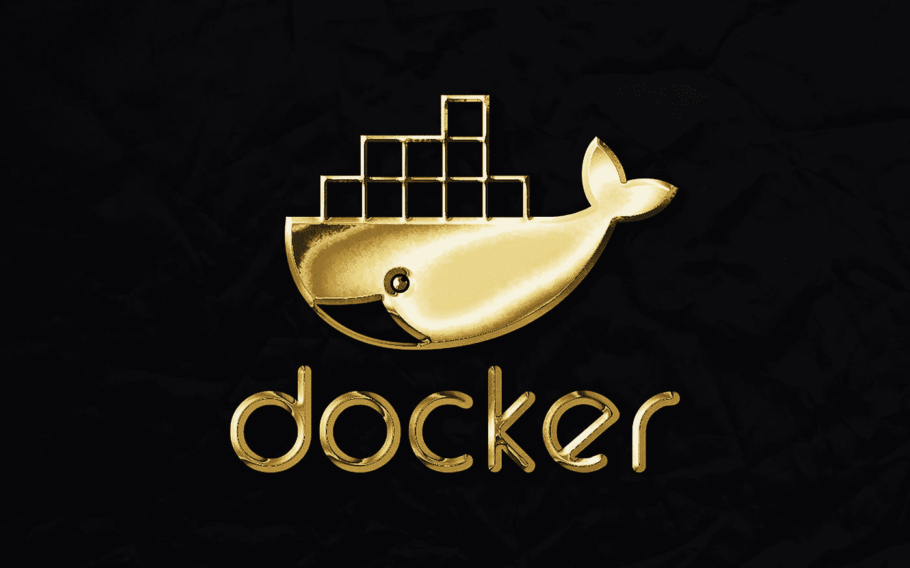*

*[Rubaitul Azad](https://unsplash.com/@rubaitulazad?utm_source=medium&utm_medium=referral) 在 [Unsplash](https://unsplash.com?utm_source=medium&utm_medium=referral) 上拍摄的照片*

*[**Docker**](https://www.docker.com/) 是一个开源平台服务，它让我们可以使用容器轻松地构建、打包、部署和运行应用程序。*

*它的工作原理是将应用程序组件(即源代码、依赖项、库)打包成一个单独的可移植包(即容器)。*

*有了容器，任何使用不同机器的人只需几行代码就可以可靠地启动和运行相同的应用程序。*

*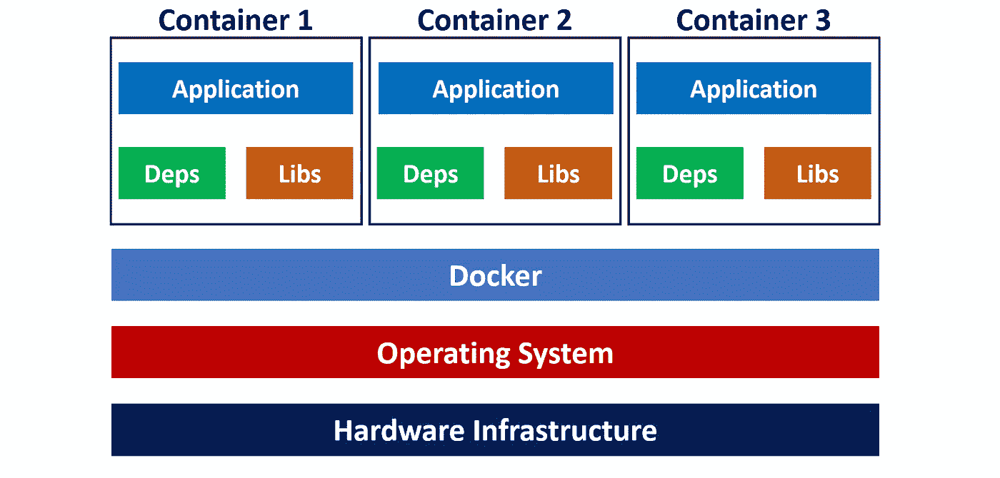*

*Docker 容器与底层基础设施的分离|按作者分类的图片*

*这些容器将应用程序从底层基础设施中分离出来，允许团队在不同的环境中快速一致地交付软件。*

*以下是该项目的关键 Docker 组件:*

*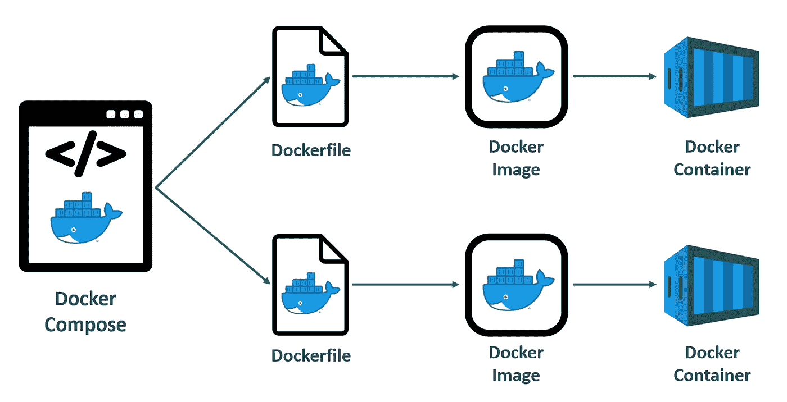*

*Docker 关键组件的概述和流程|按作者分类的图片*

*   *Dockerfile :一个文本文档，包含关于构建 Docker 图像的说明。它可以被视为具有 Docker 引擎组装映像的特定命令的配方，例如下载要求、复制文件等。*
*   ***Docker Image** :一个只读模板，包含可执行源代码以及应用程序运行所需的库和依赖项。当您运行 Docker 映像时，它会生成容器的一个实例。*
*   ***Docker 容器**:Docker 图像的一个实时运行实例。*
*   ***Docker Compose** :定义和编排多个容器的构建和共享的配置文件。*

*使用 Docker 最简单的方法是使用 **Docker Desktop** ，它提供了一个简单的用户界面来构建和共享容器化的应用程序。*

*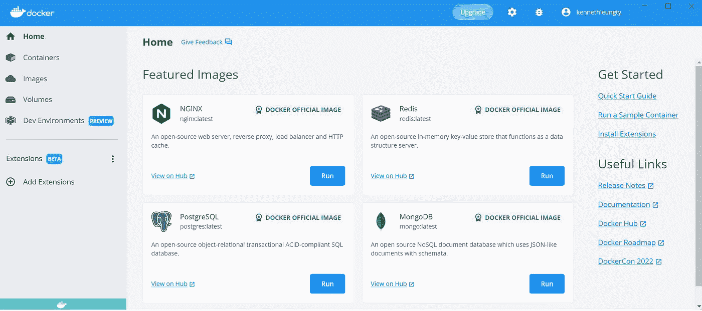*

*Docker 桌面|图片作者登陆页面截图*

*就像 GitHub Desktop 如何用 Git 简化开发一样，Docker Desktop 让我们使用 Docker 变得很容易。*

*您可以根据您的操作系统安装合适的 Docker 桌面版本，即 [Windows](https://docs.docker.com/desktop/windows/install/) 、 [Mac](https://docs.docker.com/desktop/mac/install/) 或 [Linux](https://docs.docker.com/desktop/linux/install/) 。*

*本项目中使用的其他工具包括:*

*   *[**【Visual Studio 代码(VSCode)**](https://code.visualstudio.com/download) —编写 Python 脚本的代码编辑器*
*   *[**Anaconda Powershell 提示**](https://www.anaconda.com/products/distribution)**——**命令行界面(CLI)运行 Python 任务并与 Docker 交互*
*   *Python 3.9(附带了 [**Anaconda 发行版**](https://www.anaconda.com/products/distribution) )*

# *(2)ML 应用概述*

*我们将使用的应用程序基于一个早期的项目，在该项目中，我们构建了一个端到端的 ML 管道，以**对购买额外车辆保险的可能性较高的健康保险客户进行分类**(即交叉销售)。*

*[](/end-to-end-automl-train-and-serve-with-h2o-mlflow-fastapi-and-streamlit-5d36eedfe606)  

我们将不讨论管道构建，因此请参考上面的文章了解详细信息。

以下是该应用程序中组件的概述:

*   **H2O 汽车—** 在一系列实验中自动训练 ML 模型
*   **MLflow —** 跟踪每个 AutoML 实验的结果和工件，并根据性能指标选择最佳模型
*   **FastAPI —** (通过[**uvicon**](https://www.uvicorn.org/)**服务器)部署和公开最佳模型作为 API 端点**
*   ****Streamlit —** 将 API 端点作为一个 web 应用程序，为模型预测请求提供一个简单的用户界面**

**最终产品是一个用户友好的 web 应用程序，用户可以上传数据并检索每个客户相应的交叉销售预测。**

**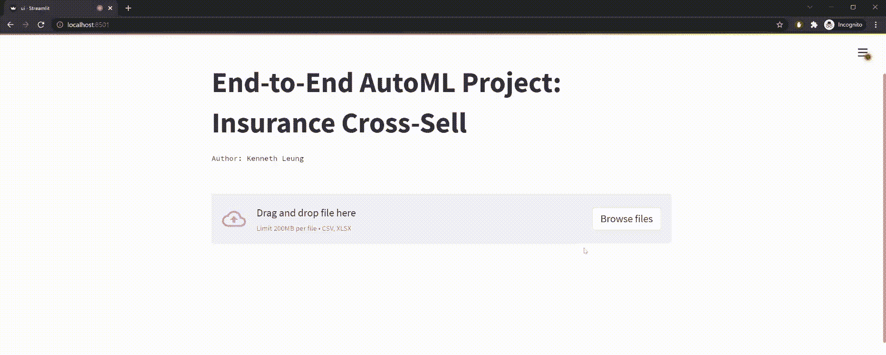**

**Streamlit web 界面上传客户数据并检索模型预测|作者 Gif*** 

***如下图所示，整个应用程序可以分为两个服务(**前端**和**后端**)。***

***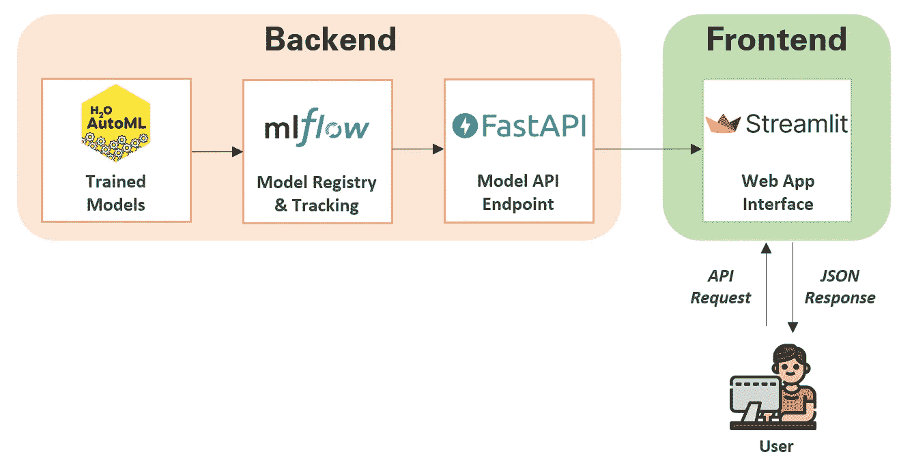***

***应用程序组件概述|按作者分类的图片(通过公共许可证获得的徽标)***

***在这一点上，我们有了各种组件的源代码和工件(即，预先训练的模型、API 端点、web 应用程序接口)。让我们学习如何用 **Docker** 封装整个应用程序。***

# ***(3)后端设置— H2O、MLflow 和 FastAPI***

***应用程序有两个部分(即**前端**和**后端**)，所以我们将它们打包到两个独立的容器中，然后将它们链接到同一个网络中。***

***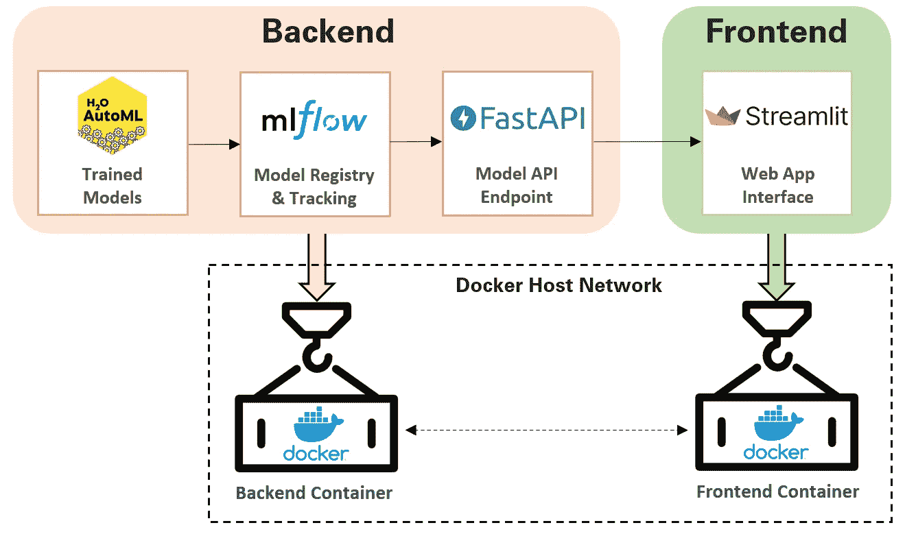***

***后端和前端服务的分类|按作者分类的图片***

***我们从探索如何容器化**后端**设置开始。后端目录结构如下:***

***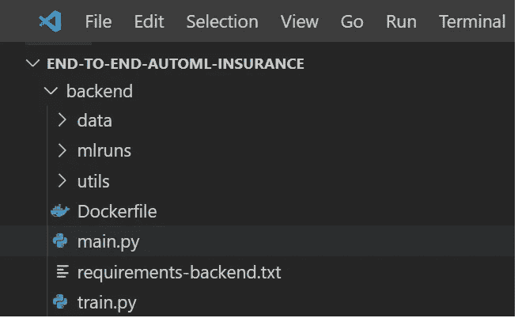***

***后端目录结构|作者图片***

***后端设置的源代码可以在 [**main.py**](https://github.com/kennethleungty/End-to-End-AutoML-Insurance/blob/main/backend/main.py) 中找到，它在这里执行以下任务:***

*   ***初始化 FastAPI、H2O 和 MLflow 客户端的实例***
*   ***使用 MLflow 客户端从`/mlruns`中存储的预训练模型集合中跟踪并加载最佳 H2O ML 模型(基于测井损失)***
*   ***创建一个 FastAPI POST 端点，该端点获取并处理上传的数据，将数据提供给 ML 模型，并以 JSON 格式返回模型预测***

***dockerizing 的第一步是构建 **Dockerfile** ，我们将使用它来创建应用程序的 **Docker 映像和容器**。***

***我们将专门为后端设置创建一个 Dockerfile，并将其保存在`/backend`目录中。后端设置的**文件**如下所示:***

***让我们了解一下 Dockerfile 文件的内容:***

*   *****来自 python:3.9** —从 Docker Hub 获取 python 映像(3.9 版)，并创建构建 Docker 映像的基础层。***
*   *****工作目录/应用** —定义 Docker 容器的工作目录***
*   *****运行** —执行特定命令，例如安装 pip 依赖关系。***
*   *****复制** —将文件从源文件夹(即 Docker 客户端的当前目录)复制到目标文件夹***
*   *****EXPOSE** —表示容器监听连接的端口***
*   *****CMD** —指定在 Docker 容器中运行的命令:***

```
***uvicorn main:app --host 0.0.0.0 --port 8000***
```

***上面的命令指示机器启动并托管位于 [IP 地址 0.0.0.0](https://superuser.com/questions/502625/what-is-ip-address-0-0-0-0) (端口 8000)的 uvicorn 服务器，并在 **main.py** 文件(即 main **:** app)中定位 FastAPI ASGI 应用程序。***

***因为 H2O 服务器需要 Java，我们还需要运行下面的命令在我们的容器中安装一个 [Java 运行时环境(JRE)](https://www.digitalocean.com/community/tutorials/how-to-install-java-with-apt-on-ubuntu-22-04) 。***

```
***RUN apt-get update && apt-get install -y **default-jre*****
```

***如果不执行上述操作，我们将会遇到 H2OStartupError，此时 H2O 服务器找不到 Java。***

***我们后端设置的 docker 文件现在已经准备好了。构建 Docker 映像和运行容器的经典方法分别是使用`docker build`和`docker run`。***

***除非是为了测试目的，否则我会避免在这个阶段单独构建容器。原因是我们将在步骤 5 中学习如何使用 **Docker Compose** 来构建和并发运行多个容器。***

# ***(4)前端设置—简化***

***让我们把注意力转向构建前端接口。前端目录结构如下:***

***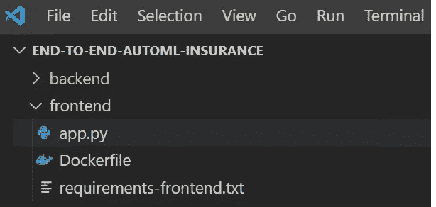***

***前端目录结构|作者图片***

***前端设置的源代码可在 [**app.py**](https://github.com/kennethleungty/End-to-End-AutoML-Insurance/blob/main/frontend/app.py) 中找到，它在其中执行以下任务:***

*   ***定义前端接口与后端 FastAPI 端点通信的端点位置，即`endpoint = 'http://**host.docker.internal**:8000/predict'`***
*   ***构建 Streamlit web 界面，包括用于 CSV 文件上传、数据预览和预测下载的组件***
*   ***将 CSV 数据转换为要解析到 FastAPI 端点的 bytes 对象***

***前端设置的**文件**如下所示:***

# ***(5)设置 Docker 组件***

***虽然我们可以单独构建后端和前端容器，但这并不是创建像我们这样的互连多容器应用程序的最佳方式。***

***我们可以利用 [Docker Compose](https://docs.docker.com/compose/) 的功能来定义和运行多容器应用程序。Docker Desktop 已经安装了撰写插件，所以不需要额外安装。***

***Docker Compose 是在 YAML 配置文件(`docker-compose.yml`)中定义的，它指定了构建应用程序的设置和指令。***

***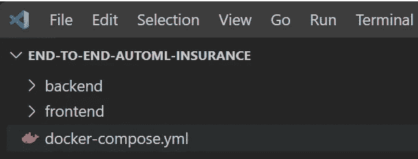***

***docker-compose.yml 放在根文件夹| Image by author 中***

***[*docker-compose . yml*](https://github.com/kennethleungty/End-to-End-AutoML-Insurance/blob/main/docker-compose.yml)文件如下图所示:***

***让我们了解一下 *docker-compose* 文件的内容:***

*   *****服务** —定义组成应用程序的服务(即后端和前端)，以便它们可以在一个隔离的环境中一起运行***
*   *****构建** —指定构建 Docker 图像的文件夹。由于我们从根文件夹运行 *docker-compose* ，我们将指定要构建的子目录，即`backend`或`frontend`。对于我们直接从根文件夹构建的情况，我们可以指定`.`***
*   *****image** —指定从中启动服务容器的图像。由于我们在**构建**部分从头开始构建映像(而不是从注册表中提取)，这里的值将是新映像的名称，例如*e2e-自动-前端:最新****
*   *****端口** —暴露容器端口。该配置将容器端口映射到主机端口，以便我们可以通过 web 浏览器上的 localhost URL 访问应用程序。例如，`8501:8501`是指主机端口 8501 到容器端口 8501 的映射(即`HOST:CONTAINER`)。对于后端服务，我们有两个公开的端口，其中 8000 用于 FastAPI 端点，而 54321 用于 H2O 服务器。***

***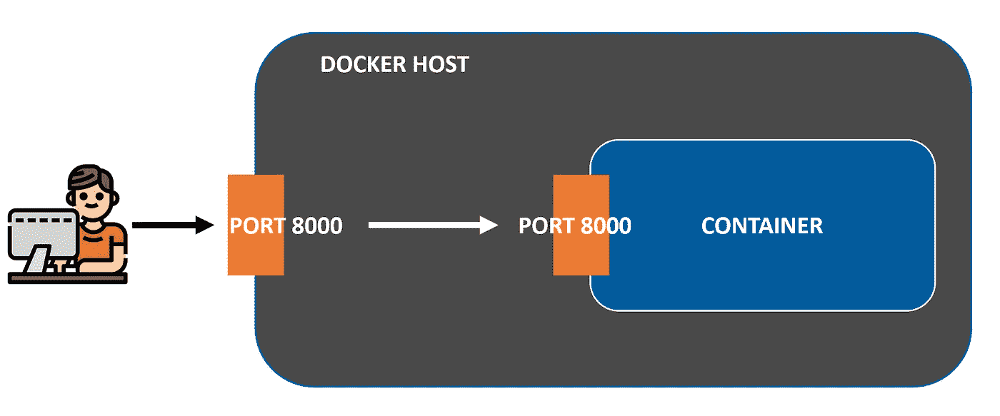***

***端口映射图|作者图片***

*   *****卷** —定义一个[卷](https://docs.docker.com/storage/volumes/)，用于保存 Docker 容器生成的数据。它是以`VOLUME:CONTAINER_PATH`的形式出现的。例如，`./backend:/app/backend`是指从相对路径 ***挂载卷内容。/backend*** (我们的后台目录)放入 ***/app/backend*** 容器中。***
*   *****依赖于** —表示服务之间的启动(和关闭)依赖关系。在我们的例子中，我们希望在前端服务之前创建后端服务。因此，我们在前端服务中包含了一个 *depends_on: backend* 语句。***
*   *****网络** —定义容器所连接的网络，引用顶级`networks`键下的条目。我们通过将两个服务连接在同一个`project_network`网络下，使它们相互通信。***

****注意:基于最新的* [*编写规范*](https://docs.docker.com/compose/compose-file/) *，不再需要在 YAML 文件中定义顶层版本属性(如 v2、v3)。****

# ***(6)本地运行 Docker Compose***

***是时候执行我们的 *docker-compose* 文件来构建我们的多服务应用程序了。我们通过从根文件夹运行以下命令来实现这一点:***

```
***docker-compose up -d --build***
```

***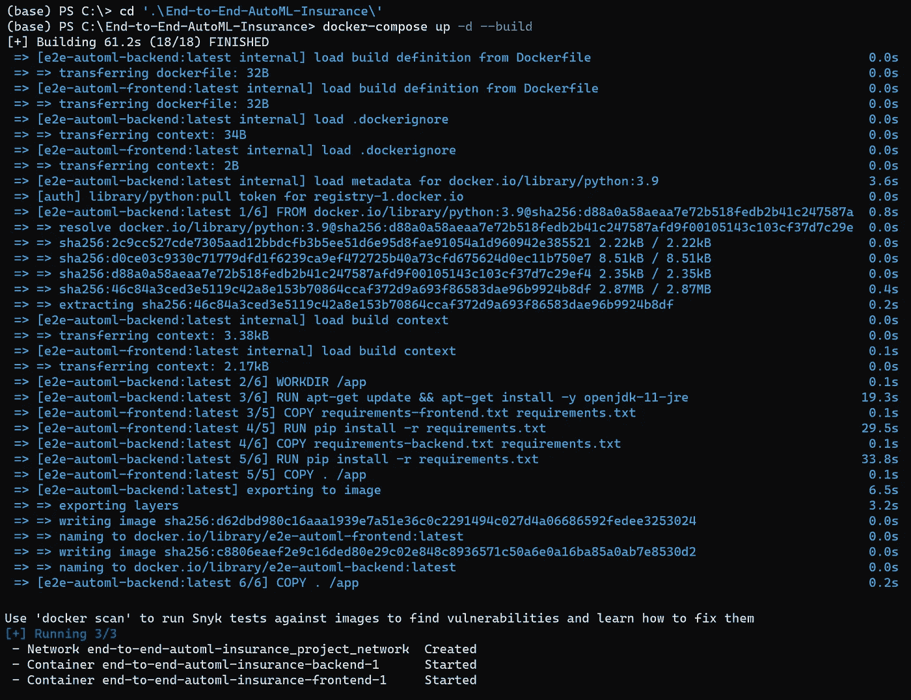***

***运行 docker-compose 命令| Image by author 后的 CLI 输出***

***然后，我们可以检查 Docker Desktop，看看我们是否已经成功地为两个服务构建了映像，并让应用程序在本地运行。***

***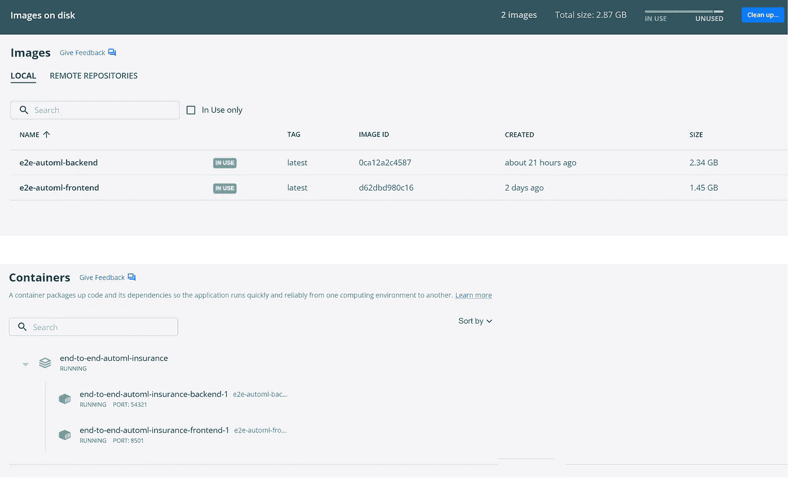***

***Docker 桌面上成功创建图像和容器的截图|作者图片***

***最后，我们可以通过在 web 浏览器上访问`localhost:8501`来测试我们的应用程序。***

***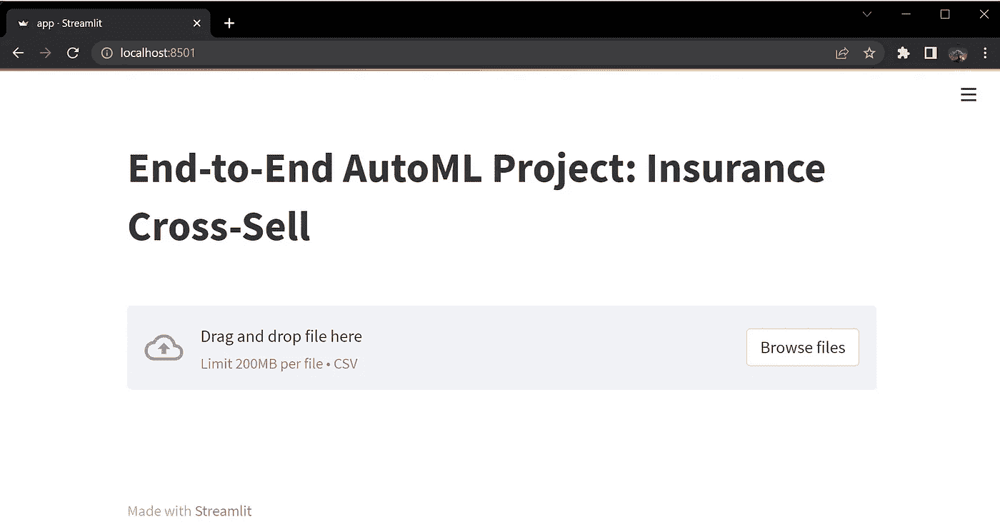***

***after 化后成功加载前端界面|图片由作者提供***

***从这里，我们还可以通过运行`docker-compose down`轻松地停止和删除容器、网络、卷和映像***

# ***(7)在 AWS 上部署 Docker 容器***

***已经学会了如何在本地对接和运行我们的 ML 应用程序，直观的下一步是在云上部署这个容器化的应用程序**，例如 AWS。*****

***虽然我想演示这个云部署，但是 Docker 文档已经很好地解释了在 Amazon ECS 上部署 Docker 容器。***

***[](https://docs.docker.com/cloud/ecs-integration/)  

尽管如此，我打算很快就这个项目在其他云平台上的部署写一个指南，所以请继续关注这个中型页面！*** 

# ***包装它***

***通过上面的简单演练，我们已经了解了如何使用 Docker 来封装基于 H2O、MLflow、FastAPI 和 Streamlit 构建的多服务 ML 应用程序。***

***你可以在这个 [**GitHub repo**](https://github.com/kennethleungty/End-to-End-AutoML-Insurance/) 中找到这个项目的源代码和文件。***

# ***在你走之前***

***欢迎您**加入我的数据科学学习之旅！**点击此[媒体](https://kennethleungty.medium.com/)页面，查看我的 [GitHub](https://github.com/kennethleungty) ，了解更多令人兴奋的数据科学内容。同时，祝你的 ML 应用程序归档愉快！***

***[](/build-an-anomaly-detection-pipeline-with-isolation-forest-and-kedro-db5f4437bfab)  [](/micro-macro-weighted-averages-of-f1-score-clearly-explained-b603420b292f)  [](https://kennethleungty.medium.com/membership) ***