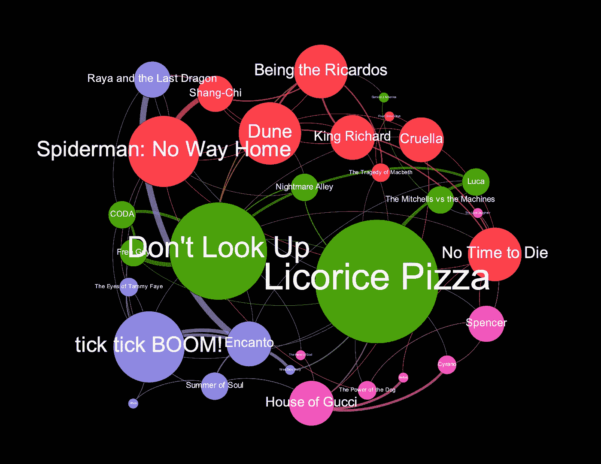
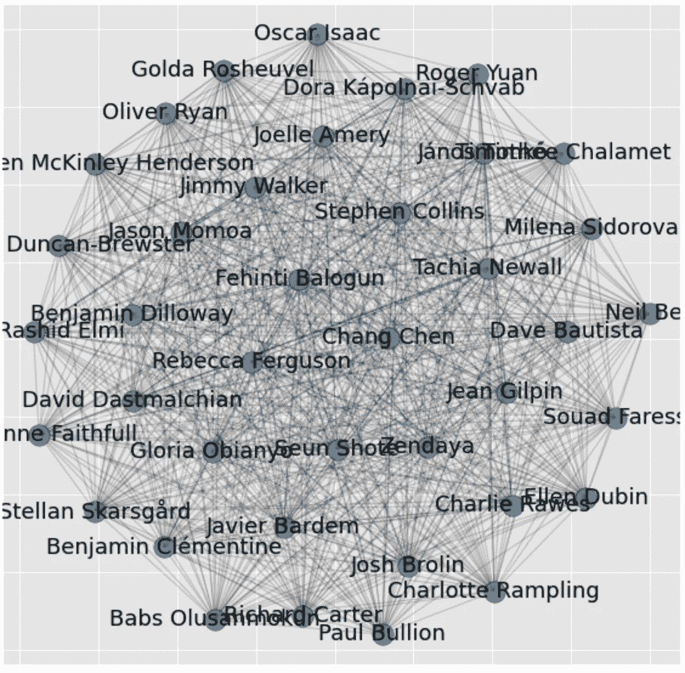
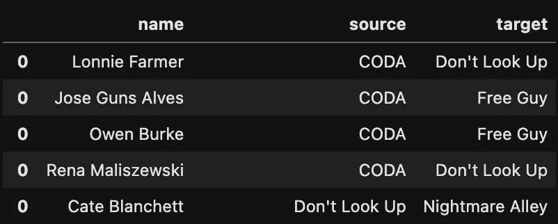
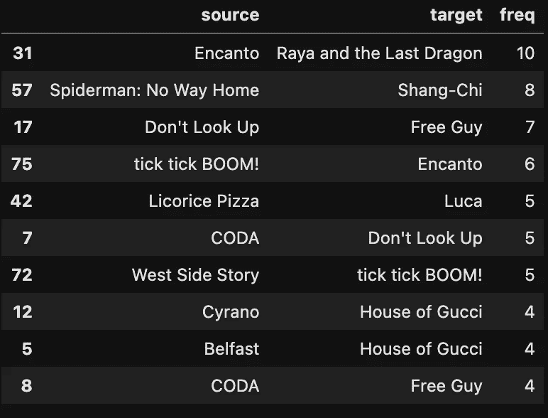
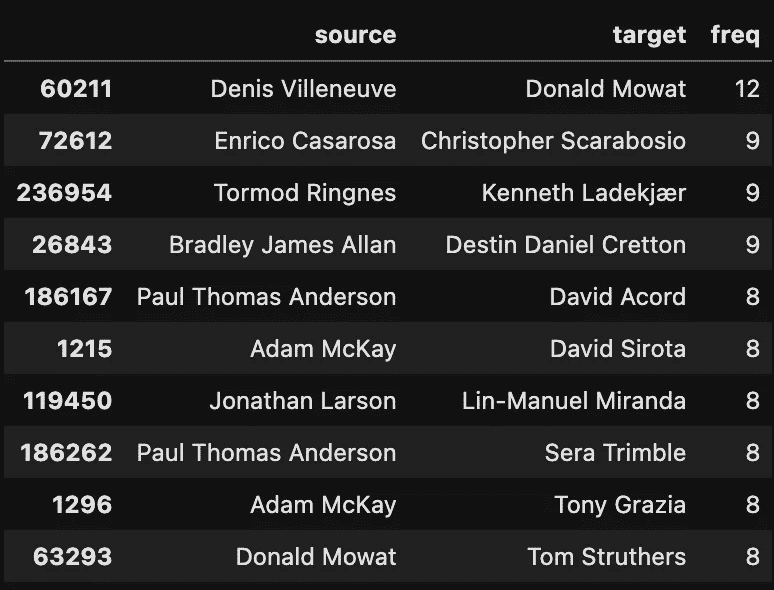
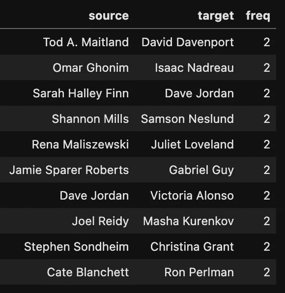
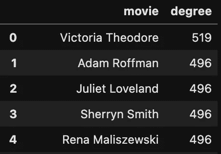
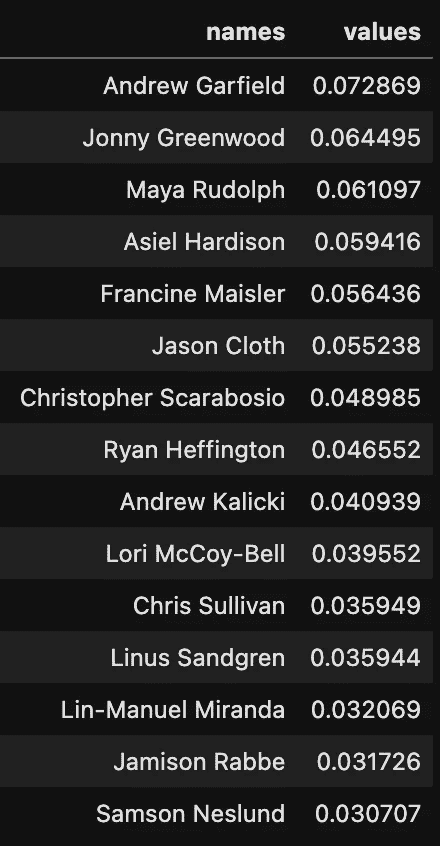
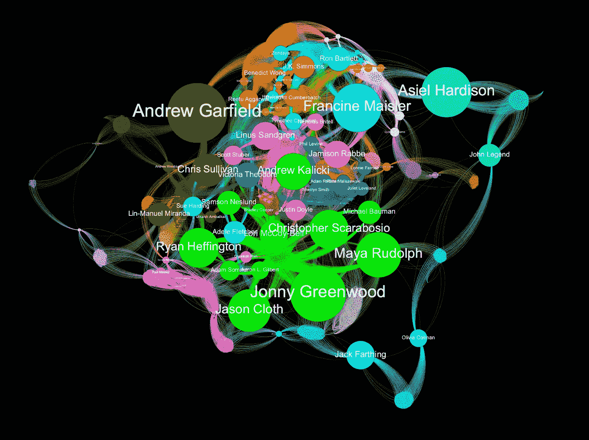

# 如何下载和浏览电影数据

> 原文：<https://towardsdatascience.com/how-to-download-and-explore-movie-data-1948a887c530>



## 使用 TMDB API 和 python 通过网络分析探索 2022 年奥斯卡提名

又到了莫伊拉·罗斯最喜欢的季节——颁奖！我认为这将是一个很好的机会来对 2022 年奥斯卡提名做一些网络分析，并与 TMDB API 玩玩。本教程将带您了解:

*   向 TMDB API 查询所有 2022 奥斯卡提名电影的演员和工作人员的完整列表，
*   从数据中提取网络，
*   并对提取的图形做一些简单的数据分析和网络分析

请尽情享受，并随时在底部提出您的任何问题或疑问！[如果你想作为参考，这里有一个链接](https://github.com/SteveHedden/FilmClub/tree/master/2022OscarNoms)指向我的 GitHub 上的代码。

# 查询 TMDB API

首先，感谢 [Monica Powell](https://dev.to/m0nica) 撰写了[这篇文章](https://dev.to/m0nica/how-to-use-the-tmdb-api-to-find-films-with-the-highest-revenue-82p)，它帮助我理解了 TMDB API。

要开始，你需要去 [TMDB 站点](https://www.themoviedb.org/)获取一个 API 密匙。要获得 API 密钥，只需访问该网站，注册一个新帐户，并使用您的新帐户生成一个新的 API 密钥。它们让事情变得非常简单，我很快就能拿到钥匙。

有了密钥后，创建一个 config.py 文件，将密钥与代码放在一起:

```
tmdb_api_key = "YOUR API KEY”
```

这不是绝对必要的，但是养成将 API 键存储在配置文件中而不是直接存储在代码中的习惯是一个好主意，尤其是如果您打算将它发布在 GitHub 上的话。你不想与任何人共享你的 API 密匙，所以把密匙放在一个单独的文件中允许你共享你的代码而不共享你的密匙。

现在我们可以开始从 TMDB 提取数据，并在 Jupyter 笔记本上进行处理。首先，让我们导入我们的包:

```
import config # to hide TMDB API keys
import requests # to make TMDB API calls
locale.setlocale( locale.LC_ALL, '' )import pandas as pd
import matplotlib.pyplot as plt
import itertools
from pandas import json_normalize 
import networkx as nx
import datetimeapi_key = config.tmdb_api_key # get TMDB API key from config.py file
```

电影数据库 API 有很棒的文档[在这里。](https://developers.themoviedb.org/3/getting-started/introduction)我发现[Tessa Xie](/this-tutorial-will-make-your-api-data-pull-so-much-easier-9ab4c35f9af)[的这篇教程](https://medium.com/u/dadb1d33c05a?source=post_page-----1948a887c530--------------------------------)对于理解如何使用这个 API 运行不同的查询非常有帮助。

出于本教程的目的，我们对电影的“演职员表”感兴趣，即演员和工作人员的完整列表。要获得这些信息，我们可以使用如下查询:

```
#Test API by pulling full credits for "Dune"
query = "[https://api.themoviedb.org/3/movie/](https://api.themoviedb.org/3/movie/)" + "438631" + "/credits?api_key=" + api_key + "&language=en-US"
response =  requests.get(query)
array = response.json()
```

这将从 TMDB 获得电影' [Dune](https://www.themoviedb.org/movie/438631-dune?language=en-US) '的所有演职员表，并将其转换为 JSON 格式。JSON 有两个组件:演职人员和工作人员。我们可以使用以下代码将完整的演员表提取到 pandas 数据帧中:

```
#Get full cast and put into a pandas DF
temp_cast = json_normalize(array, 'cast')
```

现在我们有了《沙丘》全体演员的数据框架。要将这些数据视为一个网络，我们需要转换这些数据。我们想把演员名单上的每个人和其他人联系起来。我发现最快的方法是使用下面的代码:

```
#Turn dataframe into a dyadic dataset that we can turn into a graph
dyads_cast = pd.DataFrame(list(itertools.combinations(temp_cast['name'], 2)))
dyads_cast = dyads_cast.drop_duplicates()
dyads_cast.columns = ['source','target']
```

这就创建了一个“边缘”的数据框架——每个参与者都与其他参与者建立了联系。对于一部电影来说，这并不有趣。我们可以通过使用 NetworkX 包将数据帧转换为图形，并使用 matplotlib 进行可视化，来创建这个网络的简单可视化。

```
#Turn df into graph using NetworkX
G = nx.from_pandas_edgelist(dyads_cast, 'source', 'target')
pos = nx.spring_layout(G) f, ax = plt.subplots(figsize=(10, 10))
plt.style.use('ggplot')nodes = nx.draw_networkx_nodes(G, pos,
                               alpha=0.8)
nodes.set_edgecolor('k')
nx.draw_networkx_labels(G, pos, font_size=18)nx.draw_networkx_edges(G, pos, width=1.0, alpha=0.2)
```



作者图片

# 从 API 中提取所有奥斯卡提名

就像我说的，一部电影看这种网络没什么意思。我们需要奥斯卡提名者的完整名单。据我所知，没有一种简单的方法可以将这些列表转换成可以进行 TMDB 查询的格式，所以我手工制作了自己的列表。如果你想在本教程中使用它，我已经把它附在了[我的 GitHub](https://github.com/SteveHedden/FilmClub/tree/master/2022OscarNoms) 上。

```
movies = pd.read_csv("oscars.csv")
#There is no data for the movie Ascension so I exclude to avoid errors later
movies = movies.loc[movies['original_title'] != "Ascension"]
```

现在是有趣的部分。我们想遍历 2022 年奥斯卡提名的列表，并获得每个提名的全部演员和工作人员，然后将每个提名附加到一个数据帧中。下面的代码遍历我们制作的电影列表，查询 TMDB，提取演员和工作人员的数据帧，然后将它们附加到 full_cast_df 和 full_crew_df。

```
#Create empty DataFrames to append to
full_cast_df = pd.DataFrame()
full_crew_df = pd.DataFrame()#Loop through movie list
for index, row in movies.iterrows():
    movie_id = row['id']
    #Query TMDB for cast and crew for movie
    query = "[https://api.themoviedb.org/3/movie/](https://api.themoviedb.org/3/movie/)" + str(movie_id) + "/credits?api_key=" + api_key + "&language=en-US"
    response =  requests.get(query)
    if response.status_code==200: 
    #status code ==200 indicates the API query was successful
        array = response.json()
        title = row['original_title']
        #Create DataFrames for this movies cast and crew lists
        temp_cast = json_normalize(array, 'cast')
        temp_crew = json_normalize(array, 'crew')
        #Create a new column called 'movie' where we put the title of the movie
        temp_cast = temp_cast.assign(movie=title)
        temp_crew = temp_crew.assign(movie=title)

        #Append individual movies cast and crew list to the main dataframe so we have one with all of them
        full_cast_df = pd.concat([full_cast_df, temp_cast])
        full_crew_df = pd.concat([full_crew_df, temp_crew])
```

你可能想分别研究演职人员和工作人员列表，但是在本教程中，我将把他们合并成一个完整的演职人员列表:

```
fullCastAndCrewDF = pd.concat([full_cast_df,full_crew_df])
```

将这些组合在一起的一个问题是，剧组有一个名为“角色”的栏目，描述他们在电影中的角色，而演员有一个名为“角色”的栏目，列出他们角色的名字。我们希望有一个专栏可以让我们知道这个人在电影中的角色是什么:

```
def getRole(x):
    if pd.isnull(x['character']) == True:
        return(x['movie'] + ": " + x['job'])
    else:
        return(x['movie'] + ": " + "Actor " + x['character'])fullCastAndCrewDF['role'] = fullCastAndCrewDF.apply(lambda x: getRole(x), axis = 1)
```

# 我们数据的一些数据分析

在我们开始创建所有这些人的大网络并在图上运行网络分析之前，我们可以使用这个 DF 来回答一些问题，例如，“谁在 2022 年奥斯卡提名最多的电影中？”

下面的代码按照名字和角色对 DF 进行分组(跨所有电影)，然后按照最多产的人进行排序。

```
prolifics = fullCastAndCrewDF.groupby(['name']).agg({'movie':lambda x: list(x), 'role':lambda x: list(x)})
prolifics['freq'] = prolifics['movie'].apply(lambda x: len(x))
pd.set_option("display.max_colwidth", -1)
prolifics.sort_values('freq',ascending=False).head(10)
```

以下是我的结果:


作者图片

我们名单上最多产的人是林·曼努尔·米兰达。他监制，导演，在《滴答，滴答，嘣》里有个小角色！，同时也为恩坎托写歌作曲。他还在纪录片《自我的灵魂之夏》中扮演了一个角色，在 2022 年奥斯卡提名中获得了 6 个学分。

这份名单上有几个人在同一部电影中有多个演职员表。例如，保罗·托马斯·安迪生是《甘草披萨》的制片人、导演、编剧和摄影师。如果我们排除同一部电影中的多个角色呢？

```
fullCastAndCrewDF_noDupes = fullCastAndCrewDF.drop_duplicates(['name','movie'])
prolifics2 = fullCastAndCrewDF_noDupes.groupby(['name']).agg({'movie':lambda x: list(x), 'role':lambda x: list(x)})
prolifics2['freq'] = prolifics2['movie'].apply(lambda x: len(x))
pd.set_option("display.max_colwidth", -1)
prolifics2.sort_values('freq',ascending=False).head(15)
```


作者图片

这是三部奥斯卡提名电影的完整名单。只有三个演员演过三部电影:玛娅·鲁道夫、安德鲁·加菲尔德和本尼迪特·王。约翰尼·格林伍德是三部电影的作曲家，这太不可思议了，但其他几个人也为三部不同的奥斯卡提名电影工作。

# 从数据中提取网络

现在我们已经有了一个包含我们想要的所有内容的数据框架，我们可以提取一个网络并在其上运行一些网络分析。我们有两种方法可以提取这个网络:我们可以把电影看作节点，把人看作它们之间的连接(或边)，也可以把人看作节点，把电影看作边。首先，让我们创建一个以电影为节点的网络。

```
#Create a list of all people
fullCastAndCrew = list(fullCastAndCrewDF['name'].drop_duplicates())#Create an empty DataFrame to append to
movie_network = pd.DataFrame()
for x in fullCastAndCrew:
    #Filter DF for this person
    temp = fullCastAndCrewDF.loc[fullCastAndCrewDF['name'] == x]
    #Create a dyadic dataset for this person between the movies they are in
    dyads = pd.DataFrame(list(itertools.combinations(temp['movie'], 2)))
    #Create a column called 'name' for the person's name
    dyads = dyads.assign(name = x) 
    #Concat this person's data onto our master DF
    movie_network = pd.concat([movie_network,dyads])

#Rename columns
movie_network.columns = ['name','source','target']#Get rid of self references
movie_network = movie_network[movie_network['source'] != movie_network['target']]
```

上面的代码创建了一个我们所有电影的列表(fullCastAndCrew)，遍历列表并创建了一个电影之间链接的二元数据集，其中每个链接都是在两部电影中扮演角色或有工作的人。创建后，DF 应该看起来像这样:



作者图片

这意味着凯特·布兰切特同时出现在《别抬头》和《噩梦小巷》中。有了这个数据集，我们可以创建一个网络的可视化。首先，将网络导出为 csv 文件:

```
movie_network.to_csv("movie_network.csv")
```

我使用 Gephi 来可视化网络，因为这比编写所有代码更容易，而且它们看起来非常棒。 [Gephi](https://gephi.org/) 是一款开源的网络分析和可视化软件。你应该可以很容易地从他们的网站上免费安装。它很容易开始，并允许一些真正美丽的可视化。如果你从未用过 Gephi，这里的是从[卢卡·哈默](https://medium.com/u/f41b88c25359?source=post_page-----f009dbbf107b-----------------------------------)开始入门的好教程。


作者图片

看起来我们列表中的大多数电影之间确实有联系，但是有没有一些电影与这张图完全没有联系呢？为了检查这些“孤儿”电影，我们首先在网络中创建一个电影列表，并删除重复的电影。

```
#Create a list of all movies in the network to see if any are not connected at all
movie_network_movies = movie_network['source'].tolist() + movie_network['target'].tolist()#Remove duplicates
movie_network_movies = set(movie_network_movies)
```

然后，我们将这份名单与所有奥斯卡提名电影的原始名单进行比较:

```
#Compare network list of movies to original list to find orphans
originalList = movies['original_title'].tolist()
non_connected_movies = list(set(originalList) - set(movie_network_movies))
non_connected_movies
```

有四部孤儿电影:《平行母亲》、《露娜娜:教室里的一头牦牛》、《开我的车》、《用火写作》。还有两部电影《逃离》和《世界上最糟糕的人》(The Worst Person in the World)有关联，但与其他电影没有关联——埃斯基尔·沃格特写过《世界上最糟糕的人》(The Worst Person in the World)，也是《逃离》的剧本顾问

如果您想创建一个列来描述这两部影片中每个人的工作，我编写了以下函数:

```
#Put description of person's role in both movies into a new column
def getDescription(x):
    name = x['name']
    roleInSource = fullCastAndCrewDF.loc[(fullCastAndCrewDF['name'] == name) & (fullCastAndCrewDF['movie'] == x['source'])]['role'].values[0]
    roleInTarget = fullCastAndCrewDF.loc[(fullCastAndCrewDF['name'] == name) & (fullCastAndCrewDF['movie'] == x['target'])]['role'].values[0]
    roles = [roleInSource,roleInTarget]
    return(roles)movie_network['connection_description'] = movie_network.apply(lambda x: getDescription(x), axis = 1)
```

这给了我们如下所示的输出:


作者图片

在这里，我们可以看到凯特·布兰切特在《不要抬头》中扮演了布里·伊万特里，在《噩梦小巷》中扮演了莉莉斯·里特。我刚刚发现自己对发现一个人如何与多部电影联系在一起很感兴趣，这个专栏让这变得简单了一些。

那么，哪部电影与其他奥斯卡提名电影最有“关联”？有几种方法可以回答这个问题。首先，我们可以找到哪两部电影联系最紧密。

```
#Which movies are most connected?
movie_network = movie_network.groupby(["source", "target"]).size().reset_index(name="freq")
movie_network.sort_values('freq',ascending=False).head(10)
```



作者图片

也许毫不奇怪，这两部迪士尼动画电影之间的联系最多。

我们还可以计算每个节点的“度”的总数，即每部电影中同时出现在至少一部其他奥斯卡提名电影中的人数:

```
#Turn df into graph using NetworkX
G = nx.from_pandas_edgelist(movie_network, 'source', 'target', edge_attr='freq')#Find the degree of everyone in the network
G_sorted = pd.DataFrame(sorted(G.degree, key=lambda x: x[1], reverse=True))
G_sorted.columns = ['movie','degree']
G_sorted.head()
```

这为我们提供了以下列表:


作者图片

甘草披萨的演员和工作人员名单中有 15 个联系人，他们也出现在我们名单上的其他电影中。如果你想看到甘草比萨和其他电影之间的联系的完整列表，你可以使用这个代码(或转到我的 GitHub 上的笔记本):

```
#Show all connections between Licorice Pizza and all the other movies on our list 
movie_network.loc[(movie_network['source'] == "Licorice Pizza") | (movie_network['target'] == "Licorice Pizza")]
```

## 创建一个网络，人是节点，电影是边

现在让我们创建一个网络，其中人是节点，他们的连接是电影。

```
#Create an empty DataFrame
people_network = pd.DataFrame()#Loop through movies and create dyads between all people in each movie
for x in movies['original_title']:
    #Filter df for movie
    temp = fullCastAndCrewDF.loc[fullCastAndCrewDF['movie'] == x]
    #Create pairs of all people in the movie
    dyads = pd.DataFrame(list(itertools.combinations(temp['name'], 2)))
    #Create a new column called 'movie'
    dyads = dyads.assign(movie = x)
    #Concat network to master df
    people_network = pd.concat([people_network,dyads])
```

上面的代码遍历所有电影，并在每部电影中创建所有人的配对——这些配对就是我们在图中的“边”。然后，我们可以重命名这些列，并去掉自我引用，即当一个人与自己相关联时。

```
#Rename columns
people_network.columns = ['source','target','movie']
#Get rid of self references
people_network = people_network[people_network['source'] != people_network['target']]
```

类似于上面的问题——如果我们想找到他们之间联系最多的两个人呢？

```
#Which two people are the most connected?
people_network = people_network.groupby(["source", "target"]).size().reset_index(name="freq")
people_network.sort_values('freq',ascending=False).head(10)
```



作者图片

我们可以看到唐纳德·莫瓦特和丹尼斯·维伦纽瓦之间有 12 个联系。这是因为丹尼斯·维伦纽瓦在《沙丘》中有三个角色(编剧、导演和制片人)，唐纳德·莫瓦特在《沙丘》中有四个角色(化妆部门主管、发型设计师、化妆设计师和假肢设计师)。这可能会引起误解，因为这两个人虽然身兼多职，但实际上只是两个人。如果我们在同一部电影中删除重复的角色，并再次计算连接的频率，会怎么样？

```
#Drop duplicates
people_network_no_dupes = people_network.drop_duplicates()#Which two people are the most connected?
people_network_freq = people_network_no_dupes.groupby(["source", "target"]).size().reset_index(name="freq")
people_network_freq.sort_values('freq',ascending=False).head(10)
```

现在我们得到了一个非常不同的列表:



作者图片

在我们的列表中，有很多成对的人合作过两部不同的电影。没有两个人合作过两部以上不同的电影。

现在，我们可以使用 NetworkX 将这个 DF 转换成图形，并运行一些网络分析。下面的代码从我们的边列表中提取一个网络，并按照每个节点的度数进行排序。在这个图表中，这意味着每个人拥有的联系数量。

```
#Turn df into graph using NetworkX
G = nx.from_pandas_edgelist(people_network_freq, 'source', 'target',edge_attr='freq')#Find the degree of everyone in the network
G_sorted = pd.DataFrame(sorted(G.degree, key=lambda x: x[1], reverse=True))
G_sorted.columns = ['movie','degree']
G_sorted.head()
```



作者图片

在我们的数据中，人脉最广的人是维多利亚·西奥多。她在《滴答，滴答，嘣！》中扮演了“TTB 乐队 2 号成员——键盘手”的角色她是电影《尾声》剧组的一名音乐家。由于这两部电影拥有我们名单上所有电影中最大的三个演员和工作人员中的两个，维多利亚·西奥多是唯一一个为这两部电影工作的人，她有最多的联系。

现在我们有了一个图表，我们可以从 NetworkX 运行任何内置函数。[如果你想四处看看，这里有](https://networkx.org/)NetworkX 文档。我们可以用下面的代码找到这个网络中的总人数和总连接数:

```
#Number of movies in our network
print(str(G.number_of_nodes()) + " people in the network")#Number of connections in the network
print(str(G.number_of_edges()) + " connections (movies) in the network")
```

这个网络有 3414 人，245939 个连接！这是网络最酷的地方之一——尽管原始数据集可能并不庞大(我们从 37 部电影开始)，但网络分析让我们能够提取成千上万的联系和见解，这些在标准数据分析中是无法获得的。

如果我们没有提到中心性测量，这就不是一篇关于网络分析的文章。中心性测量本质上是一种测量网络中节点重要性的方法。衡量重要性的一种方法是计算连接的数量——就像我们上面计算每个节点的度数一样。另一种方法是寻找中间中心性。这是我在[以前的一篇文章中对中间中心性的描述。](/who-is-the-most-important-person-in-the-film-industry-61d4fd6980be)

> **“中间中心性**通过寻找每组两个节点之间的最短路径来计算。对于任意两个节点，它们之间都存在一条最短路径。通过一个节点的最短路径越多，它的介数中心性就越高。在许多节点或节点群之间充当“桥”或“代理”的节点具有较高的“介数中心性”。例如，在一个电力网络中，节点是变电站，链路是电流，位于许多其他变电站之间最短路径上的变电站将有大量电流通过，因此具有更高的介数中心性。”

我们可以使用下面的代码计算中间中心性:

```
#Calculate bc on our Graph
bc = nx.betweenness_centrality(G,k=1000,weight='freq')#Get nodes from graph and sort by highest betweenness
bc = pd.DataFrame([bc.keys(), bc.values()]).T
bc.columns= ['names', 'values']  # call them whatever you like
bc = bc.sort_values(by='values', ascending=False)
```

请注意，计算介数可能需要一段时间。



作者图片

这是输出。正如你所看到的，在这个网络中具有最高介数中心性的人是安德鲁·加菲尔德——他出演了其中的三部电影。同样，约翰尼·格林伍德为三部电影配乐，所以他有很高的中间中心性。玛娅·鲁道夫参与了甘草披萨的制作，也参与了卢卡和米切尔夫妇与机器的对决。阿西尔·哈德森是一名舞蹈演员，曾出演过《成为里卡多夫妇》和《未来美国》由于他是《未来 2 美国》和其他电影之间仅有的两个联系之一，他具有非常高的中间中心性。《即将到来的美国 2》的另一个关联是[约翰·传奇，](https://www.imdb.com/name/nm1775466/?ref_=nv_sr_srsg_0)，他在动画电影《米切尔一家大战机器》中饰演自己。如果你想看介数最高的人的直观表现，这是我在 Gephi 制作的一个图表。



作者图片

要在 Gephi 中构建这个图，您需要将一个边列表和一个节点列表导出为 csv 文件，然后将它们导入 Gephi。下面是导出这两个文件的代码:

```
#Get list of nodes from graph
G_nodes = pd.DataFrame(sorted(G.degree, key=lambda x: x[1], reverse=True))
G_nodes.columns = ['names','degree']#Merge betweenness scores into node list
people_nodes = pd.merge(G_nodes,bc, how='left', left_on="names",right_on="names")
#Rename 'names' column -- Gephi is weird about that
people_nodes = people_nodes.rename(columns={'names': 'Id'})#Export to csvs
people_nodes.to_csv("peopleNodes.csv")
people_network_freq.to_csv("peopleEdges.csv")
```

# 结论

## TMDB 数据库的好处

TMDB API 是一个丰富的电影数据资源。[几年前，我写了一篇文章](/who-is-the-most-important-person-in-the-film-industry-61d4fd6980be)，用 IMDb 数据库对电影数据进行网络分析，但是这些数据有严重的局限性。IMDb 只为每部电影列出 7-10 个“负责人”——通常是导演、几个制片人、作曲家和几个演员。有了 TMDB 的数据库，我们就能得到每部电影的全部演员和工作人员。这让我们可以建立更大、更完整、更有趣的网络。

TMDB 数据库也可以通过 API 获得。所有的 IMDb 数据集都是静态文件，可点击[这里](https://www.imdb.com/interfaces/)下载。这些文件非常庞大，需要进行大量的处理和过滤，才能方便地进行查询。然而，使用那些大的静态文件的好处是，我们从一个地方开始所有的数据。如果我们想要 TMDB 数据库中所有电影的完整列表，我们必须运行额外的电影列表查询——我还没有这样做过。

## 关于电影网络的思考

名单上所有的美国电影都是相连的，但一些国际电影是断开的。有四部电影与图表完全无关(《平行母亲》、《鲁娜娜:教室里的一头牦牛》、《开我的车》和《用火写作》)——都是国际电影。两部获得提名的国际电影(《世界上最坏的人》和《逃离》)相互关联，但没有其他电影。《上帝之手》(The Hand of God)是一部获得最佳国际电影提名的意大利电影，但它是由网飞制作的，因此与《别抬头》(Don't Look Up)(也是一部网飞电影)共用一个制片人，与《古驰之家》(House of America)的艺术总监也是同一个人

在我几年前用 IMDb 数据写的一篇文章中，我运行了一个社区检测算法，将网络分成紧密分组的节点或社区。这个网络很自然地沿着地理界线瓦解了——有一个中国电影社区，一个西班牙社区等等。充当这些社区和中心“好莱坞”社区之间桥梁的节点具有最高的中间中心性。例如，Penélope Cruz 具有很高的中间中心性，因为她通常是好莱坞和西班牙电影界之间的桥梁。这种地理/语言上的划分在 2022 年奥斯卡的分析中也很明显，即国际电影联系更少。

那么这张图中的密度是多少呢？换句话说，奥斯卡是乱伦、裙带关系、沾沾自喜的骗局吗？我开始这个分析的原因之一是，它*看起来*像一个密集的图形。我看的每一部奥斯卡提名电影都让我看到另一部奥斯卡提名电影中的人物——《T4》一定是一个非常小的世界，对吗？例如，尽管《法国派遣》没有获得任何奥斯卡提名，但它有[蕾雅·赛杜](https://www.imdb.com/name/nm2244205/?ref_=tt_cl_i_4)、[克里斯托弗·沃尔兹](https://www.imdb.com/name/nm0910607/?ref_=nv_sr_srsg_0)和[杰弗里·赖特](https://www.imdb.com/name/nm0942482/)——所有这些演员也都出演了[死亡时间](https://www.imdb.com/title/tt2382320/?ref_=nm_flmg_act_7)。我觉得我最近看的电影中有一半都有蒂莫西·柴勒梅德的身影。还是仅仅因为每部电影都有那么多人贡献，所以几乎任何两部电影都会有一个共同的人？

对于一个技术性的回答，我们可以计算我们两个网络的**图密度**和**聚类系数**。Omar Lizardo 和 Isaac Jilbert 在《社交网络:简介[》一书中给图密度下了一个很好的定义。](https://bookdown.org/omarlizardo/_main/)

> “图的密度是对参与者之间存在多少联系与参与者之间可能存在多少联系的度量。”

我们电影网的[图密度](https://en.wikipedia.org/wiki/Dense_graph)为 0.15，人民网的图密度为 0.042。这意味着电影之间存在大约 15%的潜在联系，而人与人之间只有 4%的联系。那是高还是低？要回答这个问题，我们真的需要一些东西来与之比较。这张图可能比大脑中的神经通路连接更稀疏，但与电影中的其他网络相比呢？下一步，我想将这样一个网络与一个由 37 部随机选择的电影组成的网络进行比较，看看奥斯卡提名者与随机选择的电影之间的联系是多还是少。

从这一分析中可以得出一个结论:参与三部奥斯卡提名电影的工作人员比演员还多。只有三个演员出演了三部电影，但是有八个工作人员出演了三部电影。

对于聚类系数，[维基百科提供了这样的定义](https://en.wikipedia.org/wiki/Clustering_coefficient):

> “在[图论](https://en.wikipedia.org/wiki/Graph_theory)中，**聚类系数**是对图中节点倾向于聚集在一起的程度的度量。”

我们的电影图[聚类系数](https://en.wikipedia.org/wiki/Clustering_coefficient)为 0.3，人物图聚类系数为 0.98。人际网络的聚类系数要高得多，但根据我们提取该图的方式，这是意料之中的。对于每部电影，每个参与电影制作的人都与其他参与电影制作的人建立了联系。这意味着我们有 37 个完整的图表，根据定义，每部电影一个。同样，如果没有与之比较的东西，很难说 0.3 的聚类系数是高还是低。

我的一些后续问题是:与其他(非提名)电影相比，0.3 的聚类系数高吗？与其他(非提名)电影相比，这些图形密度测量值是高还是低？电影的分类是基于制作公司、导演还是其他变量？我们可以使用网络分析来衡量奥斯卡的代表性吗，也就是说，这 37 部电影是否代表了整个行业？代表性差距在哪里？随着时间的推移，奥斯卡提名者的代表性有所增加吗？随着时间的推移，哪几对人被提名的次数最多？

从电影数据中提取图表让我们能够提出通过传统数据分析无法回答的问题。就连这篇文章中回答的简单问题也是如此，比如“有没有哪部电影没有获得奥斯卡提名？”只能通过把我们的数据连接成图表来回答。一旦我们将数据转换成图表，我们就可以回答更多的问题，其中一些我已经在上面列出来了。也许最重要的是，将数据转化为网络提供了对数据结构更直观的感觉，并允许我们以不同的方式更有创造性地思考我们可能会提出的问题。

如果你觉得这个教程很有帮助和有趣，请跟随:)

请随意评论任何问题，我会尽力回答。