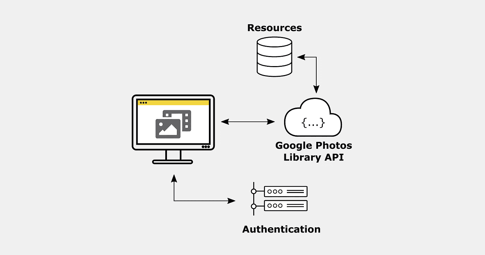
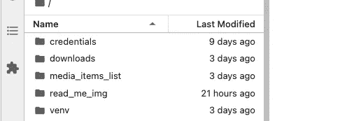
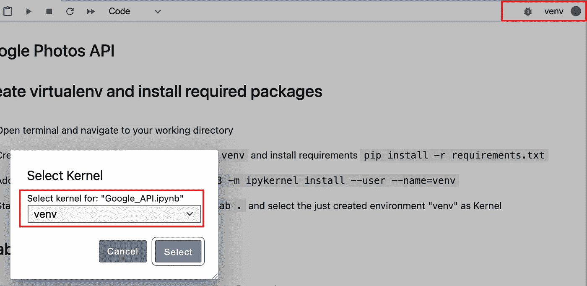
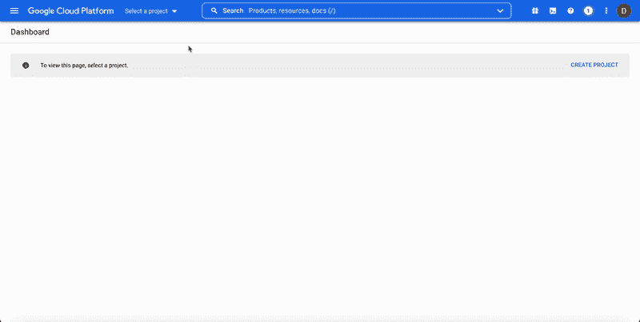
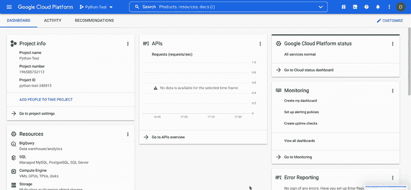
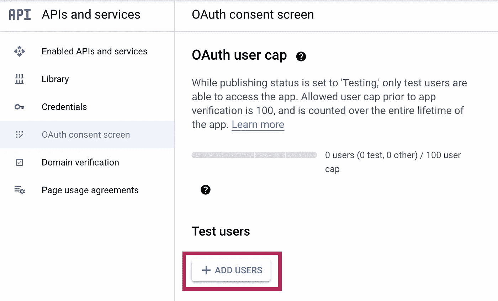
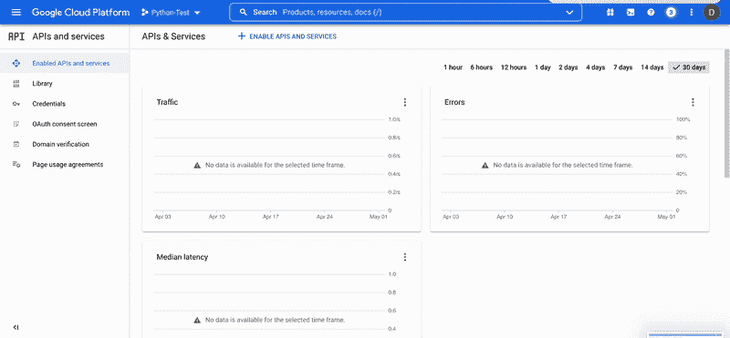
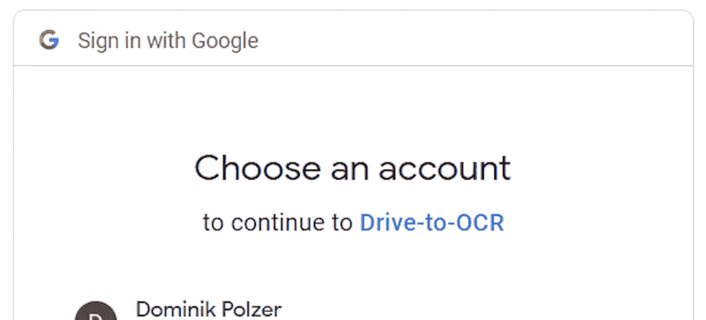
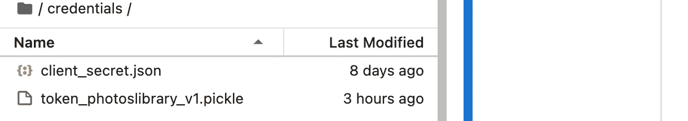

# 如何使用 Python 和照片库 API 从 Google 相册下载图像

> 原文：<https://towardsdatascience.com/how-to-download-images-from-google-photos-using-python-and-photos-library-api-6f9c1e60a3f3>



作者图片

使用 Google 相册 REST API，您可以下载、上传和修改储存在 Google 相册中的图片。

作为快速复习，REST 是应用程序编程接口的一种架构风格，允许与 RESTful web 服务进行交互。[Red20]

GET 请求允许检索数据库条目，POST 请求创建新条目，PUT 请求更新条目，DELETE 请求删除条目。

以下步骤描述了如何设置一个简单的项目，让您可以使用 Python 从 Google 相册下载图像:

## 1.打开终端窗口并导航到您的工作目录

## 2.创建子文件夹结构或克隆存储库

```
git clone [git@github.com](mailto:git@github.com):polzerdo55862/google-photos-api.git
```

[https://github.com/polzerdo55862/google-photos-api.git](https://github.com/polzerdo55862/google-photos-api.git)



文件夹结构—作者截图

repo 包含以下子文件夹:

*   **凭证:**文件夹，用于存储向 Google 相册库验证“Python 应用程序”所需的凭证
*   **media_items_list:** 脚本每次运行时，都会保存一个. csv 文件，其中包含在指定时间段内上传的所有 Google 相册媒体项目和相应的元数据
*   **下载:**存储从 Google 相册下载的图片

## 3.创建虚拟环境并安装所需的软件包

`python3 -m venv venv`，激活`source ./venv/bin/activate`，安装需求`pip install -r requirements.txt`

## 4.将 venv 添加到 Jupyter 笔记本

安装为 Jupyter: `pip install ipykernel`提供 IPython 内核的 ipykernel，并将您的虚拟环境添加到 Jupyter: `python -m ipykernel install --user --name=venv`

您可以通过导航到`/Users/Library/Jupyter/kernels`来检查安装。应该会有一个名为`venv`的新目录。在这个文件夹中，您会发现`kernel.json`文件，它定义了您正在使用的 Python 安装的路径。

卸载不再需要的内核:`jupyter kenelspec uninstall venv`

## 5.导航到该文件夹并启动 jupyter 笔记本/实验室

`jupyter lab .`

创建一个新的 jupyter 笔记本文件(或者在 repo 中打开现有的文件),并选择刚刚创建的环境“venv”作为内核



在 Jupyter 笔记本中选择虚拟环境—作者图片

## 6.启用 Google 相册 API 服务

*   去谷歌 API 控制台[https://console.cloud.google.com/](https://console.cloud.google.com/)。
*   从菜单栏中，选择一个项目或创建一个新项目。



创建新项目—作者的图像

*   要打开 Google API 库，从左侧导航菜单中选择`APIs & Services > Library`
*   搜索`Google Photos Library API`。选择正确的结果，然后单击“启用”。如果已经启用，请单击“管理”
*   之后，它会将您转到“照片 API/服务详情”页面([https://console.cloud.google.com/apis/credentials](https://console.cloud.google.com/apis/credentials))



启用 API 作者提供的图像

## 7.配置“OAuth 同意屏幕”[Sta21]

*   在 Google 相册 API 服务页面的左侧，点击“ [OAuth 同意屏幕](https://console.cloud.google.com/apis/credentials/consent)”(在“凭证”下方)并定义同意屏幕
*   添加测试用户:指定用于测试 API 调用的 google 帐户的电子邮件



将用户添加到同意屏幕—作者截图

## 8.创建 API/OAuth 凭据

*   在 Google 相册 API 服务页面的左侧，点击凭证
*   单击“创建凭据”并创建 OAuth 客户端 ID
*   作为应用程序类型，我选择“桌面应用程序”,并给你的客户端一个你想用来调用 API 的名称
*   将 JSON 文件下载到创建的凭证中，将其重命名为`client_secret.json`，并保存在“凭证”文件夹中



创建凭据—作者提供的图像

## 9.首次使用谷歌照片图库 API:

下一节展示了如何使用 OAuth 凭证通过 Google Library API 进行身份验证。下面的代码部分包含以下步骤:

1.  创建 GooglePhotosApi 对象`google_photos_api = GooglePhotosApi()`

2.函数`run_local_server()`检查在`.pickle`文件中是否已经存储了有效令牌，如果没有，它使用`client_secret.json`文件`cred = google_photos_api.run_local_server()`运行 **OAuth 2.0 授权流**

**第一次调用 API(OAuth 2.0 授权流程):**

Google 将询问您是否要授予应用程序在范围中定义的所需权限:



作者图片

由于目前这只是一个测试应用，谷歌会让你意识到这一点。单击“继续”继续。一旦授予应用程序必要的权限，就会创建一个`token_...pickle`文件，下载并存储在文件夹`/credentials/`中。这个令牌文件用于将来的 API 请求。



第一次 API 调用后生成的令牌文件—作者截图

## 10.使用 Pythons 请求模块和令牌文件从 Google 相册中检索数据

下面的函数向媒体 API 发送 post 请求，以获取所有条目的列表。由于 API 返回限于 100 个项目，所以搜索范围缩小到一天。因此，如果在一天之内创建/上传了超过 100 个图像，这种调用只会丢失图像。

使用 API 的响应将结果和所需的元数据写入数据框并返回:

# 11.使用定义的功能从 Google 相册下载媒体项目

a.用已经下载到`/downloads/`文件夹的所有文件创建一个列表

b.定义从开始日期到结束日期(今天)的所有日期的列表

c.对所有日期执行 API 调用，以获得所有媒体项目的列表。API 返回:

*   **id**
*   **文件名**
*   **Base Url**:Google 相册库 API 中的基本 URL 允许你访问媒体项目的字节。它们的有效期是 60 分钟。([https://developers . Google . com/photos/library/guides/access-media-items](https://developers.google.com/photos/library/guides/access-media-items))

d.将下载到/downloads/文件夹中的文件的媒体项目列表与 Google 相册中的媒体项目进行比较，以下载尚未下载的项目。现在可以使用`baseUrl`和 python 请求模块为每个媒体项发送 get 请求。

e.将包含所有媒体项目的列表另存为。csv 在`/media_items_list/`

# 摘要

本文描述了如何通过 Python 使用 Google Photos REST API 下载(和操作)Google Photos 内容。

我主要使用 API 来搜索用我的智能手机拍摄的图像的文本和特征，并将提取的信息推送到概念。

# 参考

[stat 21]错误 403:来自 Google 身份验证 web API 的 access_denied，2021。URL[https://stack overflow . com/questions/65184355/error-403-access-denied-from-Google-authentic ation-we b-API-Duncan-Google-ACC](https://stackoverflow.com/questions/65184355/error-403-access-denied-from-google-authentication-web-api-despite-google-acc)

[Red20] RedHat:什么是 REST API？, 2020.网址[https://www.redhat.com/en/topics/api/what-is-a-rest-api](https://www.redhat.com/en/topics/api/what-is-a-rest-api)