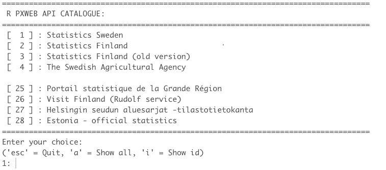
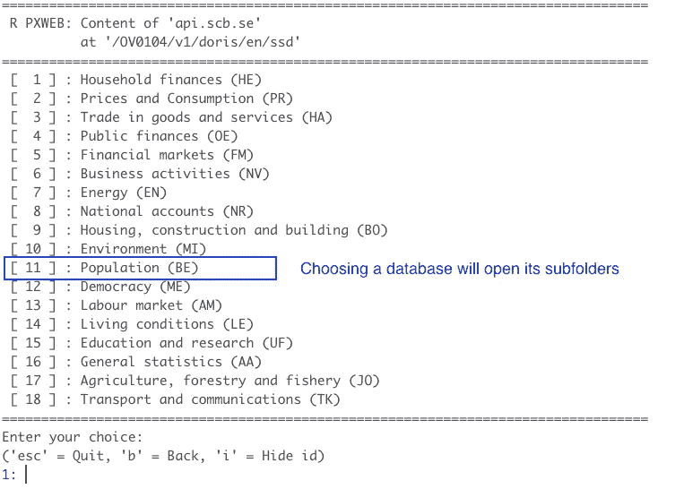
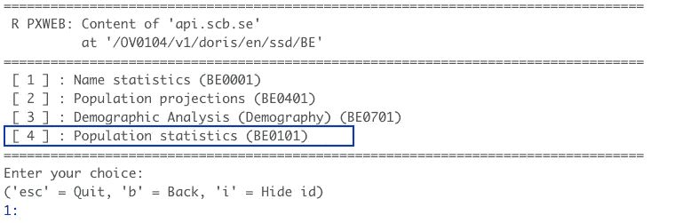
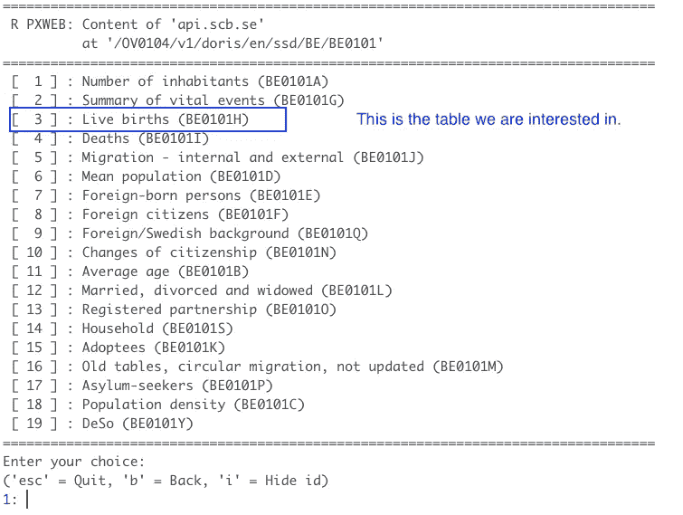
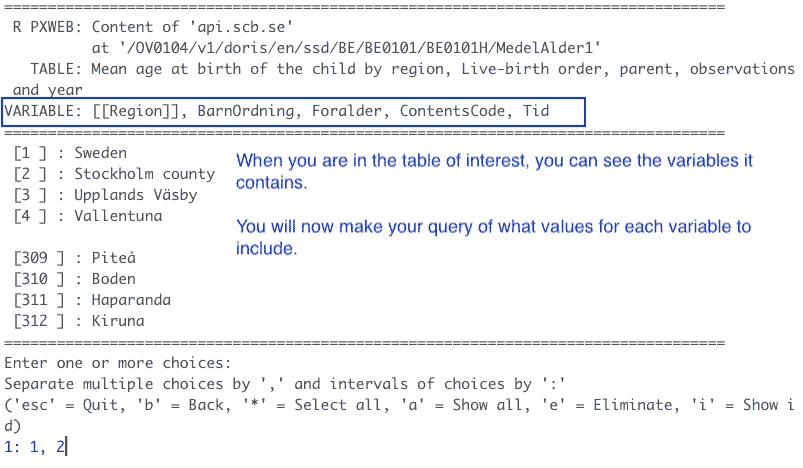
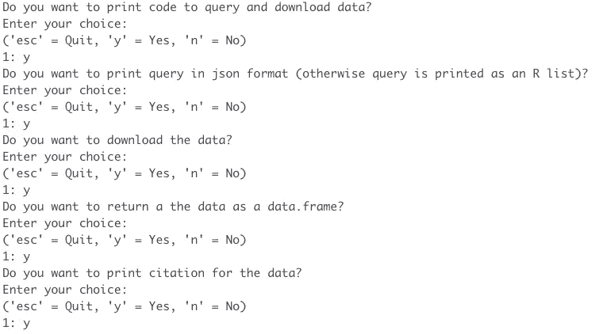
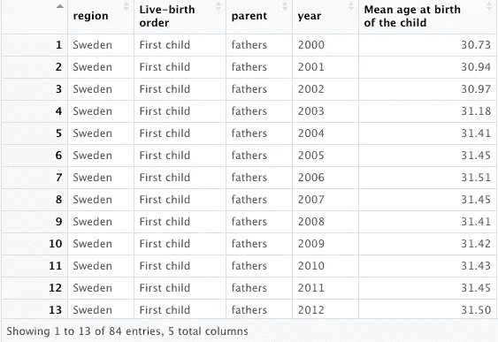
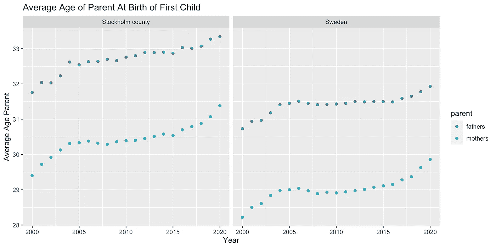

# 如何方便地从国家统计机构获取和下载公共数据

> 原文：<https://towardsdatascience.com/how-to-easily-access-and-download-public-data-from-national-statistical-institutions-dab9f2e6a18f>

## R 中 PxWeb API 接口指南，使用 PxWeb 包。

照片由[东阮](https://pixabay.com/sv/users/tungnguyen0905-17946924/)在 [Pixabay](https://pixabay.com/images/id-6701404/) 拍摄

PxWeb 是一个网络应用编程接口和网络工具，用于传播来自国家统计机构的数据。在 R 中，有一个名为`pxweb`的包，它连接到这些 web APIs，使您能够从 NSI 数据库直接将数据下载到 R 会话中，而无需通过 HTTP/HTTPS 使用 web 浏览器。

在本指南中，我将向您展示如何从统计机构下载公共数据。我将举一个例子，寻找显示瑞典父母第一个孩子出生时平均年龄的数据。我们可以在瑞典统计局的人口数据库中找到这些数据，这是他们公开数据的一部分。他们的开放数据可供所有人免费使用。

PxWeb APIs 由元数据和实际数据组成。元数据是一个分层的节点树，其中每一层都包含有关其子节点的信息。您可以将这些节点视为文件夹。您可以在这些表中导航，直到找到包含感兴趣的数据的表。

您需要两件事情来访问和下载数据，API 中指向数据表的 **URL** 和指定您想要下载什么数据的**查询**。我将向您展示这两者是如何通过一个非常直观的分步过程获得的。

# 安装并加载 pxweb 包

如果是第一次使用`pxweb`包，你需要安装它。然后将它加载到您 R 会话中。

作者图片

# 导航 API

我们通过输入`pxweb_interactive()`连接到 API 目录。您可以向该函数传递一个 URL 来跳过一些步骤，直接访问特定的 API 或数据库级别。

作者图片

我们将继续打开 API 目录，以便您可以看到当前包含在软件包中的统计机构。您可以打开任何 PxWeb API，即使它没有包含在软件包中。只需在`pxweb_interactive()`调用中将 URL 添加到 API 中。

作者图片

我们想从瑞典统计局下载数据，所以我们输入“1”。在选择了一个 API 之后，你还要选择你想要访问的数据库的版本和语言。之后，您将在 API 中看到所有可用的数据库。我们对人口数据库感兴趣，所以我们选择 11 号。

作者图片

您只需继续导航并选择要打开的子文件夹，直到找到包含要下载的数据的表格。

作者图片

作者图片

# 查询数据

现在我们在包含感兴趣的数据的表中。(*表:按地区、活产顺序、父母、观察和年份分列的儿童平均出生年龄。*)我们将查询数据并选择每个变量的值，一次一个变量。

作者图片

对于我们的查询，我选择了以下数据:

> 地区:瑞典和斯德哥尔摩县
> BarnOrder(活产顺序):第一个孩子
> for older(父母):母亲、父亲
> ContentsCode:孩子出生时的平均年龄
> Tid(时间):2000 年至 2020 年

# 下载数据

当您定义了查询后，R 会问您几个问题来帮助您将数据下载到 R 中。

作者图片

通过对所有这些问题选择“是”，`pxweb`包非常有用，它将你下载数据所需的所有代码打印到控制台的一个整洁的 data.frame 中。

## **1。将查询代码存储为 json 文件。**

根据选择的数据，R 将我们的查询以 json 格式打印到控制台。将它保存在一个单独的 json 文件中。如果想要更改查询，可以直接在这个 json 文件中进行。

作者图片

## **2。下载数据并转换为 data.frame 格式**

使用`pxweb_get(url = [url to table], query = [path to json])`功能，您可以将数据下载到 R 会话中。r 已经把需要的代码打印到控制台上了。您只需要更改 json 文件的路径。运行`as.data.frame()`将数据转换成 data.frame

作者图片

现在您在 R 会话中有了一个整洁的 data.frame，您可以继续分析和可视化数据了！我为我们的数据做了一个图表，它显示了斯德哥尔摩第一次做父母的平均年龄远远高于全国平均水平。

作者图片

作者图片

## **3。获取数据注释**

有时数据有注释，您可能也想下载它们。在我们的例子中，没有注释。要下载评论，你只需使用下面的代码。

作者图片

## **4。获取数据引用**

为了可再现性，引用数据是一种好的做法，这样你和其他人就可以看到数据来自哪里，何时下载的。

作者图片

对于我们的例子，引用看起来像这样

> 瑞典统计局(2022 年)。"按地区、活产顺序、父母、观察和年份分列的儿童平均出生年龄."[使用 pxweb R 包 0.12.0 访问的数据 2022–02–07 12:48:51]，<url: class="ae ky" href="http://api.scb.se/OV0104/v1/doris/en/ssd/BE/BE0101/BE0101H/MedelAlder1" rel="noopener ugc nofollow" target="_blank">http://API . SCB . se/ov 0104/v1/Doris/en/SSD/BE/BE 0101/BE 0101h/medel alder 1>。</url:>

如果您是用 LaTex 编写的，该软件包还会将引文打印为 BibTex 条目。

我发现`pxweb`包是一个非常有用的工具。它很容易使用，并且可以把你想要的数据整理成一个整洁的格式。如果您需要某个项目的数据，您可以通过使用`pxweb_interactive()`功能浏览目录及其数据库来获得灵感。如果您已经知道使用什么数据，或者如果您随着时间的推移分析某个变量，您可以使用`pxweb_get()`函数直接获得数据。

***`*pxweb*`*套装由曼斯·马格努松、马库斯·凯努、詹尼·霍瓦里和利奥·拉赫蒂(罗彭戈夫)开发。网址:*[*http://github.com/ropengov/pxweb*](http://github.com/ropengov/pxweb)