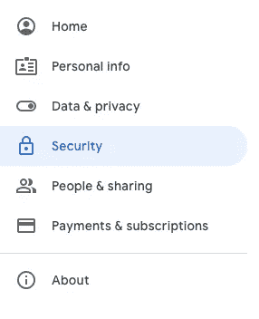
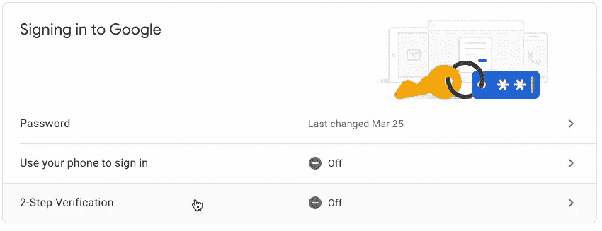
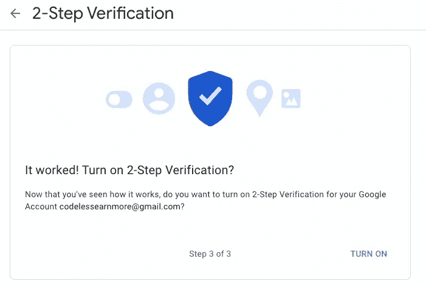
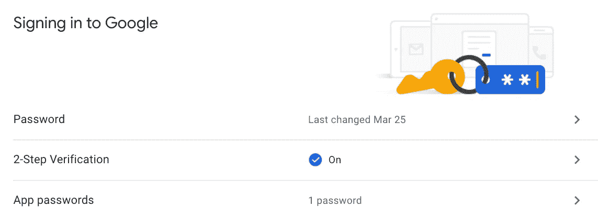
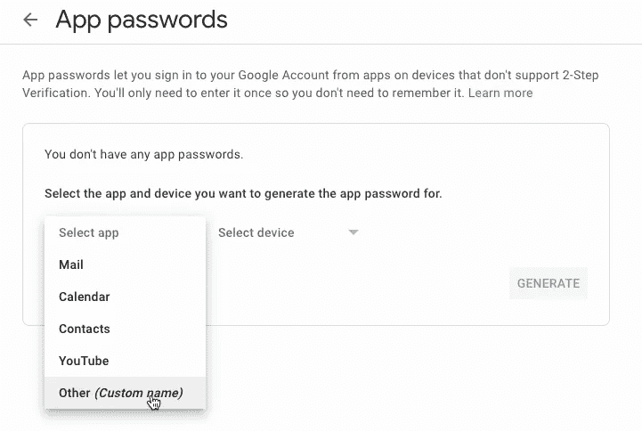
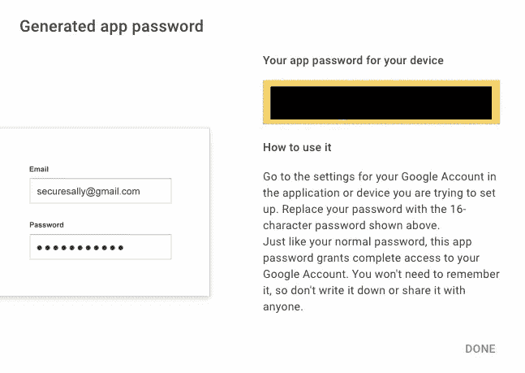
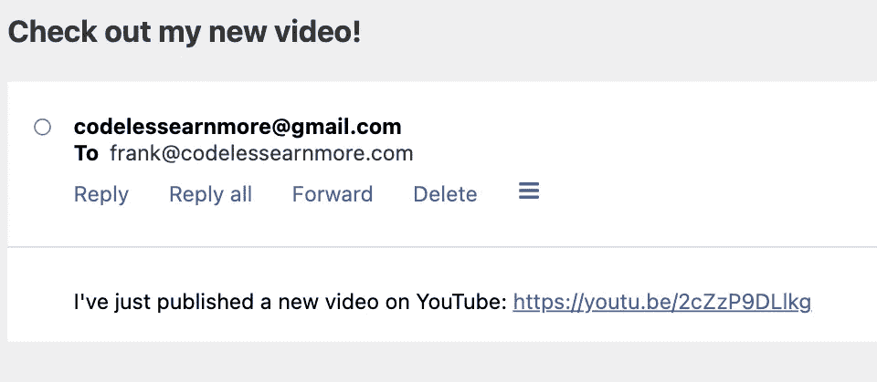
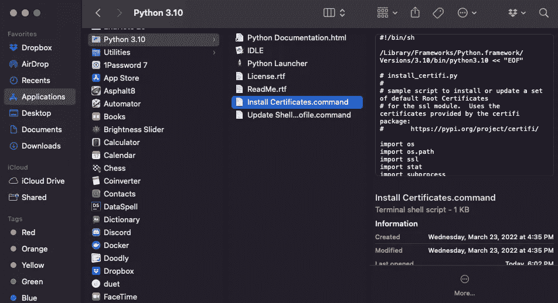

# 如何使用 Python 轻松实现电子邮件自动化

> 原文：<https://towardsdatascience.com/how-to-easily-automate-emails-with-python-8b476045c151>

## 用 Python 自动化枯燥的电子邮件


由 [Unsplash](https://unsplash.com?utm_source=medium&utm_medium=referral) 上的[在线打印机](https://unsplash.com/@onlineprinters?utm_source=medium&utm_medium=referral)拍摄

你知道大多数办公室工作的共同点吗？在大多数情况下，你必须定期发送电子邮件。

不管你是程序员、数据科学家还是工程师，你都有可能每天都要阅读和回复电子邮件。这项活动并没有给我们的职业增加任何价值，然而它停止了我们的工作流程，占用了我们宝贵的时间。

解决办法？用 Python 实现自动化！

在本指南中，我将向您展示如何使用 Python 自动发送电子邮件。我们将在本教程中使用 Gmail，所以请确保您有一个 Gmail 帐户来测试这种自动化。

```
**Table of Contents** 1\. [Turn On 2-Step Verification](#62c7)
2\. [Sending Email with Python](#bc59)
 - [Import the libraries and set email sender and receiver](#0c87)
 - [Set the subject and body of the email](#cbd8)
 - [Add SSL](#fe88)
 - [Log in and send the email](#17a9)
3\. [Schedule the Python Script to Run Monthly, Weekly, or Daily](#c3f9)
```

*如果你不想看，你可以看我的视频！*

# 1.打开两步验证

在我们开始编写代码之前，我们需要设置我们的 Gmail 帐户，以便能够在 Python 中使用它。

过去，我们可以通过打开“不太安全的应用程序访问”来轻松地使用 Python 连接到 Gmail，但该选项不再可用。我们现在要做的是打开两步验证，以获得一个 16 个字符的密码，我们可以使用该密码使用 Python 登录 Gmail。

首先，进入你的 [Google 账户](https://myaccount.google.com/)，选择你想在本教程中使用的账户，并在左侧面板选择“安全”选项。



作者图片

然后向下滚动，直到找到“登录谷歌”部分这里我们需要点击“两步验证”



作者图片

在这之后，我们会看到新的一页。我们必须点击“开始”

谷歌会要求再次登录。然后我们必须输入一个电话号码，并点击“下一步”我们将获得一个代码来验证我们的电话号码。在我们引入代码之后，我们应该会看到下面的页面。



作者图片

我们需要点击“打开”

如果一切设置正确，我们将看到一个新的页面，显示消息“两步验证开始”

最后，我们需要转到“应用程序密码”部分，因此再次转到您的 [Google 帐户](https://myaccount.google.com/)，点击“安全”，向下滚动直到您找到“登录 Google”部分，然后选择“应用程序密码”。



作者图片

我们需要再次登录。之后，我们应该会看到下面的页面。



作者图片

在“选择应用程序”下拉列表中，选择“其他(自定义名称)”并键入您想要的任何名称。我将我的命名为“Python ”,然后点击“生成”

在此之后，我们应该会看到一个新的页面，在一个黄色框中有 16 个字符的密码，如下所示。



作者图片

都弄好了！我们将使用这个 16 个字符的密码登录我们的 Python Gmail 帐户。

现在，您可以复制这个密码并将其粘贴到 Python 脚本的一个变量中，或者使用环境变量隐藏密码(我强烈推荐您这样做)。你可以按照我的指南[在 Windows 和 macOS 上创建环境变量](https://medium.com/geekculture/how-to-hide-passwords-and-secret-keys-in-your-python-scripts-a8904d5560ec)。

# 2.使用 Python 发送电子邮件

一旦我们打开两步验证并有了 16 个字符的密码，我们就可以开始编写代码了。

## 导入库并设置电子邮件发送者和接收者

要使用 Python 发送电子邮件，我们需要使用以下内置的 Python 库。

```
**import** smtplib
**import** ssl
**from** email.message **import** EmailMessage

email_sender = 'codelessearnmore@gmail.com'
email_password = 'write-password-here'
email_receiver = 'write-email-receiver-here'
```

此外，我们设置电子邮件发送者和密码(这是我们用来打开两步验证的电子邮件)以及电子邮件接收者。

请注意，电子邮件收件人不一定是 Gmail 帐户，也可以来自不同的电子邮件服务。

## 设置电子邮件的主题和正文

现在我们需要定义一个主题和一个主体。我们可以在这里写任何想写的东西。

```
**subject** = 'Check out my new video!'
**body** = """
I've just published a new video on YouTube: https://youtu.be/2cZzP9DLlkg
"""
```

注意，我在正文中用三重引号写了多行。

之后，我们实例化`EmailMessage`类，并使用我们之前为电子邮件、主题和正文创建的变量。

```
**em** = EmailMessage()
**em['From']** = email_sender
**em['To']** = email_receiver
**em['Subject']** = subject
**em**.set_content(body)
```

## 添加 SSL

现在让我们使用 SSL 来增加一层安全性。SSL 是保持互联网连接安全和保护在两个系统之间发送的任何敏感数据的标准技术。

```
context = ssl.create_default_context()
```

## 登录并发送电子邮件

最后，我们指定主机`smtp.gmail.com`，通过端口`465`连接，并使用上一步定义的`context`登录并发送我们的电子邮件。

恭喜你！我们刚刚用 Python 发了一封电子邮件。进入`email_receiver`收件箱查看我们发送的邮件。

这是我收到的邮件。



作者图片

你可以在我的 [Github](https://github.com/ifrankandrade/automation) 上查看我们在本指南中构建的脚本。

**注意:**如果运行脚本后得到一个`ssl.SSLCertVerificationError`，搜索一个名为`Install Certificates.command`的文件并安装它。

为此，进入“应用程序”，点击一个名为“Python 3。x”，并双击文件`Install Certificates.command`。



作者图片

一旦安装完成，在运行脚本时，您应该不会收到任何错误消息。

# 3.安排 Python 脚本每月、每周或每天运行

您可以使用 macOS 上的 crontab 和 Windows 上的任务调度器来安排每天或每周执行这个 Python 脚本。

要了解如何做到这一点，请查看我下面的指南。

[](/how-to-easily-automate-your-python-scripts-on-mac-and-windows-459388c9cc94) [## 如何在 Mac 和 Windows 上轻松自动化您的 Python 脚本

### 使用 crontab 和任务调度器来自动化您的脚本并节省时间

towardsdatascience.com](/how-to-easily-automate-your-python-scripts-on-mac-and-windows-459388c9cc94) 

自动化你的生活！ [**加入我的 10k+人电子邮件列表，获取我的免费自动化备忘单。**](https://frankandrade.ck.page/44559e1ae7)

如果你喜欢阅读这样的故事，并想支持我成为一名作家，可以考虑报名成为一名媒体成员。每月 5 美元，让您可以无限制地访问数以千计的 Python 指南和数据科学文章。如果你用[我的链接](https://frank-andrade.medium.com/membership)注册，我会赚一小笔佣金，不需要你额外付费。

[](https://frank-andrade.medium.com/membership) [## 通过我的推荐链接加入媒体——弗兰克·安德拉德

### 作为一个媒体会员，你的会员费的一部分会给你阅读的作家，你可以完全接触到每一个故事…

frank-andrade.medium.com](https://frank-andrade.medium.com/membership)