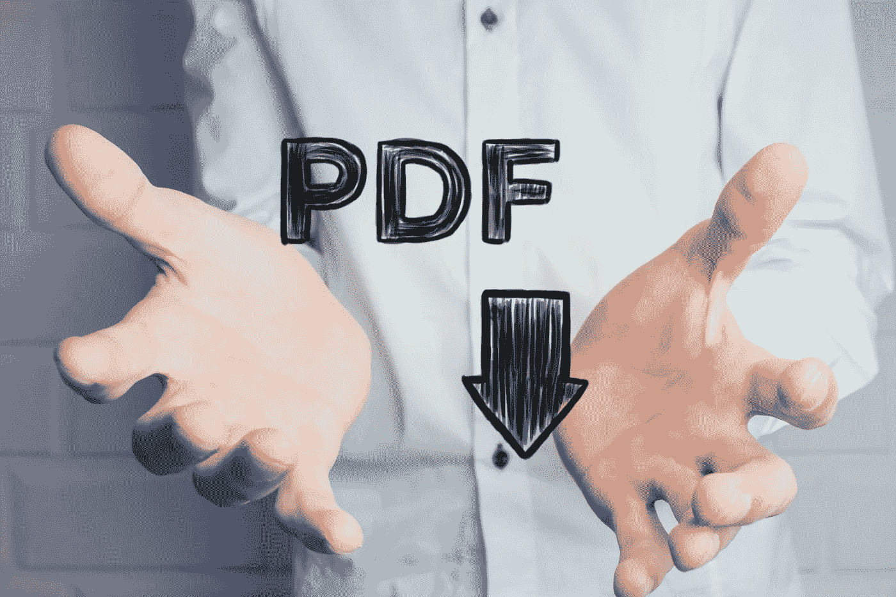
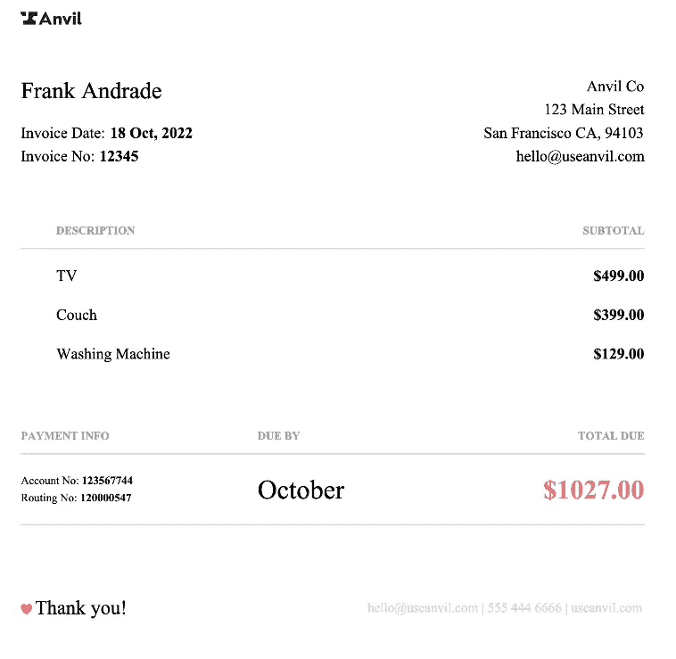
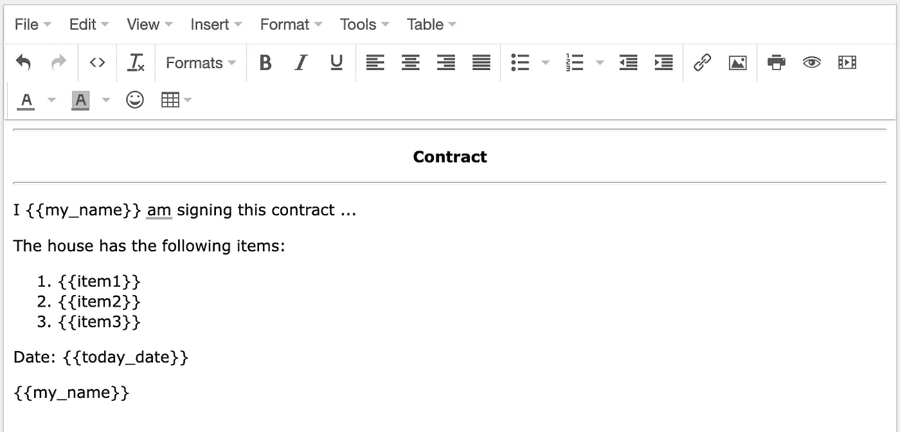
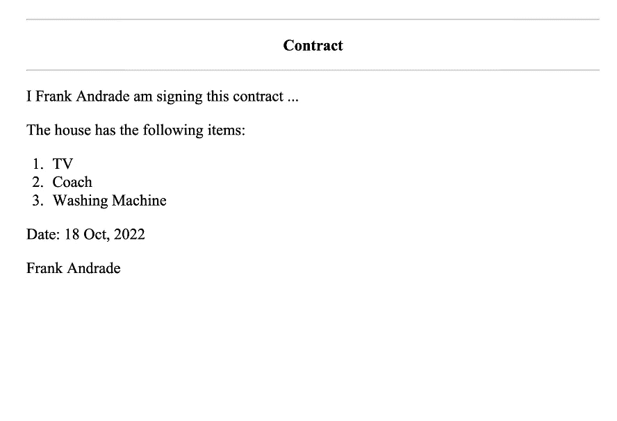

# 如何用 Python 轻松创建 PDF 文件(3 步)

> 原文：<https://towardsdatascience.com/how-to-easily-create-a-pdf-file-with-python-in-3-steps-a70faaf5bed5>

## 如何使用 Python 和 HTML 模板在几分钟内创建 PDF 文件



图片来自 Shutterstock，授权给 Frank Andrade

PDF 可能是我们在电脑上能找到的最常见的文件类型之一。

我们使用 pdf 格式的简历、报告、发票，应有尽有！

创建 PDF 文件的常用方法是将 Word 文件另存为。但是我们也可以使用 Python 创建一个 pdf 文件。

专业人士？如果您计划使用同一个模板创建多个 pdf，您可以使用 Python！但是首先，我们将了解如何使用 Python 创建 PDF 文件。

在本教程中，我们将首先创建一个简单的 PDF 文件，然后我们将创建一个更高级的文件，如下图所示。



作者图片

# 如何用 Python 轻松创建 PDF 文件

用 Python 创建 PDF 文件有不同的方法，但我发现使用 HTML 模板是最简单的方法。

使用此选项，我们可以在几分钟内创建基本和高级 pdf！

## 安装库

要创建 PDF 文件，我们需要安装以下库:

```
pip install pdfkit
pip install jinja2
```

在我们使用`pdfkit`库之前，我们需要安装`wkhtmltopdf`。安装步骤取决于您的操作系统:

```
*# macOS (you need to install brew first)*
brew install homebrew/cask/wkhtmltopdf*# Ubuntu*
sudo apt-get install wkhtmltopdf
```

如果你用的是 Windows，你可以在这里下载安装程序。

现在让我们用 Python 创建一个简单的 PDF。

## 步骤 1:创建一个带有占位符的 HTML 模板

首先，我们需要创建一个 HTML 文档，稍后我们将使用它作为模板。

为了创建这个 HTML 文档，我们将使用一个名为 [HTML 编辑器](https://html-online.com/editor/)的网站。在这个网站上，我们可以在左边的可视化编辑器中键入文本，并在右边的源代码编辑器中生成它的 HTML 代码。

这是我在编辑器中引入的文本(这个文件可以在我的 [GitHub](https://github.com/ifrankandrade/automation/tree/main/PDF/1.basic-pdf) 上找到)



注意我用`{{}}`创建的占位符。稍后我们将使用 Python 在这些花括号中引入值。

这是由 HTML 编辑器生成的 HTML 代码。

我们需要复制这段 HTML 代码，在我们的工作目录中创建一个 HTML 文件，然后将代码粘贴到它上面。

## 步骤 2:为每个占位符创建一个 Python 变量

首先我们导入 jinja2 和 pdfkit。我有一个名为`{{today_date}}`的占位符，所以我也导入`datetime`来获得今天的日期。

然后，我们为 HTML 文档中的每个占位符创建一个 Python 变量，并创建一个将占位符与 Python 变量配对的字典。

注意，我将每个 Python 变量命名为占位符，但是它们可以有不同的名称。

## 步骤 3:为我们的模板创建一个环境并导出 PDF

现在是时候使用 jinja2 为我们的模板创建一个环境了。

```
template_loader = jinja2.FileSystemLoader(‘./’)
template_env = jinja2.Environment(loader=template_loader)
```

然后我们指定使用哪个模板。在我的例子中，我将 HTML 文件命名为`basic-template.hmtl`。在这之后，我们呈现我们在步骤 2 中创建的字典。

```
template = template_env.get_template(‘basic-template.html’)
output_text = template.render(context)
```

接下来，我们将`wkhtmltopdf`添加到`pdfkit`配置中。为此，我们需要指定安装`wkhtmltopdf` 的路径。

下面是您需要运行的命令来获得这个路径。

```
*# macOS/Linux*
>>> which wkhtmltopdf
'/usr/local/bin/wkhtmltopdf'*# Windows*
>>> where wkhtmltopdf
'C:\Program Files\wkhtmltopdf'
```

最后，我们使用`.from_string()`方法导出 PDF 文件。

注意，我给`.from_string()`方法添加了一个 CSS 参数。这是可选的，但我发现有必要将 PDF 中段落的字体变大。

我在工作目录中创建了一个`style.css`文件，并编写了下面的代码。

```
p { font-size: 24px; }
li { font-size: 24px; }
```

就是这样。这是我们用 Python 生成的 PDF。



我们写的代码和本教程使用的文件可以在我的 [GitHub](https://github.com/ifrankandrade/automation/blob/main/PDF/1.basic-pdf/basic-pdf.py) 上找到。

现在要生成一个更高级的 PDF，就像下面的发票，我们需要下载一个 HTML 模板并创建一些占位符。[在这个视频教程](https://youtu.be/1IYtkkEOuoU)里，我展示了怎么做。


使用 Python 自动化您的生活！ [**加入我的 10k+人电子邮件列表，获取我的免费自动化备忘单。**](https://frankandrade.ck.page/44559e1ae7)

如果你喜欢阅读这样的故事，并想支持我成为一名作家，可以考虑报名成为一名媒体成员。每月 5 美元，让您可以无限制地访问数以千计的 Python 指南和数据科学文章。如果你使用[我的链接](https://frank-andrade.medium.com/membership)注册，我会赚一小笔佣金，不需要你额外付费。

[](https://frank-andrade.medium.com/membership) [## 通过我的推荐链接加入媒体——弗兰克·安德拉德

### 作为一个媒体会员，你的会员费的一部分会给你阅读的作家，你可以完全接触到每一个故事…

frank-andrade.medium.com](https://frank-andrade.medium.com/membership)