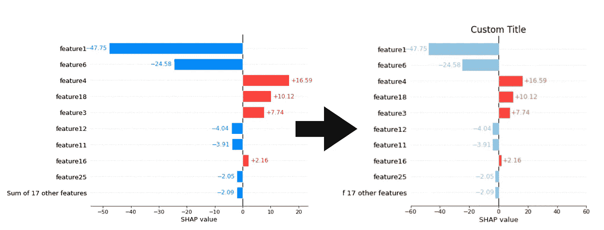
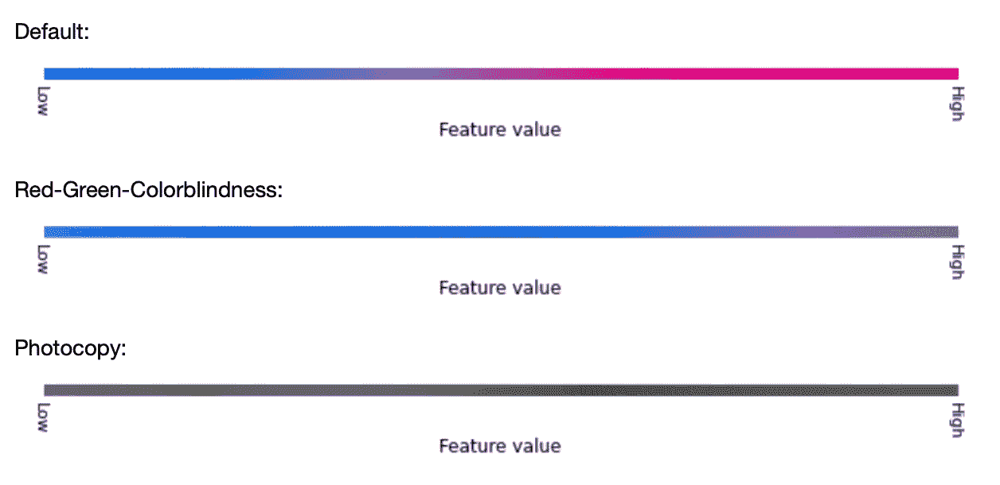
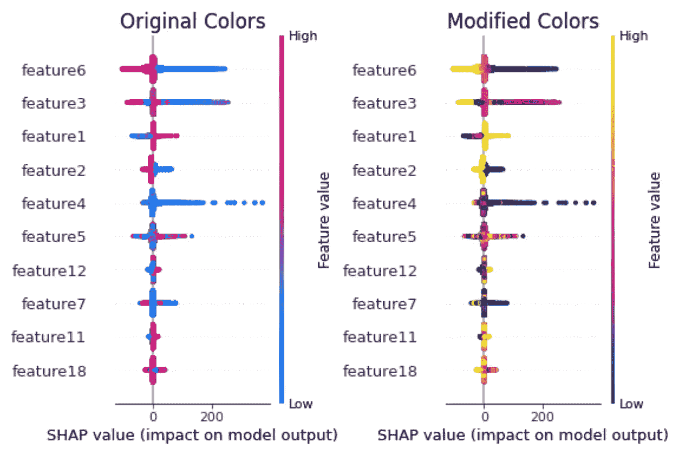
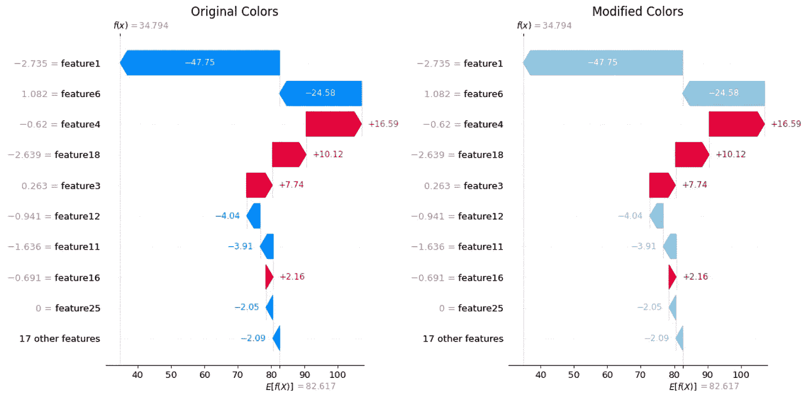
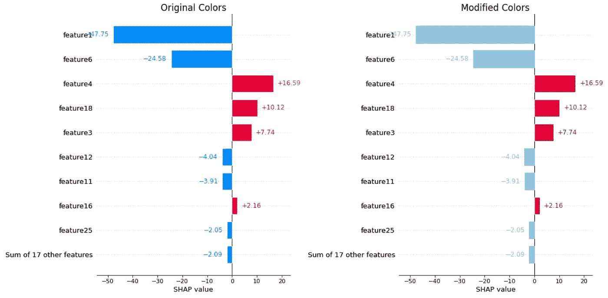
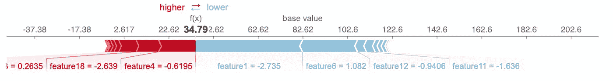
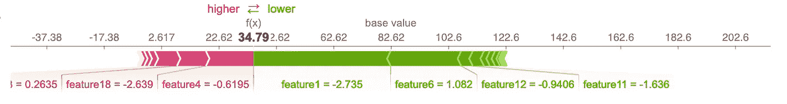

# 如何在 Python 中轻松定制 SHAP 图

> 原文：<https://towardsdatascience.com/how-to-easily-customize-shap-plots-in-python-fdff9c0483f2>

## 调整颜色和图形大小，并为 SHAP 图添加标题和标签



(图片由作者提供)

HAP(SHapley Additive exPlanations)是一种流行的建模可解释性的方法。Python 包使你能够快速创建各种不同的图。其独特的蓝色和品红色使该图立即识别为 SHAP 图。

不幸的是，Python 包的默认调色板既不是色盲的，也不是影印安全的。因此，您可能需要更改 SHAP 图的颜色。或者也许你只是想调整颜色，以符合你的企业形象。也可能你唯一想要的就是加个标题。

对于一些 SHAP 地块，定制比其他更容易。一些绘图函数已经提供了这样的参数，但是对于一些绘图类型，您必须变得更加灵活。

> 对于一些 SHAP 地块，定制比其他更容易。

在本文中，我们将讨论如何

1.  [**自定义图形和轴对象**](#52df) 的属性，如调整图形大小、添加标题和标签、使用支线剧情等。
2.  [**自定义汇总图、瀑布图、条形图和压力图的颜色**](#3237) 。

在这篇文章中，我们将集中在定制 SHAP 情节。如果你需要关于如何使用 SHAP 软件包的介绍或复习，我推荐 Conor O'Sullivan 的这篇文章:

[](/introduction-to-shap-with-python-d27edc23c454)  

确保您安装了 SHAP **版本 0.41.0** 。否则，您会在本文的代码片段中遇到错误[1，3]。

```
import shap
print(shap.__version__)
```

如果没有，请按如下方式升级软件包:

```
!pip install --upgrade shap
```

# 自定义图形和轴对象的属性

在我们开始着色之前，让我们先了解一下基础知识。在本节中，我们将讨论如何自定义图形和轴对象的属性。

为了能够修改 SHAP 图，您需要将`show`参数设置为`False`。

> `*show*`:返回前是否调用 matplotlib.pyplot.show()。将此项设置为 False 允许在创建图后进一步自定义图。[2]

## 调整图形大小

不幸的是，当您想要调整 SHAP 图的图形大小时，调整`figsize`参数没有多大帮助。相反，您需要设置`show = False`，然后您可以调整图形的大小，如下所示:

```
fig = plt.figure()shap.plots.bar(shap_values[0], **show = False**)**plt.gcf().set_size_inches(20,6)**
plt.show()
```

## 调整标题、标签和限制

当您设置了`show = False`后，您可以像往常一样自由调整人物的属性。下面你可以看到一个如何改变标题，x 标签和 x 限制的例子。

```
fig = plt.figure()shap.plots.bar(shap_values[0], **show = False**)**plt.title("Custom Title") 
plt.xlabel("Custom X-Label")
plt.xlim([-12,12])**plt.show()
```

## 使用支线剧情

如果你想在一个图形中显示多个支线剧情，可以使用`.add_subplot()`方法。

```
fig = plt.figure()**ax0 = fig.add_subplot(131)**
shap.plots.bar(shap_values[0], show = False)**ax1 = fig.add_subplot(132)**
shap.plots.bar(shap_values[1], show = False)**ax2 = fig.add_subplot(133)**
shap.plots.bar(shap_values[2], show = False)plt.gcf().set_size_inches(20,6)
plt.tight_layout() 
plt.show()
```

# 自定义颜色

在我们进入如何定制地块的颜色之前，让我们绕一点弯子，了解一下**为什么 SHAP 默认调色板不适合**。

最近，我写了一篇文章强调色盲安全数据可视化的重要性。

[](/is-your-color-palette-stopping-you-from-reaching-your-goals-bf3b32d2ac49)  

不幸的是，SHAP 的默认调色板既不是色盲也不是影印安全的(在 2022 年 8 月写作时)，正如你在下图中看到的。



默认 SHAP 调色板模拟色盲(图片由作者提供。用[科布利斯](https://www.color-blindness.com/coblis-color-blindness-simulator/)模拟色盲

虽然边缘颜色(洋红色(#ff0051)和蓝色(#008bfb)是色盲安全的，但它们不是影印安全的，因为它们具有相似的色调。

此外，渐变调色板不是色盲安全的，因为对于红绿色盲的人来说，中间范围的紫色调与低范围的蓝色调是无法区分的。

## 汇总图

*注意:对于本节，您必须至少安装了 SHAP 版本 0.40.0，并安装了*【1】*。*

对于概要剧情来说，换个调色盘简直易如反掌。从版本 0.40.0 开始，您可以简单地使用`cmap`参数[1]。

```
shap.summary_plot(shap_values, 
                  X_train,
                  **cmap = "plasma"**)
```



使用默认和修改的调色板的摘要图(图片由作者提供)

## 瀑布图

*注意:对于本节，您必须至少安装了 SHAP 版本 0.41.0 [3]。*

由于我们没有瀑布图可用的参数，我们需要变得狡猾一点。

首先，您需要将`show`参数设置为`False`，以便能够修改图[2]。对于瀑布图，我们需要**调整 FancyArrow 和文本对象的颜色。**

```
import matplotlib
import matplotlib.pyplot as plt

# Default SHAP colors
default_pos_color = "#ff0051"
default_neg_color = "#008bfb"# Custom colors
positive_color = "#ca0020"
negative_color = "#92c5de"# Plot Waterfall Plot
shap.plots.waterfall(shap_values[0], **show = False**)# Change the colormap of the artists
for fc in plt.gcf().get_children():
    for fcc in fc.get_children():
        if (isinstance(fcc, **matplotlib.patches.FancyArrow**)):
            if (matplotlib.colors.to_hex(fcc.get_facecolor()) == default_pos_color):
                fcc.set_facecolor(positive_color)
            elif (matplotlib.colors.to_hex(fcc.get_facecolor()) == default_neg_color):
                fcc.set_color(negative_color)
        elif (isinstance(fcc, **plt.Text**)):
            if (matplotlib.colors.to_hex(fcc.get_color()) == default_pos_color):
                fcc.set_color(positive_color)
            elif (matplotlib.colors.to_hex(fcc.get_color()) == default_neg_color):
                fcc.set_color(negative_color)plt.show()
```



使用默认和修改的调色板绘制瀑布图(图片由作者提供)

## 条形图

对于柱状图，我们需要采用与瀑布图相似的方法。

同样，您需要将`show`参数设置为`False`，以便能够修改图[2]。对于条形图，我们需要**调整矩形和文本对象的颜色。**

```
# Plot bar plot
shap.plots.bar(shap_values[0], **show = False**)# Change the colormap of the artists
for fc in plt.gcf().get_children():
    # Ignore last Rectangle
    for fcc in fc.get_children()[:-1]:
        if (isinstance(fcc, **matplotlib.patches.Rectangle**)):
            if (matplotlib.colors.to_hex(fcc.get_facecolor()) == default_pos_color):
                fcc.set_facecolor(positive_color)
            elif (matplotlib.colors.to_hex(fcc.get_facecolor()) == default_neg_color):
                fcc.set_color(negative_color)
        elif (isinstance(fcc, **plt.Text**)):
            if (matplotlib.colors.to_hex(fcc.get_color()) == default_pos_color):
                fcc.set_color(positive_color)
            elif (matplotlib.colors.to_hex(fcc.get_color()) == default_neg_color):
                fcc.set_color(negative_color)plt.show()
```



带有默认和修改的调色板的条形图(图片由作者提供)

## 力图

幸运的是，对于力图，我们可以简单地使用`plot_cmap`参数。

您可以手动指定颜色:

```
# Custom colors
positive_color = "#ca0020"
negative_color = "#92c5de"shap.force_plot(shap_values[0], 
                **plot_cmap = [positive_color, negative_color]**)
```



通过指定颜色，使用修改的调色板强制绘图(图片由作者提供)

或者使用预定义的调色板:

```
shap.force_plot(shap_values[0], 
                **plot_cmap = "PkYg"**)
```



通过使用预定义的调色板，使用修改的调色板强制绘图(图片由作者提供)

# **结论**

本文展示了如何快速定制 SHAP 图。虽然对某些阴谋来说很容易，但对其他阴谋来说，我们必须变得狡猾。

通常，您需要使用`show = False`参数来调整 SHAP 图。

然后，您可以轻松地定制图形和轴对象的属性，如图形大小、标题和标签，或者您可以添加支线剧情。

自定义颜色

*   **对于一些绘图类型，我们可以直接使用可用的参数。**例如，对于汇总图，我们可以使用`cmap`参数，对于压力图，我们可以使用`plot_cmap`参数。
*   **对于某些绘图类型，我们没有可用于改变颜色的参数**。所以对于瀑布图、条形图之类的图，我们需要逐个改变美工的颜色。

如果您在使用本文的代码片段时遇到问题，请务必检查您是否至少安装了 SHAP 版本 0.41.0。

# 喜欢这个故事吗？

*如果你想把我的新故事直接发到你的收件箱，* [*订阅*](https://medium.com/subscribe/@iamleonie) *！*

成为一名媒体成员，阅读更多其他作家和我的故事。报名时可以用我的 [*推荐链接*](https://medium.com/@iamleonie/membership) *支持我。我将收取佣金，不需要你额外付费。*

[](https://medium.com/@iamleonie/membership)  

*在*[*Twitter*](https://twitter.com/helloiamleonie)*[*LinkedIn*](https://www.linkedin.com/in/804250ab/)*，以及*[*Kaggle*](https://www.kaggle.com/iamleonie)*！**

# *参考*

*[1] C. S .“将` shap.summary_plot()`的渐变颜色更改为特定的 2 或 3 种 RGB 渐变调色板颜色”。stackoverflow.com。https://stack overflow . com/questions/60153036/changing-the-gradient-color-of-shap-summary-plot-to-specific-2-or-3-RGB-grad(2022 年 8 月 8 日访问)*

*[2]《SHAP》，《欢迎来到 SHAP 文献》。https://shap.readthedocs.io/en/latest/index.html(2022 年 8 月 8 日访问)*

*[3] J. Stevenson，“用 show=False 修复瀑布中的 bug”。github.com。[https://github.com/slundberg/shap/pull/2342](https://github.com/slundberg/shap/pull/2342)(2022 年 8 月 8 日访问)*